# AI 时代的 FDE：认知、流程、团队与中国落地

> 副题：从非标交付到平台飞轮——"卖人力"到"卖能力"的完整方法论

> [!NOTE]
> **关于本书**
> 本书系统讲解 FDE（Forward Deployed Engineer，前沿部署工程师）这一交付模式——它是什么、为什么有效、如何落地、如何组建团队，以及中国技术服务商该如何对标转型。全书面向多层级读者：**决策层**可重点读第一、二篇（认知与标杆）与各篇导读、小结，把握战略与 ROI；**中层管理者**可深读第三、四篇（流程与团队），掌握交付方法论与组织建设；**一线工程师**可细读第三篇的四阶段 SOP 与各类模板工具。建议初次阅读按篇顺序通读，日后可当作工具手册按需查阅。

---

# 第一篇：认知篇 — FDE的What & Why

> [!NOTE]
> **本篇导读**
> 本篇解决两个最根本的问题：**FDE 是什么（What）** 与 **为什么需要它（Why）**。第1章界定 FDE 的定义、三重角色、与外包/咨询的本质区别，以及它在 AI 时代的复兴；第2章从经济学视角论证——传统项目制为何陷入"死亡螺旋"，而 FDE + 平台模式如何靠"能力回注飞轮"实现边际成本递减、把毛利从外包水平拉升到 SaaS 水平。读完本篇，你会理解一句贯穿全书的主线：**FDE 的本质，是从"卖人力"到"卖能力"的转变。**

## 第1章 FDE是什么

> [!NOTE]
> **本章导读**：先把 FDE 这个概念本身讲清楚——它的定义与起源、"工程师×业务顾问×产品经理"的三重角色、与驻场外包和传统咨询的本质区别，以及为何在 AI 时代重新走红。读完本章，你能准确回答"FDE 到底是什么、不是什么"。

### 1.1 定义与起源

**战略意义**：在复杂的企业级To B与To G市场中，标准化产品往往难以直接解决客户核心痛点，而纯定制化开发又无法实现规模化盈利。FDE模式提供了一种在「非标痛点」与「标准平台」之间建立高带宽双向通道的战略解法。

**操作细节**：
FDE（Forward Deployed Engineer，前沿部署工程师）这一概念由硅谷大数据巨头Palantir Technologies首创。FDE并非传统意义上的后端开发或实施人员，而是**驻扎在客户现场的全栈工程师，负责将公司的核心平台深度定制化部署到客户特定的业务场景中**。

核心箴言：
> **“FDEs are the glue between our products and our customers.”** 
> —— Palantir对FDE角色的官方定调

FDE不仅要解决“代码怎么写”的问题，更要解决“业务需要什么代码”的问题。他们直接面对客户的杂乱数据、落后基础设施以及复杂的组织博弈，用最高效的代码手段在现场拉通系统、证明价值，并将通用性需求抽象提取，反哺给后方研发团队。

**辨析：FDE 到底是一个岗位、一支团队，还是一套方法论？**

这是学习 FDE 时最常见、也最该在一开始就厘清的困惑。答案是：**三者都是**——“FDE”这个词在业界（包括本教材）同时被用在三个抽象层级上，它们不是矛盾，而是同一概念随抽象层级递进的自然扩展：

| 层级 | FDE 指什么 | 典型语境 |
| :--- | :--- | :--- |
| **(a) 岗位 / 角色**（狭义，最初义） | Forward Deployed **Engineer**——一个具体的工程师职位 | “我们招 3 个 FDE”“他是一名资深 FDE” |
| **(b) 团队 / 组织模式** | 由 FDE、部署策略师、平台工程师等构成的特种交付团队及其组织形态 | “组建 FDE 团队”“FDE 的汇报线设计” |
| **(c) 方法论 / 交付范式**（广义，最重要） | Forward Deployed **Engineering**——一整套“平台 + 前沿部署 + 能力回注”的交付方法论与商业模式 | “转型为 FDE 模式”“FDE 飞轮” |

> [!TIP]
> **一个帮你秒懂的类比：FDE 之于交付，正如 DevOps 之于研发。**
> “DevOps” 既可以指一个岗位（DevOps 工程师）、一支团队，更是一套方法论与文化。当我们说“公司要做 DevOps”，指的是方法论；说“招个 DevOps”，指的是岗位。**FDE 完全同理——它首先是一套方法论（范式），其次才落地为团队与岗位。**
>
> **本教材教的是第 (c) 层。** 从书名《AI 时代的 FDE：认知、流程、团队与中国落地》即可看出，本书讲的是 FDE 从认知到落地的一整套**体系与商业模式转型**（内核是"从卖人力到卖能力"的飞轮），而非“如何当好一名工程师”。第 (a) 层（岗位能力）主要在第四篇团队篇展开，第 (b) 层（团队组织）贯穿全书。后文出现“FDE”时，请读者依语境判断它指的是哪一层——但**最核心的那一层，始终是方法论**。

### 1.2 三重角色融合：工程师 × 业务顾问 × 产品经理

传统IT架构下，业务顾问负责调研，产品经理负责设计，工程师负责写代码。这种“流水线”分工在需求明确的成熟市场运作良好，但在极度复杂、需求模糊的前沿领域，信息在传递过程中会产生巨大的损耗。FDE的核心在于**“三位一体”的降维打击**。

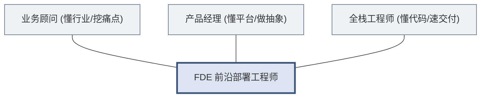

1. **全栈工程师维度**：要求具备极强的系统集成、数据管道搭建、全栈开发及故障排查能力。在现场，FDE可能需要连接十年前的遗留ERP系统，编写复杂的数据转换脚本。
2. **业务顾问维度**：要求具备敏锐的商业嗅觉和沟通能力。不仅要听懂客户说出来的需求，更要挖掘出客户未表达出的深层痛点，并在客户内部复杂的部门利益间斡旋。
3. **产品经理维度**：要求具备“抽象思维”。FDE绝不是为了当前客户写死代码，而是思考：这个非标需求，未来能否固化为公司核心平台的一个标准组件？

**为什么三合一比分工更有效？**
在高度复杂场景下，沟通成本呈指数级上升。FDE通过单兵或小团队作战，将业务逻辑与代码实现的大脑合二为一，实现了“发现痛点即刻写代码验证，验证成功即刻转化为平台需求”的最短闭环。

### 1.3 FDE ≠ 驻场外包 ≠ 传统咨询：本质区别辨析

认识 FDE，必须先立刻划清一条边界：**它不是驻场外包，也不是 IT 咨询。** 三者表面都“派人去客户现场”，但本质截然不同——用一句话概括这条分野，就是：

> **从“卖人力”到“卖能力”的转变。**

外包卖的是“人力”——按人天计费，人在价值在、人走价值走，公司沉淀不下任何资产；FDE 卖的是“能力”——每一次现场交付，都在为己方平台积累可复用的系统能力，卖出去的不是工时，而是**被平台不断放大的解决问题的能力**。

三者的核心差异可先用下表快速定位：

| 对比维度 | 驻场外包 | 传统咨询 | FDE |
| :--- | :--- | :--- | :--- |
| **核心交付物** | 客户定制的孤立系统 | 战略 PPT、方案文档 | 运行在生产环境的定制化系统集成 |
| **能力/IP 最终归属** | 归客户，公司无法复用 | 归咨询公司的方法论 | **回注到己方平台，越做越强** |
| **对己方的意义** | 赚人天差价（卖人力） | 赚咨询费（卖洞见） | **完善平台、驱动规模化（卖能力）** |

> [!CAUTION]
> 永远不要用人头计费模式（Time & Material）来衡量 FDE，这是扼杀 FDE 飞轮效应的毒药。FDE 的价值在于创造系统级资产，而非出卖工时。

**关于三种模式更深入的对比论证——包括 FDE 为何能兼得“高适配 + 高复用”、边际成本为何“先低后高”、以及 FDE 为何极易退化成外包——将在 2.2 节的四模式全景对比中系统展开。** 本节只需先建立一个直觉：**判断一件事是不是真 FDE，就看这次交付结束后，“公司”这个主体的能力有没有增长——只有客户与公司双方能力都增长，才是 FDE。**

### 1.4 AI时代的FDE复兴

2023年生成式AI爆发后，包括OpenAI、Anthropic、Cohere等顶级大模型公司纷纷开始建立自己的FDE或前沿部署团队。

**为什么AI时代比以往任何时候都更需要FDE？**
因为大模型落地面临着难以逾越的**五大鸿沟**：
1. **模型≠产品**：API接口无法直接解决业务痛点，需要业务流编排。
2. **数据合规**：企业核心数据不能直接出域，需要现场进行复杂的数据脱敏与联邦架构部署。
3. **模型微调与工程**：RAG（检索增强生成）、Prompt调优需要深度结合客户专有知识。
4. **系统集成**：AI必须嵌入企业现有的CRM、ERP等系统中才能产生闭环价值。
5. **搁板软件风险**：没有人在现场推动变革，再好的AI系统也会被抵触情绪束之高阁。

在AI时代，FDE是拉近“参数规模”与“企业利润”之间距离的唯一桥梁。

### 1.5 FDE 如何工作：四阶段交付概览

前面几节回答了 FDE"是什么""三重角色""不是什么"。那么落到一个真实项目上，FDE 究竟是**怎么一步步把价值交付出来的**？答案是一套贯穿始终的**四阶段方法论**——这也是 FDE 交付最标志性的框架。

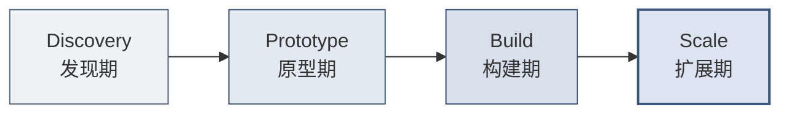

四个阶段层层递进、由轻到重、由点到面：

- **Discovery（发现期）**：不急着写代码，先深入客户业务，找准一个既有高价值、又可行的"快赢"切入点。
- **Prototype（原型期）**：用最小可行的架构，快速搭出一个能跑通、能演示的原型，用真实数据证明价值。
- **Build（构建期）**：把验证过的原型打磨成稳定、安全、可运维的生产级系统。
- **Scale（扩展期）**：从单个场景向全组织扩展，让系统沉淀为客户的"数字基础设施"，并把通用能力回注平台。

> [!TIP]
> **一句话记住四阶段**：**先找对问题（Discovery）→ 快速证明（Prototype）→ 做实做稳（Build）→ 放大复制（Scale）。** 这条主线，正是 FDE 把"现场定制"转化为"平台能力"的完整路径。
>
> 本节只勾勒轮廓；每个阶段的具体目标、操作步骤、交付物与阶段验收（Gate）清单等可落地的作战手册，将在**第三篇「四阶段流程 SOP」**中逐一展开。

---

## 第2章 为什么需要FDE

> [!NOTE]
> **本章导读**：从"是什么"进到"为什么"。本章用经济学视角论证 FDE 的必要性——传统项目制为何陷入"死亡螺旋"、四种交付模式如何对比、FDE 靠"经验曲线/能力回注飞轮"如何实现边际成本递减，并用 Palantir 的真实财务数据（毛利率、净利率、NRR）验证这套逻辑。

### 2.1 传统交付模式的结构性困境

传统项目制交付往往陷入一种“死胡同”，在To B/To G行业尤为常见。

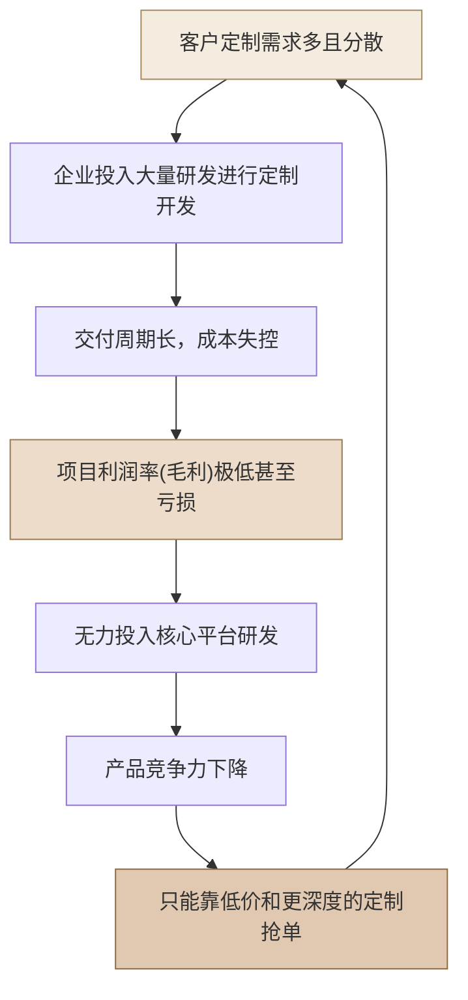

**为什么这是“结构性”困境，而非“管理不善”？**

很多陷入这个循环的公司，第一反应是“我们项目管得不够好”——于是加强 PMO、压缩工期、精细核算人天。但这些努力往往只能延缓、无法逆转下滑，因为问题**不在执行层，而在结构层**。逐环拆解这条螺旋，会发现每一步都是“局部理性、全局自杀”：

1. **需求分散 → 定制开发**：客户的需求真实且合理，销售为了签单必须接。局部看，接单是对的。
2. **定制开发 → 周期长、成本失控**：每个项目从头造轮子，没有可复用资产，成本随项目数**线性甚至超线性**增长。
3. **成本失控 → 毛利极低甚至亏损**：为了中标又不得不压价，利润被两头挤压。
4. **无利润 → 无力投入平台研发**：这是**最致命的一环**。没有利润，就没有钱投入到能“一次开发、多次复用”的核心平台上——而平台恰恰是唯一能打破线性成本的东西。
5. **无平台 → 产品竞争力下降 → 只能靠更低价、更深度定制抢单**：于是回到第 1 步，且每绕一圈，定制更重、毛利更薄、离平台更远。

> [!CAUTION]
> **死亡螺旋的残酷之处，在于它是“自我强化（self-reinforcing）”的。**
> 越是缺钱，越不敢投平台；越不投平台，就越只能靠人力堆定制；越堆定制，就越缺钱。这是一个正反馈的恶性循环——**单靠“更努力地做项目”永远走不出去，因为你越努力，螺旋转得越快。** 唯一的出路是从结构上切断某一环：要么容忍短期亏损、强行投入平台（Palantir 的选择），要么改变交付模式本身。

**一个典型的痛感场景**（一线读者大概率似曾相识）：
> 团队刚交付完 A 客户的定制系统，B 客户来了几乎一样的需求，但因为 A 的代码写死了字段和流程，几乎无法复用，只能推倒重来。于是同一类问题，团队解决了两遍、收了两份人天钱、却没沉淀出任何资产。第三个类似客户来时，团队依然要从零开始。**收入在增长，但公司什么都没积累下来——这就是项目制的本质陷阱：用规模换收入，却换不来资产。**

而FDE模式则致力于把这条恶性螺旋**反转为正向飞轮**：在现场解决问题的同时，将定制代码提炼为通用组件；下一个类似项目复用这些组件，部署速度更快、成本更低；成本下降带来的利润，再投入研发更强大的平台——**每绕一圈，成本更低、平台更强**（这个正向飞轮的经济学机理，将在 2.3 节详细展开）。

### 2.2 四种交付模式全景对比

要理解 FDE 模式的独特定位，最好的方式是把它放到四种主流交付模式的坐标系里对照。

| 维度 | 标准SaaS | 传统咨询 | 项目外包/定制开发 | FDE + 平台模式 |
| :--- | :--- | :--- | :--- | :--- |
| **客户适配度** | 低（客户需改变流程适应软件） | 高（定制化方案） | 极高（完全按需开发） | **高（平台底座 + 现场定制集成）** |
| **研发复用率** | 极高（100%同一套代码） | 中（复用分析框架） | 极低（每个项目从头造轮子） | **高（70%平台 + 30%定制组件回注）** |
| **边际成本趋势**| 趋近于零 | 线性增加（依赖高级人头） | 线性增加（依赖开发人头） | **指数级递减（通过平台沉淀）** |
| **毛利率趋势** | 高且稳定（70%-90%） | 稳定（40%-60%） | 低且脆弱（10%-30%） | **从低到高（初期30%，成熟期80%+）** |
| **商业模式** | 纯订阅制 | 咨询服务费 | 人天计费或固定项目费 | **高价值许可费（含平台授权与首期部署）** |

**如何读懂这张表：FDE 凭什么“既要又要”？**

这张表最反直觉的一行是「客户适配度」与「研发复用率」——因为在传统认知里，**这两者是天然矛盾的一对**：
- **标准 SaaS**：一套代码服务所有客户，复用率 100%，但客户必须削足适履去适应软件（**高复用、低适配**）。
- **项目外包**：完全按客户需求定制，适配度极高，但每个项目从头造轮子，几乎零复用（**高适配、低复用**）。

绝大多数公司只能在这条对角线上二选一。而 FDE + 平台模式的全部精妙之处，就在于它**试图同时拿到对角线的两端**——用「**平台底座（保复用）＋ 现场定制集成（保适配）**」的分层结构破解这个矛盾：

- **底层 70% 靠平台**：数据引擎、本体层、通用组件是标准化的、跨客户复用的——这部分贡献了复用率。
- **上层 30% 靠 FDE 现场定制**：贴合每个客户的具体流程、数据、界面——这部分贡献了适配度。
- **而且这 30% 不是白写的**：其中的通用部分会被**回注**为平台能力，让下一个客户的“70% 平台”变成“75%、80%”——复用率本身是**动态上升**的。

> [!TIP]
> **一句话抓住四种模式的本质区别：**
> - **SaaS** 卖的是“标准品”——边际成本趋零，但触达不了复杂痛点。
> - **咨询** 卖的是“洞见”——交付 PPT 和方法论，但不落地为可运行系统。
> - **外包** 卖的是“人天”——完全定制，但公司什么资产都沉淀不下来。
> - **FDE + 平台** 卖的是“**被平台放大的解决方案**”——用标准底座承载定制交付，再把定制反哺回底座。**它是唯一一个“做得越多、平台越强、下一单越省”的模式**，这也是为什么只有它的边际成本曲线是“指数级递减”而非“线性增加”。
>
> （这四种模式在“卖什么”上的根本差异，正是 1.3 节所辨析的“从卖人力到卖能力”。）

这张表的最后两行（边际成本趋势、毛利率趋势）指向同一个结论：**FDE 模式初期看起来最像“低毛利的外包”，但它的成本结构从根子上就不同——它是先低后高、越做越轻的。**

**正因如此，FDE 极易“退化”回外包——这是全书最重要的警示之一。**

上表清晰地把外包和 FDE 分在了两列，但在**真实的日常现场，两者几乎肉眼难辨**：都是派工程师驻扎客户现场、都在写贴合客户的代码、都在解决客户的具体问题。差异不在“当下做什么”，而在“**做完之后往哪走**”——是把通用经验抽象、沉淀回平台（FDE），还是写完就留在客户那里（外包）。正因为这个差异是“隐性的、面向未来的”，它极易在两种现实压力下被悄悄侵蚀：

1. **销售压力**：为快速签单，销售倾向承诺“客户要什么我们做什么”，FDE 被迫在现场写死大量一次性代码，无暇抽象回注（这也是 3.3 节强调 “FDE 不应汇报给销售” 的原因）。
2. **交付压力**：工期紧张时，“先把这个客户糊弄过去”永远比“多花 20% 时间把逻辑抽象成通用组件”更省事——于是回注被无限期推迟，FDE 事实上变成了外包。

> [!CAUTION]
> **一个自检信号：如果你的“FDE 团队”连续几个项目下来，平台能力毫无增长、每个新项目仍在重复造轮子、收入靠堆人头线性增长——那么无论它挂着什么头衔，它已经退化成了一支昂贵的外包队。**
> 这正是 1.3 节强调“永远不要用人头计费（Time & Material）衡量 FDE”的原因——人天计费会从考核机制上，把 FDE 一步步逼回外包的老路，掐断上表中那条本该越做越轻的成本曲线。

要真正理解这条“先低后高、越做越轻”的成本曲线为何成立、以及它背后的数学规律，就需要进入下一节的经济学原理。
### 2.3 FDE的经济学原理

FDE模式在经济学上遵循深刻的**经验曲线效应（Experience Curve Effect）**。
其公式表示为：

$$
C_n = C_1 \times n^{-\alpha}
$$

其中：
- $C_n$：交付第 $n$ 个客户的部署成本
- $C_1$：交付第 1 个客户的极高初始成本（此时FDE需要大量写非标代码）
- $n$：累计客户交付数量
- $\alpha$：学习率参数，由FDE团队将非标经验抽象回注给核心平台的速度决定。

把这个公式画成曲线，就能一眼看清 FDE 与传统外包的分野——**同样是做项目，一个越做越省，一个越做越贵**：


上图中，FDE 的成本随累计交付数 $n$ 按 $n^{-\alpha}$ 快速下坠（凸降曲线），而传统外包因缺乏平台复用、每单从头再来，成本始终持平甚至因复杂度上升而抬头。两条线之间不断张开的"剪刀差"，就是平台飞轮沉淀带来的**成本红利**——它随项目数增加而越拉越大。下面的数据表，正是这条曲线在几个关键节点上的具体展开：

**边际成本递减效应示例：**
| 项目次序 | 现场所需FDE人数 | 实施周期 | 核心平台覆盖度 | 现场定制代码量 | 项目级利润率（示意） |
| :--- | :--- | :--- | :--- | :--- | :--- |
| 第 1 个项目 | 5人 | 6个月 | 40% | 60% | -20% (战略亏损) |
| 第 5 个项目 | 3人 | 3个月 | 60% | 40% | +35% |
| 第 10 个项目 | 1.5人 | 1个月 | 80% | 20% | +65% |
| 第 20 个项目 | 1人 | 2周 | 95% | 5% | +85% |

> [!NOTE]
> 上表为**示意性**的单项目核算（把 FDE 现场人力成本计入后，某个项目自身的盈亏）——它会随定制代码占比下降而由负转正，用来解释经验曲线的机理。这与 2.4 节 Palantir **公司整体毛利率**（软件毛利率，通常不为负）是两个不同口径，请勿混淆：项目级利润会因重人力投入而为负，公司软件毛利率一般不会。

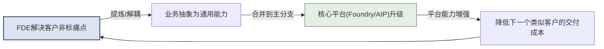
*图：FDE经济学飞轮*

**飞轮如何从静止转起来：一个“先亏后赚”的加速过程**

上面的公式和曲线揭示了一个反直觉的规律：**FDE 模式的盈利能力不是一开始就有的，而是被“转”出来的。** 理解飞轮的启动过程，是理解整个 FDE 经济学的关键。

- **静止期（第 1-2 个项目）：飞轮最重，必须用力推。**
  此时平台还只有最通用的底层功能，**没有沉淀任何行业解决方案，没有可复用的行业模块**。因此第一批项目**必然是高定制、高投入的**——FDE 要在现场写大量非标代码（定制代码占比 60% 以上），交付慢、毛利为负。这不是执行失败，而是飞轮启动的**物理必然**：你必须先在泥泞里把路趟通一次，才谈得上把它修成公路。这几个“种子项目”当期是亏钱的，但它们真正的产出不是利润，而是**行业 Know-how 与可被抽象的经验**——这些才是喂养飞轮的燃料。
- **加速期（第 3-10 个项目）：共性显现，飞轮开始自转。**
  当同一行业的第 3、4、5 个项目做下来，FDE 会发现“这段清洗逻辑、这个预警模型、这套本体结构”在客户间反复出现。此时把它们抽象、回注为平台组件（$\alpha$ 学习率的体现），下一个同类项目的定制代码占比就降到 40%、20%……边际成本随之递减，毛利由负转正。
- **飞轮期（第 10 个项目以后）：势能积累，越转越快。**
  平台已沉淀出成体系的行业方案，新项目大量复用既有资产，定制代码降至个位数百分比，单个 FDE 可并行支撑多个项目，毛利趋于 SaaS 水平。**飞轮的重量没变，但它积累的动能已经让它自己转下去。**

> [!IMPORTANT]
> **启动期的判断逻辑：靠什么决定“接不接、做什么”？**
>
> 既然启动期没有可复用模块，那“这个项目值不值得做”就**不能用“平台复用度”来衡量**——那是飞轮转起来之后（成熟期）才有意义的指标。启动期真正该看的，是 Palantir 官方在《Delivering a use case》中给出的**结果导向（outcome-oriented）三要素**：
>
> 1. **Outcome（期望结果）**：这个项目最终能帮客户改善哪个**运营决策**、挂钩哪个核心 KPI？——先问结果，而非先问要建什么功能。这是价值的第一标尺，也决定客户的付费意愿。
> 2. **Data（数据可行性）**：从期望结果倒推所需的数据实体，评估现有数据能否支撑这个结果。
> 3. **痛点的行业普遍性**：这个痛点在**同行业其他客户**中是否普遍存在？——注意，这是“痛点是否普遍”（可通过行业调研**前瞻**判断），而非“我方能否复用现成模块”（启动期无从谈起）。痛点越普遍，这个种子项目未来喂养飞轮的价值越大。
>
> *来源：Palantir Foundry 官方文档「Delivering a use case」，原文三要素为 Outcome / Data / Tools。此处结合 FDE 商业语境，将偏交付执行的 “Tools（平台工具选型）” 替换为更适合入场决策的 “痛点的行业普遍性”——Tools 层面的工具选型将在第三篇 Prototype/Build 阶段详述。*
>
> 换言之：**通用性是被“训练”出来的结果，不是入场时筛出来的前提。** Palantir 官方将 FDE 方法论比作“人肉反向传播”——平台的通用能力，正是靠一个个种子项目反复喂反馈，一轮轮收敛而成。这也解释了 3.5 节「五次部署法则」的深意：共性要 5 个客户之后才真正清晰，过早标准化反而会把个例的偏见固化下来。

**飞轮转起来之后：承接选择逻辑的反转**

前面讨论的都是“飞轮如何启动”。但一个更深刻、也更常被忽略的问题是：**当飞轮真正转起来、平台已经沉淀出成体系的行业方案之后，承接项目的选择逻辑会发生一次根本性的反转。**

反转的根源，在于**稀缺资源变了**：
- **启动期**，最稀缺的是“行业 Know-how”——平台一无所有，所以要**广撒种、赌通用性**，判断点是 Outcome + Data + 痛点的行业普遍性（前瞻性地押注哪些赛道值得深耕）。
- **成熟期**，行业 Know-how 已不再稀缺（平台里全是），此时最稀缺的变成了**顶尖 FDE 的交付带宽**。于是承接选择的核心问题，从“这个项目值不值得亏钱做”，变成了“**在有限的 FDE 带宽下，哪些项目能最大化复用飞轮红利、又不反噬平台**”。

成熟期的承接判断，应从“结果导向”升级为“**资产杠杆导向**”，看以下四个点：

| 判断点 | 含义 | 启动期 vs 成熟期的差异 |
| :--- | :--- | :--- |
| **(a) 复用杠杆率（正向核心）** | 该项目能复用多少现成平台资产/行业组件？复用越高 → 边际成本越低 → 交付越快、毛利越高 | 「复用度」终于成为**正当的入场指标**——但它是成熟期指标，绝非启动期门槛（这正是启动期悖论的另一面） |
| **(b) 战略延展性** | 项目落在已沉淀的成熟行业里（**收割型**），还是开辟一个新的、值得押注的赛道（**再播种型**）？ | 成熟期要有意识区分两类：收割型用杠杆逻辑评估，再播种型回到启动期的种子逻辑评估 |
| **(c) 是否反噬平台（负向筛选）** | 高定制、极特殊、通用性极低的孤岛需求，接了会占用稀缺带宽、诱导平台为个例妥协、破坏架构一致性 | **这是成熟期特有、启动期没有的判断点**——详见下方展开 |
| **(d) 人效贡献** | 该项目会拉高还是拉低团队人效（单个 FDE 可并行支撑的项目数）？ | 考核从“能不能交付”转向“人效是否健康增长” |

> [!IMPORTANT]
> **成熟期最关键的能力，是对“能做但不该做”的项目说不（负向筛选）。**
>
> 这是启动期与成熟期最深刻的一处反转，也是本节要讲透的重点：
>
> - **同一个高定制、通用性极低的孤岛需求**，在**启动期**可能因为“痛点行业普遍、值得赌”而应该接（它是喂养飞轮的种子）；但在**成熟期**，如果它无法复用既有资产、又不通向新赛道，就应该**坚决 Say No**——哪怕团队完全有能力把它做出来。
> - 原因是成熟期的机会成本变了：一个顶尖 FDE 投入到一个“只此一家、别无分号”的孤岛需求上，意味着放弃了 N 个能复用飞轮、快速高毛利交付的项目。更危险的是，为了迁就这个孤岛需求，平台团队可能被诱导做出破坏通用性的妥协，**反过来污染已经铺好的“铺装公路”**。
> - 这与 9.2 节「回注优先级矩阵」的判断完全同构：**左下角（低通用 + 高成本）的需求坚决不做，留作一次性项目定制、绝不并入平台**。承接选择与回注决策，在成熟期用的是同一把尺子。
>
> **一句话概括这次反转：启动期的智慧是“敢于为通用性亏钱”，成熟期的智慧是“敢于为通用性拒单”。** 前者怕的是错过种子，后者怕的是稀释资产。一个健康的 FDE 组织，必须同时具备这两种看似矛盾的勇气，并清醒地知道自己当前处在飞轮的哪个阶段。

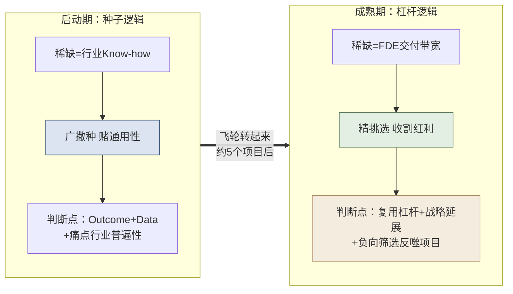
*图：飞轮启动前后，项目承接选择逻辑的反转*

### 2.4 财务证据：从"低毛利外包"到"高盈利平台"

Palantir早年因投入大量FDE在客户现场，常被华尔街诟病为“一家伪装成SaaS的低毛利外包公司”。但随着FDE飞轮的转动，其财务数据实现了惊人的反转。这个反转分两个阶段发生——**先是毛利率爬升，再是盈利能力质变**：

**第一阶段（2018–2022）：毛利率证明"这不是外包"。**

| 财年 | 整体毛利率 | 核心驱动因素 |
| :--- | :--- | :--- |
| 2018 | ~50% | Apollo部署平台尚未成熟，FDE纯靠人力堆叠整合异构数据。 |
| 2020 | 68% | Foundry平台组件化加速，Apollo实现自动化跨网部署。 |
| 2022 | 78.6% | 行业本体论（Ontology）大规模复用，每个新增客户实施周期大幅缩短。 |

毛利率从 50% 爬到 ~80%，已经足以反驳"外包"论——外包的毛利率通常只有 10%–30%（见 2.2 节对比表）。

**第二阶段（2023–2025）：毛利率见顶后，飞轮威力转移到"盈利能力"上。**

到 2023 年后，毛利率稳定在 **80% 出头的高平台**（2023 年 80.6%、2024 年 80.3%、2025 年 82.4%），不再是看点。真正体现飞轮成熟的，是**经营利润率与净利率的转正与飙升**——这说明平台复用带来的规模效应，终于压过了 FDE 的人力投入成本：

| 财年 | 整体毛利率 | 经营利润率 | 净利率 | 营收（亿美元） | 营收增速 |
| :--- | :--- | :--- | :--- | :--- | :--- |
| 2022 | 78.6% | -8.5% | -19.5% | 19.1 | +23.6% |
| 2023 | 80.6% | +5.4% | +9.8%（首次转正） | 22.3 | +16.7% |
| 2024 | 80.3% | +10.8% | +16.3% | 28.7 | +28.8% |
| 2025 | 82.4% | **+31.6%** | **+36.5%** | **44.8** | **+56.2%** |

> [!NOTE]
> **数据来源**：Palantir（NASDAQ: PLTR）公开财报，经 stockanalysis.com / Fiscal.ai 整理，截至 2025 财年（自然年，FY 截止 12 月）。毛利率、经营利润率、净利率均为公开可查证数据。

**这张表最反直觉、也最有说服力的一点是**：2024→2025 年，Palantir 营收增速不降反升（从 +28.8% 跳到 +56.2%），同时经营利润率翻了近三倍（10.8%→31.6%）。一家体量已达数十亿美元的公司，还能同时实现"增长加速 + 利润率飙升"，这正是 FDE 飞轮进入成熟期的典型特征——**平台底座沉淀得越厚，新增收入的边际成本越低，于是规模越大反而越赚钱**（正是 2.3 节经验曲线的宏观兑现，也印证了 AIP 等 AI 能力让 FDE 用极少代码即可完成现场交付）。

**除了毛利/净利，还有两组数据直接印证了"落地生根、卖能力"的模式跑通：**

- **净收入留存率（NRR）——"从 1 个用例扩展到 N 个"的硬证据。** NRR 衡量老客户今年比去年多付了多少钱，大于 100% 说明老客户在持续增购、扩展场景。Palantir FY2021 总体 NRR 达 **131%**（其中美国商业 **150%**、政府 **146%**），FY2022 为 **115%**，2024 年回升至 **118%** 左右。这组数字量化地证明了 FDE"先用一个快赢切入、再横向复制"的扩张逻辑真实有效（呼应 4.2 BP 案例的"落地生根"）。
- **单客户产出持续走高——规模化不是靠堆客户数，而是靠做深单客户。** Palantir 每个政府客户的年均收入从 2020 年的 **680 万美元**增至 2021 年的 **1000 万美元**；其 Top 20 客户的近十二个月平均收入，从 2024 年的 **6460 万美元**升至 2025 年的 **9390 万美元**。单客户越做越深，正是"卖能力"（而非按人头卖一次性项目）的直接体现。

> [!NOTE]
> 上述 NRR 与单客户收入均为 Palantir 官方财报/投资者材料披露的可查证数据，来源见附录 C。

> [!IMPORTANT]
> **对To B/To G技术服务商的启示：** 
> 早期容忍较低的毛利率并敢于向客户现场派驻顶尖人才（FDE），是获取行业Know-how和核心数据的必经之路。只要建立了“现场定制 -> 平台抽象”的坚实反馈管道，后期的规模化盈利就是水到渠成。Palantir 用了约七年（2018 的 50% 毛利、亏损 → 2025 的 82% 毛利、36% 净利率）走完这条路——**飞轮启动慢，但一旦转起来，回报是指数级的。**

> [!TIP]
> **本篇小结**
> 认知篇立起了全书的地基：FDE 不是驻场外包，而是"用平台承载定制、再把定制回注为平台能力"的一种交付范式，其本质是**从卖人力到卖能力**。它之所以成立，是因为一条经济学规律——能力回注飞轮让边际成本随规模递减，从而走出传统项目制的死亡螺旋。**但"飞轮"目前还只是一个原理；它在现实中究竟长什么样、由谁跑通？** 下一篇（标杆篇）将走进 Palantir——这套模式的发明者与集大成者，看它如何用平台、团队与方法论把飞轮真正转起来。

---

# 第二篇：标杆篇 — Palantir FDE深度解剖

> [!NOTE]
> **本篇导读**
> FDE 模式由 Palantir 首创并跑通，它是全球最值得对标的标杆。本篇拆解 Palantir 的 FDE 体系：第3章讲它的"武器库+作战单元+治理+方法论"（平台、团队、汇报线、碎石路→铺装公路、五次部署法则），第4章用空客、BP、NHS、财富500强、美国陆军五个真实案例印证这套体系如何在战场发挥威力，并用 People–Process–Technology 框架做统一透视。**本篇的目的不是让你崇拜 Palantir，而是提炼出可被中国厂商对标复现的底层机理。**

## 第3章 Palantir的平台与FDE体系

> [!NOTE]
> **本章导读**：一支能打胜仗的 FDE 队伍，需要四样东西层层就位：**先得有趁手的武器——强大的平台底座；光有武器不够，得有对的人组成特种作战单元；而这支队伍归谁指挥，决定了它会不会变质、沦为外包；最后，还得有一套把"现场定制"沉淀为"平台能力"的迭代哲学与作战纪律。**
> 武器、人、治理、方法论——这四者恰好对应 People–Process–Technology 三要素：平台是 Technology，团队与治理是 People，迭代哲学与纪律是 Process。

### 3.1 武器库：三大平台架构 Gotham / Foundry / AIP

FDE的强大离不开其背后的武器库。没有强大底座支撑的FDE，最终都会沦为堆砌代码的外包民工。**所以理解 FDE 体系，第一步是理解它手里握着什么武器。**

1. **Gotham（国防与情报平台）**：主攻强对抗、低带宽、极高安全密级的场景（如军方、反恐、情报网）。FDE在此场景下负责连接异构情报源，在战区甚至无网环境下部署节点。
2. **Foundry（企业级数据操作系统）**：主攻商业世界（制造业、金融、医疗）。它不是传统的数据仓库，而是一个业务闭环系统。
3. **AIP（人工智能平台）**：将大模型直接接入客户的企业本体数据库，实现自然语言驱动的分析和决策建议。

**Foundry 核心模块详解（FDE的乐高积木）：**
| 模块名称 | FDE用途 | 从手工向自动化的进化 |
| :--- | :--- | :--- |
| **Pipeline Builder** | 构建异构数据清洗与融合管道 | 早期FDE写几千行Spark脚本；现在直接用可视化界面配置。 |
| **Ontology (本体层)** | 将死数据转化为业务对象（如“飞机”、“订单”） | FDE的核心工作从“建数据库表”变成了“构建业务对象的物理关系图”。 |
| **Object Explorer** | 面向业务用户的拖拽式搜索探索工具 | 让不写代码的分析师能直接过滤与查看数据，替代定制前端。 |
| **Contour** | 亿级数据的无代码可视化数据探索 | 降低FDE写SQL或BI仪表的频率。 |
| **Quiver** | 时间序列数据的高级关联分析（如金融走势） | 解决大量复杂的数学推演问题。 |
| **Code Workbook** | 将Python/R/SQL代码化作为分析流 | 使分析具有高度复用性，告别孤立的Jupyter Notebook。 |
| **Workshop** | 快速构建面向最终用户的操作应用 | 替代了早期FDE必须手写React/Vue前端的低效工作。 |
| **AIP Logic** | 编排大语言模型与业务逻辑 | 让FDE可以通过配置而不是深度编码，构建企业级Agent。 |

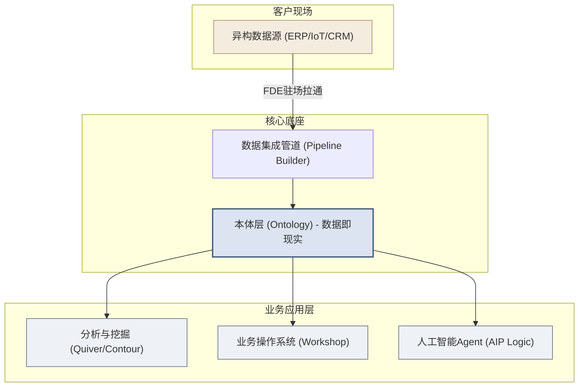

### 3.2 作战单元：团队结构（技术执行 / 业务策略 / 基础设施）

有了武器库，接下来的问题是**谁来使用它**。在客户现场，单纯派出一名写代码的工程师是不够的，必须形成特种作战小组——这三类角色，正是 People 维度的核心配置。

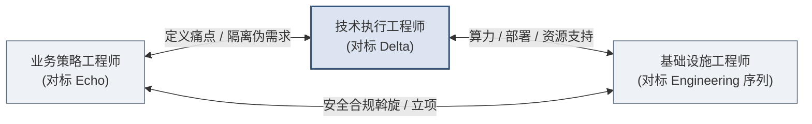

1. **技术执行工程师（对标 Delta，即狭义的 FDE / FDSE）**
   - **定位**：尖刀，核心战斗力。享有极高的战术自主权。
   - **职责**：编写代码，打通数据，构建本体模型，开发前端应用。他们对技术产出的最终质量和速度负责。
2. **业务策略工程师（对标 Echo）**
   - **定位**：政委与导航员。挖掘高管真实意图，定义 FDE 要优先攻击的"高价值痛点"，并保护尖刀不陷入客户无穷无尽的"假需求"泥潭。
   - **说明**：这一角色最易被误解，下方专门厘清它与传统客户经理的本质区别。
3. **基础设施工程师（对标 Engineering 序列，如 SRE / Enablement Engineer）**
   - **定位**：阵地保障。
   - **职责**：解决网络隔离、防火墙穿透、私有云部署、数据安全合规加密等偏向系统底层运维的问题。

> [!IMPORTANT]
> **重点厘清：业务策略工程师 ≠ 传统的客户经理 / 行业专家 / 售前。**
>
> 它和传统客户经理表面都在"和客户谈、挖痛点"，但本质完全不同。
>
> **先看 Palantir 官方对这一角色（Deployment Strategist）的定义**（据 Palantir 官方招聘 JD）：它属于独立于工程师序列的 **Echo 序列**，核心使命是"把客户的模糊直觉变成现实"——*综合零散的信息流，判断出最重要的问题是什么、数据意味着什么、产品需要什么、用户被什么驱动、影响力在哪里*。官方 JD 明确要求该角色**具备编程/脚本能力（Python/R/SQL）**，日常职责包括：识别相关数据集、**与技术执行工程师协作把数据集成进管道**、为新用户群构建定制工作流、主导培训、向从分析师到 C-suite 的各层级汇报，并**把现场所见回嵌到平台产品中**。
>
> 由此可见，它与传统客户经理有着本质区别：
>
> | 维度 | 传统客户经理 / 行业专家 | 业务策略工程师（Deployment Strategist） |
> | :--- | :--- | :--- |
> | **懂不懂技术** | 通常不懂，只做业务翻译 | **懂技术**——官方 JD 硬性要求 Python/R/SQL 能力，需与 FDE 协作做数据集成 |
> | **核心产出** | 需求文档、关系维护 | **判断"最重要的问题是什么"并推动落地**——把模糊直觉综合成可执行的问题定义 |
> | **对落地负责吗** | 提完需求就交棒，不对结果负责 | **全程陪跑**——从识别数据、构建工作流、培训用户到回嵌产品，对最终业务影响负责 |
>
> 一句话：**客户经理是"把客户的话带回来"（信息传递者），业务策略工程师是"判断哪些问题最值得解决、并亲手推动它落地"（问题定义者 + 落地推动者）。**
>
> 还有一条边界值得强调：**业务策略工程师定义"做什么、值不值得做"，但不承担签单与定价的压力。** 这与 3.3 节"FDE 团队不应向销售汇报"是同一条逻辑——一旦让定义问题的人同时背商务指标，他就会倾向"客户要什么答应什么"，把团队拖回卖人力的老路。因此，定价与合同应由独立的商务角色承担，与业务策略工程师隔离。

这套编制的精妙，藏在两条看似矛盾、实则互补的线里——**先解耦、再整合**。

**第一条线：分工解耦——让最强的战斗力，只打最该打的仗**

三个角色的边界必须清晰、互不越界，其根本目的只有一个：**把技术能力最强的人（技术执行工程师）从一切非核心事务中解放出来，让他专注于最高价值的业务逻辑与代码。**

- 业务策略工程师**向前**挡住客户的人际博弈与"假需求"，不让尖刀陷入无意义的会议和低价值定制；
- 基础设施工程师**向下**扛住安全合规、网络配置、部署运维这些"脏活累活"，不让尖刀分心于底层环境；
- 于是技术执行工程师**居中**，得以把全部精力压在"发现痛点→写代码验证→沉淀为平台能力"这条主价值链上。

> [!TIP]
> **通用借鉴点**：对任何希望转型 FDE 的技术服务商，这套解耦逻辑都值得直接照搬——**不要让你团队里代码能力最强的人，把时间耗在客户关系维护、环境搭建、合规文书上。** 这些事重要，但应该由专门的角色承担；让尖刀去干杂活，是对最稀缺资源的最大浪费，也是团队从"精兵"退化为"人海"的开始。

**第二条线：战斗力整合——解耦不是各自为战，而是为了更好地合力**

分工清晰绝不意味着三人各干各的、隔墙抛砖。恰恰相反，解耦的目的是让他们能作为**一个紧密咬合的战斗单元**协同发力——上图的三条双向箭头，正是三者之间高频、实时的互相支撑：业务策略与技术执行之间"一个指方向、一个开炮"，实时对齐痛点与实现；技术执行与基础设施之间"一个提需求、一个即时保障"，让落地不被环境卡住；业务策略与基础设施之间则并肩扫清合规与立项的组织障碍。三条线同时高速运转，小组才成其为一个整体。

**一句话概括这套哲学：解耦是手段，整合是目的。** 通过让每个角色只做自己最擅长的事（分），再让三者高带宽咬合成一个整体（合），FDE 小组才能以极小的编制，在复杂客户现场打出远超人数的战斗力——这正是本节开篇所说"特种作战小组"的真正含义。

### 3.3 归谁指挥：FDE 的汇报线设计

组建了作战单元，紧接着一个决定"这支队伍会不会变质"的关键问题浮现出来：**FDE 到底归谁管？**

> [!NOTE]
> **先厘清一个层级区别**：上一节（3.2）讲的是 FDE 小组**内部**的角色分工（谁写代码、谁管客户、谁管环境）；本节讲的是完全不同的另一层问题——**FDE 这支小组作为一个整体，在乙方公司的组织架构里，应该挂靠在哪个部门下、向谁汇报。**
> 因此，下表中的"产品/研发""销售/区域""工程/实施"**不是 FDE 团队内部的角色**，而是乙方公司里位于 FDE 团队**之上**的三个候选归属部门。选错了上级部门，再精良的作战小组也会被带偏。

这是组织架构设计的核心难题——不同的汇报线，会直接决定 FDE 团队的基因，是"卖能力"还是退回"卖人力"（见 1.3、2.2 节）。

| FDE 团队挂靠的上级部门 | 优势 | 劣势与隐患 | Palantir的最佳实践 |
| :--- | :--- | :--- | :--- |
| **汇报给产品/研发**（推荐） | 确保「现场经验」无损反哺给「平台研发」；FDE有技术归属感，最利于能力回注和平台演进。 | 可能导致对销售支持不足，短期收入受影响。 | 强耦合产品线，FDE视为产品研发的前延探针。 |
| **汇报给销售/区域** | 极致的客户响应速度；直接对营收数字负责。 | **致命隐患**：销售为拿单会逼迫FDE过度承诺，偏向扩充营收，FDE沦为低级定制外包。 | 坚决禁止。FDE不对签单本身承担首要KPI。 |
| **汇报给工程/实施** | 交付流程规范化；利于代码质量把控。 | 容易演变成传统的“软件实施外包中心”，产生部门墙。 | 作为过渡形态，必须设置极强的技术双线汇报。 |

至此，武器（平台）与人（团队 + 治理）都已就位。但真正让 FDE 区别于外包的，不是有平台、有团队，而是**一套把"现场一次性定制"系统性沉淀为"平台通用能力"的方法论**——这就是接下来两节要讲的 Process 维度：迭代哲学与作战纪律。

### 3.4 迭代哲学：从「碎石路」到「铺装公路」

Palantir内部有一个著名的产品哲学：**“From Gravel Roads to Paved Highways”**。它回答了一个核心问题——**FDE 在现场写的定制代码，如何才能变成平台的标准能力？**

- **碎石路（Gravel Road）**：面对全新的客户场景，平台尚无标准功能。FDE在现场使用Python脚本、脏代码、非标准集成，甚至连夜打补丁，以最快的速度把路“趟”出来，证明业务价值。这叫走碎石路。
- **铺装公路（Paved Highway）**：一旦发现多个客户都需要走这条碎石路（例如：都需要清洗某家特定供应商的乱码数据，或都需要某类供应链预警模型），后方产品团队就会将其重构为产品里的一个标准配置项（即铺装公路）。今天客户A的定制代码，成为明天平台的一个配置项，更是后天所有客户的标准能力。

> [!WARNING]
> **反面模式：拒绝过早标准化**
> 如果连一条“碎石路”都没走通，研发就在后方凭空想象修建一条“铺装公路”，往往会造出没人用的“搁板软件”。只有FDE在泥泞里证明了价值，标准化才有意义。

需要说明的是，"碎石路→铺装公路"是一个**理念层面的比喻**——它讲清了"为什么要把定制沉淀为平台能力、方向是什么"。而落到操作上，这个理念可以拆成一条清晰的四步链路：

> **识别 → 抽象 → 集成 → 验证**
> - **识别**：在现场发现"这段定制，别的客户可能也需要"的重复信号；
> - **抽象**：剥离客户特定的硬编码，把它提炼成可配置、可复用的通用模式；
> - **集成**：由平台团队将其正式并入产品主干，成为标准能力；
> - **验证**：在下一个客户身上复用它，确认通用性真正成立。

这四步就是把"碎石路"铺成"铺装公路"的施工流程。**本篇作为概念篇，点到这一层即可；至于每一步由谁负责、如何抽象才不污染平台、如何度量回注成效等可落地的操作细节与配套工具，将在第9章「能力回注方法论」中完整展开。**

### 3.5 作战纪律：五次部署法则

"碎石路→铺装公路"讲的是**方向**，而"何时该动手铺路"则需要一条**纪律**来把关——这就是五次部署法则。Palantir对于将FDE的定制经验转化为标准产品有一条铁律：**在成功完成至少5个不同客户的部署之前，不要过早试图写出固定的Playbook或标准产品。**

- **阶段1（1-2个客户）**：早期试图编写固定Playbook往往会把无法扩展的个例固化下来，这些经验都带有强烈的“特定客户偏见”。
- **阶段2（3-4个客户）**：模式开始显现，FDE开始主动在客户间复用部分脚本代码。
- **阶段3（5个以上客户）**：共性彻底清晰。此时由核心研发团队介入，将FDE的组件重构为平台的原生架构。

> [!NOTE] 
> **合理负荷管理**
> 一名顶尖FDE同时并行的负荷极限是1-2个大型企业级客户。超过此限制，FDE就会退化为只负责应付催度的“接线员”，失去深度思考和重构代码的时间。

至此，Palantir 的 FDE 体系全貌清晰了：**Technology（平台武器）+ People（团队与治理）+ Process（迭代哲学与纪律）**，三者缺一不可、互相咬合。下一章将通过五个真实案例，看这套体系在战场上如何发挥威力。

---

## 第4章 Palantir经典案例集

> [!NOTE]
> **本章导读**：用五个真实案例（空客、BP、NHS、财富500强、美国陆军）印证第3章讲的 FDE 体系如何在战场发挥威力。每个案例遵循统一的"背景挑战 → FDE做了什么 → 核心成果 → 能力回注"四段式，并提炼给读者的方法论启示；4.6 汇总能力回注图谱，4.7 用 PPT 框架做整体透视。

本章通过真实场景，剖析FDE如何将平台能力与客户特定难题结合。每个案例遵循统一的四段式解剖框架——**背景挑战 → FDE做了什么 → 核心成果 → 能力回注**，并在末尾提炼**给读者的方法论启示**。

> [!NOTE]
> **关于数据严谨性的说明**：本章案例中，凡涉及具体量化数字，仅保留有公开来源可查证的部分；无法查证的量化结论，采用“显著”“数周级”等定性表述，避免以精确假数字误导读者。案例的核心价值不在于记住某个数字，而在于理解 FDE「解决孤立痛点 → 沉淀平台能力」的作用机理。

### 4.1 Airbus空客 — 制造业供应链（Foundry / Skywise）

**背景挑战**：
制造一架 A350 宽体客机，需要来自全球数千家供应商的数百万个零部件协同到位。空客当时面临严峻的产能爬坡（ramp-up）压力：不同工厂、不同产线的 ERP、MES（制造执行系统）、PLM（产品生命周期管理）以及供应商 EDI 数据，分散在数十个互不连通的遗留系统中，数据编码标准不一、口径各异。当某个供应商延期时，图卢兹总部很难快速判断哪些飞机的总装环节会因此受阻——问题往往在停线时才暴露。

**FDE做了什么**：
Palantir 自 2015 年起与空客在法国的团队并肩工作，共建了 **Skywise** 航空数据平台（该平台于 2017 年正式推出、对外开放）。FDE 的工作分三层递进：
1. **系统拉通**：用 Pipeline Builder 将 ERP/MES/PLM/供应商数据接入统一底座，处理编码不一致、单位不统一等脏数据问题（典型的“碎石路”阶段）。
2. **本体建模**：在现场建立“飞机制造 Ontology”，把碎片化的数据表映射为业务人员能直接理解的对象——**飞机、工位、零件、供应商、生产订单**及其相互关系（如“某零件 装配于 某工位”“某供应商 供应 某零件”）。
3. **业务应用**：基于 Ontology 构建产线监控与瓶颈预警应用，让生产经理能看到“哪个节点即将成为生产卡点”。

**核心成果**：
系统帮助空客把隐藏在数十个系统深处的供应链瓶颈显性化，支撑了民用飞机的生产、供应链管理与机队可靠性运营。Skywise 后续通过"数字联盟（Digital Alliance）"对外开放，发展为面向全球航空业（航空公司、GE Aerospace 等 OEM/供应商、MRO 维修机构）的行业数据平台。

**能力回注（飞轮效应）**：
空客现场踩过的坑、建立的复杂离散制造供应链 Ontology 模型，被 Palantir 抽象吸收，成为 Foundry 在**复杂离散制造业**领域可复用的建模范式与供应链能力，此后在其他制造业客户中被反复复用。

> [!TIP]
> **给读者的方法论启示**：空客案例是「Ontology 优先」的经典范本。FDE 没有陷入“把所有系统数据先搬进一个大数据湖”的传统数仓思路，而是**以业务对象为中心**倒推需要哪些数据——这正是 3.1 节 Ontology 与 3.4 节碎石路哲学的现场体现。

### 4.2 BP石油 — 油气生产运营（Foundry）

**背景挑战**：
英国石油公司（BP）的上游油气生产，涉及遍布全球的油田、钻井平台、管线与炼化设施。要优化生产、预测设备故障、保障运营可靠性，工程师需要同时权衡产量、设备状态、传感器读数、维护记录等多维数据——而这些数据分散在互不连通的不同系统中，难以形成统一的运营视图。

**FDE做了什么**：
Palantir 与 BP 自 2014 年起深度合作，在 Foundry 上为其油气生产运营构建统一的数据底座与**运营数字孪生**。关键在于：把物理世界的油田、设备、管线建模为可交互的 Ontology 对象，让工程师能在一个统一视图里监控生产、预测设备可靠性、优化运营决策。近年双方进一步把 AIP（大模型能力）引入这套体系，用自然语言驱动运营分析。

**核心成果**：
项目建立在双方"十年深度协作"的基础之上——2024 年双方续签为期五年的战略协议，Palantir 软件已成为 BP 油气生产运营的核心数据底座。这是"落地生根（Land and Expand）"的典型：从生产运营的核心场景切入，建立信任后持续把能力扩展到新的业务领域。

**能力回注（飞轮效应）**：
在能源这类重资产、强运营行业对"**工业运营数字孪生**"建模能力的深度打磨，反哺了 Foundry 在工业运营场景的通用建模能力，此后被其他能源、制造、供应链客户复用。

> [!TIP]
> **给读者的方法论启示**：BP 是第 8 章 Scale「从 1 到 N」的现实样本——**先在一个核心场景赢得信任，再横向扩张**，而非一开始就承诺"整个企业数字化"。FDE 切入点越聚焦、越可量化，越容易赢得第一场信任，也才有后续十年扩展的基础。

### 4.3 NHS英国国民健康服务 — 公共卫生应急（Foundry）

**背景挑战**：
COVID-19 疫情爆发，英国亟需实时掌握全国每一家医院还有多少可用呼吸机、多少张空余 ICU 床位、多少防护物资。但这些数据散落在成百上千个独立的医院系统和 Excel 表格中，口径不一、更新不及时。传统的数据集成项目动辄以“年”为周期，而疫情决策以“天”计。

**FDE做了什么**：
Palantir 是参与 NHS COVID-19 数据支撑的**四家科技公司之一**（可查证事实），基于 Foundry 快速搭建了国家级数据平台：在极短周期内将全国医院床位、物资、人员数据对接汇聚，构建实时分析视图与资源调配能力。合规脱敏与权限隔离在此类严苛场景中是与速度同等重要的前置约束。此外，Palantir 还开发了用于美国疫苗分配的软件 **Tiberius**（可查证事实）。

**核心成果**：
系统支撑了英国疫情期间的医疗物资分配、ICU 容量实时监控与后续的疫苗接种项目运营分析。此役证明了：在合规极其严苛的公共卫生领域，数据平台同样可以做到**极速上线**。（注：NHS 与 Palantir 的后续合作亦伴随患者数据隐私的公共争议，2023 年 NHS England 授予 Palantir 一份为期七年、价值约 £3.3 亿的联邦数据平台合同——此为可查证事实，教材引用旨在说明规模而非评判其争议。）

**能力回注（飞轮效应）**：
该战役极大地完善了核心平台在**合规严苛环境下的快速部署能力**（Rapid Deployment Framework 方向），证明了合规与速度可以兼得，此类经验此后在各国公共部门应急项目中被复用。

> [!TIP]
> **给读者的方法论启示**：NHS 案例呼应第五篇 14.5 节的政企/合规话题。FDE 在中国政企场景同样面临“数据不出域、等保合规、极速见效”的三重约束——**合规不是速度的敌人，而是设计的前置输入**。把合规当成第一天就要解的题，而非上线前的补丁。

### 4.4 某财富500强 — 供应链本体论（Foundry / Writeback）

**背景挑战**：
该客户（因商业保密匿名）的供应链数据分散在 SAP ERP、大量 Excel 以及成千上万封往来邮件中。一旦发生突发事件（如某供应商断供），排查受影响的订单需要几十个采购员耗费数周时间手工核对——等排查清楚，最佳应对窗口早已错过。

**FDE做了什么**：
FDE 为客户构建了强交互的供应链 Ontology。它的技术卖点不只是“可视化面板”，而是支持**业务人员双向读写**的操作系统：
- **读**：采购员在统一视图中一眼看清“某供应商 → 影响哪些零件 → 波及哪些订单 → 关联哪些客户交付”的完整链路。
- **写（Writeback / Actions）**：业务员可直接在系统里模拟调整生产/采购计划，并将决策**安全地写回底层 SAP 等源系统**，而非导出 Excel 再让 IT 手工回填。这背后是严格的权限管控与操作审计，确保“业务人员改数据”不会破坏源系统的一致性。

**核心成果**：
将突发事件的响应时间从**数周缩短到小时级别**。更关键的是，客户把核心供应链决策从“看报表 + 打电话 + 改 Excel”的旧模式，整体迁移到了这套可双向读写的业务系统上。

**能力回注（飞轮效应）**：
此次部署极大推动了 **Ontology 建模 + Writeback/Actions（数据回写与动作）** 能力的演进，使“可读写的业务操作系统”成为 Foundry 区别于传统 BI 工具的核心差异化能力，成为各类业务流闭环的标准件。

> [!TIP]
> **给读者的方法论启示**：这个案例揭示了 FDE 交付物与传统 BI 报表的本质区别——**BI 让人“看见”问题，Ontology + Writeback 让人“直接解决”问题**。当系统成为业务人员每天动手操作的工具（而非偶尔查看的看板），它才真正嵌入了客户的业务血液，替换成本极高。

### 4.5 美国陆军 — 数据平台与战备分析（Gotham / Army Vantage）

**背景挑战**：
美国陆军的装备维护、战备与后勤数据分散在数十个高度保密、年代久远的异构系统中，且分处不同密级网络。指挥官很难获得跨部队、跨装备类别的实时战备状态全景，导致预算调配和维护决策缺乏统一数据支撑。

**FDE做了什么**：
FDE 深入现场，面对极端老旧的数据接口和严格的密级隔离约束，编写了大量定制化数据管道，在低带宽、高安全等级环境下（Gotham 的典型场景，见 3.1 节）构建了 **Army Vantage** 平台——它是支撑"陆军数据平台（Army Data Platform）"的核心软件系统。数据融合与密级管控是此类国防项目的核心难点。

**核心成果**：
自 2018 年起，美国陆军持续借助 Palantir 的软件提升跨部队、跨装备的数据可见性与决策能力。2024 年 12 月，双方续签并扩展了 Army Vantage 合作（合同金额 4.007 亿美元、上限 6.189 亿美元）。凭借其在国防场景中不可替代的价值，Palantir 长期是美国国防部与情报界的核心软件供应商——其 SaaS 是美国国防部授权用于关键任务国家安全系统（IL5）的少数几家之一；2024 年 11 月，美国海军亦另行授予 Palantir 一份近 10 亿美元的软件合同（注：此为海军的独立合同，与上述陆军 Vantage 合同是两笔不同项目，勿混淆）。

**能力回注（飞轮效应）**：
陆军项目中沉淀的**跨密级异构数据融合框架**与**国防后勤本体模型**，回注强化了 Gotham 平台在强对抗、低带宽、高安全环境下的部署与建模能力，成为 Palantir 服务其他国防与情报客户时可复用的核心资产。

> [!TIP]
> **给读者的方法论启示**：陆军案例是全书唯一的 Gotham（而非 Foundry）案例，它证明 FDE 方法论在**极端受限环境**（无外网、高密级、老旧接口）下同样成立。这恰是 12.1 节 FDE 面试题“客户只有堡垒机、老旧 Oracle、五天要出 Demo”的真实原型——FDE 的核心竞争力，正是在别人认为“不可能接入”的地方把数据拉通。

### 4.6 能力回注总图谱

下表总结了 FDE 如何将“现场难题（碎石路）”提炼为“核心平台能力（铺装公路）”，驱动飞轮越转越快。

| 原始客户场景 (碎石路) | 回注的平台功能 (铺装公路) | 承载平台 | 后续复用情况 |
| :--- | :--- | :--- | :--- |
| **空客**：整合数十个离散制造遗留系统 | **Ontology (本体论) 建模** | Foundry | 被快消、制造业广泛复用 |
| **BP石油**：油气生产运营数据割裂 | **工业运营数字孪生建模能力** | Foundry | 能源、制造、供应链运营场景复用 |
| **某财富500强**：采购员需读写 ERP 数据 | **Writeback (数据回写) 与 Actions** | Foundry | 成为各类业务流闭环的标准件 |
| **NHS**：疫情下的合规极速搭建 | **Rapid Deployment Framework (快速部署框架)** | Foundry | 各国公共卫生和应急项目普及 |
| **美国陆军**：跨密级老旧系统的数据融合 | **跨密级数据融合框架 + 国防后勤本体** | Gotham | 服务其他国防/情报客户时复用 |

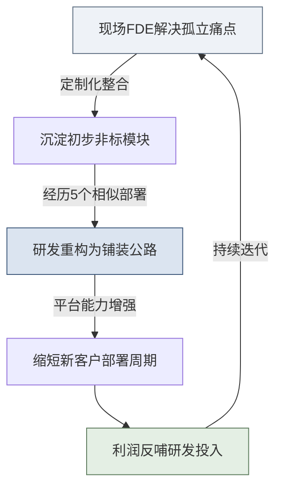
*图：FDE经济学与产品能力回注飞轮*

### 4.7 Palantir 的 PPT 最佳实践透视

Palantir 的平台、团队与方法论，可以用 **People–Process–Technology（PPT）框架** 归位到三个维度。这三个维度的协同，正是 Palantir 成为 FDE 模式标杆的根本。

> [!NOTE]
> Palantir 之所以能成为 FDE 模式的标杆，恰恰在于它没有偏科：**People、Process、Technology 三个维度都做到了行业顶尖，且三者互相咬合、形成飞轮。** 下表将各维度的关键实践归位：

| PPT 维度 | Palantir 的标杆实践 | 对乙方的启示 |
| :--- | :--- | :--- |
| **People** | Delta/Echo/Engineering 三序列组成的特种作战小组；FDE 汇报给产品而非销售；一名 FDE 只带 1-2 个大客户 | 团队要“三位一体”复合编制，且组织归属决定基因——别让 FDE 沦为销售的定制工具 |
| **Process** | 「碎石路→铺装公路」哲学；五次部署法则（5 个客户后才标准化）；四阶段交付节奏 | 先在泥泞里趟通价值，再谈标准化；用流程纪律约束黑客式冲动 |
| **Technology** | Foundry 模块化底座；Ontology 本体层跨越异构；AIP 让自然语言驱动集成 | 没有强底座支撑的 FDE 终将沦为堆码农；技术的终极目标是“把定制变配置” |
| **飞轮（三者咬合）** | 能力回注机制：现场 People 发现痛点 → Process 沉淀方法 → Technology 固化为平台能力 | PPT 三者不是并列清单，而是一个自我强化的循环——这才是护城河 |

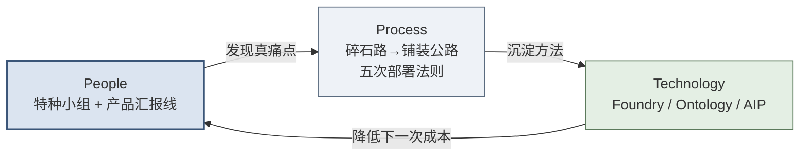
*图：Palantir 的 PPT 三维度互相咬合，形成能力回注飞轮*

> [!TIP]
> **给读者的对标提示**：读完 Palantir 的 PPT 标杆，请带着一个问题进入后续章节——**我所在的乙方组织，在 People / Process / Technology 上分别处于什么水平？哪一维度是我的短板？** 第五篇 14.8 节会给你一张可自查的 PPT 转型对照表。

> [!TIP]
> **本篇小结**
> 标杆篇拆开了 Palantir 这台"样机"：平台（Foundry/Ontology）是武器，特种作战小组（Delta/Echo）是人，碎石路→铺装公路与五次部署法则是方法论，五个真实案例是战果——而把它们焊成飞轮的，是贯穿始终的能力回注。用 People–Process–Technology 三维度看，Palantir 的过人之处不在某一维突出，而在**三维均衡且互相咬合**。**标杆看清了，接下来就是最实操的部分：如何一步步交付？** 第三篇将把这套体系拆解为可执行的四阶段 SOP 与能力回注方法论。

---

# 第三篇：流程篇 — 四阶段交付 SOP 与能力回注方法论

> [!NOTE]
> **本篇导读：流程不仅是纪律，更是业务结果的保障**
> 
> 本篇是整个教材的核心。技术执行工程师（对标Palantir Delta/FDE）往往面临一种矛盾：一方面，我们推崇黑客精神，追求极速破局；另一方面，企业级服务对稳定性、可预期性和商业成功有极高要求。
> 
> 如何平衡？答案就在于第 1.5 节已勾勒过的**四阶段方法论**（Discovery → Prototype → Build → Scale）。如果说概念篇只是亮出了这四个阶段的轮廓，那么本篇要做的，就是把每个阶段拆解到**可执行的 SOP 级别**。这套方法论不仅是项目管理的工具，更是认知客户、重构业务、实现价值的认知框架。对于高管，它是控制风险、预判投资回报的沙盘；对于中层，它是协同各部门、推进项目的指挥棒；对于一线，它则是应对复杂现场、步步为营的战术手册。

---

## How 总纲：PPT 框架 × 四阶段的交付矩阵

如果说第一篇回答了 **What（FDE 是什么）**、第二篇与第一篇的经济学部分回答了 **Why（为什么需要 FDE）**，那么从本篇开始，教材进入 **How（如何做）**。

但 How 不能只是一堆散落的操作技巧。在动手讲四阶段 SOP 之前，我们必须先建立一个统领性的认知框架，否则读者会淹没在细节中，只见树木、不见森林。

> [!NOTE]
> **关于本篇方法论的来源属性（请读者先读）**：本篇采用的 **Discovery → Prototype → Build → Scale 四阶段**，是业界对 FDE 式交付的**通用提炼**，并非 Palantir 的官方术语——Palantir 官方对应的表述是"用例生命周期（Use Case Lifecycle：需求提炼 → 方案设计 → 开发排序）"与"平台采纳四阶段（Foundry Adoption：聚焦用例 → 建设基础设施 → 自治式增长 → 超速增长）"。本教材选用 Discovery/Prototype/Build/Scale，是因为它对**从 0 到 1 的单项目交付**更直观易懂。
> 同时，本篇各阶段给出的**交付物清单、阶段 Gate 检查清单、以及 SOP 模板**，是本教材为转型企业提炼的**实操建议与最佳实践**，供落地时裁剪采用——它们不是任何厂商公开发布的官方标准。请读者按此定位使用：**框架与清单重在"可执行"，而非"权威认证"。**

### 一、任何企业级交付，本质都是对客户三个维度的改造

FDE 交付一个系统，绝不只是“部署一套软件”。一次成功的落地，本质上是对客户组织在三个维度上的同步改造——这正是组织变革领域历经数十年验证的经典框架 **People–Process–Technology（简称 PPT 框架）**：

| 维度 | 含义 | 在 FDE 语境下的具体所指 |
| :--- | :--- | :--- |
| **People（人员与组织）** | 谁来用、谁来推、谁来接盘 | 客户侧的决策者、冠军用户、终端用户、自运营团队；以及 FDE 己方团队的角色配置 |
| **Process（流程）** | 业务如何运转、如何被重塑 | 客户业务流程的诊断、审批链路的重塑、新旧流程的切换与采纳；以及 FDE 自身的交付流程 SOP |
| **Technology（技术平台）** | 用什么技术打通、如何对接 | 与客户异构系统的集成、数据管道、本体建模、私有化/信创适配 |

> [!IMPORTANT]
> **PPT 三者缺一不可，且以 People 为先。**
> - 只上 Technology 不改 Process、不带 People，系统必然沦为“搁板软件”（买了没人用）。
> - 只谈 Process 改造却无 Technology 支撑，是纸上谈兵的咨询 PPT（此 PPT 非彼 PPT）。
> - 三者中，**People 是根、Process 是脉、Technology 是器**——顺序不可颠倒。这也是为什么 FDE 的第一周是“听客户说话”（People/Process），而非“打开电脑写代码”（Technology）。

### 二、PPT 是“内容维度”，四阶段是“时间维度”，二者构成交付矩阵

这里必须厘清一个极易混淆的关系：**PPT 框架与四阶段方法论不是二选一，而是正交互补的两个维度**。

- **四阶段（Discovery→Prototype→Build→Scale）是时间轴**——它回答“**什么时候做**”。
- **PPT（People/Process/Technology）是内容轴**——它回答“**做什么**”。

任何一个交付动作，都同时落在这个矩阵的某个格子里。下表展示了 PPT 三要素在四个阶段中的工作重心如何演进：

| PPT 维度 ＼ 四阶段 | Discovery 发现 | Prototype 原型 | Build 构建 | Scale 扩展 |
| :--- | :--- | :--- | :--- | :--- |
| **People 人员组织** | 利益相关者地图、找冠军用户（5.2） | 客户 Demo、决策者亲手试用、争取 Build 资源（6.5） | 用户培训、冠军用户培养（7.5） | 冠军用户网络、客户自运营（8.4） |
| **Process 流程** | 业务流程诊断、痛点识别（5.3） | 原型跑通业务闭环、Demo 验证价值（6.4/6.5） | 从原型到生产的流程固化、质量治理（7.3/7.4） | 跨部门推广、组织变革管理（8.3） |
| **Technology 技术平台** | 数据资产盘点（5.4） | MVP 数据管道、本体建模（6.2/6.3） | 异构系统集成、数据源扩展（7.2） | AI 赋能、平台能力回注（8.5/8.6） |

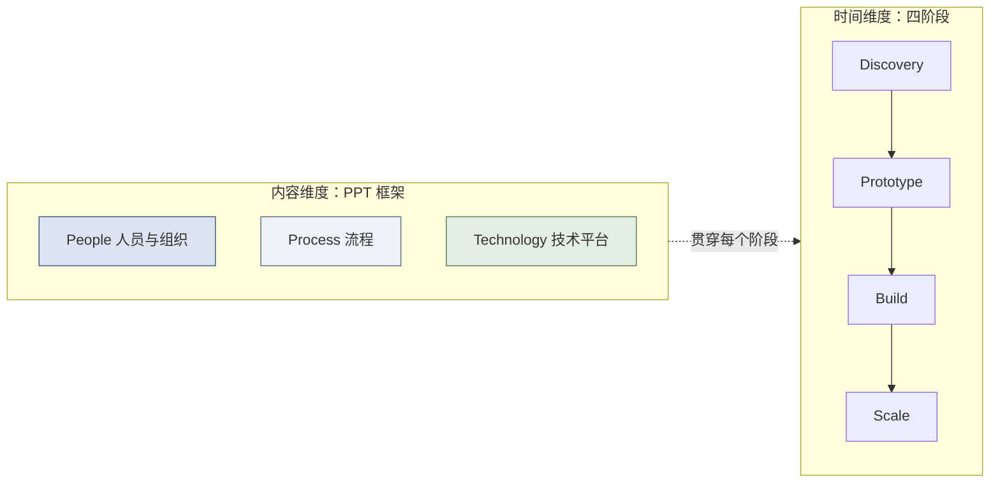
*图：每个交付阶段，都需要同时推进 People / Process / Technology 三个维度*

### 三、本篇及后续的阅读导航

- **本篇（第三篇）** 以**四阶段时间轴**为主线组织，但请读者随时用 PPT 这把“内容标尺”去审视每个阶段：**这一步我在改人、改流程，还是改技术？三者是否同步？**
- **第二篇（Palantir 标杆）** 已经展示了 PPT 的“标准动作”——Foundry/Ontology 是 Technology、Delta/Echo/Engineering 三序列团队是 People、碎石路→铺装公路是 Process。（见 4.7 节的 PPT 透视）
- **第五篇（中国实践）** 将展示中国厂商在 PPT 三维度上的各自侧重与妥协，并在结尾给出**面向乙方的 PPT 转型对标行动纲领**（见 14.8 节）。

至此，认知框架已立。下面进入四阶段的实操细节。

---

## 第5章 Phase 1: Discovery（发现期，1-2周）

> [!NOTE]
> **本章导读**：四阶段的第一步。发现期不写代码，而是"听客户说话"——绘制利益相关者地图、诊断业务痛点、盘点数据资产、筛选"快赢"切入点。本章配套 SOP 1-3（干系人地图/数据盘点表/快赢矩阵）与发现期 Gate 清单。这一步定调子，决定项目做成"锦上添花的玩具"还是"解燃眉之急的利器"。

### 5.1 目标与进入条件

**战略意义（给高管）：** 发现期是定调子的阶段，决定了项目是成为“锦上添花”的玩具，还是解决“燃眉之急”的利器。找准切入点，能最大化早期投资回报（ROI）。
**操作意义（给一线）：** 不要急于写代码。技术执行工程师（对标Palantir Delta/FDE）的第一周不是看数据库，而是听客户说话，成为客户业务的“内行人”。

- **目标：** 深入理解客户业务运转的真实逻辑，找到兼具高价值和高可行性的“快赢（Quick Win）”切入点，完成核心干系人绑定。
- **进入条件：** 合同签署完毕，项目启动会（Kick-off）完成，客户方提供必要的物理/网络通行权限，FDE团队全员到位。
- **核心原则：** “FDE的第一周不是写代码，而是听客户说话。”

### 5.2 利益相关者地图绘制

> [!TIP]
> 任何企业级软件的部署，本质上都是一次组织变革。没有人推动，再好的软件也会被束之高阁。

**为什么要做利益相关者地图？**
企业软件购买者和使用者往往分离。绘制地图是为了回答：谁来买单？谁来使用？谁会阻碍？谁能帮我们扫清障碍？

**如何识别关键人物：**
1. **决策者（Sponsor）：** 掌握预算，关心宏观指标（如成本降低、营收增长）。
2. **影响者（Influencer）：** 可能是架构师、合规部门，他们有否决权。
3. **使用者（End-user）：** 真正每天用系统的基层员工，他们关心系统能否让自己早点下班。
4. **阻碍者（Blocker）：** 可能因为系统触动其利益或改变其习惯而产生抵触。
5. **冠军用户（Champion）：** 最有意愿推动系统落地的人，通常是痛点最深、渴望改变的业务骨干。

**利益相关者地图模板（SOP 1）**

> [!TIP]
> **SOP 1: 利益相关者地图模板**
> 
> | 姓名 | 部门/职务 | 角色类型 | 对项目态度 | 关注点 | 沟通策略 |
> |---|---|---|---|---|---|
> | 张总 | 供应链副总裁 | 决策者 | 积极支持 | 降低库存周转天数 | 每周核心指标汇报，展示ROI |
> | 李工 | IT部数据架构师 | 影响者 | 观望/怀疑 | 数据安全、系统兼容性 | 邀请参与早期架构设计，打消安全顾虑 |
> | 王主管 | 华东区调拨主管 | 冠军用户 | 极度热情 | 告别手工Excel，自动化排程 | 深度绑定，共同设计原型，树立标杆 |
> | 赵专员 | 一线操作员 | 使用者 | 抵触 | 增加工作量、改变操作习惯 | 简化UI，强调能为他节省的时间 |

**实操建议：** 在到达现场的头三天，务必找到你的“冠军用户”。在某快消企业项目中，如果没有供应链总监这个冠军用户顶住IT部门初期的阻力，项目根本无法熬到第二周。

### 5.3 业务流程诊断与痛点识别

**访谈方法：**
- **结构化访谈：** 针对管理层，使用预设问卷，聚焦战略目标和关键绩效指标。
- **跟班观察（Shadowing）：** 针对操作层。坐在他们旁边，看他们如何处理一封邮件、如何打开5个系统比对数据。**眼睛看到的，比他们嘴上说的更真实。**

**关键问题清单（FDE访谈提纲）：**
- “您日常工作中最耗时的环节是什么？”（寻找效率痛点）
- “有哪些决策是凭经验而非数据做的？”（寻找数据赋能点）
- “跨部门协作中最大的卡点是什么？”（寻找信息孤岛）
- “如果有一个魔法棒，您最想解决什么问题？”（寻找终极期望）

**痛点分类矩阵：**
1. **流程痛点：** 审批链路过长，手工操作多。
2. **数据痛点：** 数据对不上，数据拿不到，数据不实时。
3. **决策痛点：** 缺乏全局视野，只能盲人摸象。
4. **协作痛点：** 部门墙厚，邮件满天飞。

### 5.4 数据资产盘点

**盘点方法论：**
千万不要直接向客户索要“全部数据”，这会引发安全部门的警觉，也会让你淹没在数据垃圾场中。应采用**“业务牵引（Business-driven）”**的逆向盘点法：业务需要什么指标 -> 依赖什么实体 -> 对应哪些系统和表。

- **系统清单：** 客户现有的ERP, CRM, MES等。
- **数据源清单：** 表结构、字段级含义。
- **数据质量评估：** 脏数据、缺失数据。
- **系统拓扑图：** 了解数据流向。

**常见陷阱：** 客户说“我们数据挺全的”，往往意味着数据质量堪忧；客户说“通过API实时拉取”，往往对方只提供了一个每天更新一次的FTP。

**数据资产盘点表模板（SOP 2）**

> [!TIP]
> **SOP 2: 数据资产盘点表模板**
> 
> | 系统名称 | 所属部门 | 数据类型 | 数据量级 | 更新频率 | 接口方式 | 数据质量 | 共享现状 |
> |---|---|---|---|---|---|---|---|
> | SAP ERP | 财务/供应链 | 订单/库存 | 百万级/天 | T+1 | 直连DB | 高，但多外键关联 | 仅核心管理层可见 |
> | CRM系统 | 销售部 | 客户信息 | 十万级/总 | 实时 | API | 极差，大量手动录入残缺 | 各大区隔离 |
> | 生产MES | 制造中心 | 设备传感器 | 亿级/天 | 毫秒级 | Kafka | 存在断点漂移 | 孤岛，未与业务打通 |

### 5.5 「快赢」场景筛选

> [!NOTE]
> **与 2.3 节筛选框架的层级区分（避免混淆）**：2.3 节的 Outcome-Data-痛点普遍性三要素，解决的是**项目层**的"这个客户/项目值不值得接"（入场决策）；本节解决的是**场景层**的"项目已经接了，先跑哪个用例"（项目内排序）。两者粒度不同、互补而非替代——先用 2.3 决定"入场"，再用本节决定"从哪切入"。

**快赢（Quick Win）的定义：** 在2-4周内，能够用最小的数据集、最核心的流程，跑通闭环并向客户展示明确业务价值的场景。

**筛选框架：**
采用 **影响力（业务价值 + 可见度） × 可行性（数据就绪度 + 技术复杂度）** 的二维框架。

- **业务价值：** 解决多大的问题？（$成本节约 = 减少时长 \times 资源单价$）
- **可见度：** 这个改进能被多少高管看到？
- **数据就绪度：** 现成数据能支撑吗？
- **技术复杂度：** 是否需要攻克巨大的底层技术难题？

**快赢场景评估矩阵模板（SOP 3）**

> [!TIP]
> **SOP 3: 快赢场景评估矩阵**
> 
> | 候选场景 | 业务价值(1-5) | 可见度(1-5) | 数据就绪度(1-5) | 技术复杂度(1-5反向*) | 综合得分 | 优先级 |
> |---|---|---|---|---|---|---|
> | A: 跨区库存智能调拨 | 5 (省千万级物流费) | 4 (副总裁主抓) | 4 (ERP数据现成) | 3 (需算法支持) | 16 | **P0 (首选快赢)** |
> | B: 销售大盘实时监控 | 3 (仅供查看无决策) | 5 (全体可见) | 5 (系统完善) | 5 (极简单) | 18 | P1 (辅助场景) |
> | C: 设备预测性维护 | 5 (减少停机) | 3 (局部可见) | 1 (传感器未联网) | 1 (极复杂) | 10 | P3 (暂时搁置) |
> 
> *技术复杂度打分：1代表最复杂，5代表最简单，以保证总分越高越好。

**选择原则：选领导最关心、群众获得感最强的场景。** 比如在某城商行项目，我们首选了“对公贷款贷后预警”而非复杂的“宏观经济预测”，因为前者直接关系到支行行长的KPI和客户经理每天的下班时间。

### 5.6 输出交付物清单

在Discovery阶段结束时，FDE团队必须产出以下内容：
1. 利益相关者地图（详实版）
2. 业务痛点清单（按优先级排序）
3. 数据资产盘点报告（聚焦快赢场景相关的闭环数据）
4. 快赢场景定义文档（含可行性分析）
5. 初始项目路线图（明确后续Prototype的时间节点）

### 5.7 阶段 Gate 检查清单

> [!IMPORTANT]
> **Discovery Gate 检查清单** (只有全部打勾，才能进入Prototype阶段)
> - [ ] 是否已识别出清晰的决策者(Sponsor)并建立了直接沟通渠道？
> - [ ] 是否找到至少一位愿意全程陪跑的冠军用户(Champion)？
> - [ ] 是否完成了支撑快赢场景的数据资产盘点（至少验证了连接可行性）？
> - [ ] 客户决策层是否听取并正式认可了快赢场景及初始路线图？
> - [ ] FDE团队（至少技术带头人）是否能不用任何技术词汇，用客户的行业黑话向客户复述其痛点？

---

## 第6章 Phase 2: Prototype（原型期，2-4周）

> [!NOTE]
> **本章导读**：四阶段的第二步，也是"见真章"的一步。用最小可行架构（MVP 数据管道 + 本体建模）快速搭出能跑通、能演示的原型，坚持"Show, Don't Tell"——让客户亲手操作、用真实数据说话。目标是用最小代价证明最大价值，换取客户投入下一阶段的承诺。

### 6.1 目标与进入条件

**战略意义（给高管）：** 这是“见真章”的阶段。原型期的成功与否，直接决定了客户是否愿意砸下真金白银购买长期License。用最小的代价证明最大的价值。
**操作意义（给一线）：** 停止写长篇大论的PPT，用可运行的软件说话。让客户的手指在键盘上敲击，让客户的眼睛看到真实数据的流转。

- **目标：** 用最小可行性架构构建原型，完成快赢场景闭环，验证业务逻辑。
- **进入条件：** Discovery阶段Gate全部通过，客户核心数据已提供授权。
- **核心原则：** “Show, Don't Tell（让客户亲手操作，而非仅看演示）”

### 6.2 最小可行数据管道（MVP Pipeline）

**什么是MVP Pipeline？**
它是一条以最快速度从数据源（哪怕是离线CSV）到最终可视化前端的链路。不要追求高可用、自动重试、灾备等生产级特性。

**搭建原则：够用就行，不追求完美。**
如果API暂时调不通，就让客户导出一份本周的Excel先用着；如果数据有脏记录，写几行Python脚本简单清洗即可，不要花两周时间搞主数据治理。

**数据管道设计的「三要三不要」：**
- **要**记录每一步转换的逻辑，**不要**写没有任何注释的面条代码。
- **要**保证关键字段的准确性，**不要**在细枝末节的非核心数据上死磕。
- **要**留有随时替换数据源的接口（如用配置文件），**不要**把文件路径写死在底层函数里。

### 6.3 本体论建模（Ontology）入门

> [!NOTE]
> 这是Palantir最核心的理念之一。不要让业务人员学习什么是“事实表”、“维度表”或“主键”，要让系统学习什么是“航班”、“飞行员”和“备降机场”。

**什么是Ontology？**
Ontology是用业务语言描述现实世界的数字孪生。它将底层碎片化、异构的系统表，映射为业务人员每天挂在嘴边的实体。

**Ontology的核心要素：**
1. **实体（Entity）：** 业务中的核心对象（如：客户、员工、工厂）。
2. **属性（Property）：** 实体的特征（如：客户的信用评级，工厂的占地面积）。
3. **关系（Relationship）：** 实体间的联结（如：客户“签订”合同，工厂“生产”产品）。

**建模示例：某政务场景的Ontology**
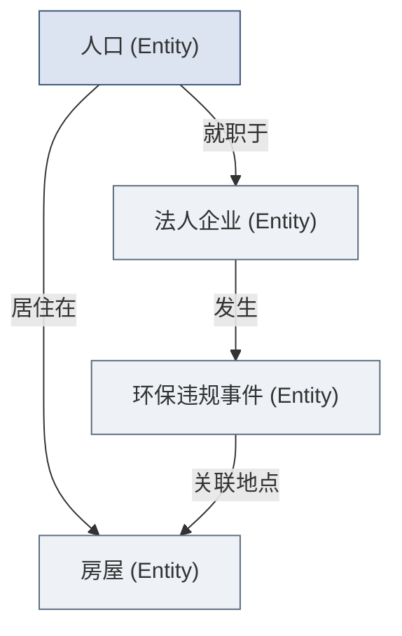

**为什么Ontology是能力回注的关键载体？**
只有沉淀在Ontology层的业务逻辑，才是跨越底层系统异构性的通用资产。一旦我们在A企业定义了“供应链牛鞭效应”的Ontology逻辑，在B企业即便底层表完全不同，只要映射到这套Ontology，能力就可以秒级复用。

### 6.4 原型应用构建：“Show, Don't Tell”

**原型的目标：让客户说“wow”，而非“我看懂了PPT”。**
当BP的工程师第一次在原型系统中通过拖拽查看到全球油田与钻井平台的实时生产状态、设备可靠性预警时，那种震撼是100页PPT也给不了的。

**构建优先级：**
**可交互 > 美观 > 功能完整**

**原型中必须包含的要素：**
1. **真实数据（而非假数据）：** 必须是客户自己的真实数据。假数据无法激起任何同理心。
2. **可操作的界面：** 哪怕只有一个按钮，也要让客户自己点。
3. **至少一个“惊喜”发现：** 通过数据关联，发现一个客户过去凭经验未能发现的盲点（例如：某个常年被评为优秀的供应商，其实延期交货率高达30%）。

**常见原型类型：** 数据看板、分析工作台、流程监控。

### 6.5 客户 Demo 与反馈收集

**Demo准备清单：** 预演数据刷新、确认网络连接、排演话术。
**Demo的黄金法则：“不要演示功能，要演示价值”。**
错误示范：“你看，点击这个按钮，系统会调用后端API进行一次聚合运算，然后在这个表格渲染出结果。”
正确示范：“王总，这就是您平时花三天时间催各个大区交上来的销售报表。现在，只要点这个按钮，它不仅瞬间生成，还能直接高亮出哪个大区库存快断了。您想亲自点一下试试吗？”

**反馈收集方法：**
- **现场记录：** FDE团队至少有一人专门负责记录客户的微小表情和随口说出的话。
- **录屏回放：** 回顾Demo过程中的交互卡点。
- **NPS快评：** Demo结束后，用1分钟收集反馈：“0-10分，这个系统多大程度上解决了您的痛点？”

**关键决策：** 客户是否认可方向？是否愿意投入资源进入Build阶段？

### 6.6 输出交付物

1. 可运行的原型应用（部署在沙箱或受控环境）
2. 初始本体模型文档（Ontology Draft）
3. 数据管道架构图（标明数据血缘）
4. 客户Demo反馈记录及复盘纪要
5. 修订后的项目路线图（为Build阶段做准备）

### 6.7 阶段 Gate 检查清单

> [!IMPORTANT]
> **Prototype Gate 检查清单** 
> - [ ] 原型是否使用了客户的真实数据（哪怕只是一小部分）？
> - [ ] 是否成功跑通了至少一条核心业务流程的端到端数据闭环？
> - [ ] 客户决策者是否亲自操作了系统，并给出了明确的积极反馈？
> - [ ] 客户是否签署或口头明确承诺了进入下一阶段（Build）的资源投入（如对接API的IT人员、参与测试的业务人员）？

---

## 第7章 Phase 3: Build（构建期，1-3月）

> [!NOTE]
> **本章导读**：四阶段的第三步——把原型"改装成量产车"。从容忍脏数据的原型走向必须治理的生产系统：数据源扩展与集成深化、数据质量治理、用户培训与冠军用户培养，并首次系统性地识别与登记能力回注点。本章是从"能用"到"可靠、可运维、可规模化"的关键锤炼期。

### 7.1 目标与进入条件

**战略意义（给高管）：** 这是一个充满阵痛的时期。从原型到生产，相当于把一辆在测试场地跑的拉力赛车，改装成能够每天在早高峰安全行驶的量产车。投入巨大，但这是确立护城河的关键。
**操作意义（给一线）：** 技术执行工程师（对标Palantir Delta/FDE）需要从“黑客”转变为“架构师”和“布道师”。你需要面对脏数据、复杂的安全权限，以及无数个想放弃的用户。

- **目标：** 从原型走向生产，交付真正可用的系统。
- **进入条件：** Prototype阶段Gate通过，客户确认投入并组建联合团队。

### 7.2 数据源扩展与集成深化

从快赢场景的2-3个数据源，向完整数据生态扩展。

**数据集成的层次：**
1. **数据接入：** 建立稳定连接（JDBC/API/Kafka等）。
2. **数据清洗：** 处理空值、修正异常字符。
3. **数据标准化：** 映射为统一实体。
4. **数据融合：** 消除数据孤岛。

**处理策略：** 增量数据与历史数据的处理策略应当是“新老划断，用时才洗”。

### 7.3 从原型到生产：关键差异

理解原型与生产的差异，是避免项目在构建期翻车的核心。

| 维度 | 原型 (Prototype) | 生产 (Production) |
|---|---|---|
| **数据质量** | 容忍脏数据 | 必须治理 |
| **性能** | 够用就行 | 需要优化 |
| **安全** | 简单控制 | 完整权限 |
| **运维** | 手动 | 自动化 |
| **文档** | 可选 | 必须 |

### 7.4 数据质量治理

不要指望客户的数据一开始就是干净的。

**数据质量的六个维度：**
- 完整性、准确性、一致性、及时性、唯一性、有效性。

**规则设计和监控：** 将数据质量规则直接写在流水线中。
**闭环处理机制：** 发现异常自动拦截告警，并推送给业务源头负责人修正。

### 7.5 用户培训与冠军用户培养

**培训层次：**
1. **管理层认知培训：** 如何通过系统看KPI、做决策。
2. **操作层使用培训：** 手把手教标准SOP流程。
3. **高级用户深度培训：** 能够自行搭建看板或配置规则。

**冠军用户的定义：** 客户内部最积极使用和推广系统的人。
**如何发现和培养冠军用户：** 寻找痛点最深、反馈最积极的业务骨干，给予技术支持特权，并在内部推广时树立其为标杆。

> [!NOTE]
> Build 阶段的重点是**培养出单个或少数几名深度冠军用户**（让系统先有人真正用起来、用出价值）。至于把冠军"由点连成网、依靠同侪影响力自发推广"，那是下一阶段（Scale）的任务——详见 8.4 冠军用户网络建设。切勿在系统尚未做实做稳时就急于铺网。

### 7.6 能力回注识别：构建期是回注的黄金窗口

**为什么构建期最适合识别回注点？** 因为此时经历了从原型到生产的锤炼，逻辑最成熟、最贴近真实痛点。

**回注信号识别：** “这个功能在其他客户（比如同行业的竞争对手，或跨行业的类似场景）那里，也会需要吗？”
**建议：** 每周记录“能力回注日志”。

**能力回注需求卡片模板（SOP 4）**

> [!TIP]
> **SOP 4: 能力回注需求卡片**
> 
> | 字段 | 填写内容示例 |
> |---|---|
> | **需求名称** | 供应链多级库存水位动态优化算法插件 |
> | **来源项目** | 某快消企业数字供应链大脑项目 |
> | **通用性评估** | 极高（适用于仓储调拨） |
> | **技术方案简述** | 基于Ontology的参数化模型，输入为：节点库存、运输时效；输出为：调拨建议 |
> | **工作量评估** | 约2周开发 + 1周测试联调 |
> | **ROI预测** | 预期能为后续项目节约约30%的定制开发时间 |
> | **优先级建议** | 高 (High) |

### 7.7 输出交付物

1. 完全可用的生产级系统。
2. 完整的数据资产字典与Ontology说明文档。
3. 系统操作手册与管理员维护手册。
4. 能力回注需求卡片。
5. 大规模培训签到表及满意度问卷。

### 7.8 阶段 Gate 检查清单

> [!IMPORTANT]
> **Build Gate 检查清单** 
> - [ ] 核心数据管道是否已实现自动化调度并稳定运行？
> - [ ] 系统的行级/列级安全权限是否已通过客户合规部门/IT部门验证？
> - [ ] 是否已至少培养出3名能够熟练使用系统的客户方冠军用户？
> - [ ] 是否已将通用业务逻辑提取，并提交了能力回注卡片？
> - [ ] 客户业务部门的核心指标是否初步通过系统得到体现并确认？

---

## 第8章 Phase 4: Scale（扩展期，持续）

> [!NOTE]
> **本章导读**：四阶段的收官——从"单点胜利"走向"全面渗透"。本章讲场景从 1 到 N 的复利式扩展、跨部门推广中的组织变革管理、冠军用户网络建设、AI 赋能，以及把前期识别的能力回注点真正推入平台。目标是让系统沉淀为客户的"数字基础设施"，形成高替换成本与续约黏性。

### 8.1 目标与进入条件

**战略意义（给高管）：** 从“单点胜利”走向“全面渗透”。Scale 阶段决定了这个客户是一笔“一次性项目收入”，还是一份“可持续增长的年金资产”。一个只用在单一部门的系统随时可能被替换；而一个成为客户“数字基础设施”的系统，则拥有极高的替换成本和续约黏性。
**操作意义（给一线）：** 技术执行工程师的角色从“建造者”转向“赋能者”。你的目标不再是自己写更多代码，而是让底层 Ontology 成为可复用的地基，让客户的冠军用户能自己搭建新场景。**衡量你 Scale 阶段是否成功的标准，是“离开你系统还能不能转”。**

- **目标：** 从 1 个场景扩展到全组织多场景，让系统沉淀为客户的“数字基础设施”，并将前期识别的能力回注点正式落地。
- **进入条件：** Build 阶段 Gate 通过，系统在核心场景已产生**可量化的确切收益**，且客户高层明确表达了推广意愿。
- **核心原则：** “复利效应（Compounding）”——因为底层 Ontology 已打通，每个新场景的边际成本急剧递减。

### 8.2 从 1 到 N 的场景扩展策略

Scale 阶段最大的诱惑是“什么都想做”，最大的风险是“扩张太快导致底座崩塌”。扩展必须有策略、有节奏。

**扩展路径的两种选择：**

| 扩展路径 | 定义 | 优势 | 风险 | 适用时机 |
| :--- | :--- | :--- | :--- | :--- |
| **相邻场景优先** | 沿着同一 Ontology、同一批用户向外扩 | 复用度最高，边际成本最低，见效快 | 价值天花板低，可能困在小圈子 | 系统刚站稳，需快速积累“战果”树立信心 |
| **高价值场景优先** | 跳到另一个高层关注的重量级痛点 | 政治能见度高，易获高层追加预算 | 可能需新数据源，边际成本高，风险大 | 已有稳固冠军用户网络，需要一场“大胜”续命 |

**复利效应的量化直觉：** 第 1 个场景 FDE 要从零搭数据管道和 Ontology（成本 100%）；第 2 个相邻场景可复用 60% 底座（成本 40%）；到第 5 个场景，可能只需配置化组装（成本 15%）。这正是 2.3 节经验曲线在单客户内部的复现。

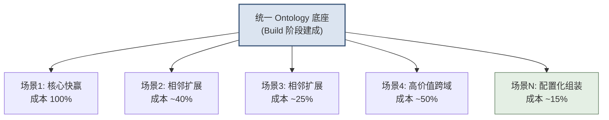
*图：底座打通后，新场景的边际成本随复用度提升而递减*

> [!TIP]
> **SOP 5: 场景扩展优先级评估表**
> 
> | 候选新场景 | 复用现有Ontology比例 | 高层关注度(1-5) | 冠军用户覆盖 | 新增数据源数 | 边际成本估算 | 扩展序位 |
> |---|---|---|---|---|---|---|
> | 供应商协同门户 | 80% | 4 | 已有 | 1 | 低 | **N+1（首选）** |
> | 全球物流塔台 | 55% | 5 | 需新建 | 3 | 中 | N+2 |
> | 碳排放合规监控 | 30% | 3 | 无 | 4 | 高 | 观察/暂缓 |

### 8.3 跨部门推广与组织变革管理

> [!IMPORTANT]
> **技术推广易，组织变革难。** Scale 阶段项目失败，90% 死于组织阻力而非技术缺陷。系统能跑通，不代表人愿意用。

**为什么跨部门推广比首个部门难？**
首个部门是被痛点驱动、主动求变的“饥饿者”；后续部门往往是被自上而下要求接入的“被动者”，他们对新系统天然带着“这是别人的政绩，凭什么增加我的工作量”的抵触。

**常见阻力类型与应对策略：**

> [!TIP]
> **SOP 6: 组织变革阻力-应对矩阵**
> 
> | 阻力类型 | 典型表现 | 深层动因 | 应对策略 |
> |---|---|---|---|
> | **数据被看透的恐惧** | “系统会暴露我部门的低效” | 担心被追责 | 明确“系统旨在赋能而非惩罚”，首期只对本部门开放，让其先尝到甜头 |
> | **既有权力受损** | 掌握“信息差”的中层消极抵抗 | 数据透明削弱其话语权 | 借高层Sponsor自上而下施压，同时给其新的价值定位（如从“信息中转”升级为“分析决策”） |
> | **习惯路径依赖** | “我用Excel用了十年，挺好” | 学习成本与安全感 | 简化UI、保留其熟悉的操作隐喻、安排冠军用户一对一帮带 |
> | **IT部门领地意识** | 以“安全合规”为由拖延接入 | 担心系统绕过其管控 | 早期邀请IT共建、开放审计日志、让其成为平台的联合管理员 |

**获取跨部门 buy-in 的组合拳：**
1. **自上而下**：借高层 Sponsor 在管理会议上把“接入系统”列为部门 KPI。
2. **横向共赢**：设计**跨部门共赢指标**（如供应链与销售共享同一套需求预测，双方都受益），而非零和的部门指标。
3. **样板效应**：把首个部门包装成内部标杆案例，让后续部门“眼红”而非“被迫”。

### 8.4 冠军用户网络建设

从“单个冠军用户”到“冠军用户网络”，是 Scale 阶段最重要的组织资产建设。单个冠军会离职、会调岗，唯有网络才能让系统在客户内部自我繁殖。

**网络化的三个动作：**
- **横向复制**：每进入一个新部门，就在该部门发展至少 1 名本地冠军用户，而非依赖外部门的人跨部门推广。
- **同侪影响（Peer Influence）**：定期组织客户内部的技术交流会/用户日，让冠军用户互相“炫技”，用同侪压力驱动采纳——业务人员更信任隔壁工位同事的推荐，而非厂商的宣讲。
- **认证与荣誉**：为深度用户设立“系统认证专家”头衔（呼应 8.7 培训认证机制），把使用系统变成个人职业资本。

### 8.5 AI 赋能与持续优化

Scale 阶段是将大模型能力叠加到已稳定运行系统之上的最佳时机——此时 Ontology 已成型，为 AI 提供了高质量的结构化语义底座（呼应 1.4 节 AI 时代 FDE 复兴）。

| AI 赋能方向 | 具体形态 | 依赖的前置条件 | 对客户的价值 |
| :--- | :--- | :--- | :--- |
| **对话式分析（Copilot）** | 业务人员用自然语言查询 Ontology，无需写 SQL/配置 | 成熟的 Ontology + 语义层 | 分析门槛归零，长尾需求自助满足 |
| **自动报告生成** | 系统定时生成带洞察结论的业务简报 | 稳定的数据管道 + 指标体系 | 替代人工周报，释放分析师产能 |
| **智能告警** | 从“阈值告警”升级为“异常模式识别 + 归因建议” | 历史数据积累 + 业务规则 | 从“发现问题”到“建议怎么办” |
| **决策型 Agent** | 编排大模型完成端到端业务动作（如自动生成调拨方案并写回） | Writeback/Actions 能力 + 权限管控 | 从“辅助人”到“替人执行低风险决策” |

> [!WARNING]
> **AI 赋能的红线**：绝不要在数据质量和权限体系尚未治理干净时叠加 AI。基于脏数据的 Copilot 会一本正经地胡说八道，反而摧毁客户好不容易建立的信任。**AI 是放大器——它放大的既可能是价值，也可能是垃圾。**

### 8.6 能力回注实施

Scale 阶段是把 Build 阶段识别、登记的回注点（第 9 章四步法的 I、II 步）真正推入平台（III、IV 步）的实施窗口。

- **正式提交与跟进**：将 Build 阶段积累的回注卡片，按 9.2 节优先级矩阵排序，正式提交回注评审委员会。
- **对齐总部节奏**：回注实施的时间线必须与平台产品的版本发布节奏对齐，避免前线等不及而又在现场写死一遍（重复造轮子）。
- **现场验证复用**：平台集成完成后，由本项目 FDE 率先在客户现场升级验证——本项目既是回注的“来源地”，也应是“第一个受益者”。

### 8.7 输出交付物

1. 多场景融合的全局业务数字孪生体（覆盖 ≥2 个部门）。
2. 定期输出的业务价值实现报告（ROI 量化，供续约谈判）。
3. 客户内部成体系的培训认证机制与冠军用户网络名册。
4. 已落地的能力回注成果清单（对应卡片状态达到“已验证复用”）。
5. 新一年度的增购/续约合同。

### 8.8 阶段 Gate 检查清单

> [!IMPORTANT]
> **Scale Gate 检查清单**
> - [ ] 系统是否已扩展至至少两个以上非初始核心部门使用？
> - [ ] 月活跃用户数（MAU）是否保持稳定增长，而非“上线即巅峰”后衰减？
> - [ ] 客户内部是否已建立起可自运营的基础日常运维机制（不再 7×24 依赖 FDE）？
> - [ ] 是否已形成至少 3 人以上的冠军用户网络，能在 FDE 撤场后自行推广？
> - [ ] Build 阶段登记的能力回注点，是否至少有一项已完成平台集成并现场验证？
> - [ ] 是否产出了明确的 ROI 衡量报告，并已用于新一轮增购/续约的商业谈判？

---

## 第9章 能力回注方法论（贯穿四阶段）

> [!NOTE]
> **本章导读：护城河的唯一来源**
> 企业级软件定制化项目的护城河，不在于某一次交付有多漂亮，而在于严格、系统化的**能力回注**机制——即把现场的一次性定制，系统性地"上游化（upstreaming）"、沉淀为平台的通用能力（这一动作在业界也称为 productization，产品化）。这正是 3.4 节"碎石路→铺装公路"那个理念的**工程化落地**——如果说"碎石路→铺装公路"回答了"为什么、往哪走"，本章就回答"具体怎么走"：由谁识别、如何抽象、怎么并入平台、如何度量。
> 前八章讲的四阶段方法论，本质上都是在为能力回注服务：Discovery 找到值得沉淀的场景，Prototype 验证抽象的可能性，Build 是回注的黄金窗口，Scale 是回注成果的复用放大器。**没有回注，FDE 就退化为高级外包；有了回注，FDE 才是平台飞轮的引擎。**

### 9.1 四步法：识别→抽象→集成→验证

能力回注不是一句口号，而是一条有明确输入输出的流水线。四个步骤各有其责任人、动作和产出物——**这里的责任人，正是 3.2 节定义的作战单元角色**：现场的技术执行工程师（Delta）与业务策略工程师（Echo）负责"识别、抽象"的前两步，后方的平台工程师负责"集成"，最后由下一个项目的现场团队完成"验证"。前线与后方在此形成闭环。

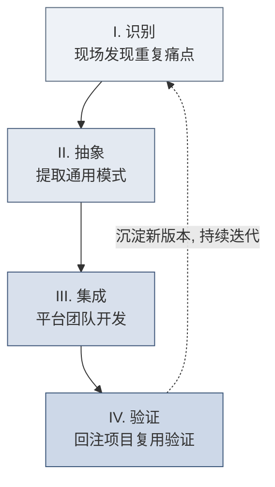

**I. 识别（Identify）— 责任人：技术执行工程师（Delta）+ 业务策略工程师（Echo）**
- **动作**：两个视角共同判断"这段东西值不值得回注"——
  - **技术执行工程师**从**代码层**识别："这段清洗逻辑/这个模型/这套集成，在上一个客户是否写过？"（技术重复信号）
  - **业务策略工程师**从**业务层**判断："这个痛点在同行业其他客户是否普遍存在？沉淀它未来能覆盖多少客户？"（业务共性与行业普遍性——呼应 2.3 节的判断标准）
  - 技术重复 + 业务普遍，两者叠加才构成一个高价值的回注候选。
- **判断阈值**：套用「五次部署法则」的前置信号——同一模式出现**第 2 次**即登记，出现**第 3 次**即触发抽象评估。
- **产出物**：能力回注日志条目（一句话描述 + 发生频次 + 初步的通用性判断）。

**II. 抽象（Abstract）— 责任人：技术执行工程师（Delta）+ 平台工程师（后方）**
- **动作**：剥离客户特定的硬编码（表名、字段名、业务常量），把它参数化、配置化。核心问题是：“哪些是这个客户独有的？哪些是所有同类客户共有的？”
- **常见抽象手法**：硬编码路径 → 配置文件；if-else 特判 → 规则引擎；专用脚本 → 带参数的模板组件；专用表结构 → 标准 Ontology 对象。
- **抽象的分寸（最考验功力的一步）**：抽象既怕"不足"也怕"过度"。**抽象不足**——只是把 A 客户的代码换个名字，换个客户就用不了，等于没抽象；**过度抽象**——为了应对想象中的所有情况，造出一个参数几十个、没人看得懂的"万能框架"，反而比定制更难维护。经验法则是**"面向已发生的重复抽象，而非面向想象的未来抽象"**：只把已经在 2-3 个客户身上真实出现过的共性提取出来，其余留作配置扩展点，不预先实现。
- **产出物**：能力回注需求卡片（见 9.3，SOP 4）。

**III. 集成（Integrate）— 责任人：平台工程师（后方）**
- **动作**：将抽象后的组件纳入平台主分支，遵循平台架构规范，编写单元测试、API 文档与 SDK 示例。
- **红线**：绝不允许把“客户 A 的定制代码原样搬进平台”。未经抽象的代码进入平台，等于把技术债转移到全公司。
- **产出物**：平台新组件 / 新配置项 + 面向 FDE 的使用文档。

**IV. 验证（Validate）— 责任人：下一个项目的技术执行工程师（Delta）**
- **动作**：在真实的新客户项目中调用该组件，验证其通用性是否成立。若需要大改才能用，说明抽象层级不对，退回第 II 步。
- **闭环标志**：新项目成功复用 → 组件“毕业”，正式进入 Playbook；反哺出的改进意见 → 触发新一轮识别。

> [!WARNING]
> **反面模式：为回注而回注**
> 只出现过 1 次的需求就急于抽象，会造出没人用的“僵尸组件”，反而增加平台维护成本。回注的前提永远是「真实的重复」，而非「想象中的通用」。

### 9.2 回注优先级评估矩阵

不是所有可回注的东西都值得回注。用 **通用性（该能力能覆盖多少未来客户）× 实现成本（平台化开发的工作量）** 构建九宫格，决定“做/缓/不做”。

| | **通用性：低** | **通用性：中** | **通用性：高** |
| :--- | :--- | :--- | :--- |
| **成本：低** | 🟡 顺手做（个人 Utils 库） | ✅ **立即做** | ✅ **立即做（最高优先）** |
| **成本：中** | ❌ 不做 | 🟡 排期规划 | ✅ 立即做 |
| **成本：高** | ❌ 不做（保留为项目定制） | ❌ 暂缓（等更多需求佐证） | 🟡 立项评审（战略级投入） |

**决策口诀：**
- **右上角（高通用 + 低成本）**：无脑做，这是回注的甜点区，投入产出比最高。
- **左下角（低通用 + 高成本）**：坚决不做，留在项目里作为一次性定制，避免污染平台。
- **右下角（高通用 + 高成本）**：需 FDE Lead 与平台负责人共同立项，用 11.6 节的 ROI 公式量化决策。

### 9.3 能力回注需求卡片（SOP 4 复用）

回注需求的标准载体是「能力回注需求卡片」，其完整模板见 7.6 节 SOP 4。这里补充**卡片提交后的处理约定**，使其从“一张表”变成“一个流程动作”：

> [!TIP]
> **SOP 4-补充：卡片提交与流转规则**
> - **提交时机**：Build 阶段每周五下班前，强制提交本周新增卡片（哪怕是 0 张也要说明）。
> - **必填校验**：「通用性评估」与「ROI 预测」两栏留空的卡片，评审委员会直接退回，不予排期。
> - **状态字段**：卡片须带状态标签——`待评审` → `已排期` → `开发中` → `已集成` → `已验证复用`（形成可追踪的生命周期）。
> - **驳回处理**：被驳回的卡片不删除，标记 `暂缓/驳回原因`，作为未来需求佐证的证据留档。

### 9.4 回注流程与组织保障

回注若只靠一线工程师的自觉，必然失败。它需要制度化的流程和明确的组织角色来保障。

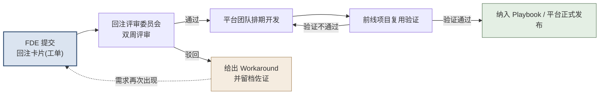

**组织保障要点：**
1. **回注评审委员会**：固定成员应包含至少 1 名资深平台架构师、1 名 FDE Lead、1 名产品经理；**双周**评审一次，避免卡片积压。
2. **代码准入 Review**：任何试图并入平台主库的代码，必须通过平台架构师的严格 Code Review（见 11.6 节代码审核机制）。
3. **20% 回注时间制度**：呼应 11.4 节的「20% 回注法则」，Build 阶段强制划拨 20% 工时用于抽象重构，并写入项目排期，而非“有空再说”。
4. **激励挂钩**：将回注贡献度纳入高级别工程师的绩效考核（呼应 12.3 节 Playbook 贡献考核），让“愿意为后人铺路”的人得到回报。

### 9.5 回注 KPI 与度量体系

没有度量就没有管理。以下四个指标构成回注健康度的仪表盘，建议按季度跟踪其**趋势**（而非绝对值）。

| KPI 指标 | 定义与计算方式 | 健康信号 |
| :--- | :--- | :--- |
| **能力回注率** | $\text{回注率} = \dfrac{\text{成功并入平台主线的通用组件数}}{\text{项目中识别出的可回注点总数}}$ | 关注**逐季上升的趋势**，而非某个固定阈值 |
| **项目复用率** | $\text{复用率} = \dfrac{\text{新项目复用的已有平台组件量}}{\text{新项目交付的总组件量}}$ | 随飞轮成熟持续走高（本教材设定的转型目标：能力积累期突破 60%，见 14.6） |
| **交付效率趋势** | 同类型项目的平均交付周期同比缩短幅度 | 呼应经验曲线，第 N 个项目周期持续下降 |
| **路线图影响力** | 平台版本迭代中，由 FDE 一线反向驱动的 Feature 占比 | 反映“前线经验→平台演进”通道是否畅通 |

> [!NOTE]
> 上表"健康信号"中的量化目标（如复用率 60%）是本教材为转型企业设定的**参考目标值**，非行业统一基准。各团队应结合自身平台成熟度设定基线，**重在跟踪趋势方向，而非攀比绝对数值**。

> [!IMPORTANT]
> **度量的陷阱**：切忌把「回注卡片提交数量」当作 KPI 去考核一线，否则会诱发“为凑数而提交”的低质量卡片。真正应考核的是**下游的复用率**——只有被别人真正用起来的回注，才算创造了价值。

> [!TIP]
> **本篇小结**
> 流程篇把 FDE 交付拆成了可执行的两条轴：**时间轴**（Discovery→Prototype→Build→Scale 四阶段，每阶段有目标、活动、交付物与 Gate）与**内容轴**（People/Process/Technology 三维度同步推进），并以贯穿四阶段的**能力回注**为护城河核心（识别→抽象→集成→验证）。这套 SOP 与工具（利益相关者地图、数据盘点、快赢矩阵、回注卡片、Gate 清单等）是全书最"可落地"的部分。**但流程再好，最终要靠人来执行。** 什么样的团队、什么样的角色、如何协作与培养，是下一篇（团队篇）的主题。

---

# 第四篇：团队篇 — 阵型、协同与人才梯队

> [!NOTE]
> **本篇导读**
> 
> 无论技术架构多么先进，平台能力多么强大，真正将技术转化为商业价值的始终是**人**。对于高管而言，本篇揭示了如何构建一支兼具特种部队敏捷性与正规军纪律性的前沿交付团队；对于中层管理者，本篇提供了排兵布阵、化解团队冲突与沉淀组织资产的标准作业程序（SOP）；而对于一线工程师，本篇则是你们规划职业生涯、理解上下游协作边界的生存指南。

---

## 第10章 FDE角色体系

> [!NOTE]
> **本章导读**：本章及第11章聚焦 1.1 节所述「FDE 三层含义」中的**第 (a) 层（岗位/角色）与第 (b) 层（团队/组织模式）**——即"FDE"作为一个具体岗位和一支特种团队时，它由哪些角色构成、如何协作。这是方法论（第 (c) 层）得以落地的组织载体。

在复杂的ToB（企业服务）交付语境中，客户面临的往往不是单一的技术问题，而是业务、技术、组织交织的“幽灵系统”。为了应对这种极端的复杂性，我们参照业界顶尖实践（如Palantir），设计了一套精密分工又高度咬合的角色体系。

### 10.1 五大核心角色定义

每一个成功交付的项目背后，都站着一个配置完备的核心团队。以下五大核心角色，均以 Palantir 的真实岗位序列为原型对标（不求一一对应，但每个都有据可循）：

> [!NOTE]
> **五大角色的 Palantir 对标依据**：Palantir 官方招聘系统用"团队代号 + 正式职位名"两套标识。下表五个角色的对标情况——**前三者与第五者均有 Palantir 官方序列/岗位原型**，第四者（负责人）是内部角色而非公开招聘岗位名：
> | 教材角色 | Palantir 原型 | 依据 |
> | :--- | :--- | :--- |
> | 技术执行工程师 | **Delta**（团队代号）/ FDSE（职位名） | 官方招聘 + 官方博客明确 "FDSE, or 'Delta'" |
> | 业务策略师 | **Echo**（代号）/ Deployment Strategist（职位名） | 官方招聘 Echo 序列 |
> | 平台工程师 | **Dev**（代号，后方产品/后端工程） | 官方博客 "a traditional software engineer, or 'Dev'" |
> | FDE负责人 | 部署团队的 **Lead**（内部角色） | 官方博客提及 Lead 带教/统筹，非公开招聘 title |
> | 基础设施工程师 | **Engineering** 序列（SRE / Forward Deployed Enablement Engineer） | 官方招聘 Engineering 序列 |
> 详细 JD 出处见附录 A。

#### 1. 技术执行工程师（对标 Palantir Delta / FDSE）

- **战略定义**：驻扎在客户现场的“全栈特种兵”。他们不仅是代码的编写者，更是技术与业务现实碰撞最前沿的解题者。
- **核心职责**：
  - 数据管道（Data Pipeline）的端到端搭建与清洗。
  - 针对高价值业务场景的原型应用开发与迭代。
  - 异构系统的集成与底层技术难题的攻坚突破。
  - 识别现场定制化代码中的共性，完成向后方平台团队的能力回注（Feedback Loop）。
- **日常时间分配**：
  - **70% 编码与系统构建**：在IDE中与数据、API、平台组件搏斗。
  - **20% 客户沟通与联调**：与客户IT部门、业务终端用户确认数据逻辑和界面表现。
  - **10% 能力回注记录**：撰写技术复盘，向总部提交Feature Request（功能需求）。
- **关键产出**：稳定可运行的业务系统、高质量的工程代码、沉淀技术细节的部署文档。
- **高管视角**：他们是交付能力的产能瓶颈，也是保持技术敏锐度的触角。
- **一线视角**：这是最苦最累但也最容易产生成就感的岗位，你能真切看到你的代码如何在一周内改变客户的工作方式。

#### 2. 业务策略师（对标 Palantir Echo / Deployment Strategist）

- **战略定义**：业务专家与“产品侦探”。他们不写代码，但必须看穿客户嘴上说的“伪需求”与实际面临的“真痛点”之间的鸿沟。
- **核心职责**：
  - 绘制并管理复杂的利益相关者地图（Stakeholder Map）。
  - 深入一线进行痛点识别，挖掘具有高价值ROI的业务场景。
  - 规划场景交付的路线图（Roadmap），定义MVP（最小可行性产品）边界。
  - 推动客户内部的组织变革与新系统的大规模采纳（Adoption）。
- **日常时间分配**：
  - **60% 客户沟通与业务调研**：驻扎在客户会议室或生产车间，开展访谈与观察。
  - **30% 场景规划与文档沉淀**：撰写业务PRD、价值论证报告（Value Proof）。
  - **10% 内部协调**：向技术执行工程师翻译业务语言，对齐开发优先级。
- **关键产出**：利益相关者地图、业务痛点评估报告、场景路线图与商业价值ROI评估。
- **高管视角**：业务策略师决定了项目做出来的东西是否有人用，他们是项目商业成功的保底阀。
- **一线视角**：你需要懂行业术语，能和某城商行的信贷主管谈风控，也能和Airbus的生产经理聊供应链。

#### 3. 平台工程师（对标 Palantir Dev 序列：后方产品研发 / 后端工程）

- **战略定义**：坐镇后方的重火力支援与“基础设施收割机”。他们负责将前线一次性的胜利，固化为平台可复制的能力。
- **核心职责**：
  - 接收并评估前线FDE提交的能力回注需求。
  - 将定制化、碎片化的代码抽象为平台标准模块或微服务。
  - 核心平台架构的设计、优化与技术演进。
- **日常时间分配**：
  - **80% 平台核心研发**：设计高并发、高可用的通用组件，编写高质量底层代码。
  - **20% 与前线FDE沟通**：参与需求评审会，理解前线场景，解释平台新特性。
- **关键产出**：平台新功能发布（Release）、可高度复用的系统组件、面向FDE的API与SDK文档。
- **高管视角**：平台工程师是实现规模化（Scale）和高毛利的根本，没有他们，公司将沦为纯外包的“堆人”企业。
- **一线视角**：追求代码的极致优雅和普适性，对前线发来的“屎山代码”进行基因重组。

#### 4. FDE负责人（对标 Palantir 部署团队的 Lead 角色）

- **战略定义**：前线作战单元的“指挥官”与政委，兼具技术敏锐度和极强的管理手腕。
- **核心职责**：
  - 项目整体规划与关键里程碑交付把控。
  - 团队资源的动态调配与成员的绩效辅导（Coaching）。
  - 处理高层客户关系（Sponsor），化解重大危机与期望值偏差。
  - 质量把控，确保交付产物符合公司技术标准和最佳实践。
- **日常时间分配**：
  - **40% 客户与期望管理**：与客户高管汇报进度，谈判资源与范围边界。
  - **30% 团队管理与辅导**：1-on-1会议，解决团队情绪与能力瓶颈。
  - **20% 技术把控与架构评审**：关键技术方案的拍板与Code Review。
  - **10% 战略规划**：思考下阶段的业务增量与客户拓客。
- **关键产出**：详细的项目执行计划、健康的团队绩效与士气、极高的客户满意度报告。
- **高管视角**：优秀的FDE负责人是稀缺资产，是开辟新战区、镇守一方的关键大将。

#### 5. 基础设施工程师（对标 Palantir Engineering 序列，如 SRE / Enablement Engineer）

- **战略定义**：默默无闻的“筑基者”。没有他们铺设的高速公路，跑车（应用）就无法上路。
- **核心职责**：
  - 云端或本地化（On-Premise）物理环境的部署与配置。
  - 网络拓扑设计、防火墙打通与安全合规（合规性审查）。
  - 系统的持续监控、告警设置与性能调优。
- **日常时间分配**：
  - 处理底层的“脏活累活”，如排查网络断连、权限配置、数据库迁移。
  - 确保技术执行工程师能够无视底层差异，专注于业务逻辑代码的编写。
- **关键产出**：稳定运行的基础环境、自动化部署脚本（IaC）、运维与灾备文档、安全审计通过报告。
- **一线视角**：最害怕半夜收到告警短信，追求系统的极度稳定与无感运行。

### 10.2 各角色能力象限雷达图

为了精准评估和选拔这五类角色，我们提取了五个核心能力维度。每个维度按1-5分进行评估：
1. **技术深度**：编码能力、系统架构设计、数据工程能力。
2. **业务理解**：行业知识积累、需求抽象分析、痛点发现与商业洞察。
3. **沟通能力**：横向跨部门协调、向客户高层汇报演示、共情能力。
4. **产品思维**：能力回注意识、平台化组件思维、用户体验与产品设计。
5. **学习敏捷度**：快速进入陌生行业、掌握新技术栈的能力。

**各角色能力要求分布表：**

| 能力维度 | 技术执行工程师 | 业务策略师 | 平台工程师 | FDE负责人 | 基础设施工程师 |
| :--- | :--- | :--- | :--- | :--- | :--- |
| **技术深度** | ⭐⭐⭐⭐⭐ | ⭐⭐ | ⭐⭐⭐⭐⭐ | ⭐⭐⭐⭐ | ⭐⭐⭐⭐⭐ |
| **业务理解** | ⭐⭐⭐ | ⭐⭐⭐⭐⭐ | ⭐⭐ | ⭐⭐⭐⭐ | ⭐ |
| **沟通能力** | ⭐⭐⭐ | ⭐⭐⭐⭐⭐ | ⭐⭐⭐ | ⭐⭐⭐⭐⭐ | ⭐⭐ |
| **产品思维** | ⭐⭐⭐⭐ | ⭐⭐⭐⭐ | ⭐⭐⭐⭐⭐ | ⭐⭐⭐ | ⭐⭐ |
| **学习敏捷度**| ⭐⭐⭐⭐⭐ | ⭐⭐⭐⭐⭐ | ⭐⭐⭐ | ⭐⭐⭐⭐ | ⭐⭐⭐⭐ |

> [!TIP]
> **SOP 7: FDE 能力评估表（供团队盘点、个人自评与定级使用）**
> 
> 在实际团队管理中，建议使用本表定期对成员进行评估，通过「实际得分 vs 岗位期望得分」的差距，快速识别能力短板并制定个人发展计划（IDP）。
>
> **评分标准（1-5 分）：**
> - **1分（入门）**：仅具备基础概念，需要在指导下完成工作。
> - **2分（初级）**：能独立完成标准任务，偶尔需要协助。
> - **3分（合格/中级）**：完全胜任日常工作，能应对一般复杂情况。
> - **4分（高级）**：在团队中表现突出，能指导他人，解决罕见难题。
> - **5分（专家）**：行业/公司内公认的权威，能定义标准，推动方法论演进。
>
> **能力评估表（填写示例：一名对标“高级 FDE”的技术执行工程师）**
>
> | 能力维度 | 岗位期望得分 | 本人实际得分 | 差距 | 改进行动（IDP） |
> |---|---|---|---|---|
> | 技术深度 | 5 | 4 | -1 | 主导一次跨系统集成攻坚，补齐分布式架构短板 |
> | 业务理解 | 3 | 3 | 0 | 保持，可尝试轮岗深耕 1 个垂直行业 |
> | 沟通能力 | 3 | 2 | -1 | 承担 2 次客户 Demo 主讲，训练价值表达 |
> | 产品思维 | 4 | 3 | -1 | 本季度提交 ≥2 张高质量能力回注卡片 |
> | 学习敏捷度 | 5 | 5 | 0 | 保持，作为新兵营带教导师输出方法论 |
> | **综合** | 20 | 17 | -3 | — |
>
> **使用说明：**
> - “岗位期望得分”取自上方【各角色能力要求分布表】的星级（⭐=1分），对照目标岗位/级别填写。
> - “差距”为负值即为短板，应优先纳入 IDP；差距为正说明该维度已超出岗位要求，可考虑向更高级别或相邻角色发展。
> - 可将五维度得分输入 Excel 或 HR 系统绘制**雷达图**，将「本人实际」与「岗位期望」两个多边形叠加，能力缺口一目了然。
> - 建议评估频率：每季度一次自评 + 半年度一次 Leader 复评，与 12.2 节的 Mentor 季度职业规划对齐。

### 10.3 各角色技能谱系与成长路径

FDE团队是一个快速迭代的有机体。以人数最多、要求最综合的**技术执行工程师（FDE）**为例，其成长路径共分为四级。

> [!NOTE]
> **关于分级的说明**：FDE 是**能力与项目复杂度驱动**的岗位，而非"熬年限"的岗位——Palantir 的 FDSE 大量从应届（New Grad）和实习生招起，官方公开也只区分 Intern / New Grad / 常规 IC 等入口，并无固定年限职级。因此下表以**独立交付能力、项目复杂度、是否带教/主导**为分级主轴，年限仅作**大致参考区间**，不作硬门槛（能力达标者可跨区间加速晋升）。

| 级别 | 参考年限 | 核心能力标志（分级主轴） | 实战考核标准 | 关键晋升标志 |
| :--- | :--- | :--- | :--- | :--- |
| **初级 (Associate)** | 约 0-2年 | 熟练掌握SQL/Python及平台基础API；基本的数据清洗能力。 | 在高级工程师带领下，按时完成指定数据管道和模块的开发。代码少Bug。 | 能够完全独立交付一个包含前后端逻辑的中等复杂度子模块。 |
| **中级 (Mid-level)** | 约 2-4年 | 扎实的数据模型设计能力；了解常见性能优化手段；具备初步的客户沟通技巧。 | **独立 own 单一场景的端到端交付**；主动识别客户痛点并转化为技术方案；开始提交质量较高的能力回注。 | 首次作为Tech Lead（技术骨干）主导一个小型项目的技术架构设计。 |
| **高级 (Senior)** | 约 4-6年 | 精通分布式系统架构；具备极强的性能调优与故障排查能力；深刻理解某1-2个垂直行业业务。 | 设计复杂的异构系统集成方案；指导初中级工程师；系统性地向平台团队贡献通用组件；在危机时刻（如生产环境崩溃）力挽狂澜。 | 能够与平台团队平起平坐地讨论核心架构演进；在跨项目中推广自己的最佳实践。 |
| **负责人/专家 (Lead/Expert)** | 通常 6年以上 | 全局技术视野；商业与技术ROI平衡能力；团队管理与客户战略对齐能力。 | 统筹10人以上的大型战役项目；制定团队技术规范；与客户CIO/CTO建立深度互信，推动百万级增购订单落地。 | 成为区域内该技术方向的“精神领袖”或转岗为资深FDE负责人。 |

### 10.4 最小可行团队编制（MVP Team）

“堆人”是ToB交付的毒药。我们推崇“精英小分队”作战模式。合理的人力负荷是：**1名中/高级技术执行工程师同时负责1-2个大型客户的平行推进**。

以下是三种典型项目的团队配置阵型：

| 团队配置类型 | 人员构成（参考比例） | 适用场景与项目特征 | 核心协作痛点与对策 |
| :--- | :--- | :--- | :--- |
| **最小启动配置 (MVP Team)** | **3人**：1 名技术执行、1 名业务策略师、1 名兼职 FDE 负责人 | 早期POC（概念验证）、预算有限的探索性项目、单一场景快速试点。 | **痛点**：单点故障风险高，技术执行容易被繁杂需求淹没。**对策**：极度聚焦，砍掉一切非核心MVP需求。 |
| **标准配置 (Standard Team)** | **5-7人**：2-3 名技术执行、1-2 名业务策略师、1 名基础设施、1 名全职 FDE 负责人 | 正式落地的生产级项目、涉及2-3个核心业务部门、有明确交付时间表。 | **痛点**：前线与后方平台团队沟通摩擦增加。**对策**：建立严格的每日站会和每周能力回注审核机制。 |
| **大型项目配置 (Scale Team)** | **10人+**：5+ 名技术执行、3+ 名业务策略师、2 名基础设施、1 名资深 FDE Lead、若干兼职平台架构师支援 | 战略级大客户（如某跨国快消巨头供应链全局重构）、涉及多个大洲或数百个系统集成、周期长达一年以上。 | **痛点**：信息孤岛、团队倦怠、架构一致性崩塌。**对策**：按业务域拆分“子战队”，推行内部Demo Day，引入轮岗制度。 |

---

## 第11章 四阶段中的角色协作

> [!NOTE]
> **本章导读**：第10章定义了"有哪些角色"，本章回答"这些角色在四个交付阶段里如何分工与漂移"。同一个角色在不同阶段的权责并非固定——发现期业务策略师主导、原型期技术执行与业务策略双轮驱动、构建期技术主导、扩展期向平台与客户双向移交。本章用 RACI 矩阵把这种动态漂移显性化，避免团队在阶段切换时权责不清、互相推诿。

沿用本教材的四阶段划分（Discovery 发现 → Prototype 原型 → Build 构建 → Scale 扩展，其来源属性见第三篇 How 总纲），在不同阶段，不同角色的权责会发生动态漂移。本章用 RACI 矩阵把这种漂移显性化。

### 11.1 总览RACI矩阵

为了避免推诿扯皮，我们采用RACI模型来界定协作边界：
- **R（Responsible）**：负责执行，真正动手干活的人。
- **A（Accountable）**：最终审批/负责，背锅的人（每个活动只能有1个A）。
- **C（Consulted）**：需要咨询意见，提供专业输入。
- **I（Informed）**：需要知会，单向信息同步。

> [!TIP]
> **FDE团队四阶段RACI协作矩阵模板**
>
> *(此模板可直接复制到项目开工会Kick-off PPT中，向全员及客户对齐边界)*

| 阶段/关键活动 | 技术执行工程师 | 业务策略师 | 平台工程师 | FDE负责人 | 基础设施工程师 |
| :--- | :--- | :--- | :--- | :--- | :--- |
| **Discovery - 利益相关者访谈** | C | **R** | I | A | I |
| **Discovery - 数据资产盘点** | **R** | C | C | A | C |
| **Discovery - 快赢场景筛选** | C | **R** | C | A | I |
| **Prototype - 数据管道搭建** | **R** | I | C | A | R |
| **Prototype - 本体论建模 (Ontology)** | **R** | R | C | A | I |
| **Prototype - 原型应用构建** | **R** | C | I | A | C |
| **Prototype - 客户高层Demo** | C | **R** | I | A | I |
| **Build - 数据集成与清洗深化** | **R** | I | C | A | R |
| **Build - 生产级应用开发** | **R** | C | C | A | C |
| **Build - 终端用户培训** | C | **R** | I | A | I |
| **Build - 能力回注识别与提交** | **R** | R | R | A | I |
| **Scale - 新业务场景扩展** | R | **R** | C | A | C |
| **Scale - 客户冠军用户培养** | C | **R** | I | A | I |
| **Scale - 能力回注的平台实施** | C | I | **R** | A | I |

### 11.2 Discovery阶段的团队协作模式

**核心主旨**：业务策略师主导，技术执行辅助，找到那把“金钥匙”。

在这个阶段，**业务策略师（Echo）**是绝对的主角。他们需要穿梭于客户的各个部门，寻找最具价值的痛点。
- **日常活动**：密集开展车间访谈、绘制流程图、筛选需求。
- **技术执行的配合**：技术执行工程师虽然不主导，但必须参与核心访谈（Consulted）。他们的任务是进行初步的**数据资产盘点**，评估业务策略师提出的场景在现有数据条件下“技术上是否可行”。
- **常见陷阱**：
  > [!WARNING]
  > **技术过早介入综合症**：技术执行工程师听完客户抱怨后，忍不住当场想打开电脑写代码。必须克制！在没有把业务流和利益分配理清楚之前，写的代码90%都是要推翻的废代码。

### 11.3 Prototype阶段的团队协作模式

**核心主旨**：“双轮驱动”，在极短时间（通常2-3周）内震撼客户。

一旦确定了MVP场景，团队进入“战时状态”。
- **协作模式**：技术执行工程师和业务策略师背靠背工作。业务策略师每天拿着画好的线框图和业务逻辑草案，与技术执行确认；技术执行则疯狂地清洗脏数据，搭建本体（Ontology）模型和前端界面。
- **基础设施介入**：此时，**基础设施工程师**开始入场，解决诸如“客户VPN连不上”、“内网服务器端口未开”等底层问题，扫清障碍。
- **关键节点**：实行“每日Demo”制度。每天下班前，技术执行必须向业务策略师展示当天的软件进展。两人确认无误后，准备每周五向客户Sponsor汇报的正式演示。

### 11.4 Build阶段的团队协作模式

**核心主旨**：技术主导，追求工程卓越，同时捍卫“能力回注”。

原型得到认可后，项目进入漫长且充满细节挑战的构建期。
- **技术执行主导**：处理海量历史数据的批处理/流处理，完善权限控制，重构原型期的“脏代码”。
- **能力回注的保卫战**：交付压力最大时，前线团队最容易滑向“纯外包”模式——直接在现场写死代码，而不顾通用性。
  > [!IMPORTANT] 
  > **20%回注法则**：如同Google的20%创新时间，FDE团队必须每周强制划拨20%的时间用于代码重构和能力回注提炼。
- **FDE负责人的作用**：负责人在这一阶段至关重要。当客户提出无理的定制化需求时，负责人需要站出来，用高超的谈判技巧Say No，或者争取更多的时间，保护工程师不被需求压垮，同时为平台化留出空间。

### 11.5 Scale阶段的团队协作模式

**核心主旨**：授人以渔，从FDE主导向客户自运营、平台标准化的双向跨越。

- **业务侧的规模化**：业务策略师转移重心，从“帮客户做”转变为“教客户做”。重点是在客户内部培养**冠军用户（Champion User）**，让他们成为系统在企业内部的布道师。
- **技术侧的规模化**：此时，**平台工程师**成为接力棒的最终接收者。前线在Build阶段识别出的共性痛点（例如，某城商行和某大型险企都需要一种特定模式的知识图谱穿透查询），将由平台工程师主导，抽象并入核心产品线。前线技术执行只需协助测试。

### 11.6 FDE团队与平台团队的协同机制

前线与后方的矛盾是ToB企业的永恒难题：前线嫌平台开发慢、不接地气；后方嫌前线乱写代码、破坏架构。

**破局之道：闭环的反馈机制与量化ROI**

1. **反馈环路设计（Feedback Loop）**：
   - FDE在现场遇到痛点 → 提交标准化的能力回注需求卡片（Feature Request，需附带业务价值和发生频次，见 9.3 SOP 4）。
   - 平台团队双周评审 → 给出排期或驳回（给出Workaround替代方案）。
   - 平台开发集成 → 前线FDE在客户现场升级版本验证 → 闭环。
2. **沟通与对齐机制**：
   - **双周同步会**：各 FDE 负责人与平台团队产品负责人同步近期重大卡点。
   - **季度路线图（Roadmap）对齐会**：确保未来3个月平台的研发资源投入，与前线打大单的方向一致。
3. **代码审核（Code Review）机制**：
   - FDE编写的、试图合并入标准产品库的代码，必须经过平台架构师的严格Review。确保代码符合全局设计规范。
4. **决策模型（经济学视角）**：
   在处理“客户紧急需求 vs 平台标准化”冲突时，高管应引入ROI模型决策：

$$
ROI = \frac{V_{platform} \times N - C_{platform}}{C_{custom}}
$$

   其中 $V_{platform}$ 是标准化功能带给单个客户的增量价值，$N$ 是预期复用客户数，$C_{platform}$ 是平台抽象开发的成本，$C_{custom}$ 是前线暴力写死的定制化成本。只有当 $ROI > 1$ 且长期价值显著时，才应坚决压制前线定制冲动，投入平台研发。

---

## 第12章 FDE人才培养与知识管理

> [!NOTE]
> **本章导读**：第10章解决了"团队由哪些角色构成"，第11章解决了"这些角色在四阶段如何协作"，本章解决最后一个、也是最难持续的问题——**这些人从哪来、如何成长、经验如何沉淀为组织资产**。如果说前两章是"排兵布阵"，本章就是"练兵与建军规"：把游击队的个人英雄主义，转化为正规军可复制的战斗力。

打造一支顶尖的FDE团队，不仅需要极高的招聘门槛，更需要系统化的培养机制和知识沉淀体系。游击队的经验必须转化为正规军的军规。

### 12.1 选拔标准与面试要点

**FDE面试与传统互联网工程师面试有着本质差异。** 我们不只需要“会刷LeetCode的做题家”，更需要能在炮火中生存的“通才”。

**先明确选拔标准：FDE 的核心能力画像。** 招聘不是找"最强的程序员"，而是找符合下述画像的复合型人才——它直接对应 10.2 节的五维能力模型：

| 能力维度 | FDE 选拔时看什么 | 反面信号（警惕项） |
| :--- | :--- | :--- |
| **技术硬实力** | 能独立打通数据、写出可运行的端到端方案 | 只会在成熟框架里填空、离开脚手架就束手无策 |
| **业务嗅觉** | 能从客户抱怨里听出真痛点、判断商业价值 | 只关心技术是否优雅，不关心解决了谁的什么问题 |
| **沟通与逆商（EQ/AQ）** | 客户不配合、被甩脸色时仍能推进 | 玻璃心、遇阻就甩锅、无法面对模糊与冲突 |
| **学习敏捷度** | 能在几天内速成一个陌生行业的黑话 | 舒适区依赖强，抵触陌生领域 |
| **产品化意识** | 写代码时会想"这能不能沉淀成平台能力" | 只求交付当下、从不考虑复用（易退化为外包心态）|

围绕这份画像，面试重点考察以下**三大核心维度**。以下每道题都是**开放题**——没有标准答案，考的是思路与本能反应，故在题后附"考点解析"，供面试官判断优劣：

1. **极端受限条件下的破局能力**：
   - *传统面试*：“请手写一个红黑树反转。”
   - *FDE面试*：“假设你周一到了客户现场，发现他们不提供外网，只能用堡垒机，且数据库是10年前的Oracle，版本老旧没有API文档，周五必须给CEO做可视化Demo，你将如何度过这5天？”
   > [!TIP]
   > **考点解析**：考的是"在垃圾条件下也能交付"的破局本能，而非技术完美主义。
   > - **加分信号**：先问"CEO 最想看到什么"（结果导向，抓重点）；接受用脏办法过渡（如先导 Excel/建视图，而非死磕 API）；懂得砍范围、只做一个能打动人的闭环；主动规划这 5 天每天的里程碑。
   > - **减分信号**：一上来就纠结"没有 API 文档没法做"、要求先补齐环境/文档才能开工；追求架构优雅而排期到两周后；不问业务目标就闷头写代码。

2. **沟通与逆商（EQ/AQ）**：
   - “当你需要某个核心业务数据，但客户IT部门的主管认为你们侵犯了他的领地，拒绝提供数据字典，你如何在一个月内打破僵局？”
   > [!TIP]
   > **考点解析**：考的是面对"人的阻力"（而非技术阻力）时的组织博弈能力——这正是区分 FDE 与纯码农的关键。
   > - **加分信号**：先理解对方为何抵触（KPI？安全担责？被架空的失落？）；把对方从"阻碍者"转化为"共赢者"（如让 IT 主管成为项目的联合署名人/审计方）；懂得借高层 Sponsor 施压但不撕破脸；有 Plan B（先用部分数据跑出价值再反向争取）。
   > - **减分信号**：第一反应是"向上投诉/让领导压他"；或干脆绕过 IT 私下搞数据（埋合规雷）；或束手无策、认为"这不是我该管的事"。

3. **快速学习能力（Learning Agility）**：
   - “给你30分钟阅读一份重资产工业企业（如 Airbus 的制造工艺流程、或 BP 的油气生产运营）的行业财报和流程图，然后向我解释他们的核心降本增效逻辑。”
   > [!TIP]
   > **考点解析**：考的是"快速进入陌生行业、抓住业务本质"的能力——FDE 每换一个客户就要重来一次。
   > - **加分信号**：30 分钟内能抓住这个行业的"钱从哪来、成本大头在哪、卡点在哪"；能用自己的话把复杂流程讲成一句话；会主动追问"哪个环节的数据最可能带来价值"。
   > - **减分信号**：陷入术语细节复述、抓不住主线；只会照本宣科念财报数字；无法把行业知识和"数据/软件能帮上什么忙"联系起来。

### 12.2 培养路径

新人入职后，需经历一套严密的带教体系。

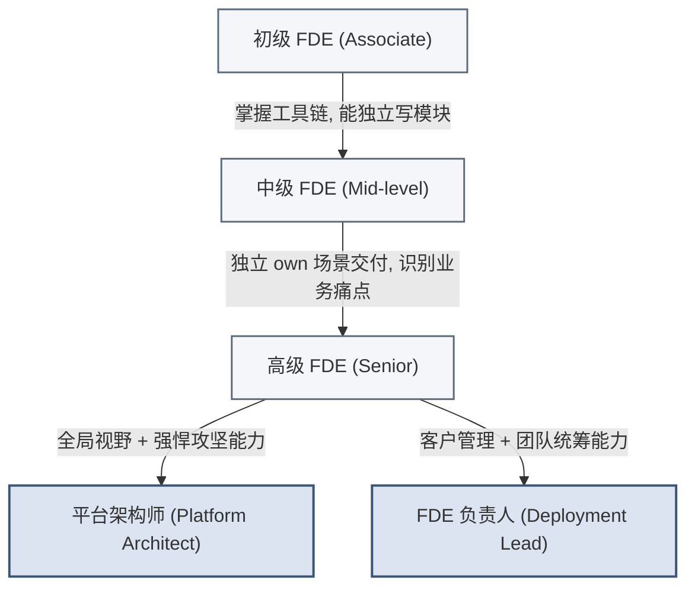

> [!NOTE]
> 晋升的**触发条件是能力标志而非年限**（各级能力标准见 10.3）。图中箭头标注的是"跨级所需能力"，而非"必须熬满几年"——能力达标者可加速晋升。

**培养机制要点**：
- **Bootcamp（新兵营）**：为期2-4周的高压封闭训练，模拟真实的烂尾项目，要求新人在模拟客户（由老员工扮演）的刁难下完成交付。
- **Buddy & Mentor（双轨导师制）**：Buddy（入职1-2年的师兄）负责日常答疑和代码规范；Mentor（资深高管或Lead）负责每季度的职业规划与心理疏导。
- **轮岗机制**：鼓励技术执行与业务策略师在职业生涯早期进行3-6个月的轮岗，培养同理心。

### 12.3 Playbook（标准作业手册）体系建设

**Playbook（作战手册）**是FDE团队最重要的知识资产。它将隐性知识显性化，是从“手工作坊”走向“工业化交付”的关键。

**Playbook的核心构成**：
1. **行业全景图**：如“零售快消行业数据治理现状图”。
2. **标准数据本体（Standard Ontology）**：预定义好的数据表结构与关系模型。
3. **交付SOP流程**：从Kick-off到上线验收的完整检查清单（Checklist）。
4. **技术架构模板**：可一键拉取的代码脚手架（Boilerplate）。
5. **避坑指南（FAQ & Anti-patterns）**：记录历史上踩过的血泪坑。

**建设与维护机制**：
- **从零到一**：由第一个啃下该行业大客户的 FDE 负责人主笔，提炼MVP经验。
- **动态更新**：将其视为内部开源项目。任何人在新项目中发现了更优解，都可以通过Pull Request（PR）的方式修改Playbook。对Playbook贡献度纳入高级别员工的绩效考核。

### 12.4 知识管理架构

知识如果在团队内部不流转，就是一堆死数据。我们构建了以下的知识管理飞轮：

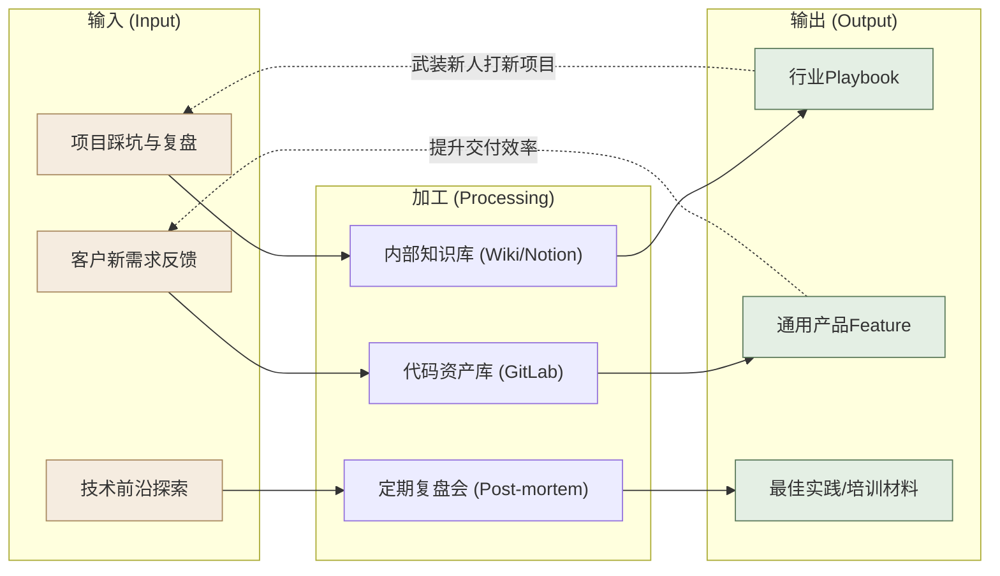

### 12.5 Demo Day与跨项目学习机制

当团队规模超过50人，各项目组极易沦为信息孤岛。“在A城商行造过的轮子，B农商行的团队又重新造了一遍。”

**破除孤岛的利器：Demo Day（演示日）**
- **定义**：每月度强制举办的全员技术与业务分享大会。
- **组织形式**：
  - 每个战区/项目组选派代表，在15分钟内，用最直观的方式（直接跑系统，拒绝纯PPT）展示本月最得意的功能突破或业务价值实现。
  - 评委由CTO、平台研发负责人及资深业务策略师组成。
- **核心目的**：
  - **技术炫耀与认同**：给前线苦战的工程师一个“装X”的舞台，极大地提振士气。
  - **寻找回注灵感**：平台工程师坐在台下，像星探一样，从各组的Demo中寻找可以做进标准产品的通用Feature。

**其他辅助机制**：
- **内部技术博客（Tech Blog）**：鼓励记录深入的技术思考，每月评选“最佳博文”。
- **无边界沟通频道（Slack/飞书）**：设立 `#fde-sos`（紧急求助频道，任何难题必须在15分钟内有人响应）、`#fde-brags`（吹牛频道，分享客户的点赞或漂亮的数据图表）。

---

> [!CAUTION]
> **警示**
>
> 团队建设与知识管理并非一日之功。切忌将这些SOP变为死板的KPI工具。FDE团队的灵魂在于“拥抱混乱中的秩序”，赋予一线作战人员最大的自主权与炮火呼叫权，才是发挥这套角色体系最大威力的密码。

> [!TIP]
> **本篇小结**
> 团队篇回答了"谁来干、如何协作、如何成长"：五大角色（技术执行/业务策略/平台/负责人/基础设施）对标 Palantir 的真实序列；RACI 矩阵界定了四阶段中权责的动态漂移；人才篇给出了选拔画像、培养路径与 Playbook 知识管理。至此，**What、Why、How、Who 四个问题已成体系**。**最后一个问题是：这套源自 Palantir 的方法论，放到中国市场行得通吗、该如何本土化？** 这正是收官的第五篇（中国实践篇）要回答的。

---

# 第五篇：中国实践篇 — 本土云厂商的探索与FDE转型挑战

> [!NOTE]
> **本篇导读**
> 本篇为《AI 时代的 FDE：认知、流程、团队与中国落地》的第五篇。在过去的十年中，中国ToB软件与云计算市场经历了从“跑马圈地”向“精耕细作”的深刻转型。在这个过程中，国内头部云厂商在不同程度上演化出了具有中国特色的“类FDE”模式。本篇旨在全景式拆解中国云服务商的技术服务交付模式，分析其与Palantir FDE（前沿部署工程师，Forward Deployed Engineer）模式的异同，并提炼出适用于中国本土市场的FDE转型挑战与应对方案。
>
> **适用对象**：
> - **高管团队**：理解中国市场技术服务的演进规律，为制定适合本土的FDE战略路线图提供决策依据。
> - **中层管理者**：掌握产品线与交付团队的整合策略，建立标准化、规模化的能力回注机制。
> - **一线工程师**：明晰个人从传统运维/交付向复合型FDE转型的路径，提升业务抽象与价值交付能力。

---

## 第13章 中国云服务商的FDE实践图谱

> [!NOTE]
> **本章导读**：把镜头从 Palantir 转向中国——阿里云、华为云、腾讯云、火山引擎四家头部厂商，基于各自基因演化出了形貌各异的"类 FDE"模式。本章用统一框架（PPT + 能力回注 + 飞轮阶段 + 卖人力/能力）横向剖析四家，看它们各自的强项与短板，为下一章的转型挑战与应对做铺垫。

在探讨中国市场的实践时，我们必须认识到：Palantir的FDE模式并非凭空产生，它是对复杂数据场景和极高业务要求的极致响应。国内以阿里云、华为云、腾讯云和火山引擎为代表的头部大厂，基于各自的组织基因，演化出了形貌各异但内核相通的技术交付模式。本章将对这四家厂商的实践图谱进行深度剖析。

> [!IMPORTANT]
> **统一考察框架：用同一把尺子量四家。**
> 为避免"各讲各的"，本章对四家厂商的考察，统一沿用前文已建立的核心模型作为透视镜——每家在 13.x.3「关键启示」小节都会用它点评强弱项，13.5 则用它做横向对比：
> - **PPT 三维度**（People / Process / Technology，见第三篇 How 总纲）——看这家的团队、流程、平台底座各处于什么水平、是否均衡；
> - **能力回注机制**（见第9章）——看它"现场经验 → 平台能力"的通道是否通畅，这是护城河的核心；
> - **飞轮阶段**（见 2.3 节）——看它处于飞轮的启动期、加速期还是成熟期；
> - **卖人力 vs 卖能力**（见 1.3 节主线）——看它本质上还在按人头卖交付，还是已转向卖可复用的平台能力。
>
> 一句话：**四家的差异，本质是它们在这套模型的各维度上"各有偏科"**——没有一家像 Palantir 那样五维均衡且互相咬合，这正是中国厂商共同的转型课题。

### 13.1 阿里云：TAM + AI FDE + OneData能力回注

作为国内云计算的开拓者，阿里云的技术服务体系经历了最为完整的演进周期。其核心特征在于建立了一套多梯次的技术服务矩阵，并通过极其强大的内部业务场景（如双11）打磨数据产品，最终向外部输出。

#### 13.1.1 阿里云的多梯次服务模式
从组织架构上看，阿里云构建了面向客户全生命周期的复合型技术交付阵型：
- **TAM（技术服务经理，Technical Account Manager）**：聚焦于企业级客户的专属技术服务，承担整体架构规划和技术治理闭环（对标Palantir 客户成功负责人/部署主管）。
- **SA（解决方案架构师，Solution Architect）**：偏向于售前与售中阶段的技术方案设计、架构蓝图绘制及实施指导（对标Palantir 架构师）。
- **驻场工程师**：负责现场的日常运维、系统保障和按部就班的项目实施。
- **面向AI的FDE模式（探索期）**：在大模型时代，阿里云组建了深入企业业务一线的敏捷团队。技术执行工程师（对标Palantir FDE）直接进入客户现场，协助企业进行算力平台适配、RAG（检索增强生成）系统搭建和垂直模型微调。

> [!IMPORTANT]
> **高管视角（战略层）**：TAM+SA的组合确保了项目“能签下来”并“有规划地落地”，而AI FDE的引入则是为了在大模型时代打破SaaS/PaaS的标品局限，贴近客户最后一公里解决高价值业务痛点。
>
> **一线视角（实操层）**：工程师不仅要懂底层云资源的调度（ECS/MaxCompute），更要懂客户业务侧的数据流向，能够利用Python或Java快速编写胶水代码连接阿里云各种API。

#### 13.1.2 能力回注机制：从业务外化到OneData体系
阿里云最接近Palantir核心理念的地方在于其**能力回注**机制。Palantir强调“在泥土中挖金”，阿里云同样擅长“吃狗粮”式演进。

阿里巴巴内部双11等大促场景淬炼出了极其复杂的数据中台能力。这些内部打磨的能力，逐步沉淀为 DataWorks、Dataphin、Quick BI 等标准化商业产品。其中最著名的是 **OneData体系**：
- **OneModel（统一数据模型）**：规范业务域和数据域的映射。
- **OneID（统一实体识别）**：跨系统整合用户/对象身份。
- **OneService（统一数据服务）**：将数据资产API化，向应用层输出。

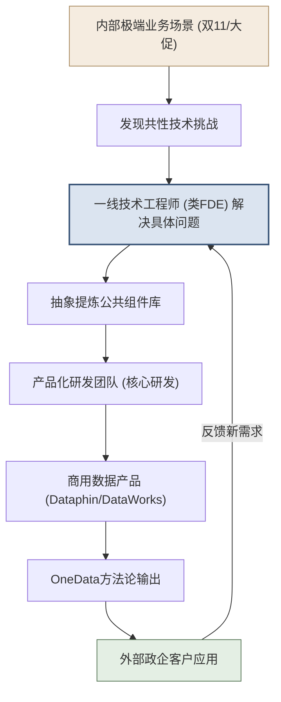

**典型本土案例**：
- **某省政务数据中台**：通过OneID打通了社保、公安、交通等几十个委办局的孤岛数据，实现“最多跑一次”。
- **某快消企业全链路数据中台**：打通线上电商与线下门店库存，构建统一的消费者画像。
- **某零售企业数字化转型**：运用OneService将订单和库存服务API化，支撑前端小程序的高并发查询。

#### 13.1.3 FDE视角的关键启示
1. **内部场景外化是最高效的能力回注**：阿里云最成功的能力回注并非来自外部定制项目，而是内部业务场景的外化。
2. **产品化程度深**：在国内云厂商中，阿里云的数据中台工具链（Dataphin等）产品化程度是最高的，极大地降低了前线交付工程师重复造轮子的成本。

> [!TIP]
> **框架透视（阿里云）**：
> - **PPT**：**Technology 最强**（OneData/Dataphin 产品化领先），People/Process 相对标准化、偏工具依赖。
> - **能力回注**：通道最顺畅——但走的是"内部业务（双11）→中台→商业化"的**自研外化路径**，而非"外部客户现场→回注"的 Palantir 路径。
> - **飞轮阶段**：成熟期（底座厚、复用率高）。
> - **卖人力/能力**：已明显偏向**卖能力**（卖产品化的中台）。
> - **短板**：前线 FDE 的现场定制灵活性受限于标准化工具，"从客户现场挖金"的能力弱于内部场景外化。

---

### 13.2 华为云：铁三角 + DataArts + 行业深耕

华为云的技术交付深深烙印着其ICT时代的B2B基因，最著名的管理实践即“铁三角”模型，这是一种高度组织化、纪律严明的阵地战打法。

#### 13.2.1 华为的铁三角模式 (Iron Triangle)
面对大型政企客户，华为在前端配置了三个核心角色协同作战：
- **AR (客户经理, Account Representative)**：负责客户关系和商务闭环。
- **SR (解决方案经理, Solution Representative)**：最接近FDE的角色，负责洞察业务痛点并输出整体技术方案（对标Palantir 部署主管/架构师）。SR不仅需要极强的技术底蕴，更需要具备与客户CXO级别对话的商业视角。
- **FR (交付经理, Fulfillment Representative)**：负责项目的生命周期管理、资源协调与实施交付。

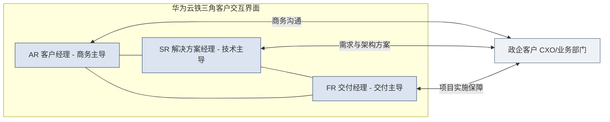

> [!NOTE]
> 铁三角的精髓在于“打破部门壁垒，向客户提供统一接口”。客户感受到的是一个完整的作战单元，而不是松散的销售和交付拼凑。

#### 13.2.2 核心产品与能力回注：DataArts Studio
华为将自身20多年的内部数据治理经验（尤其是跨国多业态的数据治理）沉淀为 **DataArts Studio（数据使能平台）**。该平台涵盖了数据目录、数据质量、数据安全等各个环节。

**典型本土案例**：
- **某城市智慧城市IOC（智能运营中心）**：早期由一线SR主导设计架构，后续沉淀为华为云智慧城市标准解决方案，成功在全球100多个城市实现规模化复制。
- **某城商行金融数据中台**：通过DataArts梳理全行数据资产目录，满足银保监会的监管报送要求。
- **某央企数字化转型**：构建“一个数据底座+八大应用场景”，统一全集团的数据标准。
- **某大型制造企业工业互联网**：现场交付团队将生产线物联数据分析逻辑提炼，回注到华为云的工业互联网平台能力中。

#### 13.2.3 FDE视角的关键启示
1. **组织化与体系化优势**：铁三角模式将商业、技术和交付强行绑定，确保了从方案设计到落地的不变形，这对松散的FDE团队治理有极大借鉴意义。
2. **SR角色的局限性**：SR虽然在架构和商业洞察上强大，但在传统模式下偏向“架构设计和方案售前”，往往缺乏像Palantir FDE那样**亲手写代码、深入脏数据池调优**的深度参与。这导致方案和最终代码实现之间可能存在割裂。

> [!TIP]
> **框架透视（华为云）**：
> - **PPT**：**People / Process 最强**（铁三角组织力、纪律严明），Technology（DataArts）扎实但 SR 偏方案设计、少亲手写码。
> - **能力回注**：走"行业标杆项目→标准解决方案→全球复用"路径，回注机制体系化，但因 SR 与代码实现割裂，现场经验的回注可能有损耗。
> - **飞轮阶段**：加速期偏成熟（智慧城市等已全球复制）。
> - **卖人力/能力**：偏**卖能力**（卖标准解决方案），但组织重、灵活性弱。
> - **短板**：SR 顶层设计与前线代码闭环之间的割裂，是"方案好但落地变形"的风险源。

---

### 13.3 腾讯云：OTSS→FDE演进 + 智能体时代

腾讯云在技术服务领域的演进，展现了一段从“被动响应”向“主动构建”升级的典型历程，这对于很多正处于转型期的传统IT企业具有直接的参考价值。

#### 13.3.1 模式演进：从被动运维到主动价值创造
- **阶段一：OTSS（驻场技术支持，On-site Technical Support Service）**
  早期的技术服务多为传统的驻场运维，工程师的核心KPI是“系统稳定性”和“工单响应时间”。工作本质是被动响应，无法触及客户核心业务逻辑。
- **阶段二：向FDE（前沿部署工程师）演进**
  随着产业互联网战略的深化，腾讯云开始培养集成“BA（业务分析师）+架构师+研发”的复合型FDE角色。工程师不再只看监控大屏，而是坐进客户的业务办公室，理解什么是GMV、日活和供应链周转率。

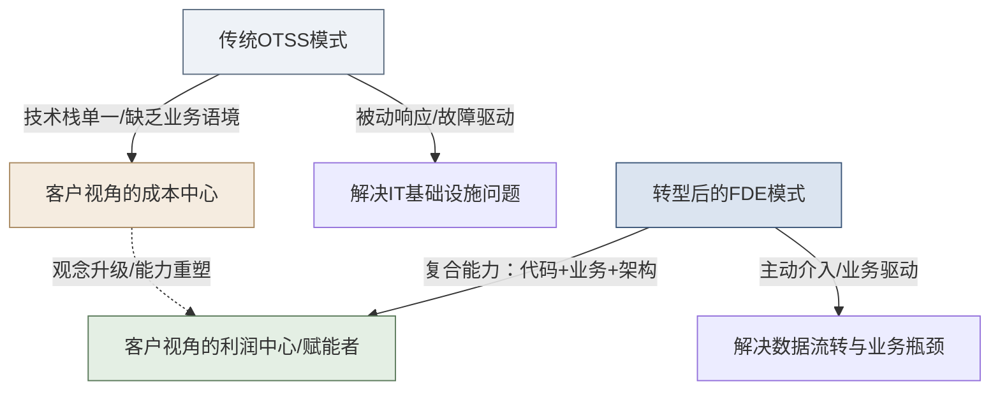

#### 13.3.2 智能体（Agent）时代的FDE定位
在当前的大模型与智能体时代，腾讯云为FDE赋予了全新的价值定位。
面对企业海量非结构化数据和复杂的审批流程，FDE负责智能体从“业务设计”、“提示词工程”、“RAG知识库构建”、“API对接部署”到“真实环境迭代优化”的端到端闭环。

> [!TIP]
> **一线转型建议**：传统运维人员向FDE转型，可以从“会写自动化运维脚本”起步，逐步过渡到“用大模型搭建企业内部IT问答智能体”，最后延伸至“开发具备复杂决策能力的业务线Agent”。

**典型本土案例**：
- **某头部消费零售企业**：FDE 团队从传统的门店 POS 系统运维起步，逐步深入商品与会员业务，基于腾讯云数据组件搭建统一消费者数据资产，支撑精准营销与选品决策。
- **某汽车主机厂智能座舱**：借助腾讯云在音视频与 C 端连接上的先天优势，FDE 将车机语音助手与后端知识库打通，构建端到端的座舱智能体。
- **某政务热线智能体**：FDE 主导完成 RAG 知识库构建与提示词工程，将市民咨询的自动应答准确率与首次解决率作为核心业务指标，替代大量重复的人工话务。

#### 13.3.3 FDE视角的关键启示
1. **转型路径的参考性**：OTSS向FDE的演进，打破了“服务就是成本中心”的传统观念，为国内SaaS/PaaS企业现有交付团队转型提供了阶梯式路径。
2. **AI时代的破局点**：智能体（Agent）开发是一个极度非标且需高度贴合业务的领域，这正是FDE发挥“前线代码能力+业务理解”双重优势的最佳战场。

> [!TIP]
> **框架透视（腾讯云）**：
> - **PPT**：**Process 正在演进**（OTSS 被动运维 → FDE 主动创造），People 的复合能力（BA+架构+研发）在补齐中，Technology 依托 C 端流量场景组件化。
> - **能力回注**：走"C 端流量场景沉淀→技术组件化→前线组装"路径，方向对，但历史交付包袱使回注尚不系统。
> - **飞轮阶段**：加速期（转型进行中，尚未完全跑通）。
> - **卖人力/能力**：**正处在从卖人力向卖能力的转型途中**——这也是它对国内传统交付团队最有参考价值之处。
> - **短板**：历史 OTSS 包袱重，"从成本中心到价值创造者"的观念与能力转型仍需时间。

---

### 13.4 火山引擎：千人级FDE + 咨询联合

字节跳动旗下的火山引擎起步较晚，但凭借敏捷的组织迭代能力和在AI、大数据领域的技术积累，探索出了一条“生态联合+人海战术”与AI商业化紧密结合的道路。

#### 13.4.1 模式特点：“铁军”与咨询联合
火山引擎深刻意识到大模型落地面临的“最后一公里”难题，采用了一种极具侵略性的破局策略：
- **联合头部咨询机构**：火山引擎提供技术底座（云原生、大数据平台、大模型API）和前线工程师，咨询公司输出行业Know-how、数字化转型顶层设计和业务诊断。
- **搭建千人级FDE团队**：将FDE视为AI商业化落地的“铁军”。这支队伍不仅负责将火山的推荐算法、大模型能力植入客户系统，还要在实战中获取最为真实的业务反馈（Feedback Loop）。

这种“技术底座 + 前线铁军 + 咨询外脑”的三方协作，本质上是把 Palantir 内部“平台工程师 + FDE + 业务策略师”的三角，部分外包给了专业咨询公司来补齐行业 Know-how 短板：

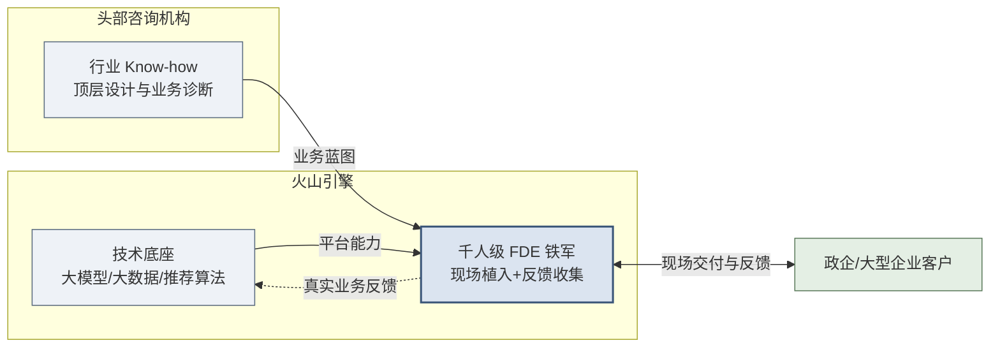

#### 13.4.2 战略意图与效果
对于火山引擎而言，FDE不仅是交付人员，更是**客户黏性制造机**和**产品反馈收集器**。通过大规模派驻懂AI和数据的FDE，极大地缩短了客户尝试新技术的决策周期，降低了AI接入门槛。

**典型本土案例**：
- **某新能源汽车品牌营销智能化**：FDE 铁军将火山的推荐与大模型能力植入客户的用户运营链路，联合咨询公司梳理“线索—试驾—成交”的转化漏斗，把营销 ROI 作为可量化的交付指标。
- **某消费品牌大模型营销**：借助火山在内容推荐上的算法积累，FDE 帮助客户搭建 AIGC 素材生产与智能投放闭环，缩短营销物料的生产周期。
- **某金融机构智能客服**：由咨询公司做合规与业务流梳理，火山 FDE 负责 RAG 知识库与对话能力落地，在严监管前提下提升自助解决率。

#### 13.4.3 FDE视角的关键启示
1. **创新的规模化路径**：通过与具备业务深度的外部咨询公司联合，弥补了原生云厂商在垂直行业（如汽车制造、医疗生命科学）领域知识储备不足的短板。这是一种“借外脑补短板”的加速策略。
2. **长期隐患与内化需求**：这种人海战术适合大模型及AI应用落地的初期阶段（快速抢占山头），但如果不建立像Palantir那样高度抽象的底层平台（如Gotham/Foundry）来实现资产沉淀，长期将面临极高的人力成本侵蚀。**未来必须从“人力密集”走向“资产复用密集”——即把千人铁军踩过的坑，系统性地回注为平台的标准能力，否则团队规模的线性扩张终将撞上人效天花板。这正是 1.3 节“从卖人力到卖能力”这一全书主线在中国厂商身上最真切的写照——火山的挑战，本质就是能否完成从“卖人力”到“卖能力”的惊险一跃（并呼应第 9 章能力回注方法论）。**

> [!TIP]
> **框架透视（火山引擎）**：
> - **PPT**：**People 规模最大**（千人 FDE 铁军 + 咨询外脑补行业 Know-how），但 **Technology 的资产沉淀（底座复用）是最大短板**，Process 依赖人力密集而非流程复利。
> - **能力回注**：目前以"前线业务反馈→快速迭代 AI/算法"为主，尚未建立"定制→抽象→并入平台"的系统化回注——这是它与前三家的最大差距。
> - **飞轮阶段**：**启动期/加速期早段**（靠人海快速起量，飞轮尚未靠资产复用转起来）。
> - **卖人力/能力**：**当前仍偏卖人力**（人效天花板明显），能否转向卖能力是其生死线。
> - **短板**：五家里 Technology 沉淀最弱，最需补"平台底座 + 能力回注"这一课。

---

### 13.5 四家对比总结

用本章开头确立的统一框架（PPT 三维 + 能力回注 + 飞轮阶段 + 卖人力/能力），把四家放到同一张表里横向对比：

| 评估维度 | 阿里云 | 华为云 | 腾讯云 | 火山引擎 |
| :--- | :--- | :--- | :--- | :--- |
| **模式简称** | TAM + AI FDE | 铁三角（SR/FR/AR）+ SA | OTSS → FDE | 千人 FDE 铁军 + 咨询联合 |
| **People（人/组织）** | 标准化，工具依赖 | ⭐ **最强**：铁三角组织力、纪律严明 | 复合能力补齐中 | 规模最大（千人）+ 咨询外脑 |
| **Process（流程）** | 中台流程成熟 | ⭐ **最强**：方案到落地不变形 | 演进中（被动→主动） | 人力密集，流程复利弱 |
| **Technology（平台）** | ⭐ **最强**：OneData 产品化领先 | DataArts 扎实，SR 少写码 | C 端场景组件化 | **最弱**：底座复用是短板 |
| **能力回注机制** | 内部场景外化（自研路径，最顺） | 标杆项目→标准方案→全球复用 | C 端沉淀→组件化（尚不系统） | 反馈迭代 AI，**未系统化回注** |
| **飞轮阶段** | 成熟期 | 加速期偏成熟 | 加速期（转型中） | 启动期/加速期早段 |
| **卖人力 vs 卖能力** | 已偏**卖能力** | 偏**卖能力**（卖方案） | **转型途中** | **仍偏卖人力** |
| **对标 Palantir 的主要差距** | 前线现场定制灵活性受限于标准化工具 | SR 顶层设计与代码实现割裂 | 历史交付包袱重，转型未跑通 | Technology 沉淀最弱，人效天花板明显 |
| **最该补的一课** | 强化"从客户现场挖金"的前线能力 | 打通 SR 方案与前线代码闭环 | 加速跑通回注、甩掉 OTSS 包袱 | 补平台底座 + 系统化能力回注 |

> [!IMPORTANT]
> **一张表看懂四家的分化**：四家在统一框架下各有偏科——**阿里赢在 Technology、华为赢在 People+Process、腾讯赢在转型路径的参考性、火山赢在 People 规模与速度**。但把五个维度叠起来看，**没有一家像 Palantir 那样五维均衡且互相咬合成飞轮**：阿里回注走的是内部外化而非客户现场、华为 SR 与代码割裂、腾讯转型未跑通、火山 Technology 与回注双缺。**这种"单点强、全局不均衡"，正是中国厂商共同的转型课题**——如何补齐最弱维度、让飞轮真正转起来，就是第14章要回答的问题，也引出 14.8 节的乙方转型行动纲领。

---

## 第14章 中国区FDE转型的五大挑战与应对

> [!NOTE]
> **本章导读**：尽管国内各大厂商都在积极探索“贴近业务解决高价值问题”的技术交付模式，但若要在中国市场真正建立起类Palantir的高效FDE体系，整个行业仍然面临着系统性的阵痛。本章将跳出单一厂商的视角，从行业共性出发，剖析五大核心挑战并给出应对策略。
>
> **重要的是：五大挑战的应对，不是五套临时对策，而是同一套方法论在不同问题上的应用。** 读者会看到，每个挑战的解药都能回溯到本教材前面确立的核心原则——**能力回注（第9章）、PPT 框架（第三篇）、卖人力→卖能力（1.3）、四阶段（第三篇）、Playbook 与知识管理（第12章）**。挑战各异，但兵器库是同一个。

### 14.1 挑战一：项目制交付的规模化困境

**现象描述**：
在中国ToB市场，“做项目”是常态。大量客户（尤其是非互联网企业）不习惯为纯软件或SaaS订阅付费，而是倾向于买“交钥匙工程”。这就导致FDE团队很容易退化为传统的“外包定制开发团队”：收入的增长必须依赖人头数的线性增长，毛利率极低，深陷项目泥潭无法自拔。从经济学视角看，边际成本未能随着规模扩大而递减。**这正是 1.3、2.2 两节反复警示的"FDE 退化为外包"在中国市场最普遍的现实版本——本该"卖能力"，却被迫退回了"卖人力"。**

**Palantir的应对经验**：
Palantir早期同样在各个情报机构中做重度定制，但其通过构建**Foundry/Gotham这样的统一本体（Ontology）底座**，将定制化代码的比例压缩至20%以内。其规模化公式可以概括为：

$$
\text{FDE产能} = \frac{\text{可复用平台资产}}{\text{单个项目的定制代码量}} \times \text{业务理解力}
$$

**适用于中国市场的应对策略**：
> 本质上，这一挑战的解药就是全书的核心——**能力回注（第9章）**：把"卖人力"扭转为"卖能力"（1.3 节主线），让边际成本随规模递减（2.3 节经济学）。落到动作上：
1. **坚守二八原则**：在商务谈判阶段，坚守核心平台底座不容侵入式修改，只在应用层和数据接入层通过API/插件进行定制开发（对应 2.2 节"70% 平台 + 30% 定制"的分层结构）。
2. **实施"资产税"制度**：要求每个定制化项目必须提炼出至少1-2个可被平台或其他项目复用的组件（Data Pipeline模板、可视化Widget或行业模型），否则不予验收结项——这就是把第9章的能力回注四步法制度化、强制化。

> [!IMPORTANT]
> **关键行动项（中层与一线）**：从今天起，记录你在客户现场写的每一段“胶水代码”。如果这个逻辑在下一个客户那里改头换面又用了一次，请立刻将其封装为配置化组件（即第9章"识别→抽象"的一线动作）。

### 14.2 挑战二：产品线分散与平台整合

**现象描述**：
许多中国科技公司在发展过程中，通过并购或内部赛马，积累了大量功能重叠、底层互不相通的PaaS产品（如多个数据仓库引擎、多个BI工具并存）。FDE在现场为了完成业务流，不得不花大量时间在自家不同产品间做系统集成，形同“内部外包”。

**应对策略：渐进式整合 vs 推倒重来**
> 这一挑战对应 **PPT 框架的 Technology 维度**（第三篇 How 总纲）——它要解决的是"平台底座是否统一、可复用"的问题。完全推倒重来重建一个大一统平台在商业上风险极高。应借鉴阿里云OneData统一方法论的经验，采用**渐进式抽象整合**：
- **第一步：统一鉴权与资源调度底座**（让所有组件在基础设施层互通）。
- **第二步：统一数据资产元数据**（构建统一Data Catalog，不论数据在哪个引擎里，都能被唯一标识）。
- **第三步：前端工作流串联**（为FDE提供一个低代码的编排界面，隐藏底层多引擎的复杂性）。

> [!IMPORTANT]
> **关键行动项**：高管层必须设立一个凌驾于各业务线之上的“平台架构委员会”，强制推进跨组件的API标准化，否则前线的FDE将永远在为后方的架构债买单。这个委员会与第9章的"回注评审委员会"应协同——一个管"平台怎么统一"，一个管"前线经验怎么并入平台"。

### 14.3 挑战三：知识碎片化与人才流动

**现象描述**：
FDE的核心价值在于其脑海中的“行业Know-how”和“排坑经验”。但国内IT行业普遍面临人员流动率较高的问题。一个王牌FDE离职，往往带走了一个行业的深度经验，接手的团队从零开始，客户满意度断崖式下跌。

**应对策略：把个人 Know-how 变成组织资产**
> 这一挑战对应 **PPT 框架的 People 维度**，其解药正是第12章的 **Playbook 体系与知识管理飞轮**——核心是把"沉淀在个人脑子里、会随离职流失"的隐性经验，转化为"沉淀在组织平台上、越用越强"的显性资产（这也是 1.3 节"卖能力"在人才维度的体现：能力属于公司平台，而非属于某个会离职的人）。
- **建立强制性的知识沉淀机制**（呼应 12.4 知识管理架构）。例如华为通过 iKnow 系统，将全球专家的实战经验结构化。
- **引入 Playbook（作战手册）机制**（即第12.3 节）。不要只写“如何配置系统”的产品文档，而是要写“面对零售客户多门店库存数据不准时，应该先排查哪张表、用什么算法清洗”的**业务处理SOP**。

> [!TIP]
> **业务处理SOP结构建议**：
> 1. 业务痛点描述 → 2. 数据源要求及探查SQL → 3. 数据建模逻辑与核心指标定义 → 4. 交付物Demo（Dashboard/报表） → 5. 常见坑点及规避方案。

### 14.4 挑战四：市场竞争与差异化

**现象描述**：
国内IaaS/PaaS层竞争同质化严重，“价格战”频发。只卖云资源或标品软件的利润率越来越薄。

**应对策略：不拼资源规模，深耕行业场景**
> 这一挑战的答案，本质是把竞争战场从"卖资源"切换到"卖能力"（1.3 节主线）——不与巨头拼底层算力/存储的性价比，而是深耕"本体（Ontology）"和业务逻辑（Palantir 在 AWS/Azure/GCP 包围中正是靠这一点突围）。
FDE的职责就是要在客户的“IT预算”之外，去切取“业务预算”。当FDE帮助车企通过数据分析将供应链周转率提升了5%，这部分的价值是任何纯底层云资源降价都无法比拟的。

> [!IMPORTANT]
> **关键行动项**：FDE团队的考核指标（KPI）应逐步从“产品消耗量（消耗了多少核算力）”向“客户可衡量的业务提升价值”转移——这与 9.5 节回注 KPI 的思路一致：**考核真正创造的业务价值，而非中间过程的资源消耗量。**

### 14.5 挑战五：政企客户特殊性

**现象描述**：
在中国做ToB业务，避不开政企客户。这一群体的特殊性对FDE模式提出了本土化考验：
- **采购流程**：招投标制度严格、预算周期长（通常跨年）、决策链条极其复杂。
- **数据安全**：等保2.0要求、数据不出域（私有化部署要求极高）、信创/国产化替代。
- **组织文化**：风险规避倾向强，各部门之间数据壁垒森严，数字化变革阻力大。

**应对策略**：
> 这一挑战的应对，恰好复用了前文两套现成的方法论——**四阶段中的 Prototype/快赢**（用最小代价证明价值）与 **8.3 的组织变革管理**（应对政企的组织阻力）。
1. **轻量级价值证明（PoV, Proof of Value）前置**：在漫长的招投标启动前，FDE应带上脱敏数据集或演示平台，在2周内免费为客户搭建一个高价值的业务闭环（如一个反欺诈预警大屏），用直观的业务价值打动“一把手”——这就是把 Prototype 阶段的"Show, Don't Tell""快赢场景"（第6章）前置到售前，用来影响招投标参数。
2. **构建强大的私有化与信创适配能力**：平台的底层架构必须能够快速打包，适应各种国产服务器、国产操作系统和数据库环境。FDE需要熟练掌握这一套自动化部署工具，避免在驻场部署上耗费数月时间。

> [!IMPORTANT]
> **关键行动项**：把"合规与信创适配"当成**第一天就要解的设计约束**，而非上线前的补丁（呼应 4.3 节 NHS 案例的启示：合规不是速度的敌人，而是设计的前置输入）。政企的组织变革阻力，则用 8.3 节的"阻力-应对矩阵"逐一化解。

---

### 14.6 通用版三阶段转型路线图

对于立志于建立本土高阶FDE体系的科技企业，我们梳理了以下循序渐进的三阶段转型路线图：

```mermaid
graph TD
    subgraph p1["阶段一：基础建设 6-12个月"]
        A1["高管确立战略定位及预算投入"]
        A2["剥离与重组试点FDE小分队"]
        A3["梳理散乱组件，构建统一底座雏形"]
        A4["建立Playbook知识库V1.0"]
    end

    subgraph p2["阶段二：能力积累 12-24个月"]
        B1["落实强硬的能力回注KPI考核"]
        B2["深入2-3个垂直行业打透场景"]
        B3["沉淀行业级数据模型与组件"]
        B4["定制化代码比例从80%降至40%"]
    end

    subgraph p3["阶段三：飞轮加速 24个月以上"]
        C1["平台底座成熟 低代码/高配置"]
        C2["FDE团队从几十人扩展至数百人"]
        C3["引入AI大模型/Agent加速交付闭环"]
        C4["生态开放：赋能外部ISV采用平台交付"]
    end

    A1 --> A2 --> A3 --> A4
    A4 ==> B1
    B1 --> B2 --> B3 --> B4
    B4 ==> C1
    C1 --> C2 --> C3 --> C4

    classDef s1 fill:#eef2f7,stroke:#5a6b7f;
    classDef s2 fill:#e3e9f1,stroke:#4a5f7d;
    classDef s3 fill:#dbe4f0,stroke:#3a5578;
    class A1,A2,A3,A4 s1;
    class B1,B2,B3,B4 s2;
    class C1,C2,C3,C4 s3;
```

这三个阶段并非平均用力，而是一条**"先亏后赚、先重后轻"的飞轮启动曲线**。下面逐阶段拆解：每个阶段要达成什么、用哪些工具做、以及——最关键的——**凭什么客观信号判断这一阶段已经成熟、可以进入下一阶段**（成熟度不能只看时间，时间到了但指标没到，就是没成熟）。

#### 阶段一：基础建设——把飞轮"扶上道"

- **核心目标**：不是盈利，而是跑通第一批种子项目、建立最小可行的组织与平台雏形。这一阶段注定是战略性投入期，毛利可能为负。
- **关键动作与所用工具**：
  - **高管共识与预算**：转型的本质是"容忍短期低毛利换长期资产"，没有一把手的长期主义背书，一切无从谈起。可先用【FDE 转型就绪度自评清单】（14.7）摸清自身家底。
  - **剥离试点小分队**：从现有交付团队挑 3-5 人，按"技术执行 + 业务策略 + 基础设施"的作战单元编制，并让它**独立于现有人头 KPI 体系**运作。
  - **跑通种子项目**：用完整的四阶段方法（Discovery→Prototype→Build→Scale）交付前几个项目，每阶段过 Gate 检查清单；同时启动 Playbook 知识库的第一版。
- **易踩的坑**：其一，想"一步到位建大平台"——正确做法是先用种子项目趟出真实需求，别凭空造轮子；其二，试点团队仍背老的人头 KPI，导致没人愿意花时间做抽象与沉淀。
- **成熟度信号（达到即可进入阶段二）**：
  - 已完整交付至少数个种子项目，且每个都产出了可复用的组件或行业模型（而非一次性代码）；
  - Playbook 知识库第一版落地，新人可据此上手；
  - 高管层已把"能力回注"写入团队考核，而非停留在口号。

#### 阶段二：能力积累——让飞轮"自己转起来"

- **核心目标**：在 2-3 个垂直行业打透场景，让**能力回注**真正跑通，定制代码比例显著下降。这是飞轮从"推得动"到"自己转"的关键期。
- **关键动作与所用工具**：
  - **落实能力回注机制**：把第9章的四步法制度化——用【能力回注需求卡片】登记、双周评审、20% 工时强制投入抽象重构；考核**复用率**而非卡片提交数量。
  - **深耕而非广撒**：集中火力在少数行业积累 Know-how 与行业组件库，飞轮的复利效应才会明显。
  - **沉淀行业级资产**：把种子项目的经验抽象为可复用的行业 Ontology 与组件，逐步充实 Playbook。
- **易踩的坑**：其一，行业铺太广、每个都浅尝辄止，导致哪个行业的复用率都上不去；其二，回注机制沦为形式，一线为凑数提交低质量卡片。
- **成熟度信号（达到即可进入阶段三）**：
  - 主打行业已积累起可观的组件库，**新项目大量复用既有资产、而非从零重写**（复用率的量化目标可参考 9.5 节，但更重要的是趋势在稳定上升）；
  - **定制代码占比较起步期显著下降**（起步期通常大头是定制，此阶段应明显向"平台为主、定制为辅"倾斜）；
  - 同类项目的平均交付周期出现**可测量的同比缩短**（经验曲线开始显效）；
  - 项目毛利**由负转正**。

#### 阶段三：飞轮加速——让飞轮"越转越快"

- **核心目标**：平台底座成熟到"低代码/高配置"，团队规模化扩张，营收实现非线性增长——此时规模越大反而越赚钱。
- **关键动作与所用工具**：
  - **平台走向低代码/高配置**：让新客户的交付越来越多地靠"配置"而非"写代码"，边际成本趋近于零。
  - **团队规模化 + AI 加速**：从几十人扩到数百人，引入大模型/Agent 把交付闭环进一步压缩。
  - **生态开放**：把平台开放给外部 ISV，让别人也用你的底座交付——从"自己转"到"带动生态一起转"。
- **易踩的坑**：其一，规模扩张时放松了回注纪律，导致"人多了、但平台没更强"，重新滑回人力密集；其二，盲目追求团队规模而非人效——成熟期健康度看的是人均产出，不是人头总数。
- **成熟度信号（标志飞轮真正转起来）**：
  - 定制代码占比降至很低水平，新客户交付**以配置为主、写码为辅**；
  - 单个 FDE 能并行支撑的项目数较早期明显提升，**人效逐年上升**（而非靠堆人头扩产能）；
  - 整体毛利率趋近 SaaS 水平；
  - **老客户持续增购、扩展到更多场景**——用净收入留存率（NRR）等指标衡量，若老客户的年度净留存显著大于 100%，说明"落地生根（land-and-expand）"已跑通（Palantir 的可查证参考见 2.4 节）；
  - 出现"营收增长而人头不成比例增长"的非线性拐点——这是飞轮转起来最硬的证据。

> [!IMPORTANT]
> **一张表看懂三阶段的"变"与"不变"**
>
> | 维度 | 阶段一 基础建设 | 阶段二 能力积累 | 阶段三 飞轮加速 |
> | :--- | :--- | :--- | :--- |
> | 飞轮状态 | 静止期（用力推） | 加速期（自己转） | 飞轮期（越转越快） |
> | 定制代码占比 | 大头是定制 | 明显下降 | 降至很低、以配置为主 |
> | 盈利水平 | 净利可能为负（战略投入期） | 净利由负转正 | 高毛利 + 高净利，趋近 SaaS |
> | 团队规模 | 小分队试点 | 单行业小队 | 数百人 + 生态 |
> | 增长方式 | 靠投入 | 靠复用 | 靠平台与生态（非线性） |
>
> **贯穿三阶段不变的主线**：能力回注始终是引擎，"从卖人力到卖能力"是唯一方向——阶段在变，这条主线不变。
>
> **可参照的真实标杆**：Palantir 自身的财务轨迹恰好印证了这条曲线——**毛利率**一路从约 50%（2018）升至 80%+（2022 起见顶），而真正体现"飞轮转起来"的**净利率**则是先长期为负、2023 年才首次转正、2025 年飙升至 36%（详见 2.4 节）。注意区分：软件业务的**毛利率**通常一开始就不低（很少为负），真正"先亏后赚"的是**净利率/经营利润率**——它才是判断飞轮是否转起来的关键财务信号。

---

### 14.7 FDE转型就绪度自评清单

前面几节讲的是"该怎么转"，但在动手之前，每一家乙方都该先诚实地问自己一句：**我们真的准备好了吗？** 本节提供一张可打分的"体检表"——它把全书的核心模型（PPT 框架、能力回注、四阶段、Playbook 等）落成 25 个可勾选的考评项，帮助管理团队在启动转型或规模化扩张前，实事求是地摸清自身家底、定位最薄弱的环节。

这张清单的五个层面与全书的 PPT 框架一脉相承：**团队层 = People、流程层 = Process、平台层 = Technology**，这三层是 PPT 三维度的落地自查；而**战略层**（高管共识、商业模式）与**度量层**（回注率、复用率、人效）则是贯穿三维度的前提与标尺——没有战略层兜底，PPT 无从谈起；没有度量层，转型无法证明成效。

> [!TIP]
> **使用方法**：组织核心管理团队逐项打分——✅已具备（2分）/ 🟡部分具备（1分）/ ❌未具备（0分），满分 50 分。配合 14.8 的 PPT 转型纲领，即可得出"哪个维度最弱、下一步资源投向哪里"的清晰结论。

**FDE 转型就绪度自评清单（25 项 / 满分 50 分）**

| 评估维度 | 核心考评项 | 状态 | 得分 | 改进计划/责任人 |
| :--- | :--- | :--- | :--- | :--- |
| **战略层面** | 1. 业务高管（CEO/CTO级）是否公开支持这种长期主义的转型并容忍短期的成本上升？ | [ ] | | |
| | 2. 是否有专项且长期的资金预算用于FDE团队建设及底层平台的整合研发？ | [ ] | | |
| | 3. FDE的定位是否明确为“业务价值交付者”而非单纯的“云资源销售辅助”或“免费售后”？ | [ ] | | |
| | 4. 商业模式上，是否有相应的商业化手段去捕捉FDE创造的额外业务价值（如咨询费、价值分成）？| [ ] | | |
| | 5. 组织架构上，FDE团队是否具备跨越研发与销售边界、直接向上级汇报的特权或通道？ | [ ] | | |
| **平台层面** | 6. 是否拥有一个核心的统一数据/应用平台底座，而不是一堆散乱的产品线拼凑？ | [ ] | | |
| | 7. 平台的API设计和模块化程度是否足够高，支持前线人员快速调用组合？ | [ ] | | |
| | 8. 是否具备强大的低代码/无代码工具，能大幅减少FDE现场编写底层基础代码的时间？ | [ ] | | |
| | 9. 平台是否具备快速适配政企私有化部署、信创环境及极简交付的能力？ | [ ] | | |
| | 10. 是否有内置的资产管理中心（Catalog），用于管理和复用不同项目中沉淀的组件？ | [ ] | | |
| **团队层面** | 11. 现有的技术服务团队中，是否有一批人员具备极强的代码能力与业务敏感度双重特质？ | [ ] | | |
| | 12. 是否有明确的FDE核心能力画像与招聘标准？ | [ ] | | |
| | 13. 是否建立了针对FDE角色的系统性培训体系（技术+业务+软技能）？ | [ ] | | |
| | 14. 团队内部是否存在“以战代练”的师傅带徒弟（Mentorship）机制？ | [ ] | | |
| | 15. 人员的薪酬结构与激励机制是否足以留住既懂技术又懂业务的高阶稀缺人才？ | [ ] | | |
| **流程层面** | 16. 是否有一套标准的Playbook（作战手册），用于指导FDE从进场、PoV到交付、验收的全流程？ | [ ] | | |
| | 17. **最核心项**：是否有制度化的“能力回注”流程（前线发现痛点 → 沉淀组件 → 回注给平台）？ | [ ] | | |
| | 18. 在售前阶段，是否有机制保障FDE的早期介入，以防止销售过度承诺无法落地的需求？ | [ ] | | |
| | 19. 项目结项时，是否有强制的知识资产（如模型、脚本、文档）复盘与上传归档环节？ | [ ] | | |
| | 20. FDE与后端产品研发团队之间是否有定期（如双周/月度）的需求反馈与对齐会议？ | [ ] | | |
| **度量层面** | 21. 是否跟踪并考核前线产出组件向后方平台的“回注率”？ | [ ] | | |
| | 22. 是否跟踪度量新项目对既有平台组件及知识资产的“复用率”？ | [ ] | | |
| | 23. 是否有指标衡量交付效率的提升（例如：单一项目平均交付周期是否在逐年缩短）？ | [ ] | | |
| | 24. 是否能够量化FDE为客户带来的直接业务价值（如：节约成本百分比、提升效率倍数）并记录在案？ | [ ] | | |
| | 25. FDE团队的人均产出（人效）是否有清晰的核算机制，并呈现逐年上升的健康趋势？ | [ ] | | |

**评分解读**（满分 50 分，四档对应 14.6 的转型阶段）：
- **40-50分｜高度就绪**：已具备强大的类Palantir FDE基因，重点在于规模化扩张与AI技术引入（对应飞轮加速期）。
- **30-39分｜基本就绪，局部需加强**：可能在平台底层整合或知识复用流程上存在短板，需尽快打通“能力回注”断点（对应能力积累期）。
- **20-29分｜系统建设期**：团队可能仍深陷定制化项目泥潭、尚未形成资产沉淀，需从顶层设计开始梳理（对应基础建设期）。
- **20分以下｜未就绪**：目前处于纯传统运维、外包开发或纯标准化SaaS售卖阶段。建议暂缓设立独立FDE团队，先从战略定位和高层共识入手。

---

### 14.8 乙方 PPT 转型对标行动纲领

> [!NOTE]
> 本节是全书的收口。教材开篇（第三篇 How 总纲）用 **People–Process–Technology（PPT）框架** 建立了“任何交付都是对客户三个维度的改造”这一认知；第二篇透视了 Palantir 在 PPT 上的标杆动作；本节则回到教材的真正受众——**国内政企技术服务商（乙方）**——回答那个最实际的问题：**我该如何对标标杆，在 People / Process / Technology 三个维度上完成从“项目制外包”到“平台+FDE”的转型？**
>
> 14.6 节的三阶段路线图回答了“**按什么时间节奏转**”（时间轴），本节则回答“**在每个维度上具体转什么**”（内容轴）。两者结合，才是完整的转型地图。

**为什么必须三维度同步转，不能偏科？**
中国厂商的通病（见 13.5 对比）是“单维度突进”——要么堆平台产品（重 Technology 轻 People），要么堆人（重 People 轻 Technology）。但 PPT 三维度是一个**咬合的飞轮**：只补一个维度，另两个维度会成为瓶颈，飞轮转不起来。转型的本质，是让三个维度**齐头并进、互相咬合**。

**乙方 PPT 转型对标行动纲领（SOP 8）**

下表把转型落到 PPT 三个维度上，每个维度都给出"起点态 → 目标态 → 关键转型动作"，供乙方逐行对照定位：

| 维度 | 传统项目制乙方的现状（起点） | 标杆（Palantir）的目标态 | 关键转型动作 |
|---|---|---|---|
| **People 人员与组织** | 交付团队=实施+运维人员，按人头计费；FDE 汇报给销售/项目 | 三位一体复合 FDE；汇报给产品线；培养客户侧冠军用户网络 | (a) 建立 FDE 能力画像与选拔标准；(b) 调整汇报线，让 FDE 对平台负责而非对签单负责；(c) 系统化培养客户侧冠军用户 |
| **Process 流程** | 按需求文档堆代码，无标准交付流程；不改客户流程，只做系统 | 四阶段交付 SOP + Gate 纪律；「碎石路→铺装公路」；帮客户重塑业务流程 | (a) 落地四阶段+Gate 交付纪律；(b) 建立能力回注流程（20% 时间制度）；(c) 从“诊断痛点”进阶到“重塑客户业务流程” |
| **Technology 技术平台** | 一堆功能重叠、互不相通的产品线拼凑；每个项目从头造轮子 | 统一 Ontology 底座；定制代码<20%；低代码/高配置；私有化信创极简交付 | (a) 渐进式整合产品线为统一底座（统一鉴权→统一元数据→前端编排）；(b) 沉淀可复用组件与行业本体；(c) 强化信创私有化打包能力 |

每个维度的**具体操作方法**在前文都有对应章节：People 见第10-12章（角色/协作/培养），Process 见第5-9章（四阶段 SOP 与能力回注），Technology 见 3.1、6.3、7.2 及 14.2/14.5（平台整合与信创）。

> [!TIP]
> **使用方法**：组织管理团队对照三行逐一定位——“我们当前在这一维度处于起点还是目标态？关键转型动作做了几项？”配合 14.7 的就绪度自评打分，即可得出一张“三维度转型热力图”，明确下一步资源投向哪个最薄弱的维度。

**最后，关于转型的顺序：People 先行，Technology 兜底，Process 贯穿。**

三维度虽要齐头并进，但发力有先后：

- **先动 People**：没有对的人（复合 FDE）和对的组织归属（汇报给产品），另外两维度的改造无人执行。
- **同步建 Technology 底座**：没有可复用底座，FDE 再努力也只是重复造轮子，边际成本降不下来。
- **用 Process 把两者焊死**：四阶段纪律 + 能力回注流程，是让“人踩过的坑”变成“平台的能力”的唯一通道。

三者齐备，飞轮才会转动——这正是 Palantir 用约二十年（毛利率爬至 80%+、净利率于 2023 年转正后飙升至 2025 年的 36%）走通的路，也是本教材希望每一家中国乙方都能复现的路。

而如果要把这条转型之路浓缩成一句话，那就是本书开篇 1.3 节立下的那句主线——**从"卖人力"到"卖能力"**。People、Process、Technology 三个维度的全部努力，最终都服务于这一个转变：让公司卖出去的，不再是会流失的人天，而是会沉淀、会增值、越用越强的平台能力。这，就是 FDE 模式的全部要义。

> [!TIP]
> **本篇小结（兼全书收束）**
> 中国实践篇用统一框架横向对标了阿里、华为、腾讯、火山四家的探索，剖析了本土转型的五大挑战与应对，并给出了三阶段路线图、就绪度自评清单与乙方 PPT 转型纲领。至此全书完整——从**认知**（是什么/为什么）、**标杆**（Palantir 如何做）、**流程**（四阶段 SOP 与能力回注）、**团队**（角色与培养）到**本土转型**（挑战与行动）。方法论已尽述，剩下的只有一件事：**回到你自己的组织，用 14.7 的清单打个分，找到最弱的那一维度，从那里开始转动飞轮。**

---
*编者按：中国市场的复杂性造就了独一无二的政企服务生态。单纯模仿Palantir的表象是行不通的，只有把握“以极强的底层抽象能力，赋能前线敏捷解决业务痛点”的核心逻辑，才能在激烈的本土市场竞争中建立起技术交付的护城河。*

---

# 附录：参考来源与官方资料

> [!NOTE]
> **本附录的用途与说明**
> 本教材正文中凡标注"据 Palantir 官方""可查证事实"之处，其原始出处集中列于此，供读者溯源核对。请注意以下边界：
> - 本附录为**引用来源清单**（含关键原文摘录），非官方文档全文转载；完整内容请以所列 URL 的原始页面为准。
> - 所列资料截取于教材编写时点，官方页面可能更新或调整，URL 亦可能失效，引用时请以最新官方发布为准。
> - 教材正文中的**四阶段方法论、各类交付物/Gate/SOP 清单**属本教材的提炼与实操建议（见第三篇 How 总纲说明），**不在本附录官方来源之列**——本附录仅收录可溯源的第三方/官方资料。

## 附录 A：Palantir 官方角色定义（招聘 JD 节选）

> [!NOTE]
> **关于角色序列命名的说明**：经核查 Palantir 官方招聘系统，其岗位序列（Team）中与 FDE 直接相关的三个是 **Delta**（驻场工程序列，含 FDSE、Forward Deployed AI/Infrastructure Engineer 等）、**Echo**（驻场策略序列，即 Deployment Strategist）、以及 **Engineering**（含 Site Reliability Engineer、Forward Deployed Enablement Engineer 等保障/使能角色）。教材"技术执行 / 业务策略 / 基础设施"三角色，分别对标 Delta / Echo / Engineering。
> 需特别说明：业界常把基础设施保障角色称为"Baseline"，但**"Baseline" 并非 Palantir 官方公开使用的序列名**——官方对应的是 Engineering 序列（及 Delta 序列下的 Forward Deployed Infrastructure Engineer）。教材如提及"Baseline"，均指此通俗代称。

**A-1　Deployment Strategist（部署策略师，对标教材"业务策略工程师"，序列：Echo）**
- **来源**：Palantir Technologies 官方招聘页（Lever 平台）
- **URL**：`https://jobs.lever.co/palantir/e0ab8226-b928-4e3a-bf87-08fe7b1ea595`
- **性质说明**：此为 Palantir 某次公开招聘的岗位描述（JD），代表该角色的官方定位，非"角色手册"全文。
- **关键原文摘录**：
  > "At its core, the Deployment Strategist role centers around using data in operational and real-world action... Deployment Strategists are responsible for turning that hunch into reality."
  > "Your mission is to synthesize disconnected streams of thought into an understanding of what the most important problem is, what the data means, what the product needs, what users are motivated by, and where the impact could be."
  > 职责含："Work with Forward Deployed Engineers to integrate the data into a stable and extensible pipeline"、"Embed with our Software Engineering and Product Design teams to incorporate what you saw in the field into cross-Palantir product offerings"。
  > 硬性要求："Experience with programming, scripting or statistical packages (e.g. Python, R, Matlab, SQL)"。
  > 序列归属：页面标注该岗位属 **Echo** track。

**A-2　Forward Deployed Software Engineer / FDSE（对标教材"技术执行工程师"，序列：Delta）**
- **来源**：Palantir Technologies 官方招聘页（Lever 平台）
- **URL**：`https://jobs.lever.co/palantir/5168e8fd-fec1-4fea-b7a1-81bdaea65850`
- **关键原文摘录**：
  > "At Palantir, the Forward Deployed Software Engineer (FDSE) role isn't just a job title: it's the blueprint. We pioneered this unique position, embedding talented engineers directly with our customers to tackle their most pressing challenges head-on."
  > "FDSEs work side by side with our customers, rapidly understanding their toughest issues; architecting and building solutions that leverage business-critical data and the latest advancements in AI to solve them."
  > 技术要求："Strong coder with demonstrated proficiency in programming languages such as Python, Java, C++, TypeScript/JavaScript, or similar."
  > 序列归属：页面标注该岗位属 **Delta** track。

**A-3　基础设施工程师（对标教材"基础设施工程师"；官方归 Engineering 序列，业界俗称 Baseline）**
- **来源**：Palantir Technologies 官方招聘页（Lever 平台）岗位列表 `https://jobs.lever.co/palantir`（按 Team = Engineering 筛选）
- **官方序列实况**：Engineering 序列下与"基础设施保障 / 系统可靠性 / 驻场使能"职能相关的真实岗位包括 **Site Reliability Engineer**、**Forward Deployed Enablement Engineer（Customer Success）** 等；此外 Delta 序列下另有 **Forward Deployed Infrastructure Engineer** 承担驻场基础设施建设。教材"基础设施工程师"这一角色综合对应上述职能。
- **代表岗位（驻场基础设施，序列 Delta）— Forward Deployed Infrastructure Engineer**
  - **URL**：`https://jobs.lever.co/palantir/72e51928-07f0-4be0-aae5-0ae6956a4846`
  - **摘录**：
    > "We're looking for Forward Deployed Infrastructure Engineers who can help us build, operate, and maintain high-performance, scalable, and reliable services for Palantir platforms, products, and deployments."
    > 职责含："Deploy new Palantir products across many production environments and perform migrations"、"Handle support and operations... monitoring and alerting, configuration management, and upgrades"。
- **说明**："Baseline" 为业界通俗代称，非 Palantir 官方序列名。

## 附录 B：Palantir 官方方法论文档

**B-1　用例交付的三要素框架：Outcome / Data / Tools**
- **来源**：Palantir Foundry 官方文档《Delivering a use case》
- **URL**：`https://www.palantir.com/docs/foundry/getting-started/delivering-a-use-case`
- **对应正文**：2.3 节"启动期用例筛选三要素"。
- **关键原文摘录**：
  > "To choose the right path, you will need to balance three factors: the desired outcome, the available data, and platform tools."
  > "instead of starting with a need to build a sales dashboard, seek to understand what decisions and outcomes your work might enable"（以结果为导向）。

**B-2　用例生命周期（Use Case Lifecycle）**
- **来源**：Palantir Foundry 官方文档《Use case lifecycle》
- **URL**：`https://www.palantir.com/docs/foundry/use-case-life-cycle/overview`
- **对应正文**：第三篇 How 总纲对"四阶段来源属性"的说明。
- **官方阶段划分**：Distilling functional requirements（提炼功能需求）→ Solution Design（方案设计）→ Sequencing development（开发排序）。
- **关键原文摘录**：
  > "A use case is a time-bound effort by a dedicated team to deliver new capabilities on the platform for a set of users."

**B-3　平台采纳四阶段（Foundry Adoption）**
- **来源**：Palantir Foundry 官方文档《Foundry adoption》
- **URL**：`https://www.palantir.com/docs/foundry/foundry-adoption/program-overview`
- **官方四阶段**：Phase 1 聚焦用例（Focus on use cases）→ Phase 2 建设基础设施以解锁规模化 → Phase 3 通过自治实现平台增长 → Phase 4 超速增长（Hypergrowth）。
- **说明**：这是 Palantir 官方的采纳分期，与教材采用的 Discovery/Prototype/Build/Scale 属不同命名体系（见第三篇 How 总纲说明）。

**B-4　Ontology（本体层）官方定义**
- **来源**：Palantir Foundry 官方文档《Ontology overview》
- **URL**：`https://www.palantir.com/docs/foundry/ontology/overview`
- **对应正文**：3.1 节 Ontology、4.4 财富 500 强案例的 Writeback/Actions。
- **关键原文摘录**：
  > "the Ontology serves as a digital twin of the organization, containing both the semantic elements (objects, properties, links) and kinetic elements (actions, functions, dynamic security)"。
  > Action types "orchestrate decision-making processes that connect to your existing systems"（支持写回源系统，含 Webhooks）。

**B-5　FDE 方法论的官方比喻："人肉反向传播"**
- **来源**：Palantir Foundry 官方文档《Architecture center》
- **URL**：`https://www.palantir.com/docs/foundry/architecture-center/overview`
- **对应正文**：2.3 节"通用性是训练出来的"。
- **关键原文摘录**：
  > "Palantir's platforms and offerings are continuously developed through the methodology of Forward Deployed Engineering. This is the human equivalent of backpropagation..."

## 附录 C：案例与财务数据来源

**C-1　空客 Airbus / Skywise**
- Palantir 官方（2026-02-10 新闻，businesswire 转载）：`https://www.businesswire.com/news/home/20260210301221/en/`
  > "Since 2015, Palantir's team in France has worked alongside Airbus to deliver and evolve the Skywise platform."
- Airbus 官方 Skywise 平台页：`https://www.skywise.com/en`（Skywise 为开放航空数据平台，覆盖航司、OEM/供应商、MRO；参与方含 Delta、GE Aerospace 等）。
- 对应正文：4.1 案例。

**C-2　BP（英国石油）**
- Palantir 官方（2024-09-09 五年战略协议，businesswire）：`https://www.businesswire.com/news/home/20240909534283/en/`
  > 双方合作"build on a decade of deep collaboration that has created a firm foundation for bp's oil and gas production operations"。
- 对应正文：4.2 案例（油气生产运营，非能源交易）。

**C-3　NHS（英国国民健康服务）COVID 相关**
- 综合来源：Wikipedia "Palantir" 词条（含内联一手引用）：`https://en.wikipedia.org/wiki/Palantir`
  > "Palantir was one of four large technology firms to start working with the NHS on supporting COVID-19 efforts through the provision of software from Palantir Foundry."
  > "Palantir also developed Tiberius, a software for vaccine allocation used in the United States."
  > "In November 2023, NHS England awarded Palantir a seven-year contract valued at £330 million to design and operate a Federated Data Platform..."
- 对应正文：4.3 案例。

**C-4　美国陆军 Army Vantage**
- Palantir 官方 Army Vantage 页：`https://www.palantir.com/army-vantage`
  > "Since 2018, Army has leveraged Palantir's software... Vantage is the core software system enabling the Army Data Platform."
- Palantir 投资者关系（2024-12-18，扩展 Army Vantage 合作，合同 $400.7M、上限 $618.9M）：`https://investors.palantir.com/`
- 美国海军近 10 亿美元独立合同（2024-11）：见 Wikipedia "Palantir" 词条内联引用。
- 对应正文：4.5 案例（注意陆军与海军为两笔不同合同）。

**C-5　Palantir 财务数据（毛利率 / 经营利润率 / 净利率 / 营收）**
- 来源：Palantir（NASDAQ: PLTR）公开财报，经 stockanalysis.com（数据源 Fiscal.ai）整理：`https://stockanalysis.com/stocks/pltr/financials/`
- 对应正文：2.4 节财务证据表（截至 2025 财年）。

**C-6　Palantir 净收入留存率（NRR）与单客户收入**
- **NRR**：FY2021 总体 131%、美国商业 150%、政府 146%；FY2022 约 115%；2024 年约 118%。
  - 官方来源：Palantir《Accompanying Remarks – 2021 Financial Results》`https://investors.palantir.com/files/Accompanying%20Remarks%20-%202021%20Financial%20Results.pdf`（含 131% / 146% / 150%）；FY2022 数值经权威财经媒体 The Motley Fool 引 Palantir 投资者材料报道。
- **单客户收入**：每政府客户年均收入 2020 年 680 万美元 → 2021 年 1000 万美元（出处同上 Accompanying Remarks）；Top 20 客户近十二个月平均收入 2024 年 6460 万美元 → 2025 年 9390 万美元（出处：Palantir FY2025 10-K，`https://investors.palantir.com/`）。
- 对应正文：2.4 节"落地生根、卖能力"的补充证据。

## 附录 D：中国云厂商实践参考来源

> [!NOTE]
> **本附录的性质**：第13章对四家中国云厂商模式的描述（如"铁三角""TAM 模式""OTSS→FDE 演进"等）属于**业界通行的分析归纳**，并非逐条引自某篇官方文档。因此本附录提供的是**相关产品的官方页面**与**权威二手来源**，供读者按图索骥、核对基本事实；凡教材中的"模式命名/对比结论"，均为本教材基于公开信息的提炼，非厂商官方定性。所列 URL 截至编写时点有效，可能随时间失效。

### 阿里云
- **DataWorks（一站式大数据开发治理平台）** — 官方：`https://www.aliyun.com/product/dataworks/`。页面明确"以阿里巴巴集团大数据建设方法论为基础"。
- **Dataphin（智能数据建设与治理）** — 官方：`https://www.aliyun.com/product/bigdata/dataphin`。页面明确其为"阿里巴巴十余年内部实践及方法论的产品化输出"，并点名依托 **OneData** 方法论。
- **OneData 方法论（OneModel/OneID/OneService）** — 线上以上述 Dataphin 官方页间接佐证；概念完整溯源建议参阅权威书籍《大数据之路：阿里巴巴大数据实践》（阿里巴巴数据技术及产品部 著）。**注**：阿里云官网无 OneData 三件套的独立官方专页。
- **Quick BI（智能商业分析）** — 官方：`https://www.aliyun.com/product/quick-bi`。
- 对应正文：13.1 节。

### 华为云
- **DataArts Studio（数据治理中心 / 数据使能）** — 官方：`https://www.huaweicloud.com/product/dayu.html`。页面明确"结合华为数据之道方法论""完整的数据治理生产线"。
- **"铁三角"（AR/SR/FR）组织模式** — 华为官网无系统介绍此模式的公开专页；权威溯源建议参阅公开出版书籍《华为铁三角工作法》（范厚华、张力 著，中信出版社）、《华为团队工作法》（吴建国 等著）。
- 对应正文：13.2 节。（注：正文提及的"工业互联网平台回注"为泛指华为云工业互联网能力，不特指某一已下线产品名。）

### 腾讯云
- **技术服务与支持体系（含驻场服务）** — 官方：`https://cloud.tencent.com/act/event/service-support`。页面列出"专属技术支持…1V1 的驻场服务""护航服务"等。**注**："OTSS"为业界/内部叫法，腾讯云官方页面未使用该缩写，正文用它仅作概念指代。
- **智能体开发平台 ADP（原大模型知识引擎升级形态）** — 官方：`https://cloud.tencent.com/product/lke`。提供 LLM+RAG、Workflow、Multi-agent 等能力。
- 对应正文：13.3 节。

### 火山引擎
- **火山引擎官网（AI 云：大模型 / 大数据 / 推荐算法）** — 官方：`https://www.volcengine.com/`
- **火山方舟（大模型服务平台）** — 官方：`https://www.volcengine.com/product/ark`
- **豆包大模型** — 官方：`https://www.volcengine.com/product/doubao`
- 对应正文：13.4 节。（注：正文提及的"与头部咨询机构联合交付""千人级 FDE 铁军"为对其模式的概括描述，教材编写时未获得可公开引用的一手权威报道佐证，读者引用时请自行核实。）
