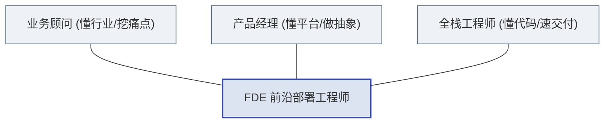
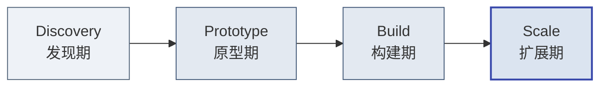

## 第1章 FDE是什么

> [!NOTE]
> **本章导读**：先把 FDE 这个概念本身讲清楚——它的定义与起源、"工程师×业务顾问×产品经理"的三重角色、与驻场外包和传统咨询的本质区别，以及为何在 AI 时代重新走红。读完本章，你能准确回答"FDE 到底是什么、不是什么"。

### 1.1 定义与起源

**战略意义**：在复杂的企业级To B与To G市场中，标准化产品往往难以直接解决客户核心痛点，而纯定制化开发又无法实现规模化盈利。FDE模式提供了一种在"非标痛点"与"标准平台"之间建立高带宽双向通道的战略解法。

**操作细节**：
FDE（Forward Deployed Engineer，前沿部署工程师）这一概念由硅谷大数据巨头Palantir Technologies首创。FDE并非传统意义上的后端开发或实施人员，而是**驻扎在客户现场的全栈工程师，负责将公司的核心平台深度定制化部署到客户特定的业务场景中**。

核心箴言（业界对 Palantir FDE 角色的**常见概括**，非官方逐字引文）：
> **“FDEs are the glue between our products and our customers.”**

> [!NOTE]
> **关于上面这句“箴言”的归属说明**：这句话在 Palantir 现有公开文档（官网、S-1/10-K、官方招聘页）中**找不到一字不差的原文**，它更接近业界对 FDE 角色的概括性描述。可溯源的官方表述（据 Palantir 官方 FDSE 招聘 JD）是：*"embedding talented engineers directly with our customers to tackle their most pressing challenges head-on"*（把有才华的工程师直接派驻到客户身边，正面解决他们最紧迫的挑战）。引用时请以下述 JD 原文为准。

FDE不仅要解决“代码怎么写”的问题，更要解决“业务需要什么代码”的问题。他们直接面对客户的杂乱数据、落后基础设施以及复杂的组织博弈，用最高效的代码手段在现场拉通系统、证明价值，并将通用性需求抽象提取，反哺给后方研发团队。

**辨析：FDE 到底是一个岗位、一支团队，还是一套方法论？**

这是学习 FDE 时最常见、也最该在一开始就厘清的困惑。答案是：**三者都是**——“FDE”这个词在业界（包括本教材）同时被用在三个抽象层级上，它们不是矛盾，而是同一概念随抽象层级递进的自然扩展：

| 层级 | FDE 指什么 | 典型语境 |
| :--- | :--- | :--- |
| **(a) 岗位 / 角色**（狭义，最初义） | Forward Deployed **Engineer**——一个具体的工程师职位 | “我们招 3 个 FDE”“他是一名资深 FDE” |
| **(b) 团队 / 组织模式** | 由 FDE、部署策略师、平台工程师等构成的特种交付团队及其组织形态 | “组建 FDE 团队”“FDE 的汇报线设计” |
| **(c) 方法论 / 交付范式**（广义，最重要） | Forward Deployed **Engineering**——一整套“平台 + 前沿部署 + 能力回注”的交付方法论与商业模式 | “转型为 FDE 模式”“FDE 飞轮” |

> [!TIP]
> **一个帮你秒懂的类比：FDE 之于交付，正如 DevOps 之于研发。**
> “DevOps” 既可以指一个岗位（DevOps 工程师）、一支团队，更是一套方法论与文化。当我们说“公司要做 DevOps”，指的是方法论；说“招个 DevOps”，指的是岗位。**FDE 完全同理——它首先是一套方法论（范式），其次才落地为团队与岗位。**
>
> **本教材教的是第 (c) 层。** 从书名《AI 时代的 FDE：认知、流程、团队与中国落地》即可看出，本书讲的是 FDE 从认知到落地的一整套**体系与商业模式转型**（内核是"从卖人力到卖能力"的飞轮），而非“如何当好一名工程师”。第 (a) 层（岗位能力）主要在第四篇团队篇展开，第 (b) 层（团队组织）贯穿全书。后文出现“FDE”时，请读者依语境判断它指的是哪一层——但**最核心的那一层，始终是方法论**。

> [!IMPORTANT]
> **无论 FDE 在哪一抽象层出现，其不可动摇的内核都是"工程师身份"。** 上面强调方法论（第 (c) 层）是本教材的主线，但必须立刻补上另一面：**(c) 层方法论之所以有效，正因为其执行者是能写生产级代码的真正工程师，而非咨询顾问或项目经理。** 方法论是“形”，工程师是“神”——把方法论交给不会写代码的角色去落地，它就会退化成 PPT 咨询；只有在工程师手里，FDE 才成立。这也是为什么 Palantir 官方用“人肉反向传播（the human equivalent of backpropagation）”来定位 FDE 方法论：平台的通用能力，像训练模型一样由一个个种子项目反复喂反馈、逐轮收敛而成——这套机制能运转的前提，恰恰是现场有一群真刀真枪写代码的工程师。

### 1.2 三重角色融合：工程师 × 业务顾问 × 产品经理

传统IT架构下，业务顾问负责调研，产品经理负责设计，工程师负责写代码。这种“流水线”分工在需求明确的成熟市场运作良好，但在极度复杂、需求模糊的前沿领域，信息在传递过程中会产生巨大的损耗。FDE的核心在于**“三位一体”的降维打击**。

*图：FDE 融合工程师、业务顾问与产品经理三重角色，三位一体实现降维打击*

1. **全栈工程师维度**：要求具备极强的系统集成、数据管道搭建、全栈开发及故障排查能力。在现场，FDE可能需要连接十年前的遗留ERP系统，编写复杂的数据转换脚本。
2. **业务顾问维度**：要求具备敏锐的商业嗅觉和沟通能力。不仅要听懂客户说出来的需求，更要挖掘出客户未表达出的深层痛点，并在客户内部复杂的部门利益间斡旋。
3. **产品经理维度**：要求具备“抽象思维”。FDE绝不是为了当前客户写死代码，而是思考：这个非标需求，未来能否固化为公司核心平台的一个标准组件？

**为什么三合一比分工更有效？**
在高度复杂场景下，沟通成本呈指数级上升。FDE通过单兵或小团队作战，将业务逻辑与代码实现的大脑合二为一，实现了“发现痛点即刻写代码验证，验证成功即刻转化为平台需求”的最短闭环。

> [!NOTE]
> **澄清：三位一体是 FDE"团队"的整体能力画像，而非要求每个 FDE 个人都是全能选手。** Palantir 的实际组织设计恰恰**不是**让一个人同时扮演三个角色，而是通过 **Delta（技术执行）+ Echo（业务策略）+ Dev（平台工程）** 的分工来实现三合一的效果。进一步说：对单个 FDE（尤其 Delta / FDSE），其核心仍是工程师——业务理解与产品思维是必备素质，但并非其主要角色；业务顾问维度更多由 Echo（Deployment Strategist）承担，平台产品维度由后方的 Dev 承担。这一澄清与 3.2 节的团队结构保持完全一致，也避免对一线 FDE 的能力预期过度拔高。
> **（注：这里的"三角色"是按"能力维度"分组——Dev 代表平台/产品维度；Palantir 一线**前线编制**的三角色（第3章 3.2）是 Delta + Echo + **Engineering（基础设施保障）**，Dev 属后方、Lead 属管理（第10章 10.1 有"三角色 vs 五角色"完整映射）。两种"三角色"口径不同：前者是能力维度、后者是前线编制，读者对照时请注意区分。）**

### 1.3 FDE ≠ 驻场外包 ≠ 传统咨询：本质区别辨析

认识 FDE，必须先立刻划清一条边界：**它不是驻场外包，也不是 IT 咨询。** 三者表面都“派人去客户现场”，但本质截然不同——用一句话概括这条分野，就是：

> **从“卖人力”到“卖能力”的转变。**

外包卖的是“人力”——按人天计费，人在价值在、人走价值走，公司沉淀不下任何资产；FDE 卖的是“能力”——每一次现场交付，都在为己方平台积累可复用的系统能力，卖出去的不是工时，而是**被平台不断放大的解决问题的能力**。

三者的核心差异可先用下表快速定位：

| 对比维度 | 驻场外包 | 传统咨询 | FDE |
| :--- | :--- | :--- | :--- |
| **核心交付物** | 客户定制的孤立系统 | 战略 PPT、方案文档 | 运行在生产环境的定制化系统集成 |
| **能力/IP 最终归属** | 归客户，公司无法复用 | 归咨询公司的方法论 | **回注到己方平台，越做越强** |
| **对己方的意义** | 赚人天差价（卖人力） | 赚咨询费（卖洞见） | **完善平台、驱动规模化（卖能力）** |

> [!CAUTION]
> 永远不要用人头计费模式（Time & Material）来衡量 FDE，这是扼杀 FDE 飞轮效应的毒药。FDE 的价值在于创造系统级资产，而非出卖工时。

**关于三种模式更深入的对比论证——包括 FDE 为何能兼得“高适配 + 高复用”、边际成本为何能一路下行（先高后低，从而支撑毛利率先低后高）、以及 FDE 为何极易退化成外包——将在 2.2 节的四模式全景对比中系统展开。** 本节只需先建立一个直觉：**判断一件事是不是真 FDE，就看这次交付结束后，“公司”这个主体的能力有没有增长——只有客户与公司双方能力都增长，才是 FDE。**

### 1.4 AI时代的FDE复兴

2023年生成式AI爆发后，包括OpenAI、Anthropic、Cohere等顶级大模型公司纷纷开始建立自己的FDE或前沿部署团队。

**为什么AI时代比以往任何时候都更需要FDE？**
因为大模型落地面临着难以逾越的**五大鸿沟**：

1. **模型≠产品**：API接口无法直接解决业务痛点，需要业务流编排。
2. **数据合规**：企业核心数据不能直接出域，需要现场进行复杂的数据脱敏与联邦架构部署。
3. **模型微调与工程**：RAG（检索增强生成）、Prompt调优需要深度结合客户专有知识。
4. **系统集成**：AI必须嵌入企业现有的CRM、ERP等系统中才能产生闭环价值。
5. **搁板软件风险**：没有人在现场推动变革，再好的AI系统也会被抵触情绪束之高阁。

在AI时代，FDE是拉近“参数规模”与“企业利润”之间距离的唯一桥梁。

> [!NOTE]
> **行业基准线——给 CXO 的决策依据**
>
> 据 Gartner 的预测（2025 年发布，见 Gartner 官网文章 `https://www.gartner.com/en/articles/ai-agents-pc1`）：到 2028 年，预计约**三分之一的企业软件应用将内置 AI Agent（Agentic AI）**，约 **15% 的日常工作决策将通过代理式 AI 自主做出**。
>
> - **这类行业基准线的用途**：对甲方而言，它是 CXO 判断“**要不要现在投入 FDE/AI**”的决策依据——如果行业整体正在朝这个方向迁移，那么“现在不投入”本身就成了一种有代价的等待；对乙方而言，它可以在售前作为**价值主张的锚点**，用可量化的基准线说明“客户为什么要为今天的能力建设买单”。
>
> - **引用纪律**：以上数字均为**预测值而非现状**，引用时务必标注**预测主体与时间点**（Gartner、2025），避免把“预计将发生”当成“已经发生的事实”来陈述；引用前也请复核 Gartner 官网最新版本。

### 1.5 FDE 如何工作：四阶段交付概览

前面几节回答了 FDE"是什么""三重角色""不是什么"。那么落到一个真实项目上，FDE 究竟是**怎么一步步把价值交付出来的**？答案是一套贯穿始终的**四阶段方法论**——这也是 FDE 交付最标志性的框架。

*图：FDE 四阶段交付——Discovery 发现、Prototype 原型、Build 构建、Scale 扩展，层层递进由点到面*

四个阶段层层递进、由轻到重、由点到面：

- **Discovery（发现期）**：不急着写代码，先深入客户业务，找准一个既有高价值、又可行的"快赢"切入点。
- **Prototype（原型期）**：用最小可行的架构，快速搭出一个能跑通、能演示的原型，用真实数据证明价值。
- **Build（构建期）**：把验证过的原型打磨成稳定、安全、可运维的生产级系统。
- **Scale（扩展期）**：从单个场景向全组织扩展，让系统沉淀为客户的"数字基础设施"，并把通用能力回注平台。

> [!TIP]
> **一句话记住四阶段**：**先找对问题（Discovery）→ 快速证明（Prototype）→ 做实做稳（Build）→ 放大复制（Scale）。** 这条主线，正是 FDE 把"现场定制"转化为"平台能力"的完整路径。
>
> 本节只勾勒轮廓；每个阶段的具体目标、操作步骤、交付物与阶段验收（Gate）清单等可落地的作战手册，将在**第三篇"四阶段流程 SOP"**中逐一展开。
>
> **（预告：1.2 节的三重角色只是能力画像——"FDE 团队由哪些角色构成"将在第四篇第10章展开为"五大角色"编制（技术执行/业务策略/平台工程/负责人/基础设施），并在第15–16章以 Echo（业务策略）与 Delta（技术执行）双视角讲解 AI 时代的落地。）**
