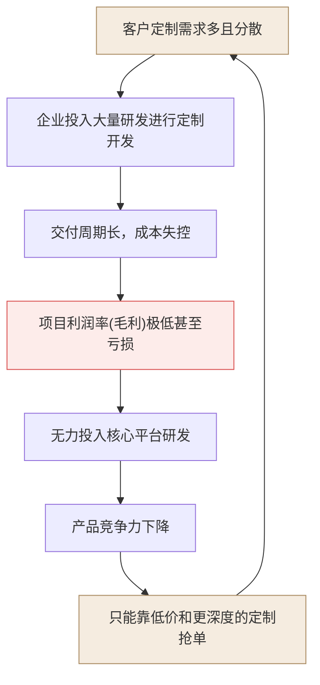
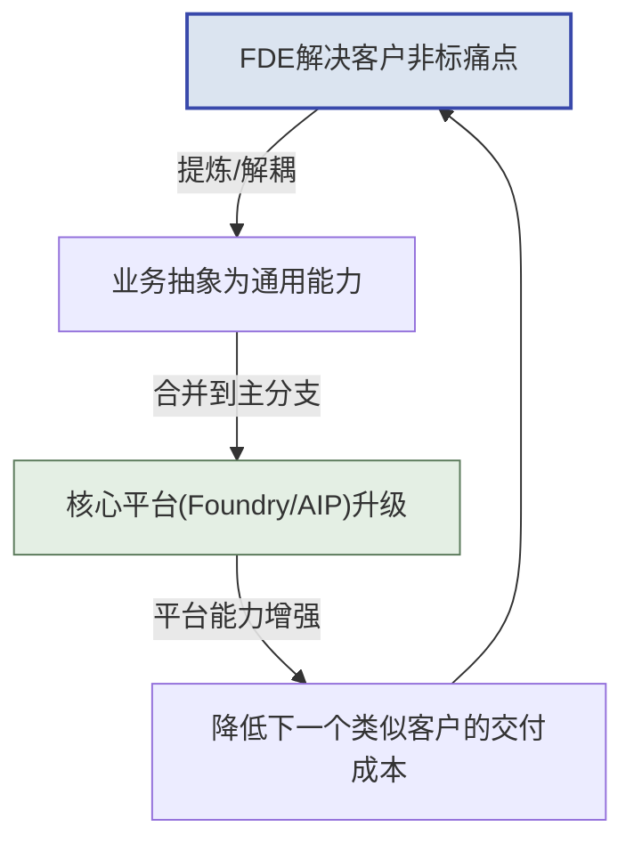
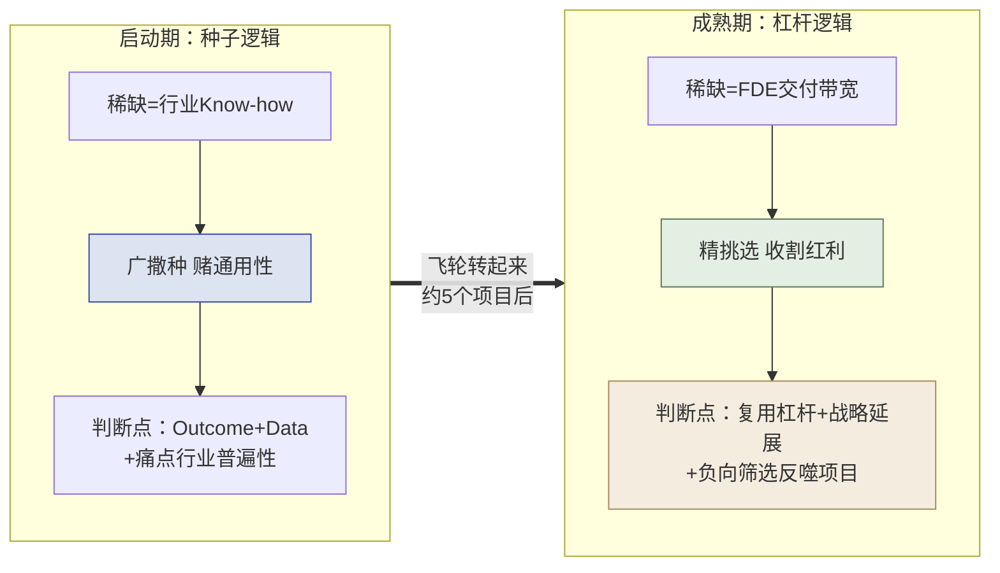

## 第2章 为什么需要FDE

> [!NOTE]
> **本章导读**：从"是什么"进到"为什么"。本章用经济学视角论证 FDE 的必要性——传统项目制为何陷入"死亡螺旋"、四种交付模式如何对比、FDE 靠"经验曲线/能力回注飞轮"如何实现边际成本递减，并用 Palantir 的真实财务数据（毛利率、净利率、NRR）验证这套逻辑。

### 2.1 传统交付模式的结构性困境

传统项目制交付往往陷入一种“死胡同”，在To B/To G行业尤为常见。

*图：项目制交付陷入"需求分散→定制→亏损→无力投平台"的自我强化死亡螺旋*

**为什么这是“结构性”困境，而非“管理不善”？**

很多陷入这个循环的公司，第一反应是“我们项目管得不够好”——于是加强 PMO、压缩工期、精细核算人天。但这些努力往往只能延缓、无法逆转下滑，因为问题**不在执行层，而在结构层**。逐环拆解这条螺旋，会发现每一步都是“局部理性、全局自杀”：

1. **需求分散 → 定制开发**：客户的需求真实且合理，销售为了签单必须接。局部看，接单是对的。
2. **定制开发 → 周期长、成本失控**：每个项目从头造轮子，没有可复用资产，成本随项目数**线性甚至超线性**增长。
3. **成本失控 → 毛利极低甚至亏损**：为了中标又不得不压价，利润被两头挤压。
4. **无利润 → 无力投入平台研发**：这是**最致命的一环**。没有利润，就没有钱投入到能“一次开发、多次复用”的核心平台上——而平台恰恰是唯一能打破线性成本的东西。
5. **无平台 → 产品竞争力下降 → 只能靠更低价、更深度定制抢单**：于是回到第 1 步，且每绕一圈，定制更重、毛利更薄、离平台更远。

> [!CAUTION]
> **死亡螺旋的残酷之处，在于它是“自我强化（self-reinforcing）”的。**
> 越是缺钱，越不敢投平台；越不投平台，就越只能靠人力堆定制；越堆定制，就越缺钱。这是一个正反馈的恶性循环——**单靠“更努力地做项目”永远走不出去，因为你越努力，螺旋转得越快。** 唯一的出路是从结构上切断某一环：要么容忍短期亏损、强行投入平台（Palantir 的选择），要么改变交付模式本身。

**一个典型的痛感场景**（一线读者大概率似曾相识）：
> 团队刚交付完 A 客户的定制系统，B 客户来了几乎一样的需求，但因为 A 的代码写死了字段和流程，几乎无法复用，只能推倒重来。于是同一类问题，团队解决了两遍、收了两份人天钱、却没沉淀出任何资产。第三个类似客户来时，团队依然要从零开始。**收入在增长，但公司什么都没积累下来——这就是项目制的本质陷阱：用规模换收入，却换不来资产。**

而FDE模式则致力于把这条恶性螺旋**反转为正向飞轮**：在现场解决问题的同时，将定制代码提炼为通用组件；下一个类似项目复用这些组件，部署速度更快、成本更低；成本下降带来的利润，再投入研发更强大的平台——**每绕一圈，成本更低、平台更强**（这个正向飞轮的经济学机理，将在 2.3 节详细展开）。

### 2.2 四种交付模式全景对比

要理解 FDE 模式的独特定位，最好的方式是把它放到四种主流交付模式的坐标系里对照。

| 维度 | 标准SaaS | 传统咨询 | 项目外包/定制开发 | FDE + 平台模式 |
| :--- | :--- | :--- | :--- | :--- |
| **客户适配度** | 低（客户需改变流程适应软件） | 高（定制化方案） | 极高（完全按需开发） | **高（平台底座 + 现场定制集成）** |
| **研发复用率** | 极高（100%同一套代码） | 中（复用分析框架） | 极低（每个项目从头造轮子） | **高（70%平台 + 30%定制组件回注）** |
| **边际成本趋势**| 趋近于零 | 线性增加（依赖高级人头） | 线性增加（依赖开发人头） | **先高后低、经验曲线式递减（幂律递减，通过平台沉淀）** |
| **毛利率趋势** | 高且稳定（70%-90%） | 稳定（40%-60%） | 低且脆弱（10%-30%） | **从低到高（项目级初期可为负，见 2.3 示意表；公司软件毛利率 2018 年约 50% 起步，见 2.4；成熟期 80%+）** |
| **商业模式** | 纯订阅制 | 咨询服务费 | 人天计费或固定项目费 | **高价值许可费（含平台授权与首期部署）** |

> [!NOTE]
> 上表行业毛利区间（SaaS 70–90%、咨询 40–60%、外包 10–30%）为**行业经验口径**，非精确统计或统一标准，对外引用时请注明"经验区间"。

**如何读懂这张表：FDE 凭什么“既要又要”？**

这张表最反直觉的一行是"客户适配度"与"研发复用率"——因为在传统认知里，**这两者是天然矛盾的一对**：

- **标准 SaaS**：一套代码服务所有客户，复用率 100%，但客户必须削足适履去适应软件（**高复用、低适配**）。
- **项目外包**：完全按客户需求定制，适配度极高，但每个项目从头造轮子，几乎零复用（**高适配、低复用**）。

绝大多数公司只能在这条对角线上二选一。而 FDE + 平台模式的全部精妙之处，就在于它**试图同时拿到对角线的两端**——用"**平台底座（保复用）＋ 现场定制集成（保适配）**"的分层结构破解这个矛盾：

- **底层 70% 靠平台**：数据引擎、本体层、通用组件是标准化的、跨客户复用的——这部分贡献了复用率。
- **上层 30% 靠 FDE 现场定制**：贴合每个客户的具体流程、数据、界面——这部分贡献了适配度。
- **而且这 30% 不是白写的**：其中的通用部分会被**回注**为平台能力，让下一个客户的“70% 平台”变成“75%、80%”——复用率本身是**动态上升**的。

> [!TIP]
> **一句话抓住四种模式的本质区别：**
>
> - **SaaS** 卖的是“标准品”——边际成本趋零，但触达不了复杂痛点。
>
> - **咨询** 卖的是“洞见”——交付 PPT 和方法论，但不落地为可运行系统。
>
> - **外包** 卖的是“人天”——完全定制，但公司什么资产都沉淀不下来。
>
> - **FDE + 平台** 卖的是“**被平台放大的解决方案**”——用标准底座承载定制交付，再把定制反哺回底座。**它是唯一一个“做得越多、平台越强、下一单越省”的模式**，这也是为什么只有它的边际成本曲线是“经验曲线（幂律）式递减”而非“线性增加”。
>
> （这四种模式在“卖什么”上的根本差异，正是 1.3 节所辨析的“从卖人力到卖能力”。）

这张表的最后两行（边际成本趋势、毛利率趋势）指向同一个结论：**FDE 模式初期看起来最像“低毛利的外包”，但它的成本结构从根子上就不同——成本是先高后低（越做越轻）、毛利率是先低后高。**

**正因如此，FDE 极易“退化”回外包——这是全书最重要的警示之一。**

上表清晰地把外包和 FDE 分在了两列，但在**真实的日常现场，两者几乎肉眼难辨**：都是派工程师驻扎客户现场、都在写贴合客户的代码、都在解决客户的具体问题。差异不在“当下做什么”，而在“**做完之后往哪走**”——是把通用经验抽象、沉淀回平台（FDE），还是写完就留在客户那里（外包）。正因为这个差异是“隐性的、面向未来的”，它极易在两种现实压力下被悄悄侵蚀：

1. **销售压力**：为快速签单，销售倾向承诺“客户要什么我们做什么”，FDE 被迫在现场写死大量一次性代码，无暇抽象回注（这也是 3.3 节强调 “FDE 不应汇报给销售” 的原因）。
2. **交付压力**：工期紧张时，“先把这个客户糊弄过去”永远比“多花 20% 时间把逻辑抽象成通用组件”更省事——于是回注被无限期推迟，FDE 事实上变成了外包。

> [!CAUTION]
> **一个自检信号：如果你的“FDE 团队”连续几个项目下来，平台能力毫无增长、每个新项目仍在重复造轮子、收入靠堆人头线性增长——那么无论它挂着什么头衔，它已经退化成了一支昂贵的外包队。**
> 这正是 1.3 节强调“永远不要用人头计费（Time & Material）衡量 FDE”的原因——人天计费会从考核机制上，把 FDE 一步步逼回外包的老路，掐断上表中那条本该越做越轻的成本曲线。

要真正理解这条"成本先高后低、越做越轻"的曲线（对应毛利率先低后高）为何成立、以及它背后的数学规律，就需要进入下一节的经济学原理。
### 2.3 FDE的经济学原理

FDE模式在经济学上遵循深刻的**经验曲线效应（Experience Curve Effect）**。
其公式表示为：

$$
C_n = C_1 \times n^{-\alpha}
$$

其中：

- $C_n$：交付第 $n$ 个客户的部署成本
- $C_1$：交付第 1 个客户的极高初始成本（此时FDE需要大量写非标代码）
- $n$：累计客户交付数量
- $\alpha$：学习率参数，由FDE团队将非标经验抽象回注给核心平台的速度决定。

把这个公式画成曲线，就能一眼看清 FDE 与传统外包的分野——**同样是做项目，一个越做越省，一个越做越贵**：

上图中，FDE 的成本随累计交付数 $n$ 按 $n^{-\alpha}$ 快速下坠（靛蓝凸降曲线），而传统外包因缺乏平台复用、每单从头再来，成本始终持平甚至因复杂度上升而抬头（琥珀上行曲线）。两条线之间不断张开的"剪刀差"，就是平台飞轮沉淀带来的**成本红利**——它随项目数增加而越拉越大（图中标注了第 1/5/10/20 个项目节点）。下面的数据表，正是这条曲线在几个关键节点上的具体展开：

**边际成本递减效应示例：**

| 项目次序 | 现场所需FDE人数 | 实施周期 | 核心平台覆盖度 | 现场定制代码量 | 项目级利润率（示意） |
| :--- | :--- | :--- | :--- | :--- | :--- |
| 第 1 个项目 | 5人 | 6个月 | 40% | 60% | -20% (战略亏损) |
| 第 5 个项目 | 3人 | 3个月 | 60% | 40% | +35% |
| 第 10 个项目 | 1.5人 | 1个月 | 80% | 20% | +65% |
| 第 20 个项目 | 1人 | 2周 | 95% | 5% | +85% |

> **表图对照**：上表四行与图中四个标注节点一一对应（第 1 个=高成本起步 → 第 20 个=个位数成本），读表时可回看图理解"成本下坠"的趋势；曲线与表格数值均为**示意**，非精确测量。

> [!NOTE]
> 上表为**示意性**的单项目核算（把 FDE 现场人力成本计入后，某个项目自身的盈亏）——它会随定制代码占比下降而由负转正，用来解释经验曲线的机理。这与 2.4 节 Palantir **公司整体毛利率**（软件毛利率，通常不为负）是两个不同口径，请勿混淆：项目级利润会因重人力投入而为负，公司软件毛利率一般不会。

*图：FDE经济学飞轮*

**飞轮如何从静止转起来：一个“先亏后赚”的加速过程**

上面的公式和曲线揭示了一个反直觉的规律：**FDE 模式的盈利能力不是一开始就有的，而是被“转”出来的。** 理解飞轮的启动过程，是理解整个 FDE 经济学的关键。

- **静止期（第 1-2 个项目）：飞轮最重，必须用力推。**
  此时平台还只有最通用的底层功能，**没有沉淀任何行业解决方案，没有可复用的行业模块**。因此第一批项目**必然是高定制、高投入的**——FDE 要在现场写大量非标代码（定制代码占比 60% 以上），交付慢、毛利为负。这不是执行失败，而是飞轮启动的**物理必然**：你必须先在泥泞里把路趟通一次，才谈得上把它修成公路。这几个“种子项目”当期是亏钱的，但它们真正的产出不是利润，而是**行业 Know-how 与可被抽象的经验**——这些才是喂养飞轮的燃料。

- **加速期（第 3-10 个项目）：共性显现，飞轮开始自转。**
  当同一行业的第 3、4、5 个项目做下来，FDE 会发现“这段清洗逻辑、这个预警模型、这套本体结构”在客户间反复出现。此时把它们抽象、回注为平台组件（$\alpha$ 学习率的体现），下一个同类项目的定制代码占比就降到 40%、20%……边际成本随之递减，毛利由负转正。

- **飞轮期（第 20 个项目以后）：势能积累，越转越快。**
  平台已沉淀出成体系的行业方案，新项目大量复用既有资产，定制代码降至个位数百分比（示意表中第 20 个项目为 5%），单个 FDE 可并行支撑多个项目，毛利趋于 SaaS 水平。**飞轮的重量没变，但它积累的动能已经让它自己转下去。**

> [!IMPORTANT]
> **启动期的判断逻辑：靠什么决定“接不接、做什么”？**
>
> 既然启动期没有可复用模块，那“这个项目值不值得做”就**不能用“平台复用度”来衡量**——那是飞轮转起来之后（成熟期）才有意义的指标。启动期真正该看的，是 Palantir 官方在《Delivering a use case》中给出的**结果导向（outcome-oriented）三要素**：
>
> 1. **Outcome（期望结果）**：这个项目最终能帮客户改善哪个**运营决策**、挂钩哪个核心 KPI？——先问结果，而非先问要建什么功能。这是价值的第一标尺，也决定客户的付费意愿。
>
> 2. **Data（数据可行性）**：从期望结果倒推所需的数据实体，评估现有数据能否支撑这个结果。
>
> 3. **痛点的行业普遍性**：这个痛点在**同行业其他客户**中是否普遍存在？——注意，这是“痛点是否普遍”（可通过行业调研**前瞻**判断），而非“我方能否复用现成模块”（启动期无从谈起）。痛点越普遍，这个种子项目未来喂养飞轮的价值越大。
>
> *来源：Palantir Foundry 官方文档"Delivering a use case"，原文三要素为 Outcome / Data / Tools。此处结合 FDE 商业语境，将偏交付执行的 “Tools（平台工具选型）” 替换为更适合入场决策的 “痛点的行业普遍性”——Tools 层面的工具选型将在第三篇 Prototype/Build 阶段详述。*
>
> 换言之：**通用性是被“训练”出来的结果，不是入场时筛出来的前提。** Palantir 官方将 FDE 方法论比作“人肉反向传播”——平台的通用能力，正是靠一个个种子项目反复喂反馈，一轮轮收敛而成。这也解释了 3.5 节"五次部署法则"的深意：共性要 5 个客户之后才真正清晰，过早标准化反而会把个例的偏见固化下来。

**飞轮转起来之后：承接选择逻辑的反转**

前面讨论的都是“飞轮如何启动”。但一个更深刻、也更常被忽略的问题是：**当飞轮真正转起来、平台已经沉淀出成体系的行业方案之后，承接项目的选择逻辑会发生一次根本性的反转。**

反转的根源，在于**稀缺资源变了**：

- **启动期**，最稀缺的是“行业 Know-how”——平台一无所有，所以要**广撒种、赌通用性**，判断点是 Outcome + Data + 痛点的行业普遍性（前瞻性地押注哪些赛道值得深耕）。
- **成熟期**，行业 Know-how 已不再稀缺（平台里全是），此时最稀缺的变成了**顶尖 FDE 的交付带宽**。于是承接选择的核心问题，从“这个项目值不值得亏钱做”，变成了“**在有限的 FDE 带宽下，哪些项目能最大化复用飞轮红利、又不反噬平台**”。

成熟期的承接判断，应从“结果导向”升级为“**资产杠杆导向**”，看以下四个点：

| 判断点 | 含义 | 启动期 vs 成熟期的差异 |
| :--- | :--- | :--- |
| **(a) 复用杠杆率（正向核心）** | 该项目能复用多少现成平台资产/行业组件？复用越高 → 边际成本越低 → 交付越快、毛利越高 | "复用度"终于成为**正当的入场指标**——但它是成熟期指标，绝非启动期门槛（这正是启动期悖论的另一面） |
| **(b) 战略延展性** | 项目落在已沉淀的成熟行业里（**收割型**），还是开辟一个新的、值得押注的赛道（**再播种型**）？ | 成熟期要有意识区分两类：收割型用杠杆逻辑评估，再播种型回到启动期的种子逻辑评估 |
| **(c) 是否反噬平台（负向筛选）** | 高定制、极特殊、通用性极低的孤岛需求，接了会占用稀缺带宽、诱导平台为个例妥协、破坏架构一致性 | **这是成熟期特有、启动期没有的判断点**——详见下方展开 |
| **(d) 人效贡献** | 该项目会拉高还是拉低团队人效（单个 FDE 可并行支撑的项目数）？ | 考核从“能不能交付”转向“人效是否健康增长” |

> [!IMPORTANT]
> **成熟期最关键的能力，是对“能做但不该做”的项目说不（负向筛选）。**
>
> 这是启动期与成熟期最深刻的一处反转，也是本节要讲透的重点：
>
> - **同一个高定制、通用性极低的孤岛需求**，在**启动期**可能因为“痛点行业普遍、值得赌”而应该接（它是喂养飞轮的种子）；但在**成熟期**，如果它无法复用既有资产、又不通向新赛道，就应该**坚决 Say No**——哪怕团队完全有能力把它做出来。
>
> - 原因是成熟期的机会成本变了：一个顶尖 FDE 投入到一个“只此一家、别无分号”的孤岛需求上，意味着放弃了 N 个能复用飞轮、快速高毛利交付的项目。更危险的是，为了迁就这个孤岛需求，平台团队可能被诱导做出破坏通用性的妥协，**反过来污染已经铺好的“铺装公路”**。
>
> - 这与 9.2 节"回注优先级矩阵"的判断完全同构：**左下角（低通用 + 高成本）的需求坚决不做，留作一次性项目定制、绝不并入平台**。承接选择与回注决策，在成熟期用的是同一把尺子。
>
> **一句话概括这次反转：启动期的智慧是“敢于为通用性亏钱”，成熟期的智慧是“敢于为通用性拒单”。** 前者怕的是错过种子，后者怕的是稀释资产。一个健康的 FDE 组织，必须同时具备这两种看似矛盾的勇气，并清醒地知道自己当前处在飞轮的哪个阶段。

*图：飞轮启动前后，项目承接选择逻辑的反转*

> [!NOTE]
> **换个视角问到底：乙方为什么愿意做投入更重的 FDE 模式？**
>
> 读到这里的读者大多默认“乙方案FDE理所当然”。但一个诚实的经营者会问：**重人力、重投入、启动期还亏损的 FDE 模式，乙方凭什么愿意做？** 答案是：**重投入换来的，是极高的“切换成本”（switching cost）。**
>
> 一旦客户的**业务逻辑被固化进系统、工作流真正跑起来**，客户便几乎无法迁移——换掉这套系统，意味着业务逻辑、数据血缘、人工习惯、流程依赖全都需要重来，代价远高于当初的采购价。这种“落地生根”带来的锁定效应，让 FDE 模式的公司拥有了**类似保险或公用事业的商业稳定性**（客户想走也走不掉、续约与增购可预期），同时又**兼具软件公司的毛利**（见 2.4 节）。外包恰恰相反：它卖的是一次性人力，人走价值走，客户没有任何切换负担，也谈不上稳定性。**稳定性与毛利兼得，才是“卖能力”而非“卖人力”真正打动乙方经营者的商业理由。**

**“飞轮真正转的到底是什么？”——乙方要同时盯住两个指标**

> 上文把飞轮描述成“能力回注→边际成本递减”，但很多乙方管理者容易把它误读成“多接项目、多回注、自然就转”。**这不是真正的飞轮。** 真正的飞轮，是下面**两个维度同步推进**，而不是单纯“多接项目”：
>
> 1. **价值维度**：交付给客户的结果价值，是否越来越大？（客户是否真的在用、真的因此变好、真的愿意为此增购）
>
> 2. **杠杆维度**：产品杠杆，是否让 FDE 交付这些结果变得越来越容易——**代码越少、时间越短**？（平台/组件被回注得越多、越通用，下一个同类交付就越轻）
>
> **两个维度缺一不可。** 只盯价值不盯杠杆，公司会退回“每次都用人力硬扛”的外包；只盯杠杆不盯价值，回注会变成“为了抽象而抽象”、与客户真实结果脱节的闭门造车。**只有当“结果价值越来越大”和“交付越来越容易”同步推进时，飞轮才算真的转起来**——这也是乙方判断自己是在做 FDE，还是只是在“多接项目”的试金石。

### 2.4 财务证据：从"低毛利外包"到"高盈利平台"

> [!NOTE]
> **时效性声明**：本节数据引自 Palantir（NASDAQ: PLTR）公开财报，**截至 FY2025（自然年 2025，财年截止 12 月）**。财务数据会随时间更新，读者引用前请自行核对最新财报——可访问 `https://stockanalysis.com/stocks/pltr/financials/` 查阅最新营收、毛利率与净利率口径（表中 2025 年 82.4% 毛利率、+36.5% 净利率、44.8 亿美元营收等数值均为 FY2025 时点数据）。

Palantir早年因投入大量FDE在客户现场，常被华尔街诟病为“一家伪装成SaaS的低毛利外包公司”。但随着FDE飞轮的转动，其财务数据实现了惊人的反转。这个反转分两个阶段发生——**先是毛利率爬升，再是盈利能力质变**：

**第一阶段（2018–2022）：毛利率证明"这不是外包"。**

| 财年 | 整体毛利率 | 核心驱动因素 |
| :--- | :--- | :--- |
| 2018 | ~50% | Apollo部署平台尚未成熟，FDE纯靠人力堆叠整合异构数据。 |
| 2020 | 68% | Foundry平台组件化加速，Apollo实现自动化跨网部署。 |
| 2022 | 78.6% | 行业本体论（Ontology）大规模复用，每个新增客户实施周期大幅缩短。 |

毛利率从 50% 爬到 ~80%，已经足以反驳"外包"论——外包的毛利率通常只有 10%–30%（见 2.2 节对比表）。

**第二阶段（2023–2025）：毛利率见顶后，飞轮威力转移到"盈利能力"上。**

到 2023 年后，毛利率稳定在 **80% 出头的高平台**（2023 年 80.6%、2024 年 80.3%、2025 年 82.4%），不再是看点。真正体现飞轮成熟的，是**经营利润率与净利率的转正与飙升**——这说明平台复用带来的规模效应，终于压过了 FDE 的人力投入成本：

| 财年 | 整体毛利率 | 经营利润率 | 净利率 | 营收（亿美元） | 营收增速 |
| :--- | :--- | :--- | :--- | :--- | :--- |
| 2022 | 78.6% | -8.5% | -19.5% | 19.1 | +23.6% |
| 2023 | 80.6% | +5.4% | +9.8%（首次转正） | 22.3 | +16.7% |
| 2024 | 80.3% | +10.8% | +16.3% | 28.7 | +28.8% |
| 2025 | 82.4% | **+31.6%** | **+36.5%** | **44.8** | **+56.2%** |

> [!NOTE]
> **数据来源**：Palantir（NASDAQ: PLTR）公开财报，经 stockanalysis.com / Fiscal.ai 整理，截至 2025 财年（自然年，FY 截止 12 月）。毛利率、经营利润率、净利率均为公开可查证数据。

**这张表最反直觉、也最有说服力的一点是**：2024→2025 年，Palantir 营收增速不降反升（从 +28.8% 跳到 +56.2%），同时经营利润率翻了近三倍（10.8%→31.6%）。一家体量已达数十亿美元的公司，还能同时实现"增长加速 + 利润率飙升"，这正是 FDE 飞轮进入成熟期的典型特征——**平台底座沉淀得越厚，新增收入的边际成本越低，于是规模越大反而越赚钱**（正是 2.3 节经验曲线的宏观兑现，也印证了 AIP 等 AI 能力让 FDE 用极少代码即可完成现场交付）。

**除了毛利/净利，还有两组数据直接印证了"落地生根、卖能力"的模式跑通：**

- **净收入留存率（NRR）——"从 1 个用例扩展到 N 个"的硬证据。** NRR 衡量老客户今年比去年多付了多少钱，大于 100% 说明老客户在持续增购、扩展场景。Palantir FY2021 总体 NRR 达 **131%**（其中美国商业 **150%**、政府 **146%**），FY2022 为 **115%**，2024 年回升至 **118%** 左右（FY2025 的 NRR 官方未单独披露，读者引用时以最新财报口径为准）。这组数字量化地证明了 FDE"先用一个快赢切入、再横向复制"的扩张逻辑真实有效（呼应 4.2 BP 案例的"落地生根"）。
- **单客户产出持续走高——规模化不是靠堆客户数，而是靠做深单客户。** Palantir 每个政府客户的年均收入从 2020 年的 **680 万美元**增至 2021 年的 **1000 万美元**；其 Top 20 客户的近十二个月平均收入，从 2024 年的 **6460 万美元**升至 2025 年的 **9390 万美元**。单客户越做越深，正是"卖能力"（而非按人头卖一次性项目）的直接体现。

> [!NOTE]
> 上述 NRR 与单客户收入均为 Palantir 官方财报/投资者材料披露的可查证数据，来源见附录 C。

> [!IMPORTANT]
> **对To B/To G技术服务商的启示：** 
> 早期容忍较低的毛利率并敢于向客户现场派驻顶尖人才（FDE），是获取行业Know-how和核心数据的必经之路。只要建立了“现场定制 -> 平台抽象”的坚实反馈管道，后期的规模化盈利就是水到渠成。Palantir 用了约七年（2018 的 50% 毛利、亏损 → 2025 的 82% 毛利、36% 净利率）走完这条路——**飞轮启动慢，但一旦转起来，回报是指数级的。**

### 2.5 真伪 FDE 鉴别清单

> 本节把 1.3 节的本质辨析，变成一份**可勾选的操作工具**——读者（尤其是甲方 BDM/TDM/HR）不再需要凭感觉判断“对方是不是真 FDE”，而是照着清单逐项核验即可。

**先看三档判定——核心看“做完项目留下什么”：**

| 维度 | 外包 | 项目制 | **真 FDE** |
| :--- | :--- | :--- | :--- |
| **做完项目留下什么** | 只留给客户一个**孤立系统** | 带回一些经验，但**无法复用**（经验留在个人身上） | **严格去掉客户信息后，把行业通用经验沉淀为可复用的模板 / Skill / 平台能力**，能显著降低下一个同类客户的交付成本 |

一句话：**外包留系统、项目制留经验（不可复用）、FDE 留可复用的平台能力。** 判断真伪，就看“项目结束、人离开现场之后，公司手里留下了什么”。

**8 条勾选鉴别项（真 FDE 应尽量满足）：**

- [ ] **① 交付结束后，公司能力是否增长？**——不只是客户受益，而是“公司”这个主体的可复用能力变强了（呼应 1.3 节的核心判定）。
- [ ] **② 是否有能力回注动作？**——识别（值得抽象的点）→ 抽象（解耦成通用组件）→ 集成（并入平台）→ 验证（确认可复用且不坏），形成闭环。
- [ ] **③ 是否按价值而非人头计费？**——报价挂钩结果/KPI，而非人天（Time & Material）；人天计费从考核机制上就会把 FDE 逼回外包（呼应 2.2 节 CAUTION）。
- [ ] **④ FDE 是否汇报给产品线而非销售？**——汇报线决定行为：汇报给销售会被“签单压力”裹挟成一次性外包（呼应 2.2 节与 3.3 节）。
- [ ] **⑤ 定制代码是否被抽象为可复用组件？**——不是写完就留在客户那里，而是其中通用部分被抽离、回注为组件。
- [ ] **⑥ 是否沉淀了 Playbook / SOP？**——把“这次怎么做的”固化成可复用的方法文档，而不是只留在个别工程师脑子里。
- [ ] **⑦ 离开客户现场后，系统是否仍能自运营？**——客户离开 FDE 后系统照常运转（而非人一退系统就瘫），说明交付物是“能力”而非“人”。
- [ ] **⑧ 人才是否是真工程师（能写生产级代码）而非咨询顾问？**——FDE 的内核是工程师身份（呼应 1.1 节）：真 FDE 写得出生产级代码；只会画方案、讲道理的，本质是咨询。

> [!CAUTION]
> **这份清单不是“全或无”的考试，而是一把诊断尺。** 现实中一个团队可能满足 6 条、卡在 1 条。卡住的那一条，往往就是它正在向外包退化的位置（尤其 ③④ 两条考核/汇报线，是退化的最优先入口）。甲方可据此评估供应商下限；乙方可据此做自诊断，提前堵住退化缺口。

> [!TIP]
> **给甲方的判读阈值（可操作版）**：**8 条中勾选 ≥6 条，且 ①②③④ 四条"硬指标"必须勾选**，才可认定对方是"真 FDE 倾向"；若"硬指标"中任何一条缺失（尤其 ③ 按价值计费、④ 汇报产品线），无论其余几条如何，都应视为"高退化风险"供应商——签约前优先核验这两条，因为它们是考核/汇报线层面的结构性保证，后天很难补齐。

> [!TIP]
> **本篇小结**
> 认知篇立起了全书的地基：FDE 不是驻场外包，而是"用平台承载定制、再把定制回注为平台能力"的一种交付范式，其本质是**从卖人力到卖能力**。它之所以成立，是因为一条经济学规律——能力回注飞轮让边际成本随规模递减，从而走出传统项目制的死亡螺旋。**但"飞轮"目前还只是一个原理；它在现实中究竟长什么样、由谁跑通？** 下一篇（标杆篇）将走进 Palantir——这套模式的发明者与集大成者，看它如何用平台、团队与方法论把飞轮真正转起来。

### 本篇收尾 · 甲乙方对照：什么是 FDE

> 中国 FDE 实践中，组织内部的**权责博弈往往比技术方案本身更复杂**——同一个词，甲方和乙方理解不同。收尾的这组对照，把认知篇最容易起分歧的三个问题，按“甲方怎么问、乙方怎么答”拆开。

**问题一：这和驻场外包有什么区别？**

- **甲方这么问**：“你们派几名工程师到我们现场写代码，这不就是驻场外包吗？怎么收费、按人天吗？”
- **乙方这么答**：区别不在“当下做什么”，而在“**做完之后留下什么**”——用 2.5 的三档判定回答：外包只留给客户一个**孤立系统**；项目制带回一些**无法复用的经验**；真 FDE 则严格去掉客户信息，把行业通用经验**沉淀为可复用的模板 / Skill / 平台能力**，并显著降低下一个同类客户的交付成本。**所以我们也反对按人头计费——我们卖的从来不是工时，而是被平台放大的能力。**

**问题二：你们为什么投入这么重？**

- **甲方这么问**：“为什么你们要派这么多顶尖工程师、做这么重的现场投入？成本是不是都摊到我头上了？”
- **乙方这么答**：重投入换来的是**极高的切换成本**——您的业务逻辑一旦固化进系统、工作流跑起来，就几乎无法迁移。这让 FDE 模式公司拥有了类似保险/公用事业的**商业稳定性**，又兼具软件公司的**毛利**（见 2.3、2.4 节）。我们愿意重投入，是因为我们卖的**不是一次性的人力，而是可持续的能力**——您的系统落地生根、越用越离不开，我们也越做越省。这是双赢，不是把成本转嫁给您。

**问题三：我怎么知道你们是真 FDE，不是换牌子的外包？**

- **甲方这么问**：“市面上一堆公司都自称 FDE，我怎么判断你们是真材实料，还是把外包换个 AI 的壳？”
- **乙方这么答**：请直接用 2.5 的**鉴别清单**逐项核验（8 条勾选项）：能力是否增长、是否有回注动作、是否按价值而非人头计费、汇报给产品线还是销售、定制代码是否抽象为可复用组件、是否沉淀 Playbook/SOP、离开现场后系统能否自运营、人才是否真工程师。同时您有权向我们要**回注证据**——即“这次交付之后，你们的平台新增了哪些可复用的组件 / Skill / 模板”，拿不出这些证据的“FDE”，请谨慎对待。

> **收尾悬念**：识别“什么是 FDE”只是第一关。真正难的下一关是——**一个项目到底算不算“做成了”，由谁来定义？甲方和乙方的答案往往不一致。** 这个“结果定义权”的分歧，将作为流程篇（SOP 与验收）要正面解决的起点。
