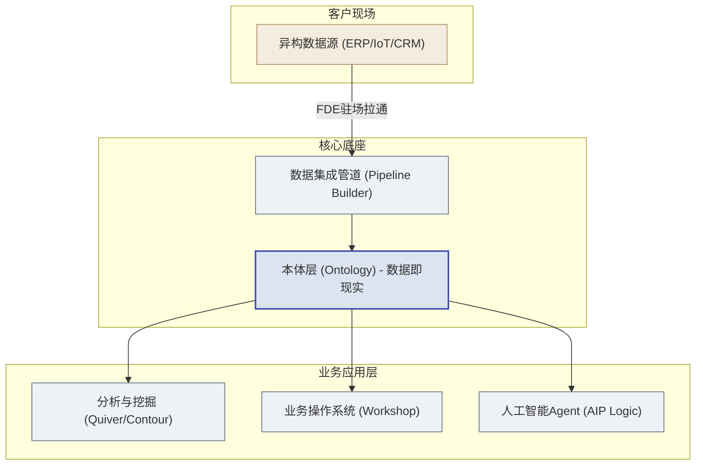
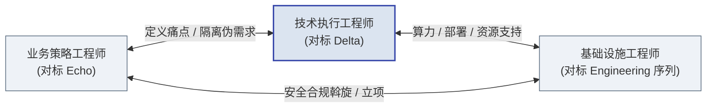

# 第二篇：标杆篇 — Palantir FDE深度解剖

> [!NOTE]
> **本篇导读**
> FDE 模式由 Palantir 首创并跑通，它是全球最值得对标的标杆。本篇拆解 Palantir 的 FDE 体系：第3章讲它的"武器库+作战单元+治理+方法论"（平台、团队、汇报线、碎石路→铺装公路、五次部署法则），第4章用空客、BP、NHS、财富500强、美国陆军五个真实案例印证这套体系如何在战场发挥威力，并用 People–Process–Technology 框架做统一透视。**本篇的目的不是让你崇拜 Palantir，而是提炼出可被中国厂商对标复现的底层机理。**

## 第3章 Palantir的平台与FDE体系

> [!NOTE]
> **本章导读**：一支能打胜仗的 FDE 队伍，需要四样东西层层就位：**先得有趁手的武器——强大的平台底座；光有武器不够，得有对的人组成特种作战单元；而这支队伍归谁指挥，决定了它会不会变质、沦为外包；最后，还得有一套把"现场定制"沉淀为"平台能力"的迭代哲学与作战纪律。**
> 武器、人、治理、方法论——这四者恰好对应 People–Process–Technology 三要素：平台是 Technology，团队与治理是 People，迭代哲学与纪律是 Process。

### 3.1 武器库：三大平台架构 Gotham / Foundry / AIP

FDE的强大离不开其背后的武器库。没有强大底座支撑的FDE，最终都会沦为堆砌代码的外包民工。**所以理解 FDE 体系，第一步是理解它手里握着什么武器。**

1. **Gotham（国防与情报平台）**：主攻强对抗、低带宽、极高安全密级的场景（如军方、反恐、情报网）。FDE在此场景下负责连接异构情报源，在战区甚至无网环境下部署节点。
2. **Foundry（企业级数据操作系统）**：主攻商业世界（制造业、金融、医疗）。它不是传统的数据仓库，而是一个业务闭环系统。
3. **AIP（人工智能平台）**：将大模型直接接入客户的企业本体数据库，实现自然语言驱动的分析和决策建议。

**Foundry 核心模块详解（FDE的乐高积木）：**

| 模块名称 | FDE用途 | 从手工向自动化的进化 |
| :--- | :--- | :--- |
| **Pipeline Builder** | 构建异构数据清洗与融合管道 | 早期FDE写几千行Spark脚本；现在直接用可视化界面配置。 |
| **Ontology (本体层)** | 将死数据转化为业务对象（如“飞机”、“订单”） | FDE的核心工作从“建数据库表”变成了“构建业务对象的物理关系图”。 |
| **Object Explorer** | 面向业务用户的拖拽式搜索探索工具 | 让不写代码的分析师能直接过滤与查看数据，替代定制前端。 |
| **Contour** | 亿级数据的无代码可视化数据探索 | 降低FDE写SQL或BI仪表的频率。 |
| **Quiver** | 时间序列数据的高级关联分析（如金融走势） | 解决大量复杂的数学推演问题。 |
| **Code Workbook** | 将Python/R/SQL代码化作为分析流 | 使分析具有高度复用性，告别孤立的Jupyter Notebook。 |
| **Workshop** | 快速构建面向最终用户的操作应用 | 替代了早期FDE必须手写React/Vue前端的低效工作。 |
| **AIP Logic** | 编排大语言模型与业务逻辑 | 让FDE可以通过配置而不是深度编码，构建企业级Agent。 |

*图：Palantir 平台五大层级：数据在管道清洗融合后进入本体层，支撑业务应用与 AI。*

在被上表与上图反复点名的 **Ontology（本体层）** 上，值得停下来看一个具体的、可复现的例子——因为它是"为什么 Ontology 比传统数据平台更强"最直观的现场演示。

> [!NOTE]
> **Ontology 的现场价值：航空制造里的"触网式"联动**
>
> 设想一家航空制造企业。FDE 的第一步不是建一堆表，而是**把业务实体固化成 Ontology**：飞机机尾号、紧固件、装配工位、质检员，以及它们之间的关系——"某紧固件 装配于 某工位""某工位 属于 某飞机""某质检员 质检 某工位"。这些对象和关系一经固化，整个工厂的物理世界就被翻译成了可操作的数字结构。
>
> 现在发生一个突发事件：某批次紧固件在海关被卡住。在传统方式下，要搞清楚"这会波及哪些飞机"，需要**写极复杂的 SQL、跨越零件表、工位表、机身表、订单表多次 JOIN**，才能辛苦地追溯到这条血缘关系——等算清楚，总装线往往已经停摆了。
>
> 而在 Ontology 面前，这层关系早就结成了"网"。系统像触网一样**瞬间联动**，直接在屏幕上**标红所有受影响的飞机**——因为"这批紧固件 → 装配的工位 → 归属的飞机"本身就是本体里现成的边，无需任何联表查询。业务人员看到的不是一张 SQL 结果表，而是红点在飞机构型图上的直接点亮。
>
> **点题**：这就是 Ontology 作为**语义层**的价值——它的本质是"用数据连接现实世界的业务对象、关系与决策流程"。Ontology 不是一个被动的数据模型，而是**可操作的业务数字孪生**：数据（企业事实）、逻辑（可复用的规则与衍生关系）、操作（Writeback 等动作，见 4.4 节）三大要素齐备，而**安全性贯穿其中**（谁能看到哪架飞机、谁能对哪批零件执行操作，都由权限与审计约束）。理解这一点，是读懂 Palantir 乃至一切"语义层型"平台的第一步。
>
> **（注：Palantir 官方文档的表述为"语义要素（对象/属性/关系）+ 动能要素（动作/函数/动态安全）"两大类（见附录 B-4）；本教材为便于一线理解，将其拆解为"数据/逻辑/操作"三要素，属教材提炼口径，两者所指一致。）**

> [!NOTE]
> **正视听：我们能直接买 Palantir 吗？——据公开信息，它不进中国市场**
>
> 这是甲方在和 FDE 团队打交道时最常问的问题："你们研究 Palantir，那我们能不能直接买一套？" 需要正面、坦诚地回答：**据公开信息，Palantir 不进中国市场**，国内几乎没有合规采购它的现实通道。因此，国内团队研究 Palantir，本质是在**研究方法论**——它让我们管理的不是"购买某个产品"，而是"复现一套可落地的方法"。
>
> 在国内要做出类似效果，通常需要一路"拼装"出组合拳：**国产数据平台（底座）＋ 自建语义层（Ontology 的国产化复刻）＋ 业务侧驻场团队（FDE 的国产化形态）**。这三者在第 13 章（阿里 / 华为 / 腾讯 / 火山等大厂的实践）都能找到对应的落地样本，这也是本书把"中国实践"单列成篇的原因。
>
> 但这里藏着一个必须提前想清楚的提醒：**Ontology 一旦建好，业务语义层就会绑定在平台的私有形态上**——在 Palantir 那里，它绑定的是封闭的 Foundry。国内团队在复刻时若不加规划，同样会把自己绑在某家国产平台的私有形态上。因此落地前就要规划好"**FDE 的经验如何沉淀为可迁移的资产**"，让它沉淀为 Skill、模板与通用方法论（呼应第 9 章"能力回注"），而不是把一摞绑定平台的定制代码留在客户那里、永远靠堆人维护。**避免陷入"永远在堆人"的困局，甚至比技术选型本身更接近成败。**

### 3.2 作战单元：团队结构（技术执行 / 业务策略 / 基础设施）

有了武器库，接下来的问题是**谁来使用它**。在客户现场，单纯派出一名写代码的工程师是不够的，必须形成特种作战小组——这三类角色，正是 People 维度的核心配置。

*图：三角色谱系中，技术执行工程师（Delta）是核心作战力量。*

1. **技术执行工程师（对标 Delta，即狭义的 FDE / FDSE）**
    - **定位**：尖刀，核心战斗力。享有极高的战术自主权。
    - **职责**：编写代码，打通数据，构建本体模型，开发前端应用。他们对技术产出的最终质量和速度负责。
2. **业务策略工程师（对标 Echo）**
    - **定位**：政委与导航员。挖掘高管真实意图，定义 FDE 要优先攻击的"高价值痛点"，并保护尖刀不陷入客户无穷无尽的"假需求"泥潭。
    - **说明**：这一角色最易被误解，下方专门厘清它与传统客户经理的本质区别。
3. **基础设施工程师（对标 Engineering 序列，如 SRE / Enablement Engineer）**
    - **定位**：阵地保障。
    - **职责**：解决网络隔离、防火墙穿透、私有云部署、数据安全合规加密等偏向系统底层运维的问题。

> [!IMPORTANT]
> **重点厘清：业务策略工程师 ≠ 传统的客户经理 / 行业专家 / 售前。**
>
> 它和传统客户经理表面都在"和客户谈、挖痛点"，但本质完全不同。
>
> **先看 Palantir 官方对这一角色（Deployment Strategist）的定义**（据 Palantir 官方招聘 JD）：它属于独立于工程师序列的 **Echo 序列**，核心使命是"把客户的模糊直觉变成现实"——*综合零散的信息流，判断出最重要的问题是什么、数据意味着什么、产品需要什么、用户被什么驱动、影响力在哪里*。官方 JD 明确要求该角色**具备编程/脚本能力（Python/R/SQL）**，日常职责包括：识别相关数据集、**与技术执行工程师协作把数据集成进管道**、为新用户群构建定制工作流、主导培训、向从分析师到 C-suite 的各层级汇报，并**把现场所见回嵌到平台产品中**。
>
> 由此可见，它与传统客户经理有着本质区别：
>
> | 维度 | 传统客户经理 / 行业专家 | 业务策略工程师（Deployment Strategist） |
> | :--- | :--- | :--- |
> | **懂不懂技术** | 通常不懂，只做业务翻译 | **懂技术**——官方 JD 硬性要求 Python/R/SQL 能力，需与 FDE 协作做数据集成 |
> | **核心产出** | 需求文档、关系维护 | **判断"最重要的问题是什么"并推动落地**——把模糊直觉综合成可执行的问题定义 |
> | **对落地负责吗** | 提完需求就交棒，不对结果负责 | **全程陪跑**——从识别数据、构建工作流、培训用户到回嵌产品，对最终业务影响负责 |
>
> 一句话：**客户经理是"把客户的话带回来"（信息传递者），业务策略工程师是"判断哪些问题最值得解决、并亲手推动它落地"（问题定义者 + 落地推动者）。**
>
> 还有一条边界值得强调：**业务策略工程师定义"做什么、值不值得做"，但不承担签单与定价的压力。** 这与 3.3 节"FDE 团队不应向销售汇报"是同一条逻辑——一旦让定义问题的人同时背商务指标，他就会倾向"客户要什么答应什么"，把团队拖回卖人力的老路。因此，定价与合同应由独立的商务角色承担，与业务策略工程师隔离。

这套编制的精妙，藏在两条看似矛盾、实则互补的线里——**先解耦、再整合**。

**第一条线：分工解耦——让最强的战斗力，只打最该打的仗**

三个角色的边界必须清晰、互不越界，其根本目的只有一个：**把技术能力最强的人（技术执行工程师）从一切非核心事务中解放出来，让他专注于最高价值的业务逻辑与代码。**

- 业务策略工程师**向前**挡住客户的人际博弈与"假需求"，不让尖刀陷入无意义的会议和低价值定制；
- 基础设施工程师**向下**扛住安全合规、网络配置、部署运维这些"脏活累活"，不让尖刀分心于底层环境；
- 于是技术执行工程师**居中**，得以把全部精力压在"发现痛点→写代码验证→沉淀为平台能力"这条主价值链上。

> [!TIP]
> **通用借鉴点**：对任何希望转型 FDE 的技术服务商，这套解耦逻辑都值得直接照搬——**不要让你团队里代码能力最强的人，把时间耗在客户关系维护、环境搭建、合规文书上。** 这些事重要，但应该由专门的角色承担；让尖刀去干杂活，是对最稀缺资源的最大浪费，也是团队从"精兵"退化为"人海"的开始。

**第二条线：战斗力整合——解耦不是各自为战，而是为了更好地合力**

分工清晰绝不意味着三人各干各的、隔墙抛砖。恰恰相反，解耦的目的是让他们能作为**一个紧密咬合的战斗单元**协同发力——上图的三条双向箭头，正是三者之间高频、实时的互相支撑：业务策略与技术执行之间"一个指方向、一个开炮"，实时对齐痛点与实现；技术执行与基础设施之间"一个提需求、一个即时保障"，让落地不被环境卡住；业务策略与基础设施之间则并肩扫清合规与立项的组织障碍。三条线同时高速运转，小组才成其为一个整体。

**一句话概括这套哲学：解耦是手段，整合是目的。** 通过让每个角色只做自己最擅长的事（分），再让三者高带宽咬合成一个整体（合），FDE 小组才能以极小的编制，在复杂客户现场打出远超人数的战斗力——这正是本节开篇所说"特种作战小组"的真正含义。

### 3.3 归谁指挥：FDE 的汇报线设计

组建了作战单元，紧接着一个决定"这支队伍会不会变质"的关键问题浮现出来：**FDE 到底归谁管？**

> [!NOTE]
> **先厘清一个层级区别**：上一节（3.2）讲的是 FDE 小组**内部**的角色分工（谁写代码、谁管客户、谁管环境）；本节讲的是完全不同的另一层问题——**FDE 这支小组作为一个整体，在乙方公司的组织架构里，应该挂靠在哪个部门下、向谁汇报。**
> 因此，下表中的"产品/研发""销售/区域""工程/实施"**不是 FDE 团队内部的角色**，而是乙方公司里位于 FDE 团队**之上**的三个候选归属部门。选错了上级部门，再精良的作战小组也会被带偏。

这是组织架构设计的核心难题——不同的汇报线，会直接决定 FDE 团队的基因，是"卖能力"还是退回"卖人力"（见 1.3、2.2 节）。

| FDE 团队挂靠的上级部门 | 优势 | 劣势与隐患 | Palantir的最佳实践 |
| :--- | :--- | :--- | :--- |
| **汇报给产品/研发**（推荐） | 确保"现场经验"无损反哺给"平台研发"；FDE有技术归属感，最利于能力回注和平台演进。 | 可能导致对销售支持不足，短期收入受影响。 | 强耦合产品线，FDE视为产品研发的前延探针。 |
| **汇报给销售/区域** | 极致的客户响应速度；直接对营收数字负责。 | **致命隐患**：销售为拿单会逼迫FDE过度承诺，偏向扩充营收，FDE沦为低级定制外包。 | 坚决禁止。FDE不对签单本身承担首要KPI。 |
| **汇报给工程/实施** | 交付流程规范化；利于代码质量把控。 | 容易演变成传统的“软件实施外包中心”，产生部门墙。 | 作为过渡形态，必须设置极强的技术双线汇报。 |

#### 3.3.1 汇报线转型过渡方案（给中国乙方）

3.3 的方向是"汇报给产品/研发"，但对中国企业（尤其从项目制交付转型的乙方），**一步切换到产品线几乎不可能**——参考第13章中国云厂商实况（阿里 TAM 挂靠客户成功/事业部、华为铁三角三方制衡、腾讯 OTSS 挂靠事业群），汇报线调整普遍需要 1–2 年渐进完成。建议按三阶段过渡：

| 阶段 | 时间 | 做法 | 关键动作 |
| :--- | :--- | :--- | :--- |
| **阶段 1：双线汇报** | 6–12 个月 | FDE 团队行政上仍归属原部门（销售/项目部） | 技术路线、能力回注、平台需求改由产品线 dotted-line 管理；设立"产品 + 原部门"联合评审会，回注需求与平台优先级在此对齐 |
| **阶段 2：虚拟独立** | 12–24 个月 | FDE 团队成为独立虚拟组织 | 绩效改由产品线主导评定；销售/项目部仅保留商务对接权；回注产出正式计入产品线路线图 |
| **阶段 3：正式独立** | 24 个月+ | FDE 正式划归产品/研发体系 | 完成组织归属调整；沉淀的 Playbook 与回注机制随组织固化 |

> [!IMPORTANT]
> **过渡期最容易退回外包**：阶段 1 中销售仍握有行政权，若没有联合评审会兜底，FDE 会继续被"签单需求"绑架。判据很简单——**看回注需求卡片（SOP 4）的通过率**：若半年内提交的回注卡片全被销售压着不发，说明过渡失败，需把 dotted-line 权限升级为硬约束。

至此，武器（平台）与人（团队 + 治理）都已就位。但真正让 FDE 区别于外包的，不是有平台、有团队，而是**一套把"现场一次性定制"系统性沉淀为"平台通用能力"的方法论**——这就是接下来两节要讲的 Process 维度：迭代哲学与作战纪律。

### 3.4 迭代哲学：从"碎石路"到"铺装公路"

Palantir内部有一个著名的产品哲学：**“From Gravel Roads to Paved Highways”**（据 Palantir 公开演讲与二手访谈对该理念的阐述，非官方文档逐字表述）。它回答了一个核心问题——**FDE 在现场写的定制代码，如何才能变成平台的标准能力？**

- **碎石路（Gravel Road）**：面对全新的客户场景，平台尚无标准功能。FDE在现场使用Python脚本、脏代码、非标准集成，甚至连夜打补丁，以最快的速度把路“趟”出来，证明业务价值。这叫走碎石路。
- **铺装公路（Paved Highway）**：一旦发现多个客户都需要走这条碎石路（例如：都需要清洗某家特定供应商的乱码数据，或都需要某类供应链预警模型），后方产品团队就会将其重构为产品里的一个标准配置项（即铺装公路）。今天客户A的定制代码，成为明天平台的一个配置项，更是后天所有客户的标准能力。

> [!WARNING]
> **反面模式：拒绝过早标准化**
> 如果连一条“碎石路”都没走通，研发就在后方凭空想象修建一条“铺装公路”，往往会造出没人用的“搁板软件”。只有FDE在泥泞里证明了价值，标准化才有意义。

需要说明的是，"碎石路→铺装公路"是一个**理念层面的比喻**——它讲清了"为什么要把定制沉淀为平台能力、方向是什么"。而落到操作上，这个理念可以拆成一条清晰的四步链路：

> **识别 → 抽象 → 集成 → 验证**
>
> - **识别**：在现场发现"这段定制，别的客户可能也需要"的重复信号；
>
> - **抽象**：剥离客户特定的硬编码，把它提炼成可配置、可复用的通用模式；
>
> - **集成**：由平台团队将其正式并入产品主干，成为标准能力；
>
> - **验证**：在下一个客户身上复用它，确认通用性真正成立。

这四步就是把"碎石路"铺成"铺装公路"的施工流程。**本篇作为概念篇，点到这一层即可；至于每一步由谁负责、如何抽象才不污染平台、如何度量回注成效等可落地的操作细节与配套工具，将在第9章"能力回注方法论"中完整展开。**

### 3.5 作战纪律：五次部署法则

"碎石路→铺装公路"讲的是**方向**，而"何时该动手铺路"则需要一条**纪律**来把关——这就是五次部署法则。Palantir对于将FDE的定制经验转化为标准产品有一条铁律：**在成功完成至少5个不同客户的部署之前，不要过早试图写出固定的Playbook或标准产品。**

> [!NOTE]
> **关于"五次部署法则"的归属说明**：该"法则"为本教材**据 Palantir 公开实践（创始人/高管演讲、一线 FDE 二手访谈）提炼总结的作战纪律**，并非 Palantir 官方文档中逐字出现的术语——Palantir 官方更常以"先走通碎石路、共性清晰后再标准化"的表述出现。读者如需溯源，请以 Palantir 官方博客/财报电话会表述为准；教材将其"法则化"，是为了让一线可执行。

- **阶段1（1-2个客户）**：早期试图编写固定Playbook往往会把无法扩展的个例固化下来，这些经验都带有强烈的“特定客户偏见”。
- **阶段2（3-4个客户）**：模式开始显现，FDE开始主动在客户间复用部分脚本代码。
- **阶段3（5个以上客户）**：共性彻底清晰。此时由核心研发团队介入，将FDE的组件重构为平台的原生架构。

> [!NOTE] 
> **合理负荷管理**
> 一名顶尖FDE同时并行的负荷极限是1-2个大型企业级客户。超过此限制，FDE就会退化为只负责应付催度的“接线员”，失去深度思考和重构代码的时间。

### 3.6 全球视野：非 Palantir 的 FDE/类 FDE 实践对标

FDE 并非 Palantir 独有，而是正被整个企业 AI/数据平台行业广泛采用的交付范式。理解这些对标对象的异同，能让读者看清 FDE 的普适内核，避免"唯 Palantir 论"。下表列出手法相近、但各有侧重的几家代表：

| 公司 | FDE/类 FDE 模式特点 | 与 Palantir 的差异 |
| :--- | :--- | :--- |
| **Anduril** | 国防科技 FDE，硬件+软件深度集成，工程师需到军事环境现场部署 | 更强调物理环境部署（传感器、无人系统），且需要安全许可；交付对象多为政府/军方 |
| **Scale AI** | 数据标注 + AI 基础设施 FDE，面向 AI 实验室与政府客户 | 更聚焦 ML Pipeline、数据标注与 RLHF 工作流，而非通用业务平台 |
| **Databricks** | Field Engineering / Solutions Architect，帮客户在 Lakehouse 上构建数据产品 | 更偏数据工程与 ML 场景；平台偏开源生态，回注对象是开源组件而非封闭平台 |
| **OpenAI / Anthropic** | 2023 年后新建的 Applied Engineering / 解决方案团队，主打大模型落地 | 更聚焦 Prompt Engineering + RAG + Agent 编排，承载的是模型平台而非数据平台 |

> [!IMPORTANT]
> **共同的底层机理**：这些公司尽管领域、平台各异，但共享 FDE 的三个内核——**① 派遣真正的工程师贴近客户解决问题；② 把现场定制抽象沉淀回平台/产品；③ 通过验证复用驱动飞轮**。恰恰印证了第 3 章开头的判断：FDE 的骨架是"工程师本位 + 能力回注 + 平台承载"，与 Palantir 无关，而与"卖能力而非卖人力"的商业模式同构。

至此，Palantir 的 FDE 体系全貌清晰了：**Technology（平台武器）+ People（团队与治理）+ Process（迭代哲学与纪律）**，三者缺一不可、互相咬合。下一章将通过五个真实案例，看这套体系在战场上如何发挥威力。
