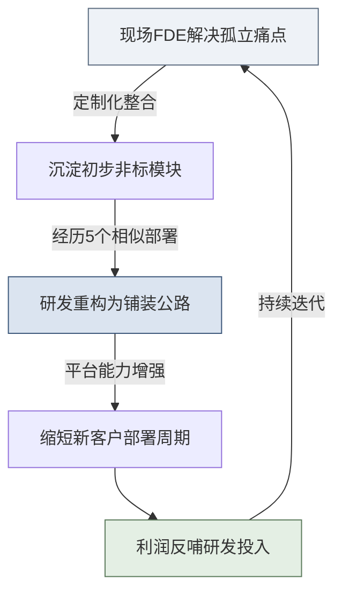
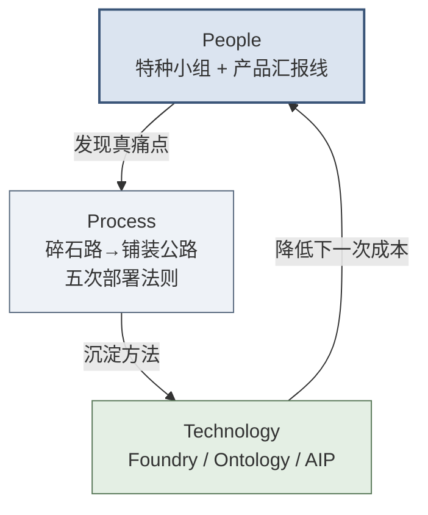

## 第4章 Palantir经典案例集

> [!NOTE]
> **本章导读**：用空客、BP、NHS、财富500强、美国陆军五个真实案例，印证第3章讲的 FDE 体系如何在战场发挥威力——每个案例按统一的"背景挑战 → FDE做了什么 → 核心成果 → 能力回注"四段式解剖，并提炼给读者的方法论启示；结尾再补两个国产场景的教学案例，提供非 Palantir 的对照视角（综合提炼、非特指真实项目）。**读完本章，你能从真实战例中提炼出可复现的 FDE 打法。**

本章通过真实场景，剖析FDE如何将平台能力与客户特定难题结合。每个案例遵循统一的四段式解剖框架——**背景挑战 → FDE做了什么 → 核心成果 → 能力回注**，并在末尾提炼**给读者的方法论启示**。

> [!NOTE]
> **关于数据严谨性的说明**：本章案例中，凡涉及具体量化数字，仅保留有公开来源可查证的部分；无法查证的量化结论，采用“显著”“数周级”等定性表述，避免以精确假数字误导读者。案例的核心价值不在于记住某个数字，而在于理解 FDE「解决孤立痛点 → 沉淀平台能力」的作用机理。

### 4.1 Airbus空客 — 制造业供应链（Foundry / Skywise）

**背景挑战**：
制造一架 A350 宽体客机，需要来自全球数千家供应商的数百万个零部件协同到位。空客当时面临严峻的产能爬坡（ramp-up）压力：不同工厂、不同产线的 ERP、MES（制造执行系统）、PLM（产品生命周期管理）以及供应商 EDI 数据，分散在数十个互不连通的遗留系统中，数据编码标准不一、口径各异。当某个供应商延期时，图卢兹总部很难快速判断哪些飞机的总装环节会因此受阻——问题往往在停线时才暴露。

**FDE做了什么**：
Palantir 自 2015 年起与空客在法国的团队并肩工作，共建了 **Skywise** 航空数据平台（该平台于 2017 年正式推出、对外开放）。FDE 的工作分三层递进：

1. **系统拉通**：用 Pipeline Builder 将 ERP/MES/PLM/供应商数据接入统一底座，处理编码不一致、单位不统一等脏数据问题（典型的“碎石路”阶段）。
2. **本体建模**：在现场建立“飞机制造 Ontology”，把碎片化的数据表映射为业务人员能直接理解的对象——**飞机、工位、零件、供应商、生产订单**及其相互关系（如“某零件 装配于 某工位”“某供应商 供应 某零件”）。
3. **业务应用**：基于 Ontology 构建产线监控与瓶颈预警应用，让生产经理能看到“哪个节点即将成为生产卡点”。

**核心成果**：
系统帮助空客把隐藏在数十个系统深处的供应链瓶颈显性化，支撑了民用飞机的生产、供应链管理与机队可靠性运营。Skywise 后续通过"数字联盟（Digital Alliance）"对外开放，发展为面向全球航空业（航空公司、GE Aerospace 等 OEM/供应商、MRO 维修机构）的行业数据平台。

**能力回注（飞轮效应）**：
空客现场踩过的坑、建立的复杂离散制造供应链 Ontology 模型，被 Palantir 抽象吸收，成为 Foundry 在**复杂离散制造业**领域可复用的建模范式与供应链能力，此后在其他制造业客户中被反复复用。

> [!TIP]
> **给读者的方法论启示**：空客案例是「Ontology 优先」的经典范本。FDE 没有陷入“把所有系统数据先搬进一个大数据湖”的传统数仓思路，而是**以业务对象为中心**倒推需要哪些数据——这正是 3.1 节 Ontology 与 3.4 节碎石路哲学的现场体现。

### 4.2 BP石油 — 油气生产运营（Foundry）

**背景挑战**：
英国石油公司（BP）的上游油气生产，涉及遍布全球的油田、钻井平台、管线与炼化设施。要优化生产、预测设备故障、保障运营可靠性，工程师需要同时权衡产量、设备状态、传感器读数、维护记录等多维数据——而这些数据分散在互不连通的不同系统中，难以形成统一的运营视图。

**FDE做了什么**：
Palantir 与 BP 自 2014 年起深度合作，在 Foundry 上为其油气生产运营构建统一的数据底座与**运营数字孪生**。关键在于：把物理世界的油田、设备、管线建模为可交互的 Ontology 对象，让工程师能在一个统一视图里监控生产、预测设备可靠性、优化运营决策。近年双方进一步把 AIP（大模型能力）引入这套体系，用自然语言驱动运营分析。

**核心成果**：
项目建立在双方"十年深度协作"的基础之上——2024 年双方续签为期五年的战略协议，Palantir 软件已成为 BP 油气生产运营的核心数据底座。这是"落地生根（Land and Expand）"的典型：从生产运营的核心场景切入，建立信任后持续把能力扩展到新的业务领域。

**能力回注（飞轮效应）**：
在能源这类重资产、强运营行业对"**工业运营数字孪生**"建模能力的深度打磨，反哺了 Foundry 在工业运营场景的通用建模能力，此后被其他能源、制造、供应链客户复用。

> [!TIP]
> **给读者的方法论启示**：BP 是第 8 章 Scale「从 1 到 N」的现实样本——**先在一个核心场景赢得信任，再横向扩张**，而非一开始就承诺"整个企业数字化"。FDE 切入点越聚焦、越可量化，越容易赢得第一场信任，也才有后续十年扩展的基础。

### 4.3 NHS英国国民健康服务 — 公共卫生应急（Foundry）

**背景挑战**：
COVID-19 疫情爆发，英国亟需实时掌握全国每一家医院还有多少可用呼吸机、多少张空余 ICU 床位、多少防护物资。但这些数据散落在成百上千个独立的医院系统和 Excel 表格中，口径不一、更新不及时。传统的数据集成项目动辄以“年”为周期，而疫情决策以“天”计。

**FDE做了什么**：
Palantir 是参与 NHS COVID-19 数据支撑的**四家科技公司之一**（可查证事实），基于 Foundry 快速搭建了国家级数据平台：在极短周期内将全国医院床位、物资、人员数据对接汇聚，构建实时分析视图与资源调配能力。合规脱敏与权限隔离在此类严苛场景中是与速度同等重要的前置约束。此外，Palantir 还开发了用于美国疫苗分配的软件 **Tiberius**（可查证事实）。

**核心成果**：
系统支撑了英国疫情期间的医疗物资分配、ICU 容量实时监控与后续的疫苗接种项目运营分析。此役证明了：在合规极其严苛的公共卫生领域，数据平台同样可以做到**极速上线**。（注：NHS 与 Palantir 的后续合作亦伴随患者数据隐私的公共争议，2023 年 NHS England 授予 Palantir 一份为期七年、价值约 £3.3 亿的联邦数据平台合同——此为可查证事实，教材引用旨在说明规模而非评判其争议。）

**能力回注（飞轮效应）**：
该战役极大地完善了核心平台在**合规严苛环境下的快速部署能力**（Rapid Deployment Framework 方向），证明了合规与速度可以兼得，此类经验此后在各国公共部门应急项目中被复用。

> [!TIP]
> **给读者的方法论启示**：NHS 案例呼应第五篇 14.5 节的政企/合规话题。FDE 在中国政企场景同样面临“数据不出域、等保合规、极速见效”的三重约束——**合规不是速度的敌人，而是设计的前置输入**。把合规当成第一天就要解的题，而非上线前的补丁。

### 4.4 某财富500强 — 供应链本体论（Foundry / Writeback）

**背景挑战**：
该客户（因商业保密匿名）的供应链数据分散在 SAP ERP、大量 Excel 以及成千上万封往来邮件中。一旦发生突发事件（如某供应商断供），排查受影响的订单需要几十个采购员耗费数周时间手工核对——等排查清楚，最佳应对窗口早已错过。

**FDE做了什么**：
FDE 为客户构建了强交互的供应链 Ontology。它的技术卖点不只是“可视化面板”，而是支持**业务人员双向读写**的操作系统：

- **读**：采购员在统一视图中一眼看清“某供应商 → 影响哪些零件 → 波及哪些订单 → 关联哪些客户交付”的完整链路。
- **写（Writeback / Actions）**：业务员可直接在系统里模拟调整生产/采购计划，并将决策**安全地写回底层 SAP 等源系统**，而非导出 Excel 再让 IT 手工回填。这背后是严格的权限管控与操作审计，确保“业务人员改数据”不会破坏源系统的一致性。

**核心成果**：
将突发事件的响应时间从**数周缩短到小时级别**。更关键的是，客户把核心供应链决策从“看报表 + 打电话 + 改 Excel”的旧模式，整体迁移到了这套可双向读写的业务系统上。

**能力回注（飞轮效应）**：
此次部署极大推动了 **Ontology 建模 + Writeback/Actions（数据回写与动作）** 能力的演进，使“可读写的业务操作系统”成为 Foundry 区别于传统 BI 工具的核心差异化能力，成为各类业务流闭环的标准件。

> [!TIP]
> **给读者的方法论启示**：这个案例揭示了 FDE 交付物与传统 BI 报表的本质区别——**BI 让人“看见”问题，Ontology + Writeback 让人“直接解决”问题**。当系统成为业务人员每天动手操作的工具（而非偶尔查看的看板），它才真正嵌入了客户的业务血液，替换成本极高。

### 4.5 美国陆军 — 数据平台与战备分析（Gotham / Army Vantage）

**背景挑战**：
美国陆军的装备维护、战备与后勤数据分散在数十个高度保密、年代久远的异构系统中，且分处不同密级网络。指挥官很难获得跨部队、跨装备类别的实时战备状态全景，导致预算调配和维护决策缺乏统一数据支撑。

**FDE做了什么**：
FDE 深入现场，面对极端老旧的数据接口和严格的密级隔离约束，编写了大量定制化数据管道，在低带宽、高安全等级环境下（Gotham 的典型场景，见 3.1 节）构建了 **Army Vantage** 平台——它是支撑"陆军数据平台（Army Data Platform）"的核心软件系统。数据融合与密级管控是此类国防项目的核心难点。

**核心成果**：
自 2018 年起，美国陆军持续借助 Palantir 的软件提升跨部队、跨装备的数据可见性与决策能力。2024 年 12 月，双方续签并扩展了 Army Vantage 合作（合同金额 4.007 亿美元、上限 6.189 亿美元）。凭借其在国防场景中不可替代的价值，Palantir 长期是美国国防部与情报界的核心软件供应商——其 SaaS 是美国国防部授权用于关键任务国家安全系统（IL5）的少数几家之一；2024 年 11 月，美国海军亦另行授予 Palantir 一份近 10 亿美元的软件合同（注：此为海军的独立合同，与上述陆军 Vantage 合同是两笔不同项目，勿混淆）。

**能力回注（飞轮效应）**：
陆军项目中沉淀的**跨密级异构数据融合框架**与**国防后勤本体模型**，回注强化了 Gotham 平台在强对抗、低带宽、高安全环境下的部署与建模能力，成为 Palantir 服务其他国防与情报客户时可复用的核心资产。

> [!TIP]
> **给读者的方法论启示**：陆军案例是全书唯一的 Gotham（而非 Foundry）案例，它证明 FDE 方法论在**极端受限环境**（无外网、高密级、老旧接口）下同样成立。这恰是 12.1 节 FDE 面试题“客户只有堡垒机、老旧 Oracle、五天要出 Demo”的真实原型——FDE 的核心竞争力，正是在别人认为“不可能接入”的地方把数据拉通。

### 4.6 能力回注总图谱

下表总结了 FDE 如何将“现场难题（碎石路）”提炼为“核心平台能力（铺装公路）”，驱动飞轮越转越快。

| 原始客户场景 (碎石路) | 回注的平台功能 (铺装公路) | 承载平台 | 后续复用情况 |
| :--- | :--- | :--- | :--- |
| **空客**：整合数十个离散制造遗留系统 | **Ontology (本体论) 建模** | Foundry | 被快消、制造业广泛复用* |
| **BP石油**：油气生产运营数据割裂 | **工业运营数字孪生建模能力** | Foundry | 能源、制造、供应链运营场景复用* |
| **某财富500强**：采购员需读写 ERP 数据 | **Writeback (数据回写) 与 Actions** | Foundry | 成为各类业务流闭环的标准件* |
| **NHS**：疫情下的合规极速搭建 | **Rapid Deployment Framework (快速部署框架)** | Foundry | 各国公共卫生和应急项目普及* |
| **美国陆军**：跨密级老旧系统的数据融合 | **跨密级数据融合框架 + 国防后勤本体** | Gotham | 服务其他国防/情报客户时复用* |

> **（注：带 \* 的"后续复用情况"为教材基于公开案例方向的方法论推断，非逐条可查证的公开声明，引用时请作为"回注方向"而非既成事实。）**

*图：FDE经济学与产品能力回注飞轮*

### 4.7 Palantir 的 PPT 最佳实践透视

Palantir 的平台、团队与方法论，可以用 **People–Process–Technology（PPT）框架** 归位到三个维度。这三个维度的协同，正是 Palantir 成为 FDE 模式标杆的根本。

> [!NOTE]
> Palantir 之所以能成为 FDE 模式的标杆，恰恰在于它没有偏科：**People、Process、Technology 三个维度都做到了行业顶尖，且三者互相咬合、形成飞轮。** 下表将各维度的关键实践归位：

| PPT 维度 | Palantir 的标杆实践 | 对乙方的启示 |
| :--- | :--- | :--- |
| **People** | Delta/Echo/Engineering 三序列组成的特种作战小组；FDE 汇报给产品而非销售；一名 FDE 只带 1-2 个大客户 | 团队要“三位一体”复合编制，且组织归属决定基因——别让 FDE 沦为销售的定制工具 |
| **Process** | 「碎石路→铺装公路」哲学；五次部署法则（5 个客户后才标准化）；四阶段交付节奏 | 先在泥泞里趟通价值，再谈标准化；用流程纪律约束黑客式冲动 |
| **Technology** | Foundry 模块化底座；Ontology 本体层跨越异构；AIP 让自然语言驱动集成 | 没有强底座支撑的 FDE 终将沦为堆码农；技术的终极目标是“把定制变配置” |
| **飞轮（三者咬合）** | 能力回注机制：现场 People 发现痛点 → Process 沉淀方法 → Technology 固化为平台能力 | PPT 三者不是并列清单，而是一个自我强化的循环——这才是护城河 |

*图：Palantir 的 PPT 三维度互相咬合，形成能力回注飞轮*

> [!TIP]
> **给读者的对标提示**：读完 Palantir 的 PPT 标杆，请带着一个问题进入后续章节——**我所在的乙方组织，在 People / Process / Technology 上分别处于什么水平？哪一维度是我的短板？** 第五篇 14.8 节会给你一张可自查的 PPT 转型对照表。

> [!TIP]
> **本篇小结**
> 标杆篇拆开了 Palantir 这台"样机"：平台（Foundry/Ontology）是武器，特种作战小组（Delta/Echo）是人，碎石路→铺装公路与五次部署法则是方法论，五个真实案例是战果——而把它们焊成飞轮的，是贯穿始终的能力回注。用 People–Process–Technology 三维度看，Palantir 的过人之处不在某一维突出，而在**三维均衡且互相咬合**。**标杆看清了，接下来就是最实操的部分：如何一步步交付？** 第三篇将把这套体系拆解为可执行的四阶段 SOP 与能力回注方法论。

### 4.8 非 Palantir 案例：两个国内 FDE 教学案例

> [!NOTE]
> **案例属性声明**：本节的案例为**基于多个真实项目与厂商公开能力模型（如阿里云 DataWorks、华为云 DataArts 等）综合提炼的教学案例**，非特指任何真实项目；客户名称、指标数值均为示意。用途是演示"FDE 方法论在中国场景如何落地"，而非可溯源的行业报道。

#### 案例一：某头部云厂商 × 制造业供应链协同（对标空客案例的国产版）

1. **背景与挑战**：一家大型云厂商服务的某家电制造集团（多基地、多级供应商），供应链数据散落在 ERP、MES、物流 TMS 与大量 Excel 中，缺料预警靠人工催办，旺季交付准时率仅 82%。
2. **FDE 介入方式**：三人小组（技术执行 ×2 + 业务策略 ×1）。Discovery 阶段蹲点计划部与仓储车间两周，锁定"多级库存水位不透明"为快赢场景。
3. **技术方案**：基于云厂商数据中台（对标 DataWorks/Dataphin），搭建 ERP/MES/TMS 实时管道，用业务对象建模（物料、订单、供应商、库存节点），构建多级库存水位看板与缺料预警。
4. **交付过程**：Prototype 2 周用真实数据跑通"库存—缺料"闭环；Build 5 周完成权限体系与质量规则；Scale 期推广至 3 个生产基地，培养 6 名冠军用户。
5. **业务成果**（示意值）：缺料预警提前量从"事后 1 天"提升到"事前 7 天"，旺季交付准时率提升至 94%，月度人工催办工时下降约 60%。
6. **能力回注**：多级库存水位模型被抽象为平台的行业组件，后续在同行业 2 个项目中复用，定制代码占比从首单 60% 降至第三单约 25%。
7. **方法论启示**：印证了"数据资产盘点（5.4）→ 快赢（5.5）→ 本体建模（6.4）→ 能力回注（第9章）"的完整闭环——国产云平台同样能承载飞轮。

#### 案例二：某城商行 × 监管报送数据中台（政企/金融场景）

1. **背景与挑战**：某城商行监管报送（EAST、1104 等）依赖多部门手工 Excel 汇总，口径打架、返工频繁，每次报送周期 10+ 天，且数据涉及个人金融信息，合规要求高。
2. **FDE 介入方式**：两名 FDE + 一名业务策略师，前置完成等保三级与数据合规约束确认（14.5.1 清单），明确"数据不出域、全程留痕"。
3. **技术方案**：私有化部署的数据中台 + 监管口径映射层（业务对象：客户、账户、交易、报表科目），按监管规则配置自动校验与差异溯源。
4. **交付过程**：Prototype 用历史一个季度数据跑通核心报表；Build 完成全量 12 张监管报表自动化与质量规则；Scale 期移交客户科技部自运营，FDE 转为季度巡检。
5. **业务成果**（示意值）：报送周期从 10+ 天压缩至 3 天，口径不一致问题下降约 80%，通过等保三级测评与数据安全评估。
6. **能力回注**：监管口径映射规则沉淀为"金融监管报送"行业模板，被同区域另一家银行复用，二次交付周期缩短约 40%。
7. **方法论启示**：政企/金融场景中，**合规（14.5.1）不是速度的敌人，而是第一天的设计输入**；FDE 撤出（8.7 三级路线图）在客户 IT 成熟度较高的场景可以更快达成。

---

### 本篇收尾 · 甲乙方对照：Palantir 的护城河，也是客户的锁链吗

读完五个真实案例（外加 4.8 两个脱敏教学案例），读者最纠结的往往不是技术，而是"这个故事里，我到底是受益方还是被绑定方"。同一个 Palantir，在甲方眼里威力十足，在乙方眼里是护城河——但换一个角度，护城河对于客户，可能就是锁链。本节不占编号，用三组"**甲方这么问 → 乙方这么答**"把这张纸的另一面摊开。

> **甲方这么问①：** "Palantir 这么厉害，我们为什么不能用它？"
>
> **乙方这么答①：** 据公开信息，Palantir 不进中国市场，国内基本没有合规采购它的现实通道，所以这条路对多数国内客户并不通。真正值得带走的不是那个产品，而是它背后的方法论——落到国内，通常是"**国产数据平台 ＋ 自建语义层 ＋ 业务侧驻场团队**"这套组合拳（呼应 3.1 节的同业对比）。你更该问的不是"能不能买 Palantir"，而是"谁有能力把这套方法论在你自己的平台上跑起来"。

> **甲方这么问②：** "你们的 Ontology 会不会把我们锁死？"
>
> **乙方这么答②：** 我们诚实承认——**锁定是一把双刃剑**。做出好的语义层需要把客户业务逻辑深深嵌进去，这既是乙方的护城河（别人很难替换），也天然构成客户的退出成本：数据在名义上始终归客户所有，但离开这套平台，语义层就得推倒重建。正因为如此，负责任的乙方会主动承诺两点：**① 语义层设计要可迁移**——避免把客户业务逻辑焊死在私有格式里，抽象成可移植的通用模型；**② 数据始终归客户**——合同里明确数据主权，让"想迁移"至少在法律和物理上都成立。护城河和锁链的分水岭，不在技术，而在乙方的迁移承诺是否落到纸面。

> **甲方这么问③：** "案例都这么漂亮，有没有失败的？"
>
> **乙方这么答③：** 有，而且我们应该主动说出来。教材里的案例天然存在**幸存者偏差**——能被写进书里的，都是成功跑通、值得复用的；而那些卡在第六周、迟迟无法验收、最后瘫痪的项目，往往不会出现在官方宣传里（2026 年 8 月的一次调研中，就有一线 FDE 口述过一个千万级大单因无法验收而陷入瘫痪的真实案例）。真正成熟的乙方既讲正面案例，也讲反面复盘——本书第 14 章的失败案例复盘，正是为了让读者在"成功叙事的滤镜"之外看到另一半真相。**如果一份供应商的案例集里全是胜利，那它要么不够诚实，要么不够成熟。**
