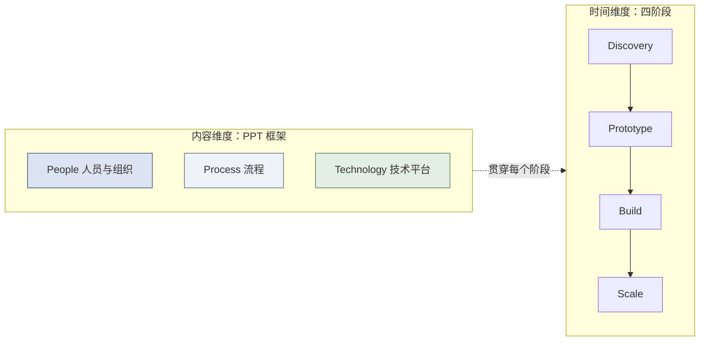

# 第三篇：流程篇 — 四阶段交付 SOP 与能力回注方法论

> [!NOTE]
> **本篇导读：流程不仅是纪律，更是业务结果的保障**
> 
> 本篇是整个教材的核心。技术执行工程师（对标Palantir Delta/FDE）往往面临一种矛盾：一方面，我们推崇黑客精神，追求极速破局；另一方面，企业级服务对稳定性、可预期性和商业成功有极高要求。
> 
> 如何平衡？答案就在于第 1.5 节已勾勒过的**四阶段方法论**（Discovery → Prototype → Build → Scale）。如果说概念篇只是亮出了这四个阶段的轮廓，那么本篇要做的，就是把每个阶段拆解到**可执行的 SOP 级别**。这套方法论不仅是项目管理的工具，更是认知客户、重构业务、实现价值的认知框架。对于高管，它是控制风险、预判投资回报的沙盘；对于中层，它是协同各部门、推进项目的指挥棒；对于一线，它则是应对复杂现场、步步为营的战术手册。

---

## How 总纲：PPT 框架 × 四阶段的交付矩阵

如果说第一篇回答了 **What（FDE 是什么）**、第二篇与第一篇的经济学部分回答了 **Why（为什么需要 FDE）**，那么从本篇开始，教材进入 **How（如何做）**。

但 How 不能只是一堆散落的操作技巧。在动手讲四阶段 SOP 之前，我们必须先建立一个统领性的认知框架，否则读者会淹没在细节中，只见树木、不见森林。

> [!NOTE]
> **关于本篇方法论的来源属性（请读者先读）**：本篇采用的 **Discovery → Prototype → Build → Scale 四阶段**，是业界对 FDE 式交付的**通用提炼**，并非 Palantir 的官方术语——Palantir 官方对应的表述是"用例生命周期（Use Case Lifecycle：需求提炼 → 方案设计 → 开发排序）"与"平台采纳四阶段（Foundry Adoption：聚焦用例 → 建设基础设施 → 自治式增长 → 超速增长）"。本教材选用 Discovery/Prototype/Build/Scale，是因为它对**从 0 到 1 的单项目交付**更直观易懂。
> 同时，本篇各阶段给出的**交付物清单、阶段 Gate 检查清单、以及 SOP 模板**，是本教材为转型企业提炼的**实操建议与最佳实践**，供落地时裁剪采用——它们不是任何厂商公开发布的官方标准。请读者按此定位使用：**框架与清单重在"可执行"，而非"权威认证"。**

### 一、任何企业级交付，本质都是对客户三个维度的改造

FDE 交付一个系统，绝不只是“部署一套软件”。一次成功的落地，本质上是对客户组织在三个维度上的同步改造——这正是组织变革领域历经数十年验证的经典框架 **People–Process–Technology（中文定名「人员流程技术」，英文缩写 PPT）。注意此"PPT"与"演示文稿 PPT"无关，仅为本框架的首字母缩写**：

| 维度 | 含义 | 在 FDE 语境下的具体所指 |
| :--- | :--- | :--- |
| **People（人员与组织）** | 谁来用、谁来推、谁来接盘 | 客户侧的决策者、冠军用户、终端用户、自运营团队；以及 FDE 己方团队的角色配置 |
| **Process（流程）** | 业务如何运转、如何被重塑 | 客户业务流程的诊断、审批链路的重塑、新旧流程的切换与采纳；以及 FDE 自身的交付流程 SOP |
| **Technology（技术平台）** | 用什么技术打通、如何对接 | 与客户异构系统的集成、数据管道、本体建模、私有化/信创适配 |

> [!IMPORTANT]
> **PPT 三者缺一不可，且以 People 为先。**
>
> - 只上 Technology 不改 Process、不带 People，系统必然沦为“搁板软件”（买了没人用）。
>
> - 只谈 Process 改造却无 Technology 支撑，是纸上谈兵的咨询 PPT（此 PPT 非彼 PPT）。
>
> - 三者中，**People 是根、Process 是脉、Technology 是器**——顺序不可颠倒。这也是为什么 FDE 的第一周是“听客户说话”（People/Process），而非“打开电脑写代码”（Technology）。

### 二、PPT 是“内容维度”，四阶段是“时间维度”，二者构成交付矩阵

这里必须厘清一个极易混淆的关系：**PPT 框架与四阶段方法论不是二选一，而是正交互补的两个维度**。

- **四阶段（Discovery→Prototype→Build→Scale）是时间轴**——它回答“**什么时候做**”。
- **PPT（People/Process/Technology）是内容轴**——它回答“**做什么**”。

任何一个交付动作，都同时落在这个矩阵的某个格子里。下表展示了 PPT 三要素在四个阶段中的工作重心如何演进：

| PPT 维度 ＼ 四阶段 | Discovery 发现 | Prototype 原型 | Build 构建 | Scale 扩展 |
| :--- | :--- | :--- | :--- | :--- |
| **People 人员组织** | 利益相关者地图、找冠军用户（5.2） | 客户 Demo、决策者亲手试用、争取 Build 资源（6.7） | 用户培训、冠军用户培养（7.7） | 冠军用户网络、客户自运营（8.4） |
| **Process 流程** | 业务流程诊断、痛点识别（5.3） | 原型跑通业务闭环、Demo 验证价值（6.5/6.7） | 从原型到生产的流程固化、质量治理（7.3/7.4） | 跨部门推广、组织变革管理（8.3） |
| **Technology 技术平台** | 数据资产盘点（5.4） | MVP 数据管道、本体建模（6.2/6.3） | 异构系统集成、数据源扩展（7.2） | AI 赋能、平台能力回注（8.5/8.6） |

*图：每个交付阶段，都需要同时推进 People / Process / Technology 三个维度*

### 三、本篇及后续的阅读导航

- **本篇（第三篇）** 以**四阶段时间轴**为主线组织，但请读者随时用 PPT 这把“内容标尺”去审视每个阶段：**这一步我在改人、改流程，还是改技术？三者是否同步？**
- **第二篇（Palantir 标杆）** 已经展示了 PPT 的“标准动作”——Foundry/Ontology 是 Technology、Delta/Echo/Engineering 三序列团队是 People、碎石路→铺装公路是 Process。（见 4.7 节的 PPT 透视）
- **第五篇（中国实践）** 将展示中国厂商在 PPT 三维度上的各自侧重与妥协，并在结尾给出**面向乙方的 PPT 转型对标行动纲领**（见 14.8 节）。

### 四、阶段 Gate 的运行规则：未通过、回滚与止损

每个阶段（第5–8章）末尾的 Gate 检查清单是质量闸门——"全部打勾才能进入下一阶段"。但只写"通过"不写"不通过怎么办"，Gate 就会退化成"带病签字"。**Gate 的运行规则必须事先约定，这里统一给出三条规定，四个阶段共用**（5.7 / 6.11 / 7.12 / 8.9 的清单本身不再重复，本节是其总纲）：

**规则一：Gate 未通过的分级处理。** 对未打勾项先定级，再按级处置，禁止"带病放行"：

| 未通过定级 | 判定标准 | 标准动作 |
| :--- | :--- | :--- |
| **轻微缺口** | 缺的是"可限期补齐"的交付物（如一份文档、一次验收演示） | 约定补齐时限（建议 ≤1 个冲刺），补齐后**带条件放行**，条件记入下一阶段任务书 |
| **重大缺口** | 关键交付物缺失或质量不达标（如核心数据管道未跑通、安全权限未过审） | **暂停进入下一阶段**，返回本阶段整改；整改完成后重开 Gate |
| **致命缺口** | 发现方向性错误（快赢选错、价值证明失败、合规硬伤） | 触发"止损/回滚"判定（规则二、三），必要时 Abort |

**规则二：跨阶段回滚不是失败，是止损。** 允许且鼓励按下列路径回退，重验后再进：

- **Prototype 验证失败 → 回退 Discovery（5.5）**：快赢场景在原型期证明不了价值，回到快赢矩阵重筛切入点，而不是硬着头皮 Build；
- **Build 发现架构性错误 → 回退 Prototype（6.x）**：原型的技术路线被证伪，回到原型重做可信度阶梯，而不是在错误的底座上加楼；
- **Scale 失速（8.7 健康退出指标恶化）→ 回退 Build（7.x）加固**：客户自运营接不住、MAU 下滑，先回到 Build 做可运营移交加固，再谈扩展。

**规则三：止损与退出要有判据。** 连续 2 个冲刺 Gate 未通过、或累计投入超过预估 150% 仍无进展时，触发甲乙联合止损评审（呼应 15.2 风险共担条款）：

- **正常退出**：按 8.7 撤出三级路线图完成移交（客户自运营、FDE 转战略咨询）；
- **异常终止（Abort）**：按合同约定的退出条款收尾——数据归还、系统移交、知识产权边界（见 15.6 合同与定价设计的退出条款），并做一次失败复盘（参照 14.9 的口径），把教训回注到方法论。

> [!IMPORTANT]
> **一句话**：Gate 不是"卡人的关卡"，而是"防事故的保险丝"——**未通过→分级处置；方向错了→回滚止损；该退出→体面收场**。这三条规则让四阶段从"单向流水线"变成"带安全网的闭环"。

### 五、SOP 的裁剪方法：不是模板越多越好

本篇及后续章节提供了 SOP 0–9 等大量模板（干系人地图、数据盘点表、快赢矩阵、回注卡片、Gate 清单……）。**模板是"弹药库"不是"必选清单"**——用错了反而增加负担。裁剪遵循"三问"：

1. **这个模板回应了客户的哪个真实决策？** 没有对应决策的模板，砍掉。例如客户是存量系统升级而非新平台建设，"数据资产盘点表"可简化，"快赢矩阵"必做。
2. **这个模板的产出能被下一个环节消费吗？** 产出一旦无下游消费（写了没人用），说明它只是"为了交差"。例如"利益相关者地图"必须能驱动"冠军用户选择"与"汇报对象设计"，否则删。
3. **填模板的时间成本是否小于它节省的沟通成本？** 对 2 周冲刺的小项目，用轻量一页版即可；对千万级政企项目才需要完整版。**模板粒度应与项目量级匹配。**

> [!TIP]
> **裁剪纪律**：宁可少用一个模板，也不要让模板变成"形式主义交付物"——审校发现"模板齐全但没人用"是 FDE 项目最常见的隐性浪费之一。每个项目启动时（SOP 0）花 10 分钟过一遍"三问"，把不适用的模板提前划掉，比事后补文档高效得多。

至此，认知框架已立。下面进入四阶段的实操细节。

---

## 第5章 Phase 1: Discovery（发现期，1-2周）

> [!NOTE]
> **本章导读**：四阶段的第一步。发现期不写代码，而是"听客户说话"——绘制利益相关者地图、诊断业务痛点、盘点数据资产、筛选"快赢"切入点。本章配套 SOP 1-3（干系人地图/数据盘点表/快赢矩阵）与发现期 Gate 清单。这一步定调子，决定项目做成"锦上添花的玩具"还是"解燃眉之急的利器"。

> [!TIP]
> **SOP 0: FDE 项目启动检查清单（在 Discovery 之前完成）**
>
> **商务侧**
>
> - [ ] 合同范围与交付边界是否已书面确认？
>
> - [ ] 计费模式是否为价值导向（而非人天计费）？
>
> - [ ] 客户方的项目 Sponsor 是否已明确？
>
> **技术侧**
>
> - [ ] 客户环境访问权限（VPN/堡垒机/数据库）是否已获取？
>
> - [ ] 客户的技术栈和数据资产概况是否已初步了解？
>
> - [ ] 信创/合规约束是否已前置评估？
>
> **团队侧**
>
> - [ ] FDE 团队编制是否到位（至少 MVP 配置）？
>
> - [ ] 角色分工和汇报线是否已确认？
>
> - [ ] Playbook（如该行业已有）是否已分发给团队成员？
>
> **用法说明**：SOP 0 是本章各环节（5.1-5.7）的**前置准备**——它不回答"这个方案做不做"，而是确保"Discovery 一开机就有干净、合格的输入"。商务侧三问守住合同与价值基线，技术侧三问保证后面能连得上、读得到数据，团队侧三问确保执行口袋里有弹药。全部打勾，再正式进入 5.1 的目标与进入条件。

> [!NOTE]
> **四阶段 与 Palantir 官方体系的对照（三套阶段体系的完整对照）**：本教材的 Discovery → Prototype → Build → Scale（How 总纲已说明）是业界对单项目交付的通用提炼，并非 Palantir 官方术语。为免读者误判，这里一次性给出**四套阶段体系**（教材四阶段 + Palantir 官方三套体系）的完整映射关系：
>
> | 本教材四阶段 | Palantir 用例生命周期 | Palantir Foundry 采纳四阶段 | Palantir AIP Activate | 阶段核心动作 |
> | :--- | :--- | :--- | :--- | :--- |
> | **Discovery**（发现期） | 需求提炼（Distilling functional requirements） | Phase 1：聚焦用例（Focus on use cases） | Identify & Prioritize（识别与排序） | 找对问题 |
> | **Prototype**（原型期） | 方案设计（Solution Design） | Phase 2：建设基础设施以解锁规模化（Build infrastructure） | Prototype & Validate（原型与验证） | 快速证明 |
> | **Build**（构建期） | 开发排序（Sequencing development） | Phase 3：自治式增长（Self-service growth） | Deploy & Operationalize（部署与运营化） | 做实做稳 |
> | **Scale**（扩展期） | （贯穿始终） | Phase 4：超速增长（Hypergrowth） | Scale & Transform（扩展与转型） | 放大复制 |
>
> **粒度差异提醒**：本教材四阶段更适合描述**单个项目从 0 到 1 的交付**；Palantir 的 Foundry 采纳四阶段更适合描述**客户组织层面的平台采纳成熟度**。两者的"阶段"不是一一对应的同一件事——前者是项目时间轴，后者是组织成熟度。AIP Activate 面向 **AI 能力的渐进式引入**，适合 AI FDE（见第15章）；"阶段核心动作"列是对每个阶段教材定位的一句话浓缩，供读者快速记忆。

### 5.1 目标与进入条件

**战略意义（给高管）：** 发现期是定调子的阶段，决定了项目是成为“锦上添花”的玩具，还是解决“燃眉之急”的利器。找准切入点，能最大化早期投资回报（ROI）。
**操作意义（给一线）：** 不要急于写代码。技术执行工程师（对标Palantir Delta/FDE）的第一周不是看数据库，而是听客户说话，成为客户业务的“内行人”。

- **目标：** 深入理解客户业务运转的真实逻辑，找到兼具高价值和高可行性的“快赢（Quick Win）”切入点，完成核心干系人绑定。
- **进入条件：** 合同签署完毕，项目启动会（Kick-off）完成，客户方提供必要的物理/网络通行权限，FDE团队全员到位。
- **核心原则：** “FDE的第一周不是写代码，而是听客户说话。”

### 5.2 利益相关者地图绘制

> [!TIP]
> 任何企业级软件的部署，本质上都是一次组织变革。没有人推动，再好的软件也会被束之高阁。

**为什么要做利益相关者地图？**
企业软件购买者和使用者往往分离。绘制地图是为了回答：谁来买单？谁来使用？谁会阻碍？谁能帮我们扫清障碍？

**如何识别关键人物：**

1. **决策者（Sponsor）：** 掌握预算，关心宏观指标（如成本降低、营收增长）。
2. **影响者（Influencer）：** 可能是架构师、合规部门，他们有否决权。
3. **使用者（End-user）：** 真正每天用系统的基层员工，他们关心系统能否让自己早点下班。
4. **阻碍者（Blocker）：** 可能因为系统触动其利益或改变其习惯而产生抵触。
5. **冠军用户（Champion）：** 最有意愿推动系统落地的人，通常是痛点最深、渴望改变的业务骨干。

**利益相关者地图模板（SOP 1）**

> [!TIP]
> **SOP 1: 利益相关者地图模板**
> 
> | 姓名 | 部门/职务 | 角色类型 | 对项目态度 | 关注点 | 沟通策略 |
> |---|---|---|---|---|---|
> | 张总 | 供应链副总裁 | 决策者 | 积极支持 | 降低库存周转天数 | 每周核心指标汇报，展示ROI |
> | 李工 | IT部数据架构师 | 影响者 | 观望/怀疑 | 数据安全、系统兼容性 | 邀请参与早期架构设计，打消安全顾虑 |
> | 王主管 | 华东区调拨主管 | 冠军用户 | 极度热情 | 告别手工Excel，自动化排程 | 深度绑定，共同设计原型，树立标杆 |
> | 赵专员 | 一线操作员 | 使用者 | 抵触 | 增加工作量、改变操作习惯 | 简化UI，强调能为他节省的时间 |

**实操建议：** 在到达现场的头三天，务必找到你的“冠军用户”。在某快消企业项目中，如果没有供应链总监这个冠军用户顶住IT部门初期的阻力，项目根本无法熬到第二周。

### 5.3 业务流程诊断与痛点识别

**访谈方法：**

- **结构化访谈：** 针对管理层，使用预设问卷，聚焦战略目标和关键绩效指标。
- **跟班观察（Shadowing）：** 针对操作层。坐在他们旁边，看他们如何处理一封邮件、如何打开5个系统比对数据。**眼睛看到的，比他们嘴上说的更真实。**

**关键问题清单（FDE访谈提纲）：**

- “您日常工作中最耗时的环节是什么？”（寻找效率痛点）
- “有哪些决策是凭经验而非数据做的？”（寻找数据赋能点）
- “跨部门协作中最大的卡点是什么？”（寻找信息孤岛）
- “如果有一个魔法棒，您最想解决什么问题？”（寻找终极期望）

**痛点分类矩阵：**

1. **流程痛点：** 审批链路过长，手工操作多。
2. **数据痛点：** 数据对不上，数据拿不到，数据不实时。
3. **决策痛点：** 缺乏全局视野，只能盲人摸象。
4. **协作痛点：** 部门墙厚，邮件满天飞。

### 5.4 数据资产盘点

**盘点方法论：**
千万不要直接向客户索要“全部数据”，这会引发安全部门的警觉，也会让你淹没在数据垃圾场中。应采用**“业务牵引（Business-driven）”**的逆向盘点法：业务需要什么指标 -> 依赖什么实体 -> 对应哪些系统和表。

- **系统清单：** 客户现有的ERP, CRM, MES等。
- **数据源清单：** 表结构、字段级含义。
- **数据质量评估：** 脏数据、缺失数据。
- **系统拓扑图：** 了解数据流向。

**常见陷阱：** 客户说“我们数据挺全的”，往往意味着数据质量堪忧；客户说“通过API实时拉取”，往往对方只提供了一个每天更新一次的FTP。

**数据资产盘点表模板（SOP 2）**

> [!TIP]
> **SOP 2: 数据资产盘点表模板**
> 
> | 系统名称 | 所属部门 | 数据类型 | 数据量级 | 更新频率 | 接口方式 | 数据质量 | 共享现状 |
> |---|---|---|---|---|---|---|---|
> | SAP ERP | 财务/供应链 | 订单/库存 | 百万级/天 | T+1 | 直连DB | 高，但多外键关联 | 仅核心管理层可见 |
> | CRM系统 | 销售部 | 客户信息 | 十万级/总 | 实时 | API | 极差，大量手动录入残缺 | 各大区隔离 |
> | 生产MES | 制造中心 | 设备传感器 | 亿级/天 | 毫秒级 | Kafka | 存在断点漂移 | 孤岛，未与业务打通 |

### 5.4.1 核心业务对象的初步识别（为 Prototype 画草图）

> [!IMPORTANT]
> **这一步只"画草图"，不是正式建模。** Palantir 官方在 Discovery 阶段就要求开始识别核心 Object Type（如 AIP 方法论中的 Identify & Prioritize），而不是等到 Prototype 才从零起步。本小节正是对齐这一做法：让技术执行工程师在进入原型期时不至于从零开始。

在盘点数据资产的同时，用**业务语言**列出"这个场景涉及哪些核心业务对象"——例如：客户、订单、产品、供应商。这是一张最朴素的清单，作用是回答"这个业务世界里有哪几类最重要的'东西'，它们之间大致是什么关系"。

- **用业务语言，而非数据库语言：** 写"订单"而不是"t_order"，写"客户"而不是"cust_dim"。业务对象的名字，应当让业务方一听就懂——这正是未来 Ontology 建模（第 6 章）的命名起点。
- **先窄后宽：** 聚焦与已锁定快赢场景直接相关的 3-5 个核心对象即可，不要一口气铺开几十个。对象越多，后期验证成本越高。
- **标注关键属性与关系：** 顺手记下每个对象最想被"看到"的属性（如订单的金额、状态、日期），以及对象之间的粗略关系（客户—下单→订单，订单—包含→产品）。这为 Prototype 期的数据管道和展示页面提前锚定了骨架。
- **与 5.4 数据资产盘点联动：** 一边盘点系统、表、字段（数据视角），一边列业务对象（业务视角）。两者对得上，说明数据能支撑该对象；对不上，恰恰暴露了数据断点，应反向补进 5.4 的数据质量评估。

**产出物定位**：这并非正式 Ontology 建模（那是 Prototype 阶段的事——见 6.2/6.3），而是为 Prototype **提前画好的草图**，让技术执行工程师进入原型期时直接站在"已有业务快照"的起点上，避免重复访谈、重复梳理。

### 5.5 「快赢」场景筛选

> [!NOTE]
> **与 Palantir 官方 "Delivering a use case" 的 Outcome-Data-Tools 三要素对齐（附录B-1）**：本节的筛选框架并非教材自创，而是对 Palantir 官方三要素的本地化落地。对应关系如下：
>
> - **"业务价值 + 可见度"≈ Outcome（期望结果）**——回答"这个用例解决了多大、多被看见的问题"；
>
> - **「数据就绪度」≈ Data（数据可行性）**——回答"现成数据能否支撑"；
>
> - **「技术复杂度」≈ Tools（平台工具适配度）**——回答"底层技术有多难攻克"。
>
> **关于为何用"技术复杂度"替换 Tools**：教材刻意将 Palantir 的 Tools 改为更通用的"技术复杂度"，因为**非 Palantir 用户无法直接对标其平台工具**；"技术复杂度"这一表述对任何技术栈（自研、开源或商业化平台）都成立，便于读者在自身语境下套用。

> [!NOTE]
> **与 2.3 节筛选框架的层级区分（避免混淆）**：2.3 节的 Outcome-Data-痛点普遍性三要素，解决的是**项目层**的"这个客户/项目值不值得接"（入场决策）；本节解决的是**场景层**的"项目已经接了，先跑哪个用例"（项目内排序）。两者粒度不同、互补而非替代——先用 2.3 决定"入场"，再用本节决定"从哪切入"。

**快赢（Quick Win）的定义：** 在2-4周内，能够用最小的数据集、最核心的流程，跑通闭环并向客户展示明确业务价值的场景。

**筛选框架：**
采用 **影响力（业务价值 + 可见度） × 可行性（数据就绪度 + 技术复杂度）** 的二维框架。

- **业务价值：** 解决多大的问题？（$成本节约 = 减少时长 \times 资源单价$）
- **可见度：** 这个改进能被多少高管看到？
- **数据就绪度：** 现成数据能支撑吗？
- **技术复杂度：** 是否需要攻克巨大的底层技术难题？

**快赢场景评估矩阵模板（SOP 3）**

> [!TIP]
> **SOP 3: 快赢场景评估矩阵**
> 
> | 候选场景 | 业务价值(1-5) | 可见度(1-5) | 数据就绪度(1-5) | 技术复杂度(1-5反向*) | 综合得分 | 优先级 |
> |---|---|---|---|---|---|---|
> | A: 跨区库存智能调拨 | 5 (省千万级物流费) | 4 (副总裁主抓) | 4 (ERP数据现成) | 3 (需算法支持) | 16 | **P0 (首选快赢)** |
> | B: 销售大盘实时监控 | 3 (仅供查看无决策) | 5 (全体可见) | 5 (系统完善) | 5 (极简单) | 18 | P1 (辅助场景) |
> | C: 设备预测性维护 | 5 (减少停机) | 3 (局部可见) | 1 (传感器未联网) | 1 (极复杂) | 10 | P3 (暂时搁置) |
> 
> *技术复杂度打分：1代表最复杂，5代表最简单，以保证总分越高越好。

**选择原则：选领导最关心、群众获得感最强的场景。** 比如在某城商行项目，我们首选了“对公贷款贷后预警”而非复杂的“宏观经济预测”，因为前者直接关系到支行行长的KPI和客户经理每天的下班时间。

### 5.6 输出交付物清单

在Discovery阶段结束时，FDE团队必须产出以下内容：

1. 利益相关者地图（详实版）
2. 业务痛点清单（按优先级排序）
3. 数据资产盘点报告（聚焦快赢场景相关的闭环数据）
4. 快赢场景定义文档（含可行性分析）
5. 初始项目路线图（明确后续Prototype的时间节点）

### 5.7 阶段 Gate 检查清单

> [!IMPORTANT]
> **Discovery Gate 检查清单** (只有全部打勾，才能进入Prototype阶段)
>
> - [ ] 是否已识别出清晰的决策者(Sponsor)并建立了直接沟通渠道？
>
> - [ ] 是否找到至少一位愿意全程陪跑的冠军用户(Champion)？
>
> - [ ] 是否完成了支撑快赢场景的数据资产盘点（至少验证了连接可行性）？
>
> - [ ] 客户决策层是否听取并正式认可了快赢场景及初始路线图？
>
> - [ ] FDE团队（至少技术带头人）是否能不用任何技术词汇，用客户的行业黑话向客户复述其痛点？
>
> - **对应交付物**：本 Gate 各项与 5.6（输出交付物清单）逐项对应，验收时逐项勾对。
>
> - **未通过怎么办**：Gate 未全部打勾时的分级处置（轻微/重大/致命）、跨阶段回滚与止损判据，见第5章 How 总纲「四、阶段 Gate 的运行规则」。

### 5.8 节奏纪律：短周期冲刺（避免"第六周死亡"）

> [!IMPORTANT]
> **本章节奏纪律的核心一句话：宁可每周交一点看得见的，也不闷头憋一个"完美"的大版本。**

**问题：为什么"闷头做三个月再上线"会死在第六周？**
Discovery 阶段找到切入点之后，最大的交付风险往往不是技术难度，而是**节奏**。如果交付模式是"闷头做三个月再上线"，项目大概率死在第六周——因为甲方在漫长的静默期里看不到任何阶段性成果，就会开始怀疑你的进度、抽调资源、砍预算，甚至直接叫停。FDE 面对的甲方不是"等着验收"的旁观者，而是一个持续在观望、随时可能收回投入的组织。**信任不是项目结束时一次性兑现的，而是每个周期用可见成果一点点喂出来的。**

**节奏建议：以 2 周为一个冲刺（Sprint），每次都交付"看得见、能演示、可验收"的增量。**
不要把整个项目当成一次"憋大招"。建议把工作量切成 **2 周一个的短周期冲刺（Sprint）**，每个冲刺结束都要向甲方交付**看得见、能演示、可验收**的增量。这个节奏与本章 5.5 的"快赢（Quick Win）"及后续 Prototype 的节奏天然同频——快赢本来就是 2-4 周能跑通闭环的小切口，用短周期冲刺把它拆成更细的 2 周增量，既延续了"小步快跑"的精神，也让甲方始终能看到进度。

| 冲刺 | 典型节奏（仅为示意，可按项目裁剪） | 交付给甲方的可见成果 |
| :--- | :--- | :--- |
| Sprint 1 | 跑通单一核心流程的最小闭环 Demo | 可点击、可演示的界面/原型 |
| Sprint 2 | 接到真实数据，验证关键指标 | 带真实数据的结果展示 |
| Sprint 3 | 固化流程、补齐边界场景 | 走通完整业务链路的版本 |
| ... | 每个冲刺结尾做一次轻量演示与评审 | 阶段验收记录 |

**行业佐证：**
> 行业调研显示，大量 AI Agent 项目卡在从 POC 到生产的跨越——亚马逊云科技陈晓建在 MEET2026 演讲中引述的口径为"**93% 的企业 AI 项目卡在 POC 到生产的最后一公里**"（据智源社区报道 `https://hub.baai.ac.cn/view/51444`）。核心失败原因之一是"技术部门推着 AI 上、业务部门却不知道要解决什么问题"。因此正确的起点应该是"**这个 Agent 消灭了哪个岗位的哪类重复工作**"，而不是"我们能用 AI 做什么"。

这段话与本节的冲刺节奏互为表里：**起点错了（技术驱动而非问题驱动），后期就必然靠"憋大版本"来圆场，于是走向第六周死亡；节奏对了（短周期、看得见），才能让业务方始终参与、始终认可，把"技术往前推"变成"业务拉着走"。**

**落点：与 5.7 Gate 检查清单衔接。**
5.7 的 Discovery Gate 是阶段级的质量闸门，而短周期冲刺是**阶段内部的节奏机制**——两者不冲突，而是互补。落地方法是：**每个冲刺结束对应一次轻量 Gate 评审**，不用像 5.7 那么完整，掐住"这 2 周的要件是否达成、是否继续推进、是否需要微调方向"三个要点即可；待冲刺累积满 Discovery 的全部交付物（5.6），再走向完整版 5.7 阶段 Gate。这样既保持了大阶段的质量门槛，又避免了阶段内部的长时间无产出。
