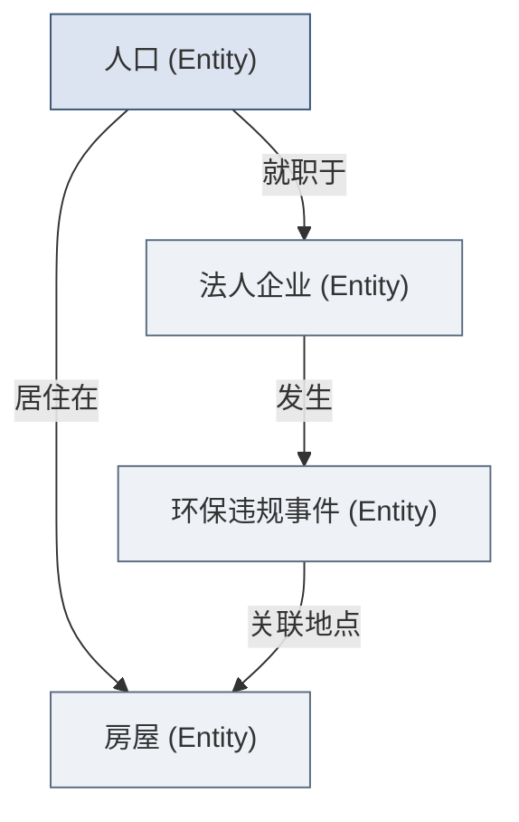

## 第6章 Phase 2: Prototype（原型期，2-4周）

> [!NOTE]
> **本章导读**：四阶段的第二步，也是"见真章"的一步。用最小可行架构（MVP 数据管道 + 本体建模）快速搭出能跑通、能演示的原型，坚持"Show, Don't Tell"——让客户亲手操作、用真实数据说话。目标是用最小代价证明最大价值，换取客户投入下一阶段的承诺。

### 6.1 目标与进入条件

**战略意义（给高管）：** 这是“见真章”的阶段。原型期的成功与否，直接决定了客户是否愿意砸下真金白银购买长期License。用最小的代价证明最大的价值。
**操作意义（给一线）：** 停止写长篇大论的PPT，用可运行的软件说话。让客户的手指在键盘上敲击，让客户的眼睛看到真实数据的流转。

- **目标：** 用最小可行性架构构建原型，完成快赢场景闭环，验证业务逻辑。
- **进入条件：** Discovery阶段Gate全部通过，客户核心数据已提供授权。
- **核心原则：** “Show, Don't Tell（让客户亲手操作，而非仅看演示）”

### 6.2 最小可行数据管道（MVP Pipeline）

**什么是MVP Pipeline？**
它是一条以最快速度从数据源（哪怕是离线CSV）到最终可视化前端的链路。不要追求高可用、自动重试、灾备等生产级特性。

**搭建原则：够用就行，不追求完美。**
如果API暂时调不通，就让客户导出一份本周的Excel先用着；如果数据有脏记录，写几行Python脚本简单清洗即可，不要花两周时间搞主数据治理。

**数据管道设计的「三要三不要」：**
- **要**记录每一步转换的逻辑，**不要**写没有任何注释的面条代码。
- **要**保证关键字段的准确性，**不要**在细枝末节的非核心数据上死磕。
- **要**留有随时替换数据源的接口（如用配置文件），**不要**把文件路径写死在底层函数里。

### 6.3 本体论建模（Ontology）入门

> [!NOTE]
> 这是Palantir最核心的理念之一。不要让业务人员学习什么是“事实表”、“维度表”或“主键”，要让系统学习什么是“航班”、“飞行员”和“备降机场”。

**什么是Ontology？**
Ontology是用业务语言描述现实世界的数字孪生。它将底层碎片化、异构的系统表，映射为业务人员每天挂在嘴边的实体。

**Ontology的核心要素：**
1. **实体（Entity）：** 业务中的核心对象（如：客户、员工、工厂）。
2. **属性（Property）：** 实体的特征（如：客户的信用评级，工厂的占地面积）。
3. **关系（Relationship）：** 实体间的联结（如：客户“签订”合同，工厂“生产”产品）。

**建模示例：某政务场景的Ontology**

**为什么Ontology是能力回注的关键载体？**
只有沉淀在Ontology层的业务逻辑，才是跨越底层系统异构性的通用资产。一旦我们在A企业定义了“供应链牛鞭效应”的Ontology逻辑，在B企业即便底层表完全不同，只要映射到这套Ontology，能力就可以秒级复用。

### 6.4 Ontology Design 深化：从草图到可运行的业务模型

> [!NOTE]
> 6.3 讲的是"Ontology 是什么、为什么重要"；本节对标 Palantir 的 **Solution Design** 环节，回答"具体怎么设计才能让原型真的跑起来"。核心判断：Ontology 不只是"数据模型"，而是**可操作的业务数字孪生**——包含语义要素（对象、属性、关联）与动能要素（Action、函数、动态权限）。

Palantir 官方文档对 Ontology 有一句核心定义：

> "the Ontology serves as a digital twin of the organization, containing both the semantic elements (objects, properties, links) and kinetic elements (actions, functions, dynamic security)"

这意味着 Ontology 不只是"数据模型"，而是"可操作的业务数字孪生"。原型期的 Ontology 设计应遵循以下四项原则：

#### 1. Object Type 设计原则（对标 Palantir Ontology 最佳实践）

| 设计原则 | 说明 | 反面模式 |
|---|---|---|
| **业务语言优先** | Object Type 命名用业务术语（"订单"而非"t_order"） | 照搬数据库表名 |
| **关系即业务逻辑** | Link Type 表达业务规则（"供应商-供应→零件"） | 只建外键关联 |
| **Action 即决策** | 设计可写回的 Action（"调拨建议→执行"） | 只做只读展示 |
| **先窄后宽** | 先建核心 3-5 个 Object Type，验证后再扩 | 一上来建 50 个 |

> [!TIP]
> **一个检验标准**：如果 Ontology 里的每个 Object Type、每条 Link，都能用一句"业务大白话"向客户解释清楚，那建模方向就对了；如果只能说出"这是张三表的主键"，说明又滑回了数据库思维，需要回到"业务语言优先"。

#### 2. 数据管道的"可演进架构"

原型管道要满足"今天能跑、明天能改、后天能进生产"。三条硬性要求：

- **数据源接入用"配置驱动"**（而非硬编码），便于 Build 阶段替换数据源——这与 6.2 的"三要三不要"一脉相承。
- **转换逻辑用"可测试的函数"封装**，而非散落在 notebook 里——原型期就得让 Build 团队能看懂、能单测。
- **留出"增量 vs 全量"的切换点**：原型跑全量没问题，但生产必须增量，切换点要在管道设计里提前预留，而不是上线前才补。

#### 3. 原型的"可信度阶梯"

不是所有原型都需要同等精度。按可信度递进，原型期按场景选用不同层级：

| 层级 | 数据形态 | 足够用于 |
|---|---|---|
| **Level 1** | 静态数据 + 手动刷新 | 首次 Demo（证明方向对）|
| **Level 2** | 自动刷新 + 真实近期数据 | 高管决策 Demo（证明价值）|
| **Level 3** | 实时/准实时 + 完整业务闭环 | Gate 通过进 Build（证明可生产）|

> [!IMPORTANT]
> **关键纪律**：不要把"可信度层级"当成"偷工减料"，而要当成**分层投入**。首次 Demo 用 Level 1 完全够，硬上 Level 3 只会拖慢见真章的节奏；但 Level 3 也绝不能省——它是 Gate 判断"能否进 Build"的硬门槛。

### 6.5 原型应用构建：“Show, Don't Tell”

**原型的目标：让客户说“wow”，而非“我看懂了PPT”。**
当BP的工程师第一次在原型系统中通过拖拽查看到全球油田与钻井平台的实时生产状态、设备可靠性预警时，那种震撼是100页PPT也给不了的。

**构建优先级：**
**可交互 > 美观 > 功能完整**

**原型中必须包含的要素：**
1. **真实数据（而非假数据）：** 必须是客户自己的真实数据。假数据无法激起任何同理心。
2. **可操作的界面：** 哪怕只有一个按钮，也要让客户自己点。
3. **至少一个“惊喜”发现：** 通过数据关联，发现一个客户过去凭经验未能发现的盲点（例如：某个常年被评为优秀的供应商，其实延期交货率高达30%）。

**常见原型类型：** 数据看板、分析工作台、流程监控。

### 6.6 原型的技术架构选择：什么时候低代码快搭，什么时候必须写代码

原型期最容易犯的两个错误：要么"杀鸡用牛刀"（本该低代码快搭却硬写全栈工程），要么"牛刀杀鸡"（所有交互都靠低代码，结果要做原型之外的任何事都被平台框死）。选型没有绝对答案，但有清晰的判断框架——**核心原则是：以"最快让真实数据跑起来"为目标，用 20% 的工程成本完成 80% 的价值证明**。

| 场景 | 建议 | 原因 |
| :--- | :--- | :--- |
| 场景变化快、需要反复演示给不同人看 | **低代码快搭**（Retool / Palantir Workshop / Streamlit 等） | 迭代成本低，可现场改、现场演示 |
| 涉及复杂的后端逻辑、数据管道、算法 | **传统代码**（Python / Java / SQL 管道） | 原型期就要验证的往往正是底层逻辑是否成立 |
| 需要演示"数据关联带来的惊喜发现" | 两者结合：低代码做交互外壳，代码做数据链路 | 交互只是载体，数据洞察才是"wow"的来源 |
| 客户环境受限（内网、信创、无外网依赖） | 提前确认依赖可控，低代码平台需先验证能否私有化部署 | 原型期就踩环境坑会浪费宝贵的客户信任 |

**决策要点：**
1. **先验证"最不确定、风险最高"的那一环**——如果你担心的是"这个算法能不能跑通"，就先把算法跑通；如果担心的是"客户爱不爱用"，就用低代码把交互做出来。
2. **低代码不是偷懒的代名词**。对一个需要高频演示、快速改需求的原型，低代码是刻意的战略选择，不是能力不足的妥协。
3. **保留数据源的替换能力**（同 6.2 的三要三不要），让原型在进入 Build 阶段时不至于推倒重来。

### 6.7 客户 Demo 与反馈收集

**Demo准备清单：** 预演数据刷新、确认网络连接、排演话术。

**Demo的黄金法则：“不要演示功能，要演示价值”。**

- **错误示范**：“你看，点击这个按钮，系统会调用后端API进行一次聚合运算，然后在这个表格渲染出结果。”
- **正确示范**：“王总，这就是您平时花三天时间催各个大区交上来的销售报表。现在，只要点这个按钮，它不仅瞬间生成，还能直接高亮出哪个大区库存快断了。您想亲自点一下试试吗？”

**反馈收集方法：**
- **现场记录：** FDE团队至少有一人专门负责记录客户的微小表情和随口说出的话。
- **录屏回放：** 回顾Demo过程中的交互卡点。
- **NPS快评：** Demo结束后，用1分钟收集反馈：“0-10分，这个系统多大程度上解决了您的痛点？”

**关键决策：** 客户是否认可方向？是否愿意投入资源进入Build阶段？

**Demo 的艺术：让决策者"当场拍板"而非"散会后再议"。**

- **对象决定内容**：给 CEO/CFO 看的是 ROI 与风险（这个系统能省多少钱、多久回本）；给业务主管看的是痛点被解决（你的痛点在这条链路里如何消失）；给 IT 看的是可行性（数据从哪来、安不安全、怎么集成）。**同一个 Demo，面对不同角色要换讲法。**
- **用客户的业务语言开场，不用技术语言冷场**：前 30 秒点出客户的高频痛点（"王总，这就是您每周三天催各区分公司交上来的报表"），而不是介绍架构。
- **设计"一个逼真的关键时刻"**：提前把客户自己的真实数据、真实地名、真实产品名嵌进去——让决策者产生"这就是我们公司"的代入感。宁可只演示一个场景，也要让这个场景逼真到无可反驳。
- **手把手让拍板人操作一次**：决策者的"回答"其实写在他们的表情和动作里。让他们亲手点一次按钮，比任何口头承诺都更能锁定下一阶段资源。
- **时刻留意"谁在皱眉"**：Demo 现场至少一名 FDE 专职记录微表情与会后私聊内容——决策者是斩钉截铁，还是礼貌性点头？这决定了进入 Build 前的资源谈判筹码。

> [!CAUTION]
> **Demo 的三大禁忌**：① 演示花哨但数据是假的（客户一问真实数据立刻穿帮）；② 只顾自己讲、不让决策者上手（沦为"我看懂了 PPT"）；③ 一上来就演示功能而非价值（见 6.7 黄金法则）。

### 6.8 原型期的客户期望管理：防止"原型=上线"的致命误解

**问题所在：客户的"顺理成章"往往是最危险的反应。**

客户看到能跑的原型后，最常见的反应不是惊喜，而是反问："这不就行了吗，为什么还要花 3 个月做 Build？"——如果管理不好这个预期，会出现两种坏结局：

- **被逼仓促上线**：客户要求"就按这个上生产"，原型那套"够用就行"的架构直接裸奔，系统必崩，飞轮一次就折断。
- **客户拒绝为 Build 付费**：既然原型已经"能跑"，客户凭什么再为"只是做得更稳"掏钱？项目停在原型，价值永远无法放大。

所以，**期望管理不是 Demo 结束后的补救，而是要在 Demo 现场就埋下种子**。

#### 应对策略一：Demo 时故意展示一个"能看到问题但解决不了"的环节

不要只展示"系统多聪明"，要主动暴露"系统当下的边界"。比如：

> "您看，这里已经显示了断供风险，但目前还不能自动生成调拨方案——**这就是 Build 阶段要解决的**。"

这一句把"原型能做什么"与"生产要做什么"画出一条明确的界线，客户自然会理解：原型是"验方向"，Build 才是"解决问题"。

#### 应对策略二：用安全与合规做"挡箭牌"

把"不能直接上线"从"我们不想干"翻译成"行业硬约束"：

> "原型跑在沙箱里，要进生产必须过安全审计、权限、合规审查——**这些都需要 Build 阶段完成**。"

这条既给了客户一个不可辩驳的"为什么不能直接上"的理由，也为 Build 阶段的工作量提前做了铺垫。

#### 应对策略三：量化 Build 的增量价值

用数字把"Build 到底多付了什么"讲清楚：

> "原型能覆盖 1 个场景，Build 能覆盖 5 个，**ROI 是 X 倍**。"

让客户意识到：Build 不是"把原型再做一遍"，而是"把一只试点翅膀变成整个机群"——覆盖范围、落地能力、投资回报都上了一个量级。

> [!IMPORTANT]
> **三颗种子必须在同一场 Demo 里全部埋下，缺一不可**。策略一让客户看到"问题还有待解决"，策略二挡住"直接上线"的冲动，策略三回答"那 Build 值不值"。三者串起来，客户才会从"这不就够了吗"走向"那我们赶紧进 Build"。

### 6.9 原型到生产的技术债管理："先脏后洗"策略

原型期用"够用就行"换来的速度，一定会留下技术债。关键在于**要有意识地记账，而不是装看不见**——否则到了 Build 阶段，原型那笔债会让生产化成本爆炸。

**技术债的三种记账清单（建议在原型末一并移交 Build 团队）：**
1. **数据债**：临时硬编码的清洗脚本、写死的数据源路径、缺失字段的空值兜底策略。
2. **逻辑债**：快速打补丁的分支逻辑、写死的业务规则阈值（如"库存<100 预警"）、未参数化的常量。
3. **架构债**：单体原型里的"一次性"耦合、缺少的错误处理、未做安全加固的接口。

**"先脏后洗"的操作纪律：**
- **原型期允许脏**，但每处"脏"都要有明确标注（TODO / 注释 / 需求卡片），让 Build 期能一眼定位要"洗"的地方。
- **把"洗债"成本写进 Build 的排期**，而不是默认"原型能跑，生产就能跑"——原型期跳过的所有生产级要求（高可用、权限、审计、重试）都会在 Build 期加倍奉还。
- **识别"值得砍掉的债"**：有些原型代码本就不该进生产（如一次性数据搬运脚本），直接废弃重写反而比"洗"更便宜。判断标准：这段代码是"业务能力"，还是"一次性搬运工具"？前者值得洗，后者应丢弃。

> [!TIP]
> **技术债管理三问**：①这笔债进生产会造成什么后果？②洗掉它要多少人天？③如果不洗，最迟什么时候必须还？——答案决定它是"进 Build 还"、"原型期顺手还"还是"直接废弃"。

### 6.10 输出交付物

1. 可运行的原型应用（部署在沙箱或受控环境）
2. 初始本体模型文档（Ontology Draft）
3. 数据管道架构图（标明数据血缘）
4. 客户Demo反馈记录及复盘纪要
5. 修订后的项目路线图（为Build阶段做准备）

### 6.11 阶段 Gate 检查清单

> [!IMPORTANT]
> **Prototype Gate 检查清单** 
> - [ ] 原型是否使用了客户的真实数据（哪怕只是一小部分）？
> - [ ] 是否成功跑通了至少一条核心业务流程的端到端数据闭环？
> - [ ] 客户决策者是否亲自操作了系统，并给出了明确的积极反馈？
> - [ ] 客户是否签署或口头明确承诺了进入下一阶段（Build）的资源投入（如对接API的IT人员、参与测试的业务人员）？
> - [ ] 是否已用 6.9 的技术债清单，把原型遗留的数据债/逻辑债/架构债登记在案，移交给 Build 团队？
> - **对应交付物**：本 Gate 各项与 6.10（输出交付物清单）逐项对应，验收时逐项勾对。
> - **未通过怎么办**：Gate 未全部打勾时的分级处置（轻微/重大/致命，含"快赢验证失败回退 5.5 重筛"）、跨阶段回滚与止损判据，见第5章 How 总纲「四、阶段 Gate 的运行规则」。
