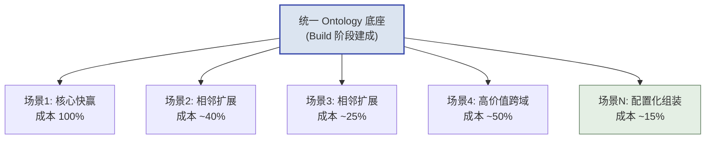

## 第8章 Phase 4: Scale（扩展期，持续）

> [!NOTE]
> **本章导读**：四阶段的收官——从"单点胜利"走向"全面渗透"。本章讲场景从 1 到 N 的复利式扩展、跨部门推广中的组织变革管理、冠军用户网络建设、AI 赋能，以及把前期识别的能力回注点真正推入平台。目标是让系统沉淀为客户的"数字基础设施"，形成高替换成本与续约黏性。

### 8.1 目标与进入条件

**战略意义（给高管）：** 从“单点胜利”走向“全面渗透”。Scale 阶段决定了这个客户是一笔“一次性项目收入”，还是一份“可持续增长的年金资产”。一个只用在单一部门的系统随时可能被替换；而一个成为客户“数字基础设施”的系统，则拥有极高的替换成本和续约黏性。
**操作意义（给一线）：** 技术执行工程师的角色从“建造者”转向“赋能者”。你的目标不再是自己写更多代码，而是让底层 Ontology 成为可复用的地基，让客户的冠军用户能自己搭建新场景。**衡量你 Scale 阶段是否成功的标准，是“离开你系统还能不能转”。**

- **目标：** 从 1 个场景扩展到全组织多场景，让系统沉淀为客户的“数字基础设施”，并将前期识别的能力回注点正式落地。
- **进入条件：** Build 阶段 Gate 通过，系统在核心场景已产生**可量化的确切收益**，且客户高层明确表达了推广意愿。
- **核心原则：** “复利效应（Compounding）”——因为底层 Ontology 已打通，每个新场景的边际成本急剧递减。

> [!IMPORTANT]
> **先把 Scale 拆成两条验收线：业务 Scale × 工程 Scale**。本节及后续小节的内容会混着出现这两种动作，读之前先分清，否则很容易把“组织愿意用”和“系统能扩展”混为一谈：
>
> - **业务 Scale（Echo 主责）**：价值实现、跨部门采纳、冠军用户网络、组织流程变化、使用率与业务指标、增购条件——回答“**人愿不愿意用、值不值得续约**”。
> - **工程 Scale（Delta + Engineering 主责）**：数据和应用扩展、容量与性能、可观测性、故障恢复、发布与回滚、技术交接、客户 IT 接管——回答“**系统能不能顶住规模化运行**”。
>
> **结论（必须写清）**：工程系统“能够扩展”，不等于组织“愿意采用”；组织采纳成功，也不等于系统已经具备规模化运行能力。**业务 Scale 与工程 Scale 必须分别验收，最终在 8.9 的 Scale Gate 汇合**——两者都通过，才称得上真正的“全面渗透”。

### 8.2 从 1 到 N 的场景扩展策略

Scale 阶段最大的诱惑是“什么都想做”，最大的风险是“扩张太快导致底座崩塌”。扩展必须有策略、有节奏。

**扩展路径的两种选择：**

| 扩展路径 | 定义 | 优势 | 风险 | 适用时机 |
| :--- | :--- | :--- | :--- | :--- |
| **相邻场景优先** | 沿着同一 Ontology、同一批用户向外扩 | 复用度最高，边际成本最低，见效快 | 价值天花板低，可能困在小圈子 | 系统刚站稳，需快速积累“战果”树立信心 |
| **高价值场景优先** | 跳到另一个高层关注的重量级痛点 | 政治能见度高，易获高层追加预算 | 可能需新数据源，边际成本高，风险大 | 已有稳固冠军用户网络，需要一场“大胜”续命 |

**复利效应的量化直觉：** 第 1 个场景 FDE 要从零搭数据管道和 Ontology（成本 100%）；第 2 个相邻场景可复用 60% 底座（成本 40%）；到第 5 个场景，可能只需配置化组装（成本 15%）。这正是 2.3 节经验曲线在单客户内部的复现。

*图：底座打通后，新场景的边际成本随复用度提升而递减*

> [!TIP]
> **SOP 5: 场景扩展优先级评估表**
> 
> | 候选新场景 | 复用现有Ontology比例 | 高层关注度(1-5) | 冠军用户覆盖 | 新增数据源数 | 边际成本估算 | 扩展序位 |
> |---|---|---|---|---|---|---|
> | 供应商协同门户 | 80% | 4 | 已有 | 1 | 低 | **N+1（首选）** |
> | 全球物流塔台 | 55% | 5 | 需新建 | 3 | 中 | N+2 |
> | 碳排放合规监控 | 30% | 3 | 无 | 4 | 高 | 观察/暂缓 |

### 8.3 跨部门推广与组织变革管理

> [!IMPORTANT]
> **技术推广易，组织变革难。** Scale 阶段项目失败，**绝大多数**死于组织阻力而非技术缺陷（"90% 死于组织阻力"为业界经验表述，非精确统计）。系统能跑通，不代表人愿意用。

**为什么跨部门推广比首个部门难？**
首个部门是被痛点驱动、主动求变的“饥饿者”；后续部门往往是被自上而下要求接入的“被动者”，他们对新系统天然带着“这是别人的政绩，凭什么增加我的工作量”的抵触。

**常见阻力类型与应对策略：**

> [!TIP]
> **SOP 6: 组织变革阻力-应对矩阵**
> 
> | 阻力类型 | 典型表现 | 深层动因 | 应对策略 |
> |---|---|---|---|
> | **数据被看透的恐惧** | “系统会暴露我部门的低效” | 担心被追责 | 明确“系统旨在赋能而非惩罚”，首期只对本部门开放，让其先尝到甜头 |
> | **既有权力受损** | 掌握“信息差”的中层消极抵抗 | 数据透明削弱其话语权 | 借高层Sponsor自上而下施压，同时给其新的价值定位（如从“信息中转”升级为“分析决策”） |
> | **习惯路径依赖** | “我用Excel用了十年，挺好” | 学习成本与安全感 | 简化UI、保留其熟悉的操作隐喻、安排冠军用户一对一帮带 |
> | **IT部门领地意识** | 以“安全合规”为由拖延接入 | 担心系统绕过其管控 | 早期邀请IT共建、开放审计日志、让其成为平台的联合管理员 |

**获取跨部门 buy-in 的组合拳：**

1. **自上而下**：借高层 Sponsor 在管理会议上把“接入系统”列为部门 KPI。
2. **横向共赢**：设计**跨部门共赢指标**（如供应链与销售共享同一套需求预测，双方都受益），而非零和的部门指标。
3. **样板效应**：把首个部门包装成内部标杆案例，让后续部门“眼红”而非“被迫”。

### 8.4 冠军用户网络建设

从“单个冠军用户”到“冠军用户网络”，是 Scale 阶段最重要的组织资产建设。单个冠军会离职、会调岗，唯有网络才能让系统在客户内部自我繁殖。

**网络化的三个动作：**

- **横向复制**：每进入一个新部门，就在该部门发展至少 1 名本地冠军用户，而非依赖外部门的人跨部门推广。
- **同侪影响（Peer Influence）**：定期组织客户内部的技术交流会/用户日，让冠军用户互相“炫技”，用同侪压力驱动采纳——业务人员更信任隔壁工位同事的推荐，而非厂商的宣讲。
- **认证与荣誉**：为深度用户设立“系统认证专家”头衔（呼应 8.8 输出交付物清单中的"客户内部培训认证机制"一项），把使用系统变成个人职业资本。

### 8.5 AI 赋能与持续优化

Scale 阶段是将大模型能力叠加到已稳定运行系统之上的最佳时机——此时 Ontology 已成型，为 AI 提供了高质量的结构化语义底座（呼应 1.4 节 AI 时代 FDE 复兴）。

| AI 赋能方向 | 具体形态 | 依赖的前置条件 | 对客户的价值 |
| :--- | :--- | :--- | :--- |
| **对话式分析（Copilot）** | 业务人员用自然语言查询 Ontology，无需写 SQL/配置 | 成熟的 Ontology + 语义层 | 分析门槛归零，长尾需求自助满足 |
| **自动报告生成** | 系统定时生成带洞察结论的业务简报 | 稳定的数据管道 + 指标体系 | 替代人工周报，释放分析师产能 |
| **智能告警** | 从“阈值告警”升级为“异常模式识别 + 归因建议” | 历史数据积累 + 业务规则 | 从“发现问题”到“建议怎么办” |
| **决策型 Agent** | 编排大模型完成端到端业务动作（如自动生成调拨方案并写回） | Writeback/Actions 能力 + 权限管控 | 从“辅助人”到“替人执行低风险决策” |

> [!WARNING]
> **AI 赋能的红线**：绝不要在数据质量和权限体系尚未治理干净时叠加 AI。基于脏数据的 Copilot 会一本正经地胡说八道，反而摧毁客户好不容易建立的信任。**AI 是放大器——它放大的既可能是价值，也可能是垃圾。**

### 8.6 能力回注实施

Scale 阶段是把 Build 阶段识别、登记的回注点（第 9 章四步法的 I、II 步）真正推入平台（III、IV 步）的实施窗口。

- **正式提交与跟进**：将 Build 阶段积累的回注卡片，按 9.2 节优先级矩阵排序，正式提交回注评审委员会。
- **对齐总部节奏**：回注实施的时间线必须与平台产品的版本发布节奏对齐，避免前线等不及而又在现场写死一遍（重复造轮子）。
- **现场回归验证（V1）**：平台集成完成后，由本项目 FDE 率先在客户现场升级验证——本项目既是回注的"来源地"，也应是"第一个受益者"。**注意这属于 9.1 第 IV 步的 V1（来源项目回归验证），只能证明重构没破坏原业务；要标为"毕业入库"还必须在一个新的第二场景完成 V2 复用验证（见 9.1）。**

### 8.7 与 Palantir Foundry Adoption Phase 3-4 的对齐：客户自运营与 FDE 撤出

> [!NOTE]
> **Palantir 对齐**：教材的 Scale 阶段与 Palantir Foundry Adoption 四阶段体系中的
> Phase 3（Self-service Growth）与 Phase 4（Hypergrowth）严格对应。Palantir 强调的
> 核心不是“FDE 帮客户做更多场景”，而是**“客户自己能做”**——这与本章 8.4
> 冠军用户网络、8.5 AI 赋能的落点一脉相承，是 Scale 阶段从“外部扶持”走向
> “客户自治”的收官命题。

Palantir 的 Phase 3、Phase 4 描述的正是平台在客户组织内部从“被扶持”走向“能自治”
的成熟过程。对 FDE 而言，Scale 后半程的最高目标，是让客户成为该平台“数字基础设施”
的真正主人——而这也决定了 FDE 能否“有尊严地撤出”。

**Palantir 采纳阶段与教材的对应关系：**

| Palantir 采纳阶段 | 教材对应 | 关键转变 |
| :--- | :--- | :--- |
| **Phase 3: Self-service** | Scale 前半段 | 客户冠军用户能**自行搭建**新用例 |
| **Phase 4: Hypergrowth** | Scale 后半段 | 客户内部形成**自治的平台团队** |

> [!IMPORTANT]
> **对照的读法**：Phase 3 对应 8.4 冠军用户网络从“点”到“网”的成型期——冠军用户
> 不再只是“会使用”，而是能基于 Ontology 自行搭建新用例；Phase 4 对应承接 8.5 AI
> 赋能之后、客户内部形成能掌控日常运维与扩展的自洽团队。两条线交汇于同一个终点：
> **客户自运营，FDE 可以有尊严地撤出。**

**FDE 撤出的三级路线图**（从“FDE 做”到“客户自己做”）：

| 级别 | 所处阶段 | 合作模式 | FDE 角色 | 晋级判定信号 |
| :--- | :--- | :--- | :--- | :--- |
| **Level 1** | Scale 初期 | FDE 主导 + 客户观摩 | FDE 做，客户看 | 冠军用户能完整复盘并复述关键操作 |
| **Level 2** | Scale 中期 | 客户主导 + FDE 辅导 | 客户做，FDE 把关 | 冠军用户能独立搭建并交付一个新场景 |
| **Level 3** | Scale 后期 | 客户自运营 + FDE 战略咨询 | 客户自治，FDE 仅提供方向性建议 | 客户自建平台团队可独立处理日常扩展与质量 |

> [!TIP]
> **衔接性说明**：这三级路线图正是 8.4 冠军用户网络从“点”到“网”的延续——
> Level 1 依托单个冠军用户“观摩”积累手感，Level 2 依托冠军网络相互协作、靠同侪
> 影响驱动自建，Level 3 则依赖 8.5 之后成型的自治平台团队。三级之间没有硬性时间表，
> 是否晋级以下方“健康退出指标”是否达成来判断，而非以驻场时长为准。

**Scale 阶段的“健康退出指标”**（四项全部达成，才允许 FDE 正式缩减驻场）：

1. **客户团队能独立完成新场景的 Ontology 扩展**——不再依赖 FDE 建模。
2. **客户团队能独立处理日常数据质量问题**——不再因小问题呼叫 FDE。
3. **MAU 在 FDE 减少驻场后仍保持增长**——证明用户价值不依赖 FDE 在场。
4. **客户主动提出新的增购需求**（而非 FDE 推销）——证明系统已成为其数字基础设施。

> [!WARNING]
> **“撤出”不等于“消失”**：健康退出指的是 FDE 从“交付者”转为“战略咨询顾问”，
> 而非从此脱手。撤出后仍应保留轻量的定期回访/护航节奏，并以此四项健康退出指标
> 作为 8.9 Gate 判定“客户可自运营”的依据，避免“撤得太早导致客户失速”。

### 8.8 输出交付物

1. 多场景融合的全局业务数字孪生体（覆盖 ≥2 个部门）。
2. 定期输出的业务价值实现报告（ROI 量化，供续约谈判）。
3. 客户内部成体系的培训认证机制与冠军用户网络名册。
4. 已落地的能力回注成果清单（对应卡片状态达到"已验证复用／毕业入库"，即已通过 9.1 第 IV 步的 V2 第二场景复用验证；若只有 V1 来源项目回归通过，则仅标"已集成"，未毕业）。
5. 新一年度的增购/续约合同。
6. 客户自运营交接清单（含 FDE 撤出路线图 Level 与健康退出指标，见 8.7）。

### 8.9 阶段 Gate 检查清单

> [!IMPORTANT]
> **Scale Gate 检查清单**
>
> - [ ] 系统是否已扩展至至少两个以上非初始核心部门使用？
>
> - [ ] 月活跃用户数（MAU）是否保持稳定增长，而非“上线即巅峰”后衰减？
>
> - [ ] 客户内部是否已建立起可自运营的基础日常运维机制（不再 7×24 依赖 FDE）？
>
> - [ ] 是否已形成至少 3 人以上的冠军用户网络，能在 FDE 撤场后自行推广？
>
> - [ ] Build 阶段登记的能力回注点，是否至少有一项已完成平台集成并**通过 V1（来源项目回归）**；若已标"毕业入库"，须确认其**已通过 V2（第二场景复用）**（V1/V2 定义见 9.1 第 IV 步）。
>
> - [ ] 是否产出了明确的 ROI 衡量报告，并已用于新一轮增购/续约的商业谈判？
>
> - **对应交付物**：本 Gate 各项与 8.8（输出交付物清单）逐项对应，验收时逐项勾对。
>
> - **未通过怎么办**：Gate 未全部打勾时的分级处置（轻微/重大/致命，含"Scale 失速回退 Build 加固"）、止损退出判据与 8.7 撤出路线图衔接，见第5章 How 总纲"四、阶段 Gate 的运行规则"。
