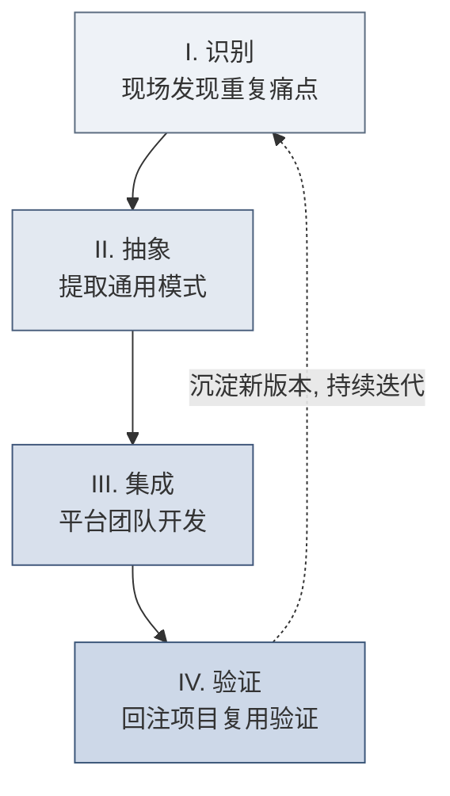
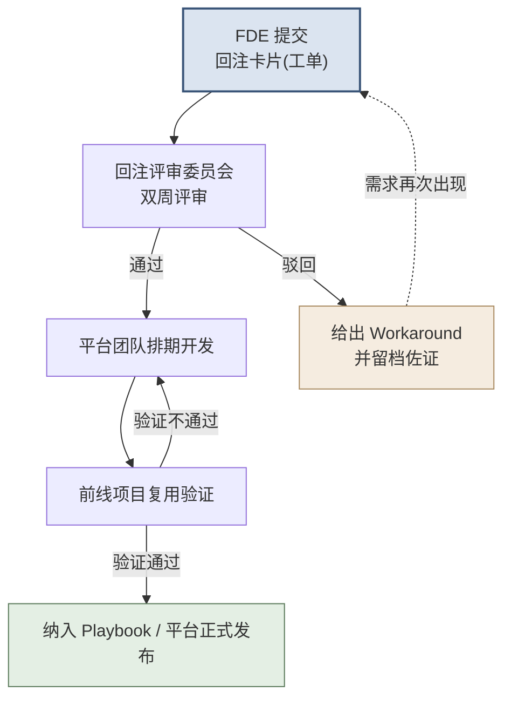

## 第9章 能力回注方法论（贯穿四阶段）

> [!NOTE]
> **本章导读：护城河的唯一来源**
> 企业级软件定制化项目的护城河，不在于某一次交付有多漂亮，而在于严格、系统化的**能力回注**机制——即把现场的一次性定制，系统性地"上游化（upstreaming）"、沉淀为平台的通用能力（这一动作在业界也称为 productization，产品化）。这正是 3.4 节"碎石路→铺装公路"那个理念的**工程化落地**——如果说"碎石路→铺装公路"回答了"为什么、往哪走"，本章就回答"具体怎么走"：由谁识别、如何抽象、怎么并入平台、如何度量。
> 前八章讲的四阶段方法论，本质上都是在为能力回注服务：Discovery 找到值得沉淀的场景，Prototype 验证抽象的可能性，Build 是回注的黄金窗口，Scale 是回注成果的复用放大器。**没有回注，FDE 就退化为高级外包；有了回注，FDE 才是平台飞轮的引擎。**

### 9.1 四步法：识别→抽象→集成→验证

能力回注不是一句口号，而是一条有明确输入输出的流水线。四个步骤各有其责任人、动作和产出物——**这里的责任人，正是 3.2 节定义的作战单元角色**：现场的技术执行工程师（Delta）与业务策略工程师（Echo）负责"识别、抽象"的前两步，后方的平台工程师负责"集成"，最后由下一个项目的现场团队完成"验证"。前线与后方在此形成闭环。

**I. 识别（Identify）— 责任人：技术执行工程师（Delta）+ 业务策略工程师（Echo）**
- **动作**：两个视角共同判断"这段东西值不值得回注"——
  - **技术执行工程师**从**代码层**识别："这段清洗逻辑/这个模型/这套集成，在上一个客户是否写过？"（技术重复信号）
  - **业务策略工程师**从**业务层**判断："这个痛点在同行业其他客户是否普遍存在？沉淀它未来能覆盖多少客户？"（业务共性与行业普遍性——呼应 2.3 节的判断标准）
  - 技术重复 + 业务普遍，两者叠加才构成一个高价值的回注候选。
- **判断阈值**：套用「五次部署法则」的前置信号——同一模式出现**第 2 次**即登记，出现**第 3 次**即触发抽象评估。
- **产出物**：能力回注日志条目（一句话描述 + 发生频次 + 初步的通用性判断）。

**II. 抽象（Abstract）— 责任人：技术执行工程师（Delta）+ 平台工程师（后方）**
- **动作**：剥离客户特定的硬编码（表名、字段名、业务常量），把它参数化、配置化。核心问题是：“哪些是这个客户独有的？哪些是所有同类客户共有的？”
- **常见抽象手法**：硬编码路径 → 配置文件；if-else 特判 → 规则引擎；专用脚本 → 带参数的模板组件；专用表结构 → 标准 Ontology 对象。
- **抽象的分寸（最考验功力的一步）**：抽象既怕"不足"也怕"过度"。**抽象不足**——只是把 A 客户的代码换个名字，换个客户就用不了，等于没抽象；**过度抽象**——为了应对想象中的所有情况，造出一个参数几十个、没人看得懂的"万能框架"，反而比定制更难维护。经验法则是**"面向已发生的重复抽象，而非面向想象的未来抽象"**：只把已经在 2-3 个客户身上真实出现过的共性提取出来，其余留作配置扩展点，不预先实现。
- **产出物**：能力回注需求卡片（见 9.3，SOP 4）。

**III. 集成（Integrate）— 责任人：平台工程师（后方）**
- **动作**：将抽象后的组件纳入平台主分支，遵循平台架构规范，编写单元测试、API 文档与 SDK 示例。
- **红线**：绝不允许把“客户 A 的定制代码原样搬进平台”。未经抽象的代码进入平台，等于把技术债转移到全公司。
- **产出物**：平台新组件 / 新配置项 + 面向 FDE 的使用文档。

**IV. 验证（Validate）— 责任人：下一个项目的技术执行工程师（Delta）**
- **动作**：在真实的新客户项目中调用该组件，验证其通用性是否成立。若需要大改才能用，说明抽象层级不对，退回第 II 步。
- **闭环标志**：新项目成功复用 → 组件“毕业”，正式进入 Playbook；反哺出的改进意见 → 触发新一轮识别。

> [!WARNING]
> **反面模式：为回注而回注**
> 只出现过 1 次的需求就急于抽象，会造出没人用的“僵尸组件”，反而增加平台维护成本。回注的前提永远是「真实的重复」，而非「想象中的通用」。

### 9.2 回注优先级评估矩阵

不是所有可回注的东西都值得回注。用 **通用性（该能力能覆盖多少未来客户）× 实现成本（平台化开发的工作量）** 构建九宫格，决定“做/缓/不做”。

| | **通用性：低** | **通用性：中** | **通用性：高** |
| :--- | :--- | :--- | :--- |
| **成本：低** | 🟡 顺手做（个人 Utils 库） | ✅ **立即做** | ✅ **立即做（最高优先）** |
| **成本：中** | ❌ 不做 | 🟡 排期规划 | ✅ 立即做 |
| **成本：高** | ❌ 不做（保留为项目定制） | ❌ 暂缓（等更多需求佐证） | 🟡 立项评审（战略级投入） |

**决策口诀：**
- **右上角（高通用 + 低成本）**：无脑做，这是回注的甜点区，投入产出比最高。
- **左下角（低通用 + 高成本）**：坚决不做，留在项目里作为一次性定制，避免污染平台。
- **右下角（高通用 + 高成本）**：需 FDE Lead 与平台负责人共同立项，用 11.6 节的 ROI 公式量化决策。

### 9.3 能力回注需求卡片（SOP 4 复用）

回注需求的标准载体是「能力回注需求卡片」，其完整模板见 7.8 节 SOP 4。这里补充**卡片提交后的处理约定**，使其从“一张表”变成“一个流程动作”：

> [!TIP]
> **SOP 4-补充：卡片提交与流转规则**
> - **提交时机**：Build 阶段每周五下班前，强制提交本周新增卡片（哪怕是 0 张也要说明）。
> - **必填校验**：「通用性评估」与「ROI 预测」两栏留空的卡片，评审委员会直接退回，不予排期。
> - **状态字段**：卡片须带状态标签——`待评审` → `已排期` → `开发中` → `已集成` → `已验证复用`（形成可追踪的生命周期）。
> - **驳回处理**：被驳回的卡片不删除，标记 `暂缓/驳回原因`，作为未来需求佐证的证据留档。

### 9.4 回注流程与组织保障

回注若只靠一线工程师的自觉，必然失败。它需要制度化的流程和明确的组织角色来保障。

**组织保障要点：**
1. **回注评审委员会**：固定成员应包含至少 1 名资深平台架构师、1 名 FDE Lead、1 名产品经理；**双周**评审一次，避免卡片积压。
2. **代码准入 Review**：任何试图并入平台主库的代码，必须通过平台架构师的严格 Code Review（见 11.6 节代码审核机制）。
3. **20% 回注时间制度**：呼应 11.4 节的「20% 回注法则」，Build 阶段强制划拨 20% 工时用于抽象重构，并写入项目排期，而非“有空再说”。
4. **激励挂钩**：将回注贡献度纳入高级别工程师的绩效考核（呼应 12.3 节 Playbook 贡献考核），让“愿意为后人铺路”的人得到回报。

### 9.5 回注 KPI 与度量体系

没有度量就没有管理。以下四个指标构成回注健康度的仪表盘，建议按季度跟踪其**趋势**（而非绝对值）。

| KPI 指标 | 定义与计算方式 | 健康信号 |
| :--- | :--- | :--- |
| **能力回注率** | $\text{回注率} = \dfrac{\text{成功并入平台主线的通用组件数}}{\text{项目中识别出的可回注点总数}}$ | 关注**逐季上升的趋势**，而非某个固定阈值 |
| **项目复用率** | $\text{复用率} = \dfrac{\text{新项目复用的已有平台组件量}}{\text{新项目交付的总组件量}}$ | 随飞轮成熟持续走高（本教材设定的转型目标：能力积累期突破 60%，见 14.6） |
| **交付效率趋势** | 同类型项目的平均交付周期同比缩短幅度 | 呼应经验曲线，第 N 个项目周期持续下降 |
| **路线图影响力** | 平台版本迭代中，由 FDE 一线反向驱动的 Feature 占比 | 反映“前线经验→平台演进”通道是否畅通 |

> [!NOTE]
> 上表"健康信号"中的量化目标（如复用率 60%）是本教材为转型企业设定的**参考目标值**，非行业统一基准。各团队应结合自身平台成熟度设定基线，**重在跟踪趋势方向，而非攀比绝对数值**。

> [!IMPORTANT]
> **度量的陷阱**：切忌把「回注卡片提交数量」当作 KPI 去考核一线，否则会诱发“为凑数而提交”的低质量卡片。真正应考核的是**下游的复用率**——只有被别人真正用起来的回注，才算创造了价值。

#### 9.5.1 行业通用指标补充（第二层：交付与客户成功）

9.5 的四指标回答的是"**平台飞轮健康度**"（能力有没有沉淀、有没有被复用——FDE 模式的内因）；这里补充四个**行业通用指标**，回答"**交付与客户成功**"（客户感受到的价值——飞轮运转的外果）。两层的关系是：**飞轮转得好，外果自然好**；第二层指标是第一层的结果验证，不作为对一线 FDE 的单一考核（防止为了压 TTFV 牺牲复用，与 1.3 节"卖能力"矛盾）。

| 补充指标 | 定义 | 说明 |
| :--- | :--- | :--- |
| **TTFV（Time to First Value，首次价值交付时间）** | 合同签署 → 客户首次从系统获得可量化业务价值的时间 | 交付效率最直接的衡量；政企场景尤其看重（可与 14.5 的 PoV 前置呼应） |
| **Customer Health Score（客户健康度）** | 使用活跃度 + 增购意向 + 关系质量的综合评分卡 | 常见于客户成功平台（如 Gainsight）；用于识别"沉默客户"提前干预 |
| **NPS / CSAT** | 净推荐值 / 客户满意度 | 非 FDE 特有，但应作为团队考核的基础指标 |
| **定制/平台代码比** | 每次交付中定制代码量 ÷ 复用平台代码量 | 飞轮健康度的"最简版"；目标随项目数**逐项目递减**（呼应 2.3 经验曲线） |

> [!NOTE]
> **两层指标的使用口径**：第一层（9.5）用于**平台/产品线**季度复盘（回注是否有效）；第二层（9.5.1）用于**交付团队/客户成功**复盘（客户是否真的受益）。两组数据应能互相印证——若复用率上升而 TTFV 没有缩短，说明回注沉淀了能力但没传导到客户价值，需检查交付流程而非指标本身。

> [!TIP]
> **本篇小结**
> 流程篇把 FDE 交付拆成了可执行的两条轴：**时间轴**（Discovery→Prototype→Build→Scale 四阶段，每阶段有目标、活动、交付物与 Gate）与**内容轴**（People/Process/Technology 三维度同步推进），并以贯穿四阶段的**能力回注**为护城河核心（识别→抽象→集成→验证）。这套 SOP 与工具（利益相关者地图、数据盘点、快赢矩阵、回注卡片、Gate 清单等）是全书最"可落地"的部分。**但流程再好，最终要靠人来执行。** 什么样的团队、什么样的角色、如何协作与培养，是下一篇（团队篇）的主题。

### 本篇收尾 · 甲乙方对照：谁来验收

流程篇是全书最实操、读者期待最高的部分——读者要的是一套"拿到就能用"的 SOP。但在所有这些清单、Gate 与冲刺的背后，有一个贯穿始终、甲乙双方摩擦最集中的环节：**验收**。同一件事，甲方和乙方对"什么算做好、谁说了算、什么时候验"的理解往往天差地别。下面用三组问答，把流程篇的验收视角掰开揉碎。

#### 甲方这么问 → 乙方这么答

**① "你们说做好了，我怎么知道？"**

> **乙方这么答**：光靠嘴上说"做好了"当然不够，这也是 FDE 模式刻意避免口头信任的原因。我们采用**四阶段 Gate 联合评审**——Discovery、Prototype、Build、Scale 每个阶段结束，都有一张明确的 Gate 检查清单（见第 5.7 节），由甲乙双方坐在一起逐项核对，而不是乙方自说自话地宣布"完成"。同时配上**可量化的成功指标**（见 9.5.1 的 TTFV「首次价值交付时间」与客户健康度），用数据说话：什么时候首次让贵方拿到可量化的业务价值、用了多少时间，白纸黑字摆出来，比任何承诺都有说服力。

**② "为什么不能最后一次性验收？"**

> **乙方这么答**：因为"最后一次性验收"正是很多项目死在半路的元凶。如果憋三个月才让你看一次，你在这三个月里得不到任何阶段性成果，就很容易开始怀疑、抽调资源、砍预算——这也就是第 5 章说的"第六周死亡"。所以我们用**短周期冲刺的节奏纪律**（见 5.8）把交付切成每 2 周一个、看得见、能演示、可验收的增量，配合每个冲刺一次轻量 Gate 评审。这不是为了给你添麻烦，恰恰相反——它是让贵方在每个时间点都能看到进度、掌控风险，而不是把宝全押在最后一次翻盘上。

**③ "验收标准谁说了算？"**

> **乙方这么答**：**既不是你单方面定，也不是我单方面定，而是甲乙共同定义成功标准。** 验收标准必须在项目早期就由双方一起写清楚——做什么、做到什么程度算"好"、用什么指标衡量，白纸黑字固化下来，而不是等做完再争。这套共同定义成功标准的机制，可以落到第 15 章 15.2《FDE 协作共识书》里，作为开局就签好的"游戏规则"。一旦标准是双方共同约定的，验收就从"甲乙对赌"变成"共同对表"——矛盾大大减少，摩擦自然降低。
