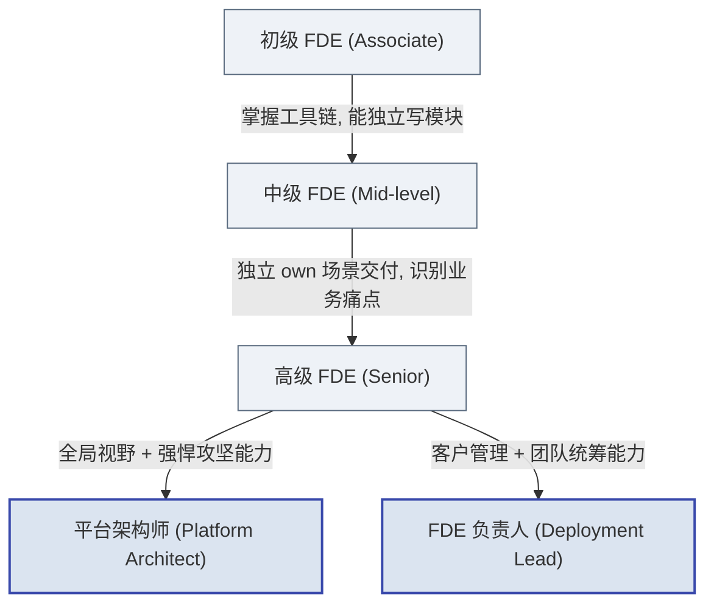
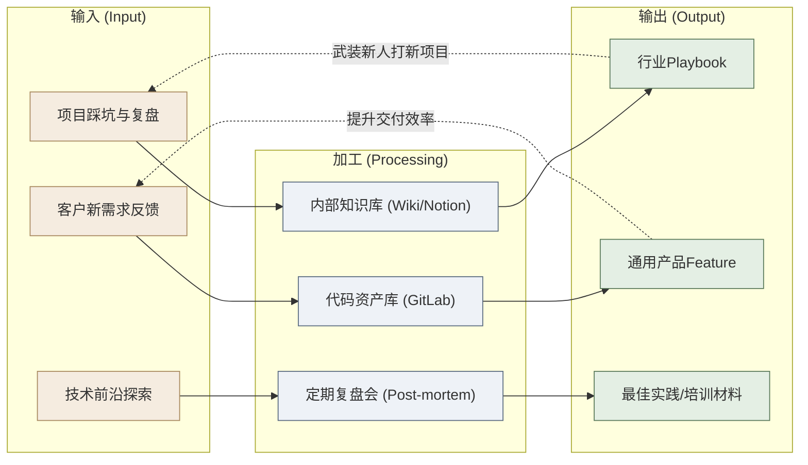

## 第12章 FDE人才培养与知识管理

> [!NOTE]
> **本章导读**：第10章解决了"团队由哪些角色构成"，第11章解决了"这些角色在四阶段如何协作"，本章解决最后一个、也是最难持续的问题——**这些人从哪来、如何成长、经验如何沉淀为组织资产**。如果说前两章是"排兵布阵"，本章就是"练兵与建军规"：把游击队的个人英雄主义，转化为正规军可复制的战斗力。

打造一支顶尖的FDE团队，不仅需要极高的招聘门槛，更需要系统化的培养机制和知识沉淀体系。游击队的经验必须转化为正规军的军规。

### 12.1 选拔标准与面试要点

**FDE面试与传统互联网工程师面试有着本质差异。** 我们不只需要“会刷LeetCode的做题家”，更需要能在炮火中生存的“通才”。

**先明确选拔标准：FDE 的核心能力画像。** 招聘不是找"最强的程序员"，而是找符合下述画像的复合型人才——它直接对应 10.2 节的五维能力模型：

| 能力维度 | FDE 选拔时看什么 | 反面信号（警惕项） |
| :--- | :--- | :--- |
| **技术硬实力** | 能独立打通数据、写出可运行的端到端方案 | 只会在成熟框架里填空、离开脚手架就束手无策 |
| **业务嗅觉** | 能从客户抱怨里听出真痛点、判断商业价值 | 只关心技术是否优雅，不关心解决了谁的什么问题 |
| **沟通与逆商（EQ/AQ）** | 客户不配合、被甩脸色时仍能推进 | 玻璃心、遇阻就甩锅、无法面对模糊与冲突 |
| **学习敏捷度** | 能在几天内速成一个陌生行业的黑话 | 舒适区依赖强，抵触陌生领域 |
| **产品化意识** | 写代码时会想"这能不能沉淀成平台能力" | 只求交付当下、从不考虑复用（易退化为外包心态）|

围绕这份画像，面试重点考察以下**三大核心维度**。以下每道题都是**开放题**——没有标准答案，考的是思路与本能反应，故在题后附"考点解析"，供面试官判断优劣：

1. **极端受限条件下的破局能力**：
    - *传统面试*：“请手写一个红黑树反转。”
    - *FDE面试*：“假设你周一到了客户现场，发现他们不提供外网，只能用堡垒机，且数据库是10年前的Oracle，版本老旧没有API文档，周五必须给CEO做可视化Demo，你将如何度过这5天？”
   > [!TIP]
   > **考点解析**：考的是"在垃圾条件下也能交付"的破局本能，而非技术完美主义。
>
   > - **加分信号**：先问"CEO 最想看到什么"（结果导向，抓重点）；接受用脏办法过渡（如先导 Excel/建视图，而非死磕 API）；懂得砍范围、只做一个能打动人的闭环；主动规划这 5 天每天的里程碑。
>
   > - **减分信号**：一上来就纠结"没有 API 文档没法做"、要求先补齐环境/文档才能开工；追求架构优雅而排期到两周后；不问业务目标就闷头写代码。

2. **沟通与逆商（EQ/AQ）**：
    - “当你需要某个核心业务数据，但客户IT部门的主管认为你们侵犯了他的领地，拒绝提供数据字典，你如何在一个月内打破僵局？”
   > [!TIP]
   > **考点解析**：考的是面对"人的阻力"（而非技术阻力）时的组织博弈能力——这正是区分 FDE 与纯码农的关键。
>
   > - **加分信号**：先理解对方为何抵触（KPI？安全担责？被架空的失落？）；把对方从"阻碍者"转化为"共赢者"（如让 IT 主管成为项目的联合署名人/审计方）；懂得借高层 Sponsor 施压但不撕破脸；有 Plan B（先用部分数据跑出价值再反向争取）。
>
   > - **减分信号**：第一反应是"向上投诉/让领导压他"；或干脆绕过 IT 私下搞数据（埋合规雷）；或束手无策、认为"这不是我该管的事"。

3. **快速学习能力（Learning Agility）**：
    - “给你30分钟阅读一份重资产工业企业（如 Airbus 的制造工艺流程、或 BP 的油气生产运营）的行业财报和流程图，然后向我解释他们的核心降本增效逻辑。”
   > [!TIP]
   > **考点解析**：考的是"快速进入陌生行业、抓住业务本质"的能力——FDE 每换一个客户就要重来一次。
>
   > - **加分信号**：30 分钟内能抓住这个行业的"钱从哪来、成本大头在哪、卡点在哪"；能用自己的话把复杂流程讲成一句话；会主动追问"哪个环节的数据最可能带来价值"。
>
   > - **减分信号**：陷入术语细节复述、抓不住主线；只会照本宣科念财报数字；无法把行业知识和"数据/软件能帮上什么忙"联系起来。

#### 12.1.1 招聘市场与薪酬竞争力

**定价逻辑：FDE 约等于"大号全栈工程师"。** 它要求同时具备生产级工程能力（对标后端高级工程师）与客户现场的业务抽象能力，其薪酬应**对标后端高级工程师的上沿乃至资深全栈**，而非实施/交付工程师。按 2026 年国内一线城市口径：**初级 FDE 年薪 25–35 万；成手 FDE 以年薪 40 万为基准线；资深/带队 FDE 50 万+**。若按"实施工程师"定价（月薪 15–18K 档），必然招不到复合型人才——这也是多数乙方"转型 FDE 却无人可用"的直接原因。

**人才来源（按优先级）**：

1. **互联网大厂后端/全栈工程师**（主力）：工程能力达标，补业务抽象与客户沟通；
2. **行业 ISV 资深实施/顾问**：懂行业与客户，补工程能力与平台认知；
3. **前咨询顾问转技术**：沟通与结构化能力强，补代码能力（可先入 Echo 序列）。

**双通道晋升（对标 Palantir 期权激励与双序列）**：

- **技术专家线**：FDE → 资深 FDE → 首席 FDE / 平台架构师（能力回注产出的主要署名者）；
- **管理线**：FDE → 交付负责人 → 事业部负责人；
- **两线同级同薪**，避免"学而优则仕"式的人才浪费（技术大牛被迫转管理才能加薪）。

**留存机制**：

- **项目分红 / 股权激励**：绑定长期飞轮而非人头计费（呼应 1.3"卖能力"）；
- **客户轮换防倦怠**：12.2 的轮岗机制主要指**角色轮岗**（技术执行↔业务策略）；**客户轮换**（同一角色换客户/行业，防止领域固化与倦怠）的具体安排见 12.6 高驻场行的轮换制度；
- **知识署名与行业影响力**：Playbook 作者署名、行业大会分享机会，满足 FDE 的"创造者"动机。

### 12.2 培养路径

新人入职后，需经历一套严密的带教体系。

*图：FDE 职级进阶双轨——高级阶段后分叉技术线（架构师）与管理线（负责人）*

> [!NOTE]
> 晋升的**触发条件是能力标志而非年限**（各级能力标准见 10.3）。图中箭头标注的是"跨级所需能力"，而非"必须熬满几年"——能力达标者可加速晋升。

**培养机制要点**：

- **Bootcamp（新兵营）**：为期2-4周的高压封闭训练，模拟真实的烂尾项目，要求新人在模拟客户（由老员工扮演）的刁难下完成交付。
- **Buddy & Mentor（双轨导师制）**：Buddy（入职1-2年的师兄）负责日常答疑和代码规范；Mentor（资深高管或Lead）负责每季度的职业规划与心理疏导。
- **轮岗机制**：鼓励技术执行与业务策略师在职业生涯早期进行3-6个月的轮岗，培养同理心。

### 12.3 Playbook（标准作业手册）体系建设

**Playbook（作战手册）**是FDE团队最重要的知识资产。它将隐性知识显性化，是从“手工作坊”走向“工业化交付”的关键。

**Playbook的核心构成**：

1. **行业全景图**：如“零售快消行业数据治理现状图”。
2. **标准数据本体（Standard Ontology）**：预定义好的数据表结构与关系模型。
3. **交付SOP流程**：从Kick-off到上线验收的完整检查清单（Checklist）。
4. **技术架构模板**：可一键拉取的代码脚手架（Boilerplate）。
5. **避坑指南（FAQ & Anti-patterns）**：记录历史上踩过的血泪坑。

**建设与维护机制**：

- **从零到一**：由第一个啃下该行业大客户的 FDE 负责人主笔，提炼MVP经验。
- **动态更新**：将其视为内部开源项目。任何人在新项目中发现了更优解，都可以通过Pull Request（PR）的方式修改Playbook。对Playbook贡献度纳入高级别员工的绩效考核。

### 12.4 知识管理架构

知识如果在团队内部不流转，就是一堆死数据。我们构建了以下的知识管理飞轮：

*图：知识管理飞轮——输入经加工沉淀为输出，输出又以反馈线回哺新一轮输入*

### 12.5 Demo Day与跨项目学习机制

当团队规模超过50人，各项目组极易沦为信息孤岛。“在A城商行造过的轮子，B农商行的团队又重新造了一遍。”

**破除孤岛的利器：Demo Day（演示日）**

- **定义**：每月度强制举办的全员技术与业务分享大会。
- **组织形式**：
    - 每个战区/项目组选派代表，在15分钟内，用最直观的方式（直接跑系统，拒绝纯PPT）展示本月最得意的功能突破或业务价值实现。
    - 评委由CTO、平台研发负责人及资深业务策略师组成。
- **核心目的**：
    - **技术炫耀与认同**：给前线苦战的工程师一个“装X”的舞台，极大地提振士气。
    - **寻找回注灵感**：平台工程师坐在台下，像星探一样，从各组的Demo中寻找可以做进标准产品的通用Feature。

**其他辅助机制**：

- **内部技术博客（Tech Blog）**：鼓励记录深入的技术思考，每月评选“最佳博文”。
- **无边界沟通频道（Slack/飞书）**：设立 `#fde-sos`（紧急求助频道，任何难题必须在15分钟内有人响应）、`#fde-brags`（吹牛频道，分享客户的点赞或漂亮的数据图表）。

---

### 12.6 HR 专属视角：组织设计与"人+算力"规划

> [!NOTE]
> **本节读者**：前五节面向技术与业务团队，本节专门写给甲方/乙方的 **HR 总监与组织设计者**。FDE 模式带来的不只是技术接入，更是一套组织与人的变革——本节讨论的是"人"这一侧如何设计与规划（呼应调研报告"团队篇"对 HR 关切点的强调）。

**驻场强度×团队配置模型。** AI 时代的 FDE 团队不再只有"全驻场"一种形态，驻场强度决定团队如何配置、后方如何补位。参考公开口径：Palantir 工程师有**相当比例**的时间在客户端工作，部分医疗 AI 公司（如 Commure）的 FDE 驻场比例甚至**过半**（据调研报告引述，具体比例出处待核验，引用前请核实）。据此可将驻场强度分为三档，各档团队配置建议如下（可呼应 11.8 跨区域协作机制）：

| 驻场强度 | 适用场景 | 前方 FDE 人数 | 后方 PDE/平台工程师配比 | 远程协作机制（呼应 11.8） |
| :--- | :--- | :--- | :--- | :--- |
| **低驻场（≤25%）** | 客户数据相对规整、流程标准化的规模化复制场景 | 前方人数较少，1–2 名 FDE/客户为常态 | 大后方（PDE/平台工程师）为核心，可做到 1:4 以上的厚后方比 | 靠 Playbook 与标准数据本体（12.3/12.4）支撑批量交付，前方只做轻量现场协调 |
| **中驻场（25–50%）** | 行业 Know-how 要求高、需高频业务对齐的客户 | 前方 2–5 名 FDE/客户，"前线联动"模式 | 后方配比约 1:2，平台工程师按项目驻点轮换 | 建立异步时区接力、每周现场/远程混合站会，前线把踩坑回注后方平台 |
| **高驻场（≥50%）** | 数据极度混乱、需贴身陪伴客户"从零到一"的攻坚场景 | 前方 FDE 为绝对主力，可整编 5 人以上小队常驻 | 后方配比低至约 1:1，作为"炮火支援"按需增援 | 应急预案与**客户轮换制度**（每 4-8 周轮换驻场人员，呼应 11.8.5），避免驻场人员长期单点耗尽 |

**组织政治张力（HR 必须正视）。** 对接 FDE 的甲方员工往往被要求投入更多时间（陪同梳理数据、参与需求澄清、配合联调），同时还可能是流程自动化之后**最先被替代的岗位**。这不是技术问题，是组织政治问题——如果 HR 回避它，被替代的焦虑会成为推行 FDE 的最大隐性阻力。HR 需要设计**"参与 FDE 项目的激励与再培训机制"**：把参与项目作为晋升与绩效的加分项，为受影响岗位铺设再培训通道，让"被替代焦虑"转化为"转型机会"。

**"硅基劳动力"与"人+算力"混合规划。** 当 AI Agent 与人类员工成为同等重要的组织资产，HR 规划需要从"人"转向"人+算力"的混合视角。二者并非零和：**人负责判断、责任与客户关系**（承担最终决策与关系维护），**Agent 负责重复执行**（承接可标准化、可自动化的流程）。因此 HR 的编制与预算设计，应从"招多少个全职人力"扩展为"规划多少类 Agent 能力 + 多少复合型人力"，并为两者同时建立能力评估与治理机制。

**薪酬与薪资倒挂数据。** 2026 年 7 月的公开报道显示，字节跳动"FDE 专家"月薪开至 **3.5 万–7 万元、全年 15 薪**（年薪最高预计约 105 万元），阿里云智能给出 **2 万–5 万元月薪、全年 16 薪**，普遍高于同级别研发，出现**薪资倒挂**（来源：界面新闻/新浪财经《大厂正在花百万年薪抢人，FDE 到底是什么？》，2026-07）。这与本教材 12.1.1 的"成手 FDE 年薪 40 万基准"互相印证：所引公司年薪区间整体覆盖了 40 万基准所在的量级（字节中低档、阿里中档约对应成手，高频档对应资深/带队区间）。这类数据对 HR 设计岗位体系、说服管理层批预算有**直接参考价值**——它既是人才稀缺的市场信号，也是"贵有贵的道理"的议价依据。

### 12.7 五角色的进阶路径与 HR 落地（把"人"的制度补全）

> [!NOTE]
> **本节定位**：12.1.1/12.2 已给技术执行线的双通道晋升；本节补全**其余四个角色的进阶路径**，并给出 HR 最关心的**团队预算区间与招聘渠道**——把"团队篇讲了角色、却没讲角色怎么走"的空白填上。

**① 五角色的进阶路径（补全 10.3 只展开技术执行的部分）**

| 角色 | 职级进阶（3-5 年示例） | 关键跃迁条件 |
| :--- | :--- | :--- |
| **业务策略师（Echo）** | 策略师 → 高级策略师 → 首席业务策略师 / 行业解决方案负责人 | 独立主导过 2+ 行业的大客户对齐；能把行业 Know-how 抽象为可复用的"场景方法包"（回注到 12.3 Playbook） |
| **平台工程师（Dev）** | 平台工程师 → 资深平台工程师 → 平台架构师 | 主导过 ≥3 次能力回注集成（9.4 评审）；抽象出的组件被多个项目复用 |
| **基础设施工程师** | 基础设施 → 资深/SRE 负责人 → 交付平台负责人 | 沉淀可复用的部署/信创自动化资产（16.4.5 工具链）；支撑项目从 1 到 N 不塌方 |
| **FDE 负责人（Lead）** | 负责人 → 交付总监 → 事业部负责人 | 带过多项目并行交付且 Gate 通过率高；能把失败复盘（14.9）转化为机制改进 |
| **技术执行（Delta，呼应 12.1.1）** | FDE → 资深 FDE → 首席 FDE / 平台架构师（技术线）或交付负责人（管理线） | 技术线看回注产出的复用率；管理线看多项目交付质量 |

**② 团队预算区间（给 HR 立项用）**

- **单 FDE 全成本**（含薪酬+差旅+工具+后台分摊）：约 **60–100 万元/年**（成手 40 万年薪基准 ×1.5–2.5 系数）；
- **最小作战单元**（1 技术执行 + 1 业务策略 + 0.5 后台支撑，见 10.4）：年预算约 **150–250 万元**；
- **一线城市 vs 二线**：二线团队薪酬可低 20–30%，但需补贴差旅（跨省驻场高频时总成本可能打平）——预算决策别只看月薪，要算"驻场强度×差旅"（呼应 12.6 驻场模型）。

**③ 招聘渠道与漏斗（把 12.1.1 的"人才来源"落地为操作）**

- **渠道优先级**：内部转岗（实施/售后转 FDE，文化匹配度最高）> 大厂后端/全栈工程师猎头定向 > 社区/开源贡献者（技术认同感强）> 校招（从"培养潜力"选人，走 12.2 带教体系）；
- **招聘漏斗参考**：100 份简历 → 15 人技术面（笔试：生产级代码 + 业务抽象题）→ 5 人业务面（行业场景分析）→ 2-3 人 Offer；**关键技术关**是"能否在 30 分钟内把一个陌生行业痛点讲成可落地技术路径"（呼应 12.1 面试设计）；
- **谈薪对标**：用 12.6 的字节/阿里云数据 + 12.1.1 的 40 万基准做锚，避免"按实施工程师定价招不到人、按架构师定价超预算"两个极端。

> [!IMPORTANT]
> **一句话**：团队篇的角色体系要落地，靠的是**"每类角色有路可走（进阶）、每支团队算得清账（预算）、每个人找得到门（渠道）"**——12.7 把这三件事补成可执行制度，与 12.1–12.6 一起构成完整的"人"的闭环。

---

### 本篇收尾 · 甲乙方对照：谁的岗位会被替代

> [!NOTE]
> 本节是"团队篇"的收尾专栏（不占编号）。同一个问题，甲方和乙方的关切往往不同——这里把团队篇最尖锐的三个问题摆出来，甲方怎么问、乙方怎么答。这种"组织内部权责博弈比技术方案更复杂"的张力，正是贯穿全书的暗线。

**Q1：你们 FDE 进场，我们的人会不会被裁？**

- **甲方这么问**：既怕 FDE 是来"替代我们"的，又怕不合作就被边缘化。
- **乙方这么答**：诚实回答——重复性、可标准化的岗位确实会被 Agent 替代，这一点不值得粉饰。但 FDE 进场恰恰带来**"人+算力"重组机会**：原岗位的人可以从"重复执行"升级为"判断、责任与客户关系"（呼应 12.6 的混合规划）。前提是 HR 同步设计再培训与转型通道，否则这种机会只会变成阵痛。我们不只交付系统，更帮你把这批人放到价值更高的位置上。

**Q2：我们能不能自己建一支 FDE 团队？**

- **甲方这么问**：看到了 FDE 的价值，想内部自建，摆脱对乙方的依赖。
- **乙方这么答**：可以用 12.6 的**驻场强度×团队配置模型**来对标自己：
    - 如果你的驻场强度需求低（≤25%）、数据复杂度可控，自建的边际成本相对低，可以考虑；
    - 如果数据极混乱、需要高驻场贴身攻坚（≥50%），自建团队的人手、培养与平台投入都很大，建议先外部合作。
    - **自建 vs 外部合作的分界**，就看两条：**甲方数据的复杂度**、**组织的准备度**（是否有成熟的双通道晋升/知识管理机制，呼应第15章 15.5 的组织准备度评估）。组织没准备好时，自建往往变成"换牌子的外包"。

**Q3：FDE 这么贵，值吗？**

- **甲方这么问**：看到薪资倒挂、人天报价高，第一反应是"这也太贵了"。
- **乙方这么答**：贵在**复合能力**，而非人头。参考 2026 年 7 月公开报道的字节"FDE 专家"月薪 3.5–7 万、15 薪，及阿里云智能 2–5 万、16 薪的定价（来源：界面新闻/新浪财经），以及本教材 12.1.1"成手 FDE 年薪 40 万基准"——它同时要具备生产级工程、行业抽象与客户博弈三类能力，天然比单一角色贵。而且 FDE 应**按价值而非人头计费**（呼应 1.3"卖能力"）：它交付的是"能复用的平台能力 + 打通业务的闭环"，不是按人天堆工时。算账时要算它为整个客户池带来的复用杠杆，而不是某一个项目的人天成本。

---

> [!CAUTION]
> **警示**
>
> 团队建设与知识管理并非一日之功。切忌将这些SOP变为死板的KPI工具。FDE团队的灵魂在于“拥抱混乱中的秩序”，赋予一线作战人员最大的自主权与炮火呼叫权，才是发挥这套角色体系最大威力的密码。

> [!TIP]
> **本篇小结**
> 团队篇回答了"谁来干、如何协作、如何成长"：五大角色（技术执行/业务策略/平台/负责人/基础设施）对标 Palantir 的真实序列；RACI 矩阵界定了四阶段中权责的动态漂移；人才篇给出了选拔画像、培养路径与 Playbook 知识管理。至此，**What、Why、How、Who 四个问题已成体系**。**最后一个问题是：这套源自 Palantir 的方法论，放到中国市场行得通吗、该如何本土化？** 这正是收官的第五篇（中国实践篇）要回答的。
