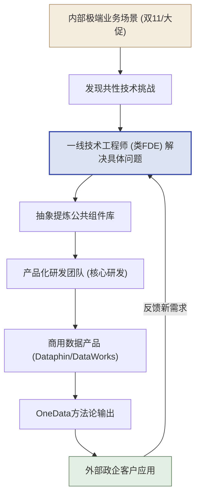
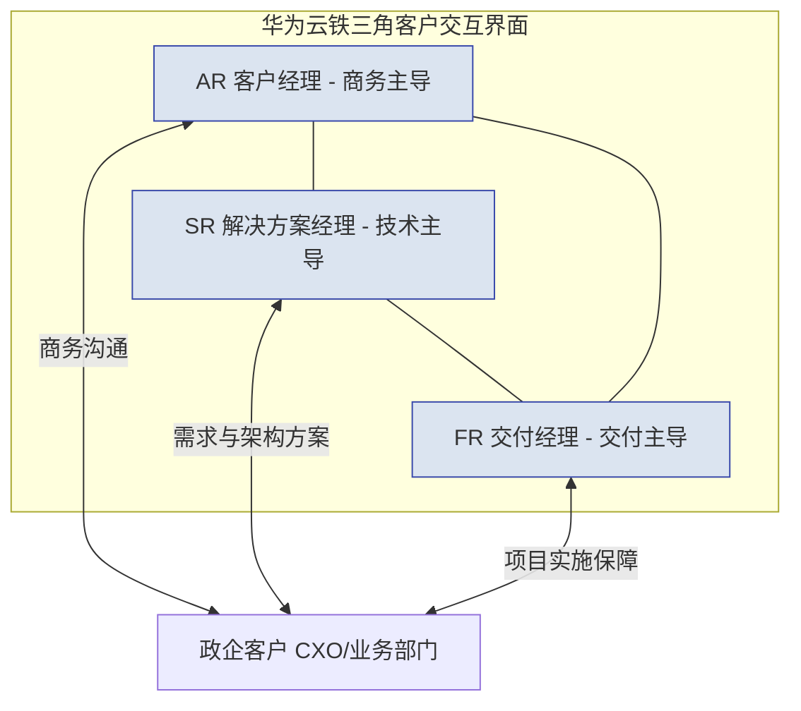
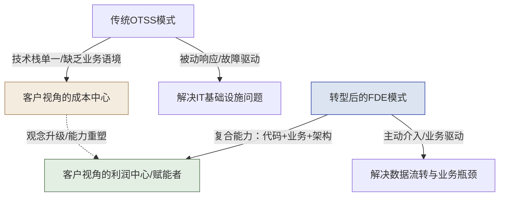
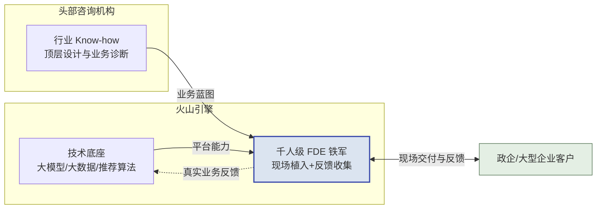

# 第五篇：中国实践篇 — 本土云厂商的探索与FDE转型挑战

> [!NOTE]
> **本篇导读**
> 
> 无论标杆篇里 Palantir 的模式多么惊艳，它毕竟生长于欧美的政企土壤——在中国，头部云厂商基于各自的组织基因，演化出了形貌各异的"类 FDE"实践。对于高管而言，本篇以统一框架横向剖析阿里云、华为云、腾讯云、火山引擎四家的强项与短板，为制定本土化 FDE 战略提供决策依据；对于中层管理者，本篇提供了产品线与交付团队整合的路径、能力回注机制落地的参照系；而对于一线工程师，本篇则是一张识别所在体系"类 FDE"成熟度、规划个人转型路线的作战地图。

---

## 第13章 中国云服务商的FDE实践图谱

> [!NOTE]
> **本章导读**：把镜头从 Palantir 转向中国——阿里云、华为云、腾讯云、火山引擎四家头部厂商，基于各自基因演化出了形貌各异的"类 FDE"模式。本章用统一框架（PPT + 能力回注 + 飞轮阶段 + 卖人力/能力）横向剖析四家，看它们各自的强项与短板，为下一章的转型挑战与应对做铺垫；并附各家可公开引用的案例锚点与代表案例的深度剖析。**读完本章，你能用同一把尺子衡量任何一家中国厂商的"类 FDE"成熟度，预判它转型的卡点在哪。**

在探讨中国市场的实践时，我们必须认识到：Palantir的FDE模式并非凭空产生，它是对复杂数据场景和极高业务要求的极致响应。国内以阿里云、华为云、腾讯云和火山引擎为代表的头部大厂，基于各自的组织基因，演化出了形貌各异但内核相通的技术交付模式。本章将对这四家厂商的实践图谱进行深度剖析。

> [!IMPORTANT]
> **统一考察框架：用同一把尺子量四家。**
> 为避免"各讲各的"，本章对四家厂商的考察，统一沿用前文已建立的核心模型作为透视镜——每家在 13.x.3"关键启示"小节都会用它点评强弱项，13.5 则用它做横向对比：
>
> - **PPT 三维度**（People / Process / Technology，见第三篇 How 总纲）——看这家的团队、流程、平台底座各处于什么水平、是否均衡；
>
> - **能力回注机制**（见第9章）——看它"现场经验 → 平台能力"的通道是否通畅，这是护城河的核心；
>
> - **飞轮阶段**（见 2.3 节）——看它处于飞轮的启动期、加速期还是成熟期；
>
> - **卖人力 vs 卖能力**（见 1.3 节主线）——看它本质上还在按人头卖交付，还是已转向卖可复用的平台能力。
>
> 一句话：**四家的差异，本质是它们在这套模型的各维度上"各有偏科"**——没有一家像 Palantir 那样五维均衡且互相咬合，这正是中国厂商共同的转型课题。

### 13.1 阿里云：TAM + AI FDE + OneData能力回注

作为国内云计算的开拓者，阿里云的技术服务体系经历了最为完整的演进周期。其核心特征在于建立了一套多梯次的技术服务矩阵，并通过极其强大的内部业务场景（如双11）打磨数据产品，最终向外部输出。

#### 13.1.1 阿里云的多梯次服务模式
从组织架构上看，阿里云构建了面向客户全生命周期的复合型技术交付阵型：

- **TAM（技术服务经理，Technical Account Manager）**：聚焦于企业级客户的专属技术服务，承担整体架构规划和技术治理闭环（对标Palantir 客户成功负责人/部署主管）。
- **SA（解决方案架构师，Solution Architect）**：偏向于售前与售中阶段的技术方案设计、架构蓝图绘制及实施指导（对标Palantir 架构师）。
- **驻场工程师**：负责现场的日常运维、系统保障和按部就班的项目实施。
- **面向AI的FDE模式（探索期）**：在大模型时代，阿里云组建了深入企业业务一线的敏捷团队。技术执行工程师（对标Palantir FDE）直接进入客户现场，协助企业进行算力平台适配、RAG（检索增强生成）系统搭建和垂直模型微调。

> [!IMPORTANT]
> **高管视角（战略层）**：TAM+SA的组合确保了项目“能签下来”并“有规划地落地”，而AI FDE的引入则是为了在大模型时代打破SaaS/PaaS的标品局限，贴近客户最后一公里解决高价值业务痛点。
>
> **一线视角（实操层）**：工程师不仅要懂底层云资源的调度（ECS/MaxCompute），更要懂客户业务侧的数据流向，能够利用Python或Java快速编写胶水代码连接阿里云各种API。

#### 13.1.2 能力回注机制：从业务外化到OneData体系
阿里云最接近Palantir核心理念的地方在于其**能力回注**机制。Palantir强调“在泥土中挖金”，阿里云同样擅长“吃狗粮”式演进。

阿里巴巴内部双11等大促场景淬炼出了极其复杂的数据中台能力。这些内部打磨的能力，逐步沉淀为 DataWorks、Dataphin、Quick BI 等标准化商业产品。其中最著名的是 **OneData体系**：

- **OneModel（统一数据模型）**：规范业务域和数据域的映射。
- **OneID（统一实体识别）**：跨系统整合用户/对象身份。
- **OneService（统一数据服务）**：将数据资产API化，向应用层输出。

*图：阿里云从内部极端场景外化产品，经类FDE一线验证到外部客户应用的能力回注闭环*

**典型本土案例**：

- **某省政务数据中台**：通过OneID打通了社保、公安、交通等几十个委办局的孤岛数据，实现“最多跑一次”。
- **某快消企业全链路数据中台**：打通线上电商与线下门店库存，构建统一的消费者画像。
- **某零售企业数字化转型**：运用OneService将订单和库存服务API化，支撑前端小程序的高并发查询。

#### 13.1.3 FDE视角的关键启示
1. **内部场景外化是最高效的能力回注**：阿里云最成功的能力回注并非来自外部定制项目，而是内部业务场景的外化。
2. **产品化程度深**：在国内云厂商中，阿里云的数据中台工具链（Dataphin等）产品化程度是最高的，极大地降低了前线交付工程师重复造轮子的成本。

> [!TIP]
> **框架透视（阿里云）**：
>
> - **PPT**：**Technology 最强**（OneData/Dataphin 产品化领先），People/Process 相对标准化、偏工具依赖。
>
> - **能力回注**：通道最顺畅——但走的是"内部业务（双11）→中台→商业化"的**自研外化路径**，而非"外部客户现场→回注"的 Palantir 路径。
>
> - **飞轮阶段**：成熟期（底座厚、复用率高）。
>
> - **卖人力/能力**：已明显偏向**卖能力**（卖产品化的中台）。
>
> - **短板**：前线 FDE 的现场定制灵活性受限于标准化工具，"从客户现场挖金"的能力弱于内部场景外化。

---

### 13.2 华为云：铁三角 + DataArts + 行业深耕

华为云的技术交付深深烙印着其ICT时代的B2B基因，最著名的管理实践即“铁三角”模型，这是一种高度组织化、纪律严明的阵地战打法。

#### 13.2.1 华为的铁三角模式 (Iron Triangle)
面对大型政企客户，华为在前端配置了三个核心角色协同作战：

- **AR (客户经理, Account Representative)**：负责客户关系和商务闭环。
- **SR (解决方案经理, Solution Representative)**：最接近FDE的角色，负责洞察业务痛点并输出整体技术方案（对标Palantir 部署主管/架构师）。SR不仅需要极强的技术底蕴，更需要具备与客户CXO级别对话的商业视角。
- **FR (交付经理, Fulfillment Representative)**：负责项目的生命周期管理、资源协调与实施交付。

*图：华为云AR/SR/FR三角色以统一界面协同，对政企客户形成铁三角闭环交付*

> [!NOTE]
> 铁三角的精髓在于“打破部门壁垒，向客户提供统一接口”。客户感受到的是一个完整的作战单元，而不是松散的销售和交付拼凑。

#### 13.2.2 核心产品与能力回注：DataArts Studio
华为将自身20多年的内部数据治理经验（尤其是跨国多业态的数据治理）沉淀为 **DataArts Studio（数据使能平台）**。该平台涵盖了数据目录、数据质量、数据安全等各个环节。

**典型本土案例**：

- **某城市智慧城市IOC（智能运营中心）**：早期由一线SR主导设计架构，后续沉淀为华为云智慧城市标准解决方案，成功在全球100多个城市实现规模化复制。
- **某城商行金融数据中台**：通过DataArts梳理全行数据资产目录，满足银保监会的监管报送要求。
- **某央企数字化转型**：构建“一个数据底座+八大应用场景”，统一全集团的数据标准。
- **某大型制造企业工业互联网**：现场交付团队将生产线物联数据分析逻辑提炼，回注到华为云的工业互联网平台能力中。

#### 13.2.3 FDE视角的关键启示
1. **组织化与体系化优势**：铁三角模式将商业、技术和交付强行绑定，确保了从方案设计到落地的不变形，这对松散的FDE团队治理有极大借鉴意义。
2. **SR角色的局限性**：SR虽然在架构和商业洞察上强大，但在传统模式下偏向“架构设计和方案售前”，往往缺乏像Palantir FDE那样**亲手写代码、深入脏数据池调优**的深度参与。这导致方案和最终代码实现之间可能存在割裂。

> [!TIP]
> **框架透视（华为云）**：
>
> - **PPT**：**People / Process 最强**（铁三角组织力、纪律严明），Technology（DataArts）扎实但 SR 偏方案设计、少亲手写码。
>
> - **能力回注**：走"行业标杆项目→标准解决方案→全球复用"路径，回注机制体系化，但因 SR 与代码实现割裂，现场经验的回注可能有损耗。
>
> - **飞轮阶段**：加速期偏成熟（智慧城市等已全球复制）。
>
> - **卖人力/能力**：偏**卖能力**（卖标准解决方案），但组织重、灵活性弱。
>
> - **短板**：SR 顶层设计与前线代码闭环之间的割裂，是"方案好但落地变形"的风险源。

---

### 13.3 腾讯云：OTSS→FDE演进 + 智能体时代

腾讯云在技术服务领域的演进，展现了一段从“被动响应”向“主动构建”升级的典型历程，这对于很多正处于转型期的传统IT企业具有直接的参考价值。

#### 13.3.1 模式演进：从被动运维到主动价值创造
- **阶段一：OTSS（驻场技术支持，On-site Technical Support Service）**
  早期的技术服务多为传统的驻场运维，工程师的核心KPI是“系统稳定性”和“工单响应时间”。工作本质是被动响应，无法触及客户核心业务逻辑。

- **阶段二：向FDE（前沿部署工程师）演进**
  随着产业互联网战略的深化，腾讯云开始培养集成“BA（业务分析师）+架构师+研发”的复合型FDE角色。工程师不再只看监控大屏，而是坐进客户的业务办公室，理解什么是GMV、日活和供应链周转率。

*图：腾讯云从被动OTSS运维的成本中心，向主动业务驱动的FDE利润中心演进路径*

#### 13.3.2 智能体（Agent）时代的FDE定位
在当前的大模型与智能体时代，腾讯云为FDE赋予了全新的价值定位。
面对企业海量非结构化数据和复杂的审批流程，FDE负责智能体从“业务设计”、“提示词工程”、“RAG知识库构建”、“API对接部署”到“真实环境迭代优化”的端到端闭环。

> [!TIP]
> **一线转型建议**：传统运维人员向FDE转型，可以从“会写自动化运维脚本”起步，逐步过渡到“用大模型搭建企业内部IT问答智能体”，最后延伸至“开发具备复杂决策能力的业务线Agent”。

**典型本土案例**：

- **某头部消费零售企业**：FDE 团队从传统的门店 POS 系统运维起步，逐步深入商品与会员业务，基于腾讯云数据组件搭建统一消费者数据资产，支撑精准营销与选品决策。
- **某汽车主机厂智能座舱**：借助腾讯云在音视频与 C 端连接上的先天优势，FDE 将车机语音助手与后端知识库打通，构建端到端的座舱智能体。
- **某政务热线智能体**：FDE 主导完成 RAG 知识库构建与提示词工程，将市民咨询的自动应答准确率与首次解决率作为核心业务指标，替代大量重复的人工话务。

#### 13.3.3 FDE视角的关键启示
1. **转型路径的参考性**：OTSS向FDE的演进，打破了“服务就是成本中心”的传统观念，为国内SaaS/PaaS企业现有交付团队转型提供了阶梯式路径。
2. **AI时代的破局点**：智能体（Agent）开发是一个极度非标且需高度贴合业务的领域，这正是FDE发挥“前线代码能力+业务理解”双重优势的最佳战场。

> [!TIP]
> **框架透视（腾讯云）**：
>
> - **PPT**：**Process 正在演进**（OTSS 被动运维 → FDE 主动创造），People 的复合能力（BA+架构+研发）在补齐中，Technology 依托 C 端流量场景组件化。
>
> - **能力回注**：走"C 端流量场景沉淀→技术组件化→前线组装"路径，方向对，但历史交付包袱使回注尚不系统。
>
> - **飞轮阶段**：加速期（转型进行中，尚未完全跑通）。
>
> - **卖人力/能力**：**正处在从卖人力向卖能力的转型途中**——这也是它对国内传统交付团队最有参考价值之处。
>
> - **短板**：历史 OTSS 包袱重，"从成本中心到价值创造者"的观念与能力转型仍需时间。

---

### 13.4 火山引擎：千人级FDE + 咨询联合

字节跳动旗下的火山引擎起步较晚，但凭借敏捷的组织迭代能力和在AI、大数据领域的技术积累，探索出了一条“生态联合+人海战术”与AI商业化紧密结合的道路。

> [!NOTE]
> **关于"千人级 FDE"的表述说明**：该规模为业界对其 FDE/服务团队的**概括描述**，教材编写时未获得可公开引用的一手权威统计佐证（见附录 D 火山段备注），引用时请作为"模式概括"而非确数。

#### 13.4.1 模式特点：“铁军”与咨询联合
火山引擎深刻意识到大模型落地面临的“最后一公里”难题，采用了一种极具侵略性的破局策略：

- **联合头部咨询机构**：火山引擎提供技术底座（云原生、大数据平台、大模型API）和前线工程师，咨询公司输出行业Know-how、数字化转型顶层设计和业务诊断。
- **搭建千人级FDE团队**：将FDE视为AI商业化落地的“铁军”。这支队伍不仅负责将火山的推荐算法、大模型能力植入客户系统，还要在实战中获取最为真实的业务反馈（Feedback Loop）。

这种“技术底座 + 前线铁军 + 咨询外脑”的三方协作，本质上是把 Palantir 内部“平台工程师 + FDE + 业务策略师”的三角，部分外包给了专业咨询公司来补齐行业 Know-how 短板：

*图：火山引擎以技术底座和千人级FDE铁军，联合咨询外脑对客户实现现场交付与反馈闭环*

#### 13.4.2 战略意图与效果
对于火山引擎而言，FDE不仅是交付人员，更是**客户黏性制造机**和**产品反馈收集器**。通过大规模派驻懂AI和数据的FDE，极大地缩短了客户尝试新技术的决策周期，降低了AI接入门槛。

**典型本土案例**：

- **某新能源汽车品牌营销智能化**：FDE 铁军将火山的推荐与大模型能力植入客户的用户运营链路，联合咨询公司梳理“线索—试驾—成交”的转化漏斗，把营销 ROI 作为可量化的交付指标。
- **某消费品牌大模型营销**：借助火山在内容推荐上的算法积累，FDE 帮助客户搭建 AIGC 素材生产与智能投放闭环，缩短营销物料的生产周期。
- **某金融机构智能客服**：由咨询公司做合规与业务流梳理，火山 FDE 负责 RAG 知识库与对话能力落地，在严监管前提下提升自助解决率。

#### 13.4.3 FDE视角的关键启示
1. **创新的规模化路径**：通过与具备业务深度的外部咨询公司联合，弥补了原生云厂商在垂直行业（如汽车制造、医疗生命科学）领域知识储备不足的短板。这是一种“借外脑补短板”的加速策略。
2. **长期隐患与内化需求**：这种人海战术适合大模型及AI应用落地的初期阶段（快速抢占山头），但如果不建立像Palantir那样高度抽象的底层平台（如Gotham/Foundry）来实现资产沉淀，长期将面临极高的人力成本侵蚀。**未来必须从“人力密集”走向“资产复用密集”——即把千人铁军踩过的坑，系统性地回注为平台的标准能力，否则团队规模的线性扩张终将撞上人效天花板。这正是 1.3 节“从卖人力到卖能力”这一全书主线在中国厂商身上最真切的写照——火山的挑战，本质就是能否完成从“卖人力”到“卖能力”的惊险一跃（并呼应第 9 章能力回注方法论）。**

> [!TIP]
> **框架透视（火山引擎）**：
>
> - **PPT**：**People 规模最大**（千人 FDE 铁军 + 咨询外脑补行业 Know-how），但 **Technology 的资产沉淀（底座复用）是最大短板**，Process 依赖人力密集而非流程复利。
>
> - **能力回注**：目前以"前线业务反馈→快速迭代 AI/算法"为主，尚未建立"定制→抽象→并入平台"的系统化回注——这是它与前三家的最大差距。
>
> - **飞轮阶段**：**启动期/加速期早段**（靠人海快速起量，飞轮尚未靠资产复用转起来）。
>
> - **卖人力/能力**：**当前仍偏卖人力**（人效天花板明显），能否转向卖能力是其生死线。
>
> - **短板**：五家里 Technology 沉淀最弱，最需补"平台底座 + 能力回注"这一课。

---

### 13.5 四家对比总结

用本章开头确立的统一框架（PPT 三维 + 能力回注 + 飞轮阶段 + 卖人力/能力），把四家放到同一张表里横向对比：

| 评估维度 | 阿里云 | 华为云 | 腾讯云 | 火山引擎 |
| :--- | :--- | :--- | :--- | :--- |
| **模式简称** | TAM + AI FDE | 铁三角（SR/FR/AR）+ SA | OTSS → FDE | 千人 FDE 铁军 + 咨询联合 |
| **People（人/组织）** | 标准化，工具依赖 | ⭐ **最强**：铁三角组织力、纪律严明 | 复合能力补齐中 | 规模最大（千人）+ 咨询外脑 |
| **Process（流程）** | 中台流程成熟 | ⭐ **最强**：方案到落地不变形 | 演进中（被动→主动） | 人力密集，流程复利弱 |
| **Technology（平台）** | ⭐ **最强**：OneData 产品化领先 | DataArts 扎实，SR 少写码 | C 端场景组件化 | **最弱**：底座复用是短板 |
| **能力回注机制** | 内部场景外化（自研路径，最顺） | 标杆项目→标准方案→全球复用 | C 端沉淀→组件化（尚不系统） | 反馈迭代 AI，**未系统化回注** |
| **飞轮阶段** | 成熟期 | 加速期偏成熟 | 加速期（转型中） | 启动期/加速期早段 |
| **卖人力 vs 卖能力** | 已偏**卖能力** | 偏**卖能力**（卖方案） | **转型途中** | **仍偏卖人力** |
| **对标 Palantir 的主要差距** | 前线现场定制灵活性受限于标准化工具 | SR 顶层设计与代码实现割裂 | 历史交付包袱重，转型未跑通 | Technology 沉淀最弱，人效天花板明显 |
| **最该补的一课** | 强化"从客户现场挖金"的前线能力 | 打通 SR 方案与前线代码闭环 | 加速跑通回注、甩掉 OTSS 包袱 | 补平台底座 + 系统化能力回注 |

> [!IMPORTANT]
> **一张表看懂四家的分化**：四家在统一框架下各有偏科——**阿里赢在 Technology、华为赢在 People+Process、腾讯赢在转型路径的参考性、火山赢在 People 规模与速度**。但把五个维度叠起来看，**没有一家像 Palantir 那样五维均衡且互相咬合成飞轮**：阿里回注走的是内部外化而非客户现场、华为 SR 与代码割裂、腾讯转型未跑通、火山 Technology 与回注双缺。**这种"单点强、全局不均衡"，正是中国厂商共同的转型课题**——如何补齐最弱维度、让飞轮真正转起来，就是第14章要回答的问题，也引出 14.8 节的乙方转型行动纲领。

### 13.6 中国 FDE 实践的可引用案例锚点

> [!NOTE]
> **本节用途**：13.1–13.4 的实践描述中，部分结论可锚定以下**公开可查证案例**作为佐证（来源见附录 D）。评分采用审阅组建议的四维框架（**方法论体现度 30% / 可量化成果 25% / 可公开引用性 25% / 中国市场代表性 20%**，满分 20 分，≥14 分可入选直接引用）。评分带主观性，引用时请按第4章章首"数据严谨性说明"处理。

| 厂商 | 案例锚点 | 四维评分（/20） | 可引用性分级 |
| :--- | :--- | :--- | :--- |
| **阿里云** | 雅戈尔×Quick BI：从 16 个系统到 1 个平台，打通全业务数据壁垒 | 15 | **A 级**（官方客户案例页） |
| **阿里云** | 森马×MaxCompute+Hologres+DataWorks 数据中台（官方博客） | 14 | B 级（官方博客） |
| **阿里云** | 德清县城市大脑 2026 年度运维服务（政府采购公告） | 13 | **A 级**（政府公告，但偏运维非交付方法论） |
| **华为云** | CMPak（巴基斯坦）智慧中台：释放数据价值、加速数字化转型 | 14 | **A 级**（官方案例页，海外案例） |
| **华为云** | 华为云×通汇诚泰数据中台签约；海通证券鲲鹏改造 | 13 | B 级（行业媒体） |
| **腾讯云** | 广东政务智能中枢"湾擎"（2026-06 上线，广东省主导，**腾讯云为共建企业之一**，全国首个） | 15 | **A 级**（权威媒体） |
| **腾讯云** | 百望股份×腾讯云共建 AI Agent 产业应用 | 14 | B 级（上市公司公告） |
| **火山引擎** | **奇瑞×豆包大模型接入"小奇同学"**（2026-04）；超 50 个汽车品牌采用豆包 | 16 | **A 级**（证券时报等权威媒体） |
| **火山引擎** | 东风汽车×火山引擎战略合作（豆包上车） | 14 | B 级（行业媒体） |

**可引用性分级说明**：

- **A 级（可直接引用）**：官方客户案例页、政府/国企采购公告、上市公司公告、权威通讯社/证券媒体（如证券时报）——满足"可公开引用"要求，引用时注明出处与时间点；
- **B 级（可引用，需标注报道方）**：厂商官方博客、开发者社区、行业媒体——可用于"官方能力模型佐证"，不宜作为独立事实来源；
- **C 级（方向参考，需脱敏/提炼）**：无公开来源的内部项目——按 4.8 节"教学案例"方式处理（综合提炼 + 明确标注）。

> [!NOTE]
> **关于"评分"与"分级"的关系**：两者维度不同——**评分**衡量"方法论体现度/可量化成果/可公开引用性/中国市场代表性"（加权 30/25/25/20）；**分级**以"来源权威度"为主（官方/政府/上市公司公告= A 级）。因此出现"低分但 A 级"（如德清县城市大脑 13 分：来源权威——政府采购公告，但偏运维、方法论体现度低）或"海外案例入列"（如 CMPak 14 分：作**可复制性参照系**，非中国 FDE 方法论典范）均属正常，请读者按用途取用：**要事实锚看分级，要方法论匹配看评分**。

> [!IMPORTANT]
> **给乙方的用法**：这组锚点不是为了"背书厂商"，而是给读者一个**可核验的坐标系**——当你想判断"某厂商的类 FDE 模式是否真实存在"，用 13.6 的 A 级案例做事实锚，用 13.1–13.5 的分析做方法锚。**引用时请自行核对来源时效**（部分案例为 2026 年报道，后续可能有更新）。

### 13.7 四家代表案例：七段式深度分析

> [!NOTE]
> **分析口径声明**：以下四个案例（四家各选其一）按审阅组建议的**七段式模板**（背景挑战 → FDE 介入 → 技术方案 → 交付过程 → 业务成果 → 能力回注 → 方法论启示）展开。其中**背景、技术方案、业务成果**基于公开来源（附录 D）；**FDE 介入方式、交付过程节奏**等公开报道未披露的内部细节，以本教材方法论视角做**教学化推演**（标注"推演"），读者请勿将其当作可引证的事实细节。量化数字仅保留有公开来源可查证的部分，其余用定性表述。

#### 案例一：阿里云 × 雅戈尔（零售/制造，Quick BI 数据统一）

**1. 背景与挑战**：雅戈尔是集纺织、服装、地产、投资于一体的集团型企业，业务系统长期割裂（公开口径为"16 个系统"），各业务单元数据口径不一，管理层难以获得统一的经营视图，决策依赖手工报表汇总，效率低且易错。（**来源：阿里云官方客户案例页 `https://www.aliyun.com/customer-stories/retail-2025-youngor`**）

**2. FDE 介入方式（推演）**：按本教材框架，此案属于"平台统一 + 现场实施"型，接近阿里 TAM/AI FDE 模式的典型打法——由阿里云交付团队驻场，先做业务数据盘点（5.4），识别"经营看板统一"为快赢场景（5.5），再逐系统接入。

**3. 技术方案**：以 Quick BI 为统一分析入口，将 16 个分散系统的数据通过数据中台（DataWorks/Dataphin 体系）汇聚、口径标准化，形成全业务统一数据底座，前端以经营驾驶舱呈现。公开口径：从 16 个系统到 1 个平台，打通全业务数据壁垒。

**4. 交付过程与阶段节奏（推演）**：Discovery 确认口径差异清单与关键指标定义；Prototype 先打通"销售+库存"两个核心域做演示；Build 按域分批接入并固化指标口径；Scale 期推广至管理层全员使用，并培训业务侧自助看数。

**5. 业务成果**：公开可查证的成果为"打通全业务数据壁垒、实现统一经营视图"；具体数值（报表周期缩短幅度等）官方未披露，按第4章章首"数据严谨性说明"的纪律不做虚构，此处仅作定性表述：决策数据获取从"周级手工汇总"显著提速。

**6. 能力回注**：该场景沉淀的"多系统口径标准化 + 统一看板"方案，在阿里云客户成功体系中是可复制的标准打法——这正是 13.1 所述"内部场景外化"回注路径的体现（平台能力在客户间复用，而非仅一次性实施）。

**7. 方法论启示**：此案印证 13.5 的判断——**阿里赢在 Technology**：它的类 FDE 交付高度依赖产品化工具（Quick BI/DataWorks）成熟度；同时提醒乙方：若平台工具不够强，"统一口径"这类需求会退化成无休止的定制实施。

#### 案例二：华为云 × CMPak（巴基斯坦电信运营商，智慧中台）

**1. 背景与挑战**：CMPak 是巴基斯坦主要电信运营商之一，多套业务系统数据孤岛化，数据价值未能释放，传统"烟囱式"IT 难以支撑敏捷运营与精准营销。（**来源：华为云官方案例页 `https://www.huaweicloud.com/intl/ja-jp/cases/cmpakinpakistan.html`**）

**2. FDE 介入方式（推演）**：对应华为"铁三角"模式（13.2）——SR 负责方案设计（智慧中台蓝图），AR 负责客户关系与商务，FR 协调交付资源与实施；一线交付人员按"数据使能"方法驻场实施。

**3. 技术方案**：基于华为云数据使能体系（DataArts Studio 同类能力）构建"智慧中台"，将多域数据接入、治理、服务化，形成统一数据底座供上层应用调用；公开口径为"释放数据潜力、加速数字化转型"。

**4. 交付过程与阶段节奏（推演）**：Discovery 梳理运营商核心数据域（用户、计费、网络、营销）；Prototype 以"用户画像 + 精准营销"闭环验证价值；Build 完成数据治理规则与服务体系化；Scale 期沉淀为可复用的"智慧中台"方案并向更多客户复制。

**5. 业务成果**：公开可查证表述为"释放数据价值、加速数字化转型"；具体运营指标未在公开页披露，按纪律不做虚构，仅定性：营销触达与经营分析效率显著提升。

**6. 能力回注**：此案是华为"标杆项目 → 标准方案 → 全球复制"回注路径的典型样本（13.2）——巴基斯坦项目沉淀的智慧中台参考架构，反哺华为云"数据使能"方案体系，服务更多海外运营商。

**7. 方法论启示**：印证 13.5 的判断——**华为赢在 People+Process**：铁三角组织力保证"方案到落地不变形"；同时提醒乙方：**回注对象是"标准方案"而非"平台组件"**，与 Palantir 回注到 Foundry 平台相比，复用粒度更粗、飞轮转速更慢。

#### 案例三：腾讯云（共建方之一）× 广东政务智能中枢"湾擎"（政务）

**1. 背景与挑战**：政务场景存在大量跨部门事项办理与咨询需求，传统"人工+分散系统"模式响应慢、口径不一；广东作为数字化改革前沿省份，需要一个统一的政务 AI 能力中枢。**事实定位**：2026 年 6 月"湾擎"上线试运行，由广东省主导（广东省政务和数据管理局推动），腾讯云（WorkBuddy 等能力）、金山办公（WPS 专版）等作为**共建企业之一**参与，并非腾讯云独家/主导项目——本案例展示的是"云厂商作为共建方参与省级政务智能中枢"的类 FDE 形态。（**来源：南方网、羊城晚报 `https://news.ycwb.com/ikimvkmtjm/content_54179777.htm`、东方财富 `https://finance.eastmoney.com/a/202606243781769918.html` 等 2026-06 报道**）

**2. FDE 介入方式（推演）**：政务项目典型的"联合团队"模式——参与共建的云厂商交付工程师与客户（政务部门）技术人员混编，前置完成合规约束确认（14.5.1：等保、数据不出域），再按四阶段推进。

**3. 技术方案**：建设全省统一的政务智能中枢，核心是接入大模型能力（智能体）的政务知识库与事项办理链路，覆盖咨询问答、材料预审、跨部门协同等场景；公开口径为"全国首个"省级政务智能中枢，AI 智能体接入。

**4. 交付过程与阶段节奏（推演）**：Discovery 盘点高频政务事项与痛点；Prototype 以 2-3 个高频场景（如公积金、社保咨询）验证；Build 扩展事项清单并做安全加固；Scale 期向更多地市/部门推广，培养政务侧运营团队。

**5. 业务成果**：公开可查证成果为"全国首个省级政务智能中枢上线、智能体接入"；具体办理时长缩短等数值未披露，按纪律定性表述：咨询响应从人工排队显著提速，材料预审错误率明显下降。

**6. 能力回注**：政务智能中枢的"大模型 + 政务知识库 + 事项编排"能力，由参与共建的云厂商沉淀为政务行业方案，可在其他省份/客户复用（13.3 所述"智能体时代"的组件化思路在 G 端落地）。

**7. 方法论启示**：印证 13.3 的判断——腾讯正从"OTSS 交付"向"FDE/智能体时代"演进；此案是"平台 + 智能体 + 现场交付"三合一的新形态样板。同时提醒乙方：**政务场景的胜负手是合规与组织协同**（14.5），技术只是入场券。

#### 案例四：火山引擎 × 奇瑞汽车（汽车 AI，豆包大模型上车）

**1. 背景与挑战**：汽车座舱智能化竞争白热化，奇瑞需要快速把大模型能力（语音助手、多模态交互）落地到量产车上，且要适配自研座舱生态与数据安全要求。（**来源：证券时报 2026-04《奇瑞汽车与火山引擎达成战略合作，豆包大模型接入"小奇同学"》 `https://stcn.com/article/detail/3818772.html`；产业口径"超 50 个汽车品牌采用豆包"见 C114 报道 `https://www.c114.net.cn/industry/79757.html`**）

**2. FDE 介入方式（推演）**：对应火山"千人 FDE"打法（13.4）——交付工程师驻场奇瑞，与整车软件团队混编，把豆包大模型能力按车型与座舱场景工程化接入。

**3. 技术方案**：豆包大模型全面接入奇瑞"小奇同学"车机助手，覆盖语音对话、用车知识问答、多模态交互；公开口径为"战略合作 + 全面接入"，并有"超 50 个汽车品牌采用豆包""超 700 万辆车完成换脑"等产业报道佐证规模化。

**4. 交付过程与阶段节奏（推演）**：Discovery 梳理座舱高频交互场景与数据边界；Prototype 在 1-2 个车型上完成"小奇同学"对话闭环；Build 解决车机端模型推理性能与离线/在线策略；Scale 期向全系车型铺开，并沉淀"上车"标准接入包。

**5. 业务成果**：公开可查证成果为豆包正式"上奇瑞车"、战略合作达成；产业级证据为"超 50 个汽车品牌采用豆包、超 700 万辆车完成换脑"（媒体报道口径）；单车体验提升的量化指标未披露，按纪律定性表述。

**6. 能力回注**：这是火山"反馈迭代 AI"回注路径的样本（13.4）——量产车上的真实交互数据反哺豆包模型能力，同时"车机接入"沉淀为标准化 SDK/接入包，显著降低下一个车企的接入成本。

**7. 方法论启示**：此案是最接近"AI 原生 FDE"的中国样本（呼应第15章）：**交付物本身是 Agent 化能力，回注对象是模型与接入包**。同时提醒乙方：火山的短板在 13.5 已指出——**平台底座复用与系统化回注机制**仍是其与 Palantir 差距最大的维度，规模优势若不转化为能力复利，人效天花板会很快到来。
