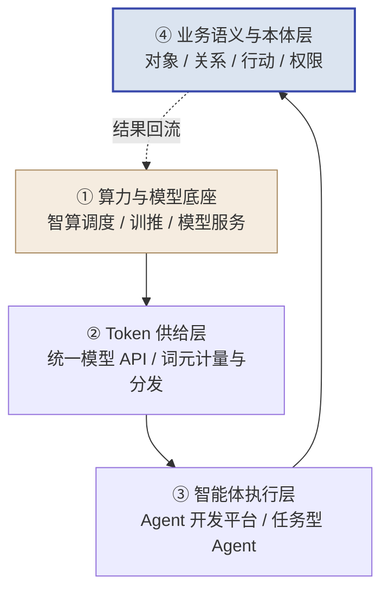
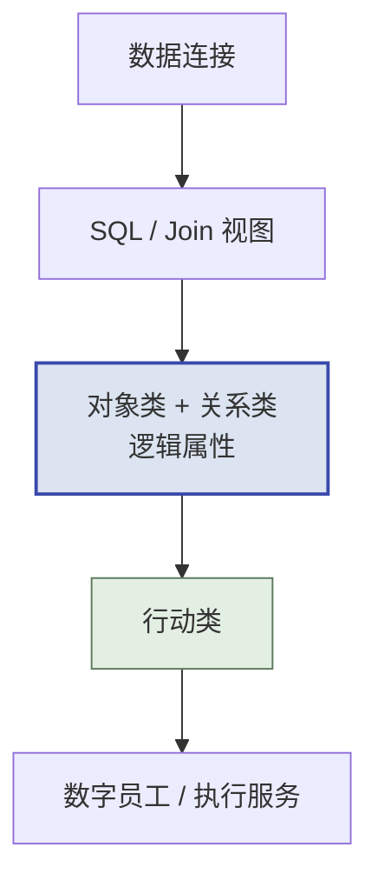

## 第 14 章 三大运营商的 AI 平台与 FDE 实践

> [!NOTE]
> **本章导读**：第 13 章讲的是云厂商，底层是"云 + 模型"；本章讲的是中国电信、中国联通、中国移动三大运营商，底层是"网络 + 算力 + 属地政企服务"。运营商既是央企，又是工信厅科函〔2026〕414 号所说的人工智能应用服务商，还常常是地方服务团的天然牵头方，因此值得单独成章。本章先用一张分层图谱把三家的平台放到同一坐标系里，再分家剖析，然后以 Palantir Foundry 为参照找出真正该比的五个点，最后给出一套统一的 PoC 验证方法。**读完本章，你能说清某个运营商平台处在哪一层、适合验证什么，以及它离"数据→对象→行动"的完整闭环还差什么。**

> [!IMPORTANT]
> **本章的三条写作纪律**（请读者也按此阅读）：
>
> 1. **按"产品 + 版本 + 证据等级"说话**：例如"元景万悟开源版 v0.6.4 的操作手册给出了对象类与行动类配置"，而不是"联通平台支持本体"。
> 2. **证据分四级**：**A** 官方技术文档、API、可读的部署配置或代码；**B** 官方产品页与发布宣称；**C** 案例报道与第三方材料；**?** 公开资料不足。证据等级不是性能分数，"没有公开文档"也不等于"不支持"。
> 3. **不排名、不打总分**：本章只给分层定位与"适合验证什么"，不据公开文档数量给三家排座次。

### 14.1 运营商为什么是特殊的 FDE 主体

运营商做 FDE，和云厂商、模型厂商相比有三个结构性差异：

| 维度 | 云厂商（第 13 章） | 运营商（本章） | 对 FDE 交付的含义 |
| :--- | :--- | :--- | :--- |
| 底层资产 | 公有云、模型、开发者生态 | 骨干网与专线、智算中心、属地机房 | 数据不出域、专网直连场景天然占优 |
| 客户触达 | 行业线 + 伙伴 | 省、市、区县三级政企客户经理 | 触达深但"懂 AI 的人"稀缺，FDE 是补位 |
| 身份 | 市场化企业 | 央企 + AI 应用服务商 + 服务团牵头方 | 同时受国资委考核与工信部培育政策牵引 |

国务院国资委在 2026 年 1 月的国新办发布会上披露，中央企业"AI+"专项行动已开放 1000 多个应用场景，建成 4 个万卡级智算集群；中国电信星辰、中国移动九天等大模型已服务 200 多家外部单位（见附录 D-10）。这说明运营商的 AI 平台不只是自用，已经在对外输出。

> [!TIP]
> **给乙方的读法**：运营商是你的**潜在总包方或服务团牵头方**，而不只是竞争对手。看懂它的平台分层，才能判断自己在哪一层做补位：数据治理、行业本体、智能体应用，还是现场交付人力。

### 14.2 平台分层图谱：六个名字不在同一层

业内常把"息壤、星辰、星罗、元景、京元、九天"放在一起比，这其实混合了算力平台、模型服务、Token 供给、智能体应用和综合品牌。按层拆开才能比较：

*图 14-1：运营商 AI 平台四层结构——越往上越接近业务，越往上公开证据越少*

| 层级 | 中国电信 | 中国联通 | 中国移动 |
| :--- | :--- | :--- | :--- |
| ① 算力与模型底座 | 天翼云息壤一体化智算服务平台 | 星罗先进算力调度平台 | 九天模型家族、LLM Studio、MaaS |
| ② Token 供给 | 息壤模型 / Token 服务 | 星罗 Token 服务、京元 Token 服务平台、元景词元运营分发 | 九天 MaaS |
| ③ 智能体执行 | 星辰智能体开发平台、星辰超级智能体 TeleAgent | 元景万悟智能体平台 | 聚智 JoinAI、九天 AI OS |
| ④ 业务语义与本体 | 星海 AI-Studio 本体语义中枢、星海智能动态本体平台 | 元景万悟本体模块 | 梧桐数据 KnoVa 本体智能平台 |

> [!CAUTION]
> **两个都不成立的判断**：一是"运营商只有算力和模型，没有 Ontology，只有 Palantir 才有"——三家在第④层都已有公开产品；二是"出现了本体就等于能替代 Foundry"——Foundry 的差异化不在某个模块，而在数据工程、业务对象、逻辑、行动、应用、安全与持续演化**连成一个体系**的程度。

### 14.3 中国电信：息壤、星辰、星海与智惠工程师

**平台侧**：

- **息壤**（第①②层，A/B）：天翼云官方文档把它定义为一体化智算服务平台，覆盖公共算力、训推、模型与 Token 服务、应用托管。它是底座，不应被当作已证实的统一业务对象平台。
- **星辰 TeleAgent**（第③层，A）：官方有详细的桌面版操作手册，定位是面向个人的任务执行 Agent，可比较其任务、Skills、MCP、授权与交付能力；另有独立的星辰智能体开发平台，两者不能混为一谈。
- **星海**（第④层，B/C）：官方介绍星海 AI-Studio 具备本体语义中枢、元数据同步、本体探索、列级权限与审计；另有"星海·智能动态本体平台"的发布报道。**两者之间的产品关系、与息壤和 TeleAgent 的技术关系，公开资料尚未说明。**

#### 14.3.1 案例：中国电信北京公司"智惠工程师"

**1. 背景与挑战**：政企客户上 AI 的普遍卡点不是模型，而是"场景说不清、数据接不上、上线后没人运营"。中国电信北京公司把 FDE 本地化为"智惠工程师"队伍，定位是打通 AI 落地的"最后一公里"（见附录 D-12）。

**2. FDE 介入方式**：公开报道把队伍分为三类角色——**Echo**（业务洞察与需求转化）、**Delta**（技术实现与交付）、**Foundry**（平台与工具沉淀）。前两类与本书三角色一致，第三类值得注意：它把"能力回注"单独设成了一类岗位。

**3. 技术方案**：以电信自有的算力与模型平台为底座，按"联合创新、定制开发、标化交付"三类场景分层供给——前沿场景联合共创，个性需求定制开发，成熟场景做成标准化产品交付。

**4. 交付过程**：报道提及的一个央企平台项目中，上线模型 200 多个、日均 Token 调用 10 亿次以上（企业披露口径）。

**5. 业务成果**：公开报道以规模与覆盖为主，未披露单场景的业务指标（如效率、准确率、成本）。

**6. 能力回注**："联合创新→定制开发→标化交付"本身就是一条回注链：场景从一次性共创，逐步沉淀为可复制的标准产品。Foundry 类岗位承担其中的平台沉淀职能。

**7. 方法论启示**：这是国内少见的**把回注职能显式设岗**的样本，对应第 9 章的"集成"一步和第 10 章的 Dev 角色。乙方可以借鉴的不是名称，而是"有人专门对沉淀负责"这一组织设计；同时要注意，公开材料证明的是规模，不是单位 FDE 的产出效率。

### 14.4 中国联通：星罗、元景万悟与京元

- **星罗**（第①②层，B）：先进算力调度平台，面向异构算力的统一调度与 Token 供给。它不是 Foundry 数据—业务执行层的同类产品。
- **元景**（第①–④层，A/B）：模型家族、MaaS、词元运营分发，以及**元景万悟**智能体平台。联通 2026 年的发布材料中出现了"词元运营分发与 FDE、本体、智能体结合"的表述。
- **京元**（第②层，B）：与北京联通关联的京元 Token 服务平台，提供统一模型 API、Token 服务与 Agent 生态接入。名称真实可查，但详细的操作文档不足。

**元景万悟是本章证据最扎实的一个**。其开源仓库与官方操作手册（Release v0.6.4，2026-09-04）给出了操作级的配置路径：

*图 14-2：元景万悟开源版的本体配置路径——从数据连接到数字员工执行*

> [!WARNING]
> **开源手册 ≠ 生产验收**。万悟文档同时写明了一些限制，例如**底表写入后不会自动更新本体索引，需要手动构建或定时构建**，因此不能承诺自动实时一致。这正是第 7 章 Build 期要专门检查"索引新鲜度"的原因：数据变了、对象状态没变，智能体就会基于过期事实行动。另外，GitHub 上的开源版与商业版元景 MaaS 不共用版本号，不能用开源版的能力推断商业版的规格。

### 14.5 中国移动：九天体系与梧桐 KnoVa

- **九天**（第①–③层，B）：九天是一个综合品牌，下面包括模型、LLM Studio、MaaS、聚智 JoinAI 和 2026 年发布的九天 AI OS。比较时要落到具体组件，不能拿某个聊天应用代表整个体系。
- **梧桐数据·本体智能平台 KnoVa**（第④层，B/C）：公开材料给出了"数据—语义—动力—行动"四层架构，以及运营商内部的流失预警、反诈白名单等案例，涉及对象化建模、规则 / 机器学习 / 图推理、决策仿真与结果回流。

> [!NOTE]
> 对标 Foundry 的业务语义与决策层，中国移动最值得看的是 **KnoVa**，而不是"九天大模型"本身。但目前能拿到的是架构与案例层面的证据，**还没有与万悟同等细度的公开操作文档和 API**，适合放进 PoC 实测，不适合直接写进方案承诺。

### 14.6 对标 Foundry：真正该比的五个点

比较运营商平台与 Foundry，不要比"有没有大模型、有没有知识库、有没有工作流"，而要比**跨层能不能打通**。下面五个点是公开文档最少、项目里最容易出事的地方：

| 比较点 | 要回答的问题 | 典型失败表现 |
| :--- | :--- | :--- |
| 1. 数据→对象状态 | 源系统数据变化后，多久、以何种保证反映到业务对象？ | 智能体基于过期对象状态做决策 |
| 2. 权限全链贯通 | 用户权限能否从数据、检索、模型、工具一直传到动作？ | 检索层绕过了数据层的行级权限 |
| 3. 写回一致性 | 行动写回失败、重试、并发时，业务状态会不会错？ | 工单重复创建、状态不一致 |
| 4. 变更与发布 | 对象、逻辑、应用能否一起测试、发布、回退？ | 改了本体，下游应用悄悄坏掉 |
| 5. 跨场景复制 | 一个项目能否带着治理与依赖复制到另一省份或客户？ | 每个省重新做一遍 |

> [!WARNING]
> **五个"看起来都有"的误判**：
>
> - 有知识库 ≠ 有业务对象；
> - 有 MCP / API ≠ 有可靠的业务行动；
> - 有角色菜单 ≠ 有全链路权限；
> - 有 Token 账单 ≠ 有端到端数据血缘；
> - 有 Docker 或应用市场 ≠ 有可治理的跨环境交付。

**Foundry 自己也不是没有边界**。按 Palantir 官方文档：Webhook 写回外部系统不是分布式强事务，外部调用成功后本体更新仍可能失败；OSDK 把数据返回给外部应用之后，后续处理仍需另行治理；分支合并部分失败时目前无法直接回退（详见第 3 章）。这提醒我们：对标的目的不是证明谁"更像 Palantir"，而是**把这五个点变成验收项**。

### 14.7 统一 PoC 验证方法

比较不同平台，最公平的办法是**同一道题、同一套检查项**。推荐题目：**政企专线故障影响分析与工单协同**——它同时涉及网络资源数据、客户合同对象、影响范围推理、工单写回和多角色权限，能把五个比较点一次性暴露出来。

检查项共 12 项，按"数据→对象→行动→交付"排列（完整清单、硬门槛、权重与总成本口径见附录 J）：

| 类别 | 检查项 |
| :--- | :--- |
| 数据 | V01 接入与更新　V02 质量与血缘 |
| 对象与逻辑 | V03 业务对象　V04 逻辑与解释 |
| 行动与权限 | V05 受控写回　V06 权限全链路　V07 业务操作台 |
| AI 与运行 | V08 Agent 评测　V09 运行追踪 |
| 交付与演化 | V10 变更与回滚　V11 多环境与隔离　V12 跨省复制与退出 |

> [!IMPORTANT]
> **PoC 纪律**：要求平台方对每一项标明能力来源——**原生功能、厂商配套产品、第三方组件、还是项目自研**。定制开发可以写进方案，但不能伪装成开箱即用；否则中标后的"定制工作量"会原样回到 FDE 身上，这正是第 16 章所说的项目制陷阱。

### 14.8 运营商作为服务商与服务团牵头方

414 号文要求各地遴选人工智能应用服务商入池，并组织由 1 家服务商牵头、不少于 2 家上下游单位参与的人工智能应用服务团（详见第 16 章）。运营商在其中有三种典型站位：

1. **牵头方**：以算力、网络与属地客户关系牵头，联合模型厂商、行业软件商、本地集成商组团，向产业链或园区提供成套服务；
2. **底座供给方**：以息壤、星罗、九天等平台和 Token 服务进入别人牵头的服务团，按调用量计费；
3. **FDE 人力方**：以智惠工程师这类队伍提供驻场交付，与平台捆绑销售。

> [!CAUTION]
> **警惕"算力换项目"**：若运营商只以算力券、Token 优惠换取项目入口，而没有第④层的业务本体与第 9 章的回注机制，交付仍会退化为按人头计价的集成项目。评估一个运营商服务团的成熟度，看的是它**有没有人对沉淀负责、有没有可复制的行业本体**，而不是算力规模。

### 14.9 甲乙方对照：运营商到底在卖算力，还是在卖能力？

| 视角 | 甲方该问 | 乙方该做 |
| :--- | :--- | :--- |
| 平台选型 | 这个平台在四层里覆盖到哪一层？第④层有没有操作级证据？ | 用附录 J 的 12 项做 PoC，逐项标注能力来源 |
| 采购条款 | Token 计费之外，业务效果怎么验收？ | 把"写回一致性、权限贯通"写进验收标准 |
| 服务团 | 牵头方是否有专人负责沉淀与复制？ | 选定自己的层级站位，避免与牵头方同层竞争 |
| 长期关系 | 平台锁定后，本体与数据能否迁出？ | 自建可迁移的本体描述与评测集，作为自己的资产 |

> [!IMPORTANT]
> **一句话结论**：运营商的优势在第①②层，趋势在第④层，FDE 的价值在于把两者连起来。算力是入场券，**能把"数据→对象→行动"闭环跑通并复制到下一个省份的能力**，才是运营商从"卖算力"走向"卖能力"的分水岭。
