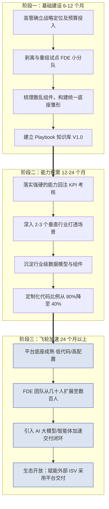

## 第 16 章 中国区 FDE 转型的六大挑战与应对

> [!NOTE]
> **本章导读**：尽管国内各大厂商都在积极探索"贴近业务解决高价值问题"的技术交付模式，但若要在中国市场真正建立起类 Palantir 的高效 FDE 体系，整个行业仍然面临着系统性的阵痛。本章将跳出单一厂商的视角，从行业共性出发，剖析六大核心挑战并给出应对策略；此外专设一节，正面回应"FDE 模式在中国是否成立"这一外部质疑；最后一节解读 2026 年工信厅科函〔2026〕414 号带来的政策窗口，说明它改变了什么、没有改变什么。 **读完本章，你能判断自己的组织卡在哪一类挑战上，用就绪度清单打分，并说清 414 号文能帮上什么、帮不上什么。**
>
> **重要的是：六大挑战的应对，不是六套临时对策，而是同一套方法论在不同问题上的应用。** 读者会看到，每个挑战的解药都能回溯到本书前面确立的核心原则——**能力回注（第 9 章）、PPT 框架（第三篇）、卖人力→卖能力（第 1 章）、四阶段（第三篇）、Playbook 与知识管理（第 12 章）**。挑战各异，但兵器库是同一个。

### 16.1 挑战一：项目制交付的规模化困境

**现象描述**：
在中国 ToB 市场，"做项目"是常态。大量客户（尤其是非互联网企业）不习惯为纯软件或 SaaS 订阅付费，而是倾向于买"交钥匙工程"。这就导致 FDE 团队很容易退化为传统的"外包定制开发团队"：收入的增长必须依赖人头数的线性增长，毛利率极低，深陷项目泥潭无法自拔。从经济学视角看，边际成本未能随着规模扩大而递减。**这正是第 1、2 章反复警示的"FDE 退化为外包"在中国市场最普遍的现实版本——本该"卖能力"，却被迫退回了"卖人力"。**

**Palantir 的应对经验**：
Palantir 早期同样在各个情报机构中做重度定制，但其通过构建**Foundry/Gotham 这样的统一本体（Ontology）底座**，将定制化代码的比例压缩至 20%以内。其规模化公式可以概括为：

$$
\text{FDE 产能} = \frac{\text{可复用平台资产}}{\text{单个项目的定制代码量}} \times \text{业务理解力}
$$

**适用于中国市场的应对策略**：
> 本质上，这一挑战的解药就是全书的核心——**能力回注（第 9 章）**：把"卖人力"扭转为"卖能力"（第 1 章主线），让边际成本随规模递减（第 2 章经济学）。落到动作上：
1. **坚守二八原则**：在商务谈判阶段，坚守核心平台底座不容侵入式修改，只在应用层和数据接入层通过 API/插件进行定制开发（对应第 2 章"70% 平台 + 30% 定制"的分层结构）。
2. **实施"资产税"制度**：要求每个定制化项目必须提炼出至少 1-2 个可被平台或其他项目复用的组件（Data Pipeline 模板、可视化 Widget 或行业模型），否则不予验收结项——这就是把第 9 章的能力回注四步法制度化、强制化。

> [!IMPORTANT]
> **关键行动项（中层与一线）**：从今天起，记录你在客户现场写的每一段"胶水代码"。如果这个逻辑在下一个客户那里改头换面又用了一次，请立刻将其封装为配置化组件（即第 9 章"识别→抽象"的一线动作）。

### 16.2 挑战二：产品线分散与平台整合

**现象描述**：
许多中国科技公司在发展过程中，通过并购或内部赛马，积累了大量功能重叠、底层互不相通的 PaaS 产品（如多个数据仓库引擎、多个 BI 工具并存）。FDE 在现场为了完成业务流，不得不花大量时间在自家不同产品间做系统集成，形同"内部外包"。

**应对策略：渐进式整合 vs 推倒重来**
> 这一挑战对应 **PPT 框架的 Technology 维度**（第三篇 How 总纲）——它要解决的是"平台底座是否统一、可复用"的问题。完全推倒重来重建一个大一统平台在商业上风险极高。应借鉴阿里云 OneData 统一方法论的经验，采用**渐进式抽象整合**：
- **第一步：统一鉴权与资源调度底座**（让所有组件在基础设施层互通）。
- **第二步：统一数据资产元数据**（构建统一 Data Catalog，不论数据在哪个引擎里，都能被唯一标识）。
- **第三步：前端工作流串联**（为 FDE 提供一个低代码的编排界面，隐藏底层多引擎的复杂性）。

> [!IMPORTANT]
> **关键行动项**：高管层必须设立一个凌驾于各业务线之上的"平台架构委员会"，强制推进跨组件的 API 标准化，否则前线的 FDE 将永远在为后方的架构债买单。这个委员会与第 9 章的"回注评审委员会"应协同——一个管"平台怎么统一"，一个管"前线经验怎么并入平台"。

> [!TIP]
> **"标准底座 + 扩展接口"的真实收益**：开发量并不会因此减少，省掉的是每个项目重复实现通用底座的工作。验证平台时建议"按层组合"：算力与 Token、智能体、业务本体分层选型（见第 14 章）。定制开发可以写进方案，但不能伪装成开箱即用。

### 16.3 挑战三：知识碎片化与人才流动

**现象描述**：
FDE 的核心价值在于其脑海中的"行业 Know-how"和"排坑经验"。但国内 IT 行业普遍面临人员流动率较高的问题。一个王牌 FDE 离职，往往带走了一个行业的深度经验，接手的团队从零开始，客户满意度断崖式下跌。

**应对策略：把个人 Know-how 变成组织资产**
> 这一挑战对应 **PPT 框架的 People 维度**，其解药正是第 12 章的 **Playbook 体系与知识管理飞轮**——核心是把"沉淀在个人脑子里、会随离职流失"的隐性经验，转化为"沉淀在组织平台上、越用越强"的显性资产（这也是第 1 章"卖能力"在人才维度的体现：能力属于公司平台，而非属于某个会离职的人）。
- **建立强制性的知识沉淀机制**（呼应第 12 章知识管理架构）。例如华为通过 iKnow 系统，将全球专家的实战经验结构化。
- **引入 Playbook（作战手册）机制**（即第 12 章）。不要只写"如何配置系统"的产品文档，而是要写"面对零售客户多门店库存数据不准时，应该先排查哪张表、用什么算法清洗"的**业务处理 SOP**。

> [!TIP]
> **业务处理 SOP 结构建议**：
>
> 1. 业务痛点描述 → 2. 数据源要求及探查 SQL → 3. 数据建模逻辑与核心指标定义 → 4. 交付物 Demo（Dashboard/报表） → 5. 常见坑点及规避方案。

### 16.4 挑战四：市场竞争与差异化

**现象描述**：
国内 IaaS/PaaS 层竞争同质化严重，"价格战"频发。只卖云资源或标品软件的利润率越来越薄。

**应对策略：不拼资源规模，深耕行业场景**
> 这一挑战的答案，本质是把竞争战场从"卖资源"切换到"卖能力"（第 1 章主线）——不与巨头拼底层算力/存储的性价比，而是深耕"本体（Ontology）"和业务逻辑（Palantir 在 AWS/Azure/GCP 包围中正是靠这一点突围）。
FDE 的职责就是要在客户的"IT 预算"之外，去切取"业务预算"。当 FDE 帮助车企通过数据分析将供应链周转率提升了 5%，这部分的价值是任何纯底层云资源降价都无法比拟的。

> [!IMPORTANT]
> **关键行动项**：FDE 团队的考核指标（KPI）应逐步从"产品消耗量（消耗了多少核算力）"向"客户可衡量的业务提升价值"转移——这与第 9 章回注 KPI 的思路一致：**考核真正创造的业务价值，而非中间过程的资源消耗量。**

### 16.5 挑战五：政企客户特殊性

**现象描述**：
在中国做 ToB 业务，避不开政企客户。这一群体的特殊性对 FDE 模式提出了本土化考验：

- **采购流程**：招投标制度严格、预算周期长（通常跨年）、决策链条极其复杂。
- **数据安全**：等保 2.0 要求、数据不出域（私有化部署要求极高）、信创/国产化替代。
- **组织文化**：风险规避倾向强，各部门之间数据壁垒森严，数字化变革阻力大。

**应对策略**：
> 这一挑战的应对，恰好复用了书中两套现成的方法论——**四阶段中的 Prototype/快赢**（用最小代价证明价值）与 **第 8 章的组织变革管理**（应对政企的组织阻力）。
1. **轻量级价值证明（PoV, Proof of Value）前置**：在漫长的招投标启动前，FDE 应带上脱敏数据集或演示平台，在 2 周内免费为客户搭建一个高价值的业务闭环（如一个反欺诈预警大屏），用直观的业务价值打动"一把手"——这就是把 Prototype 阶段的"Show, Don't Tell""快赢场景"（第 6 章）前置到售前，用来影响招投标参数。
2. **构建强大的私有化与信创适配能力**：平台的底层架构必须能够快速打包，适应各种国产服务器、国产操作系统和数据库环境。FDE 需要熟练掌握这一套自动化部署工具，避免在驻场部署上耗费数月时间。

> [!IMPORTANT]
> **关键行动项**：把"合规与信创适配"当成**第一天就要解的设计约束**，而非上线前的补丁（呼应第 4 章 NHS 案例的启示：合规不是速度的敌人，而是设计的前置输入）。政企的组织变革阻力，则用第 8 章的"阻力-应对矩阵"逐一化解。

#### 16.5.1 合规检查清单（等保 / 数据合规 / 信创）

> [!NOTE]
> 以下为**实操检查清单**（非法律意见），对标文件包括《网络安全法》《数据安全法》《个人信息保护法（PIPL）》《网络安全等级保护 2.0》《信创产品安全测评规范（2026 版）》《数据分类分级安全规范》等；**各项以最新监管口径为准**，落地前与客户法务/合规部门逐项确认。

**1. 等保 2.0（政务/金融客户通常按三级基线）**

- [ ] 系统**定级**：与客户共同确定系统等级（二级/三级），完成定级备案；
- [ ] **建设整改**：FDE 承担技术侧整改（身份鉴别、访问控制、安全审计、入侵防范、数据完整性/保密性等）；
- [ ] **测评与复测**：配合第三方测评机构完成测评，并针对整改项闭环；
- [ ] 明确"等保四级"场景（涉密/关键信息基础设施）需额外保密与专用环境要求。

**2. 数据合规（数据安全法 / PIPL）**

- [ ] **数据分类分级**：客户数据按敏感度分级，高敏数据（医疗、金融、政务）从严管控；
- [ ] **PIPL 红线**：处理**敏感个人信息、向第三方提供或出境**需**单独同意**；一般个人信息处理依合法基础并履行告知义务；提供人脸等生物识别场景按"最小必要"从严；
- [ ] **数据不出域**：这是**项目或合同层面的控制要求**，不是适用于全部企业数据的统一法律规定。核心数据留在客户侧，必要外发走脱敏或联邦方案（呼应第 18 章）；是否构成数据出境、应走哪种出境机制，按数据处理者主体、数据类型、数量及法定豁免情形逐项判断（依据《促进和规范数据跨境流动规定》，[国家网信办](https://www.cac.gov.cn/2024-03/22/c_1712776611775634.htm)）；客户合同可能比法规更严，两者要分别记录；
- [ ] 与客户约定**数据销毁与项目退出**时的数据处置条款。

**2A. 生成式 AI 专项（先判断适用范围，再列控制措施）**

- [ ] **先判断是否适用**：《生成式人工智能服务管理暂行办法》第二条规定，其适用对象是向境内公众提供生成式人工智能服务；企业、科研机构等研发、应用生成式 AI 技术而**未向境内公众提供服务**的，不适用该办法（[中国政府网](https://www.gov.cn/zhengce/202311/content_6917778.htm)）。但这**不免除**个人信息保护、数据安全、网络安全及行业监管义务；
- [ ] **对外服务场景**：面向公众的智能体或问答服务，按算法备案、大模型备案等要求确认轨道（见第 18 章）；
- [ ] **"私有化部署 + 脱敏 + 过滤"不等于合规完成**：每项要求要落到"适用依据→控制措施→测试证据→责任人"四列映射表，作为 Build 期交付物随项目维护。

**3. 信创适配矩阵（国产化四层核对）**

- [ ] **CPU**：鲲鹏 / 飞腾 / 海光 / 龙芯 兼容性验证；
- [ ] **操作系统**：麒麟 / 统信（UOS）运行验证；
- [ ] **数据库**：达梦 / 人大金仓 / GaussDB / OceanBase 等替代验证（含 SQL 方言差异）；
- [ ] **中间件**：东方通 / 宝兰德等替代验证；
- [ ] 全链路通过后申请**信创产品适配认证/测评**（以 2026 版测评规范为准）。

**4. 国际场景（按客户要求裁剪）**

- [ ] ISO 27001（信息安全管理体系）与 SOC 2（服务审计）为出海/外企客户场景的加分项，非国内政企必选；
- [ ] 若客户要求，配合完成审计证据收集（权限审计、变更记录、日志留存）。

> [!CAUTION]
> **合规清单的使用姿势**：不要把它当"上线前打勾"的一次性动作——政企客户每一轮采购/续约都可能更新合规要求。建议 FDE 把合规状态**随项目持续维护**（复用第 7 章安全基线与第 8 章交接清单），并把"合规差距"作为售前 PoV（应对策略 1）的输入，提前影响招投标参数。

#### 16.5.2 三行业关切对照表（快速定位"我这个行业该重点看哪几章"）

> [!NOTE]
> **用途**：金融、制造、政务三大行业的关切点差异很大（金融怕合规出事、制造怕物理世界出错、政务怕失控卡脖子）。下表一页说清各行业的核心关切、红线、部署要求，以及**对应本书章节导航**——读者可按行业直接跳读重点章节。附录 I 提供更细的合规速查（按行业分列），本节是"导航表"。

| 维度 | 金融 | 制造 | 政务 / 公共事业 |
| :--- | :--- | :--- | :--- |
| **核心关切** | 合规红线优先于效果 | 零容错场景下的责任机制 | 自主可控是一票否决项 |
| **典型红线** | 数据不出域、多级隔离（"数据→模型→业务"链路层层受控）；大模型基本要求私有化部署；PIPL 敏感信息从严；算法备案 | "责任留痕"——操作员勾选"采纳"AI 建议，系统自动生成事后复核记录，每一步可追溯可审计 | 信创适配认证硬指标；敏感数据不出内网；存量系统年代久远无 API，可能需要视觉识别等额外操作能力 |
| **部署要求** | 私有化 + 统一平台管理算力/私域数据/模型能力 | 边缘/现场部署，故障响应链路闭环 | 私有化/政务云，内网闭环 + 审计系统（AI 每次点击、每条决策链路可回溯） |
| **合规对照** | 等保/PIPL、第 18 章（备案四轨） | 第 18 章（人工确认环、场景卡 4） | 等保/信创、第 18 章（信创算力、场景卡 6） |
| **重点章节导航** | 第 18 章场景卡 2/5 · 第 4 章案例二（城商行报送） | 第 13 章案例一（雅戈尔供应链）· 第 18 章场景卡 3/4 · 第 4 章案例一 | 第 13 章案例三（湾擎）· 第 18 章场景卡 6 · 合规清单 |
| **附录速查** | 附录 I（金融行） | 附录 I（制造行） | 附录 I（政务行） |

> **一句话**：金融把"合规"当入场券、制造把"责任留痕"当信任基础、政务把"自主可控"当一票否决——FDE 面对不同行业，**先读对应行业的"关切行 + 章节导航"再进现场**，比从通用方法论读起效率高得多。

---

### 16.6 挑战六：FDE 人才竞争与交付主体重构

前五大挑战讲的是"客户现场有多难"。第六个挑战来自市场结构本身——**它不动摇方法论，但动摇你能否按计划凑齐人手、以及你在产业链上还是不是别人绕不开的那一环。**

**现象描述**：

2026 年，FDE 从行业内部术语变成了公开招聘市场上的热门岗位。领英（LinkedIn）2026 年 1 月发布的全球劳动力市场趋势洞察显示，**FDE 新增岗位自 2023 年至 2025 年增长了 42 倍**，同期 AI 工程师岗位增长 13 倍。国内招聘平台上，字节跳动"豆包 AI 大模型 FDE"给出 3.5 万至 7 万元/月 × 15 薪、蚂蚁数科 B 端 FDE 4 万至 6 万元/月 × 15 薪、智谱华章 FDE 负责人 6 万至 8 万元/月；海外 OpenAI、Anthropic 的 FDE 岗位年薪折合人民币在百万元量级。但从业者也提示：**真正进入"年薪百万"的是核心顶尖人才，不是行业平均水准**——这与第 12 章的薪酬基准可以互相印证。

对交付组织而言，这条数据带来三个直接压力：

- **组建成本被抬高**：本章转型路线图的"阶段一"假设企业能抽调 3-5 人组成先锋小队。当同类人才被大厂以更高 package 争夺时，这个前提不再自动成立——要么付出溢价，要么接受次优人选，要么改用外部供给。
- **内部薪资倒挂**：新招 FDE 的市价高于在岗多年、能力相当的资深交付工程师，会直接冲击团队稳定性。这是账面上的组织风险，不是"人力资源的小问题"。
- **人才争夺跨越甲乙边界**：甲方在与乙方合作过程中，会把 FDE 打法与人员能力一并观察在眼里。**客户下场自建团队，或直接挖走驻场骨干，已成为现实风险**——驻场越深、越懂客户业务，这个风险越高。

与此同时，**交付主体也在重构**：大模型厂商开始以 FDE 模式做末端部署，但自身不养全量驻场队伍，转而与系统集成商共建、以 Token 或价值分成绑定双方利益；一批数字化服务商则把 FDE 交付体系做成对外商品（两类新主体的具体动向见第 13 章）。过去乙方面对的是"友商"，现在还要面对"模型厂商 + 伙伴网络"这种新的竞争单元。

**应对策略：三条不互相替代的路**

> 这一挑战的解药，不是再补一套方法论，而是把**定位、人才与资产**三件事重新排布：

1. **路线选择要显性化，不要糊着走**：明确定位自己是"**自建 FDE 能力**""**与模型厂商/云厂商共建交付**"还是"**做平台方与模型厂商的交付伙伴**"。三条路的能力要求、毛利结构、议价地位完全不同；最糟的处境是既没有自建能力的深度，又没进入任何伙伴网络，只剩价格竞争。
2. **把人才策略从"抢人"改成"造人 + 留人"**：对外，借助模型厂商与云厂商的伙伴网络补足队伍（见第 13 章）；对内，靠第 12 章的五角色进阶路径与双通道体系把"从实施工程师长成 FDE"的通道修通，让在岗骨干看得见上升空间，这才是对冲外部高薪挖角最有效的防线。
3. **把 Know-how 留成组织资产，而不是留在个人身上**：本节要补的动机比知识管理更现实——**人才流动正在加速，Playbook 与能力回注是防流失的对冲手段**。驻场越深的人越要有"抽出机制"（轮换、双人配置、文档化交付物），避免客户关系与现场判断力绑定在单个人身上，同时也降低被整体挖角的风险。

> [!CAUTION]
> **不要把"涨薪"当成唯一解**。当全行业都在为 FDE 溢价时，纯靠薪酬跟价必然打不过头部厂商的预算。真正有差异化的留人手段是三样：**有窗口的成长路径**（能成为 Lead / 架构 / 行业专家）、**能对外讲的战绩**（真实项目的 Gate 通过与业务成效）、以及**不必永远漂在现场的组织安排**（轮换与后方岗位通道）。

### 16.7 反面视角：FDE 模式在中国被质疑了什么

前面六节讲的都是"怎么把 FDE 做成"。但一本负责任的书必须把反面话摆到桌面上——**2026 年，FDE 这个模式在中国正被权威研究机构明确质疑**。如果读者带着"FDE 是标准答案"的预设去见客户，很可能在第一次高层对话里就被问住。

> [!CAUTION]
> **Gartner 在《2026 中国数据、分析和人工智能技术成熟度曲线》中，将"前沿部署工程师（FDE）"标注为 "X"**——即该实践在当前阶段被判断为关注度过热、预期在未来一段时间内降温或被淘汰。这与国内媒体同期热炒"FDE 是 AI 圈最火岗位"形成了鲜明对照。

Gartner 给出的中国适配障碍主要有三条。它们不需要你全盘接受，但**每一条你都要能答**：

**质疑一：中国缺少能承载 Palantir 模式的厂商。** FDE 模式要求乙方能直接触达客户最高决策层、具备客户筛选与长期投入能力。同时具备这三点——高层触达、客户筛选、长周期投入——的厂商数量有限，而这恰恰是模式成立的前提。

**质疑二：中国的项目制采购与 FDE 的"目标持续探索"存在结构冲突。** 传统 IT 项目在启动前就要明确范围、数据边界、预算与验收标准（落成 SOW）；而 FDE 强调围绕一个业务目标持续探索、随发现调整边界。两套逻辑放进一张合同里，天然别扭，客户也未必愿意承担探索期的不确定性。

**质疑三：知识产权边界难以界定。** 客户不愿看到自己的业务经验被厂商产品化后卖给同行；厂商也不愿只做一次性项目。这条边界划不清，回注飞轮在合同层面就转不起来。

针对这三点，本书的回应如下——注意，**这不是"驳倒 Gartner"，而是回答"那我们还怎么做"**：

| 质疑 | 本书的回应 | 对应章节 |
| :--- | :--- | :--- |
| 缺少能承载该模式的厂商 | 承认这是事实，所以中国路径不是"复刻 Palantir"，而是**分层演进**：用 PoV 先切片验证价值，用 Gate 把探索关进笼子，靠回注飞轮逐步把能力从人身上移到平台上 | 本章第一节；第 5 章 Gate 运行规则；第 9 章 |
| 项目制采购与持续探索冲突 | 不绕开项目制，而是**在项目制内部造一个"探索容器"**：把探索限定在 PoV 与 Prototype 阶段（时限、范围、费用都封顶），一旦进入 Build 就必须以量化指标与验收条款固化——**探索有边界，交付有标准** | 本章第五节应对策略；第 17 章合同与定价设计、ROI 测算框架 |
| 知识产权边界难界定 | 用**"业务私有 / 通用机制"二分**把边界写进合同：客户的业务规则、数据、专用模型与知识库归甲方；剥离了业务语义的通用工程机制、组件与工具链归乙方并可复用。这条线必须在签约前谈清楚，而不是验收时再吵 | 附录 H"定制"条目；本章第三节 Playbook；本章自评清单 |

> [!IMPORTANT]
> **本书的立场**：FDE 不是万能解，也不该是唯一解——Gartner 提出的替代路径（企业内部设"上下文工程"类岗位、优先采用低门槛平台、让应用厂商延续交付）在许多场景下确实是更经济的选择。**FDE 真正不可替代的场景，是"业务目标高度不确定、需要现场持续探明边界、且组织内部无力自建该能力"的那一类**。因此本书主张的用法是：**先判该不该用 FDE，再谈怎么把 FDE 做好**（判断工具见第 2 章鉴别清单与第 17 章甲方自评清单）。
>
> 同时也要看清 A 面与 B 面的关系：Gartner 说"这个模式在中国难"——难点恰恰是本篇所描述的现场摩擦力；而 2026 年仍在大量出现的伙伴计划与共建模式（见第 13 章）说明，市场正在用自己的方式**绕开这些难点**（用伙伴网络代替自建队伍、用分成代替一次性项目）。**被质疑不等于会消失，更可能是形态被改写。**

### 16.8 通用版三阶段转型路线图

对于立志于建立本土高阶 FDE 体系的科技企业，我们梳理了以下循序渐进的三阶段转型路线图：

*图 16-1：FDE 转型分基础建设、能力积累、飞轮加速三阶段，逐级递进启动能力回注飞轮*

> [!NOTE]
> 图中"定制化代码从 80% 降至 40%"这类比例，以及下面三个阶段各自提到的周期缩短幅度、毛利与留存率阈值，都是**本书给出的对标目标值，不是行业统计数据**。各组织起点差异很大，请以自身基线的相对改善为依据设定内部目标，不要直接把这些绝对值当 KPI 压给团队。

这三个阶段并非平均用力，而是一条**"先亏后赚、先重后轻"的飞轮启动曲线**。下面逐阶段拆解：每个阶段要达成什么、用哪些工具做、以及——最关键的——**凭什么客观信号判断这一阶段已经成熟、可以进入下一阶段**（成熟度不能只看时间，时间到了但指标没到，就是没成熟）。

#### 阶段一：基础建设——把飞轮"扶上道"

- **核心目标**：不是盈利，而是跑通第一批种子项目、建立最小可行的组织与平台雏形。这一阶段注定是战略性投入期，毛利可能为负。
- **关键动作与所用工具**：
    - **高管共识与预算**：转型的本质是"容忍短期低毛利换长期资产"，没有一把手的长期主义背书，一切无从谈起。可先用【FDE 转型就绪度自评清单】摸清自身家底。
    - **剥离试点小分队**：从现有交付团队挑 3-5 人，按"技术执行 + 业务策略 + 基础设施"的作战单元编制，并让它**独立于现有人头 KPI 体系**运作。
    - **跑通种子项目**：用完整的四阶段方法（Discovery→Prototype→Build→Scale）交付前几个项目，每阶段过 Gate 检查清单；同时启动 Playbook 知识库的第一版。
- **易踩的坑**：其一，想"一步到位建大平台"——正确做法是先用种子项目趟出真实需求，别凭空造轮子；其二，试点团队仍背老的人头 KPI，导致没人愿意花时间做抽象与沉淀。
- **成熟度信号（达到即可进入阶段二）**：
    - 已完整交付至少数个种子项目，且每个都产出了可复用的组件或行业模型（而非一次性代码）；
    - Playbook 知识库第一版落地，新人可据此上手；
    - 高管层已把"能力回注"写入团队考核，而非停留在口号。

#### 阶段二：能力积累——让飞轮"自己转起来"

- **核心目标**：在 2-3 个垂直行业打透场景，让**能力回注**真正跑通，定制代码比例显著下降。这是飞轮从"推得动"到"自己转"的关键期。
- **关键动作与所用工具**：
    - **落实能力回注机制**：把第 9 章的四步法制度化——用【能力回注需求卡片】登记、双周评审、20% 工时强制投入抽象重构；考核**复用率**而非卡片提交数量。
    - **深耕而非广撒**：集中火力在少数行业积累 Know-how 与行业组件库，飞轮的复利效应才会明显。
    - **沉淀行业级资产**：把种子项目的经验抽象为可复用的行业 Ontology 与组件，逐步充实 Playbook。
- **易踩的坑**：其一，行业铺太广、每个都浅尝辄止，导致哪个行业的复用率都上不去；其二，回注机制沦为形式，一线为凑数提交低质量卡片。
- **成熟度信号（达到即可进入阶段三）**：
    - 主打行业已积累起可观的组件库，**新项目大量复用既有资产、而非从零重写**（复用率的量化目标可参考第 9 章，但更重要的是趋势在稳定上升）；
    - **定制代码占比较起步期显著下降**（起步期通常大头是定制，此阶段应明显向"平台为主、定制为辅"倾斜）；
    - 同类项目的平均交付周期出现**可测量的同比缩短**（经验曲线开始显效）；
    - 项目毛利**由负转正**。

#### 阶段三：飞轮加速——让飞轮"越转越快"

- **核心目标**：平台底座成熟到"低代码/高配置"，团队规模化扩张，营收实现非线性增长——此时规模越大反而越赚钱。
- **关键动作与所用工具**：
    - **平台走向低代码/高配置**：让新客户的交付越来越多地靠"配置"而非"写代码"，边际成本趋近于零。
    - **团队规模化 + AI 加速**：从几十人扩到数百人，引入大模型/智能体把交付闭环进一步压缩。
    - **生态开放**：把平台开放给外部 ISV，让别人也用你的底座交付——从"自己转"到"带动生态一起转"。
- **易踩的坑**：其一，规模扩张时放松了回注纪律，导致"人多了、但平台没更强"，重新滑回人力密集；其二，盲目追求团队规模而非人效——成熟期健康度看的是人均产出，不是人头总数。
- **成熟度信号（标志飞轮真正转起来）**：
    - 定制代码占比降至很低水平，新客户交付**以配置为主、写码为辅**；
    - 单个 FDE 能并行支撑的项目数较早期明显提升，**人效逐年上升**（而非靠堆人头扩产能）；
    - 整体毛利率趋近 SaaS 水平；
    - **老客户持续增购、扩展到更多场景**——用净收入留存率（NRR）等指标衡量，若老客户的年度净留存显著大于 100%，说明"落地生根（land-and-expand）"已跑通（Palantir 的可查证参考见第 2 章）；
    - 出现"营收增长而人头不成比例增长"的非线性拐点——这是飞轮转起来最硬的证据。

> [!IMPORTANT]
> **一张表看懂三阶段的"变"与"不变"**
>
> | 维度 | 阶段一 基础建设 | 阶段二 能力积累 | 阶段三 飞轮加速 |
> | :--- | :--- | :--- | :--- |
> | 飞轮状态 | 静止期（用力推） | 加速期（自己转） | 飞轮期（越转越快） |
> | 定制代码占比 | 大头是定制 | 明显下降 | 降至很低、以配置为主 |
> | 盈利水平 | 净利可能为负（战略投入期） | 净利由负转正 | 高毛利 + 高净利，趋近 SaaS |
> | 团队规模 | 小分队试点 | 单行业小队 | 数百人 + 生态 |
> | 增长方式 | 靠投入 | 靠复用 | 靠平台与生态（非线性） |
>
> **贯穿三阶段不变的主线**：能力回注始终是引擎，"从卖人力到卖能力"是唯一方向——阶段在变，这条主线不变。
>
> **可参照的真实标杆**：Palantir 自身的财务轨迹与这条曲线在**方向上一致**（作为旁证，非严格因果证明——财务表现还受市场需求、客户结构、会计口径等多因素影响，详见第 2 章的口径提示）——**毛利率**一路从约 50%（2018）升至 80%+（2022 起见顶），而真正体现"飞轮转起来"的**净利率**则是先长期为负、2023 年才首次转正、2025 年升至 36%（详见第 2 章）。注意区分：软件业务的**毛利率**通常一开始就不低（很少为负），真正"先亏后赚"的是**净利率/经营利润率**——它可作为判断飞轮是否转起来的关键财务参考信号。

---

### 16.9 FDE 转型就绪度自评清单

前面几节讲的是"该怎么转"，但在动手之前，每一家乙方都该先诚实地问自己一句：**我们真的准备好了吗？** 本节提供一张可打分的"体检表"——它把全书的核心模型（PPT 框架、能力回注、四阶段、Playbook 等）落成 30 个可勾选的考评项，帮助管理团队在启动转型或规模化扩张前，实事求是地摸清自身家底、定位最薄弱的环节。

这张清单的六个层面与全书的 PPT 框架一脉相承：**团队层 = People、流程层 = Process、平台层 = Technology**，这三层是 PPT 三维度的落地自查；而**战略层**（高管共识、商业模式）与**度量层**（回注率、复用率、人效）是贯穿三维度的前提与标尺——没有战略层兜底，PPT 无从谈起；没有度量层，转型无法证明成效。**新增的成本与资源层**（人力成本占比、算力预算归口、评测基线、资产归属与保留方案）则直接对应第六大挑战：团队能打但账算不过来，转型一样不成立。

> [!TIP]
> **使用方法**：组织核心管理团队逐项打分——✅已具备（2 分）/ 🟡部分具备（1 分）/ ❌未具备（0 分），满分 60 分。配合本章 PPT 转型行动纲领，即可得出"哪个维度最弱、下一步资源投向哪里"的清晰结论。
>
> **分数怎么用**：不要只看总分，要看**六个层面的分布**。总分高但"成本与资源"层全是 ❌，说明团队能打但在赔钱；"团队层面"高而"平台层面"低，说明你在靠人硬扛，飞轮还没装上去。把最弱的两个层面写成行动项，比追求总分更有意义。

**FDE 转型就绪度自评清单（30 项 / 满分 60 分）**

| 评估维度 | 核心考评项 | 状态 | 得分 | 改进计划/责任人 |
| :--- | :--- | :--- | :--- | :--- |
| **战略层面** | 1. 业务高管（CEO/CTO 级）是否公开支持这种长期主义的转型并容忍短期的成本上升？ | [ ] | | |
| | 2. 是否有专项且长期的资金预算用于 FDE 团队建设及底层平台的整合研发？ | [ ] | | |
| | 3. FDE 的定位是否明确为"业务价值交付者"而非单纯的"云资源销售辅助"或"免费售后"？ | [ ] | | |
| | 4. 商业模式上，是否有相应的商业化手段去捕捉 FDE 创造的额外业务价值（如咨询费、价值分成）？| [ ] | | |
| | 5. 组织架构上，FDE 团队是否具备跨越研发与销售边界、直接向上级汇报的特权或通道？ | [ ] | | |
| **平台层面** | 6. 是否拥有一个核心的统一数据/应用平台底座，而不是一堆散乱的产品线拼凑？ | [ ] | | |
| | 7. 平台的 API 设计和模块化程度是否足够高，支持前线人员快速调用组合？ | [ ] | | |
| | 8. 是否具备强大的低代码/无代码工具，能大幅减少 FDE 现场编写底层基础代码的时间？ | [ ] | | |
| | 9. 平台是否具备快速适配政企私有化部署、信创环境及极简交付的能力？ | [ ] | | |
| | 10. 是否有内置的资产管理中心（Catalog），用于管理和复用不同项目中沉淀的组件？ | [ ] | | |
| **团队层面** | 11. 现有的技术服务团队中，是否有一批人员具备极强的代码能力与业务敏感度双重特质？ | [ ] | | |
| | 12. 是否有明确的 FDE 核心能力画像与招聘标准？ | [ ] | | |
| | 13. 是否建立了针对 FDE 角色的系统性培训体系（技术+业务+软技能）？ | [ ] | | |
| | 14. 团队内部是否存在"以战代练"的师傅带徒弟（Mentorship）机制？ | [ ] | | |
| | 15. 人员的薪酬结构与激励机制是否足以留住既懂技术又懂业务的高阶稀缺人才？ | [ ] | | |
| **流程层面** | 16. 是否有一套标准的 Playbook（作战手册），用于指导 FDE 从进场、PoV 到交付、验收的全流程？ | [ ] | | |
| | 17. **最核心项**：是否有制度化的"能力回注"流程（前线发现痛点 → 沉淀组件 → 回注给平台）？ | [ ] | | |
| | 18. 在售前阶段，是否有机制保障 FDE 的早期介入，以防止销售过度承诺无法落地的需求？ | [ ] | | |
| | 19. 项目结项时，是否有强制的知识资产（如模型、脚本、文档）复盘与上传归档环节？ | [ ] | | |
| | 20. FDE 与后端产品研发团队之间是否有定期（如双周/月度）的需求反馈与对齐会议？ | [ ] | | |
| **度量层面** | 21. 是否跟踪并考核前线产出组件向后方平台的"回注率"？ | [ ] | | |
| | 22. 是否跟踪度量新项目对既有平台组件及知识资产的"复用率"？ | [ ] | | |
| | 23. 是否有指标衡量交付效率的提升（例如：单一项目平均交付周期是否在逐年缩短）？ | [ ] | | |
| | 24. 是否能够量化 FDE 为客户带来的直接业务价值（如：节约成本百分比、提升效率倍数）并记录在案？ | [ ] | | |
| | 25. FDE 团队的人均产出（人效）是否有清晰的核算机制，并呈现逐年上升的健康趋势？ | [ ] | | |
| **成本与资源层面** | 26. 是否清楚掌握 FDE 人力成本在单个交付项目总成本中的占比，并逐年在优化而非恶化？ | [ ] | | |
| | 27. 算力、推理调用与模型相关支出是否**独立列支与预算归口**，而不是混进项目杂费、交付时才发现超支？ | [ ] | | |
| | 28. 是否建立了可复用的**评测集与回归基线**（效果验收口径），使模型调优与版本迭代有客观依据？ | [ ] | | |
| | 29. 关键行业资产（行业模型、清洗规则包、Playbook）是否有**明确的归属与随人流动的防护机制**（文档化、双人配置、轮换制度），而非只存在个人电脑与大脑里？ | [ ] | | |
| | 30. 面对市场高薪竞争，是否已有**成手 FDE 的保留方案**（晋升窗口、激励结构、后方岗位通道），而不只是被动跟价？ | [ ] | | |

**评分解读**（满分 60 分，四档对应转型阶段）：

- **48-60 分｜高度就绪**：已具备强大的类 Palantir FDE 基因，重点在于规模化扩张与 AI 技术引入（对应飞轮加速期）。
- **36-47 分｜基本就绪，局部需加强**：可能在平台底层整合或知识复用流程上存在短板，需尽快打通"能力回注"断点（对应能力积累期）。
- **24-35 分｜系统建设期**：团队可能仍深陷定制化项目泥潭、尚未形成资产沉淀，需从顶层设计开始梳理（对应基础建设期）。
- **24 分以下｜未就绪**：目前处于纯传统运维、外包开发或纯标准化 SaaS 售卖阶段。建议暂缓设立独立 FDE 团队，先从战略定位和高层共识入手。

---

### 16.10 乙方 PPT 转型对标行动纲领

> [!NOTE]
> 本节是**第五篇"乙方组织转型主线"的收口**（本篇的总结辨析见本章末尾与下一篇导读）。本书开篇（第三篇 How 总纲）用 **People–Process–Technology（PPT）框架** 建立了**"任何交付都是对客户三个维度的改造"**这一认知；第二篇透视了 Palantir 在 PPT 上的标杆动作；本节则回到本书的真正受众——**国内政企技术服务商（乙方）**——回答那个最实际的问题：**我该如何对标标杆，在 People / Process / Technology 三个维度上完成从"项目制外包"到"平台+FDE"的转型？**
>
> 本章的三阶段路线图回答了"**按什么时间节奏转**"（时间轴），本节则回答"**在每个维度上具体转什么**"（内容轴）。两者结合，才是完整的转型地图。

**为什么必须三维度同步转，不能偏科？**
中国厂商的通病（见第 13 章对比）是"单维度突进"——要么堆平台产品（重 Technology 轻 People），要么堆人（重 People 轻 Technology）。但 PPT 三维度是一个**咬合的飞轮**：只补一个维度，另两个维度会成为瓶颈，飞轮转不起来。转型的本质，是让三个维度**齐头并进、互相咬合**。

**乙方 PPT 转型对标行动纲领（SOP 8）**

下表把转型落到 PPT 三个维度上，每个维度都给出"起点态 → 目标态 → 关键转型动作"，供乙方逐行对照定位：

| 维度 | 传统项目制乙方的现状（起点） | 标杆（Palantir）的目标态 | 关键转型动作 |
|---|---|---|---|
| **People 人员与组织** | 交付团队=实施+运维人员，按人头计费；FDE 汇报给销售/项目 | 三位一体复合 FDE；汇报给产品线；培养客户侧冠军用户网络 | (a) 建立 FDE 能力画像与选拔标准；(b) 调整汇报线，让 FDE 对平台负责而非对签单负责；(c) 系统化培养客户侧冠军用户；(d) 用真实项目 Gate 记录证明队伍能力 |
| **Process 流程** | 按需求文档堆代码，无标准交付流程；不改客户流程，只做系统 | 四阶段交付 SOP + Gate 纪律；"碎石路→铺装公路"；帮客户重塑业务流程 | (a) 落地四阶段+Gate 交付纪律；(b) 建立能力回注流程（20% 时间制度）；(c) 从"诊断痛点"进阶到"重塑客户业务流程" |
| **Technology 技术平台** | 一堆功能重叠、互不相通的产品线拼凑；每个项目从头造轮子 | 统一 Ontology 底座；定制代码<20%；低代码/高配置；私有化信创极简交付 | (a) 渐进式整合产品线为统一底座（统一鉴权→统一元数据→前端编排）；(b) 沉淀可复用组件与行业本体；(c) 强化信创私有化打包能力 |

每个维度的**具体操作方法**在书中都有对应章节：People 见第 10-12 章（角色/协作/培养），Process 见第 5-9 章（四阶段 SOP 与能力回注），Technology 见第 3、6、7 章（平台整合与信创）。

> [!TIP]
> **使用方法**：组织管理团队对照三行逐一定位——"我们当前在这一维度处于起点还是目标态？关键转型动作做了几项？"配合就绪度自评打分，即可得出一张"三维度转型热力图"，明确下一步资源投向哪个最薄弱的维度。

**最后，关于转型的顺序：People 先行，Technology 兜底，Process 贯穿。**

三维度虽要齐头并进，但发力有先后：

- **先动 People**：没有对的人（复合 FDE）和对的组织归属（汇报给产品），另外两维度的改造无人执行。
- **同步建 Technology 底座**：没有可复用底座，FDE 再努力也只是重复造轮子，边际成本降不下来。
- **用 Process 把两者焊死**：四阶段纪律 + 能力回注流程，是让"人踩过的坑"变成"平台的能力"的唯一通道。

三者齐备，飞轮才会转动——Palantir 用约二十年的财务轨迹（毛利率爬至 80%+、净利率于 2023 年转正后升至 2025 年的 36%，财务表现受多因素影响，作旁证参考）为这一机制提供了一个**方向一致的参照**，也是本书希望每一家中国乙方能借鉴的路。

而如果要把这条转型之路浓缩成一句话，那就是本书开篇第 1 章立下的那句主线——**从"卖人力"到"卖能力"**。People、Process、Technology 三个维度的全部努力，最终都服务于这一个转变：让公司卖出去的，不再是会流失的人天，而是会沉淀、会增值、越用越强的平台能力。这，就是 FDE 模式的全部要义。

### 16.11 FDE 失败案例复盘（反高潮叙事）

> [!NOTE]
> 前面的案例多以正面为主，本节为诚实呈现补两个"**反高潮**"失败复盘。
>
> **据受访者口述整理，非官方数据，人物/项目已脱敏**。这两则不是为了否定 FDE 模式，而是为了证明：方法论的失效点往往不在"不会做"，而在"没按纪律做"。

#### 失败案例一：千万级大单的验收瘫痪

- **背景**：一家乙方签下千万级大单，客户是大客户、合同也大，商务端为了拿下单子承诺了过多超出交付能力的事项。**承诺过多，是后续所有问题的起点。**
- **失败过程**：项目启动后乙方选择"闷头交付"，连续三个月没有向甲方展示任何阶段性成果。到第六周起，甲方开始怀疑进度、抽调自身资源介入"查账"；双方在验收口径上僵持不下，最终项目陷入瘫痪——**钱花了很多，验收却遥遥无期**。
- **根因**：
    1. **未用短周期冲刺节奏**——大单被当成"一次性交付整块成果"，而非拆成多个可验收的短周期里程碑（阶段成果迟迟不出现，信任被耗尽）；
    2. **验收标准未前置对齐**——"验收看什么"双方各自理解，直到临验收才发现口径分歧；
    3. **成功指标未共同定义**——"赢了是什么样"从未落在纸面上，"交付了"与"价值兑现了"被混为一谈。
- **对应防范机制**：**第 5 章节奏纪律**（短周期冲刺）、**第 5 章阶段 Gate**（逐阶段验收闸门，含"未通过怎么办"的运行规则见 How 总纲）、**第 17 章《FDE 协作共识书》**（把合作模式/验收/成功标准签进合同）。

#### 失败案例二：原型烂尾

- **背景**：Prototype 阶段做出来的 Demo 让客户惊艳，客户脱口而出"这不就行了吗"。
- **失败过程**：正因为客户觉得"这不就行了吗"，他不愿意再为接下来的 **Build** 阶段付费——在他眼里，能演示的东西就是全部成果。原型成了"孤品"：惊艳一时，却无法推进到真正可生产的系统。
- **根因**：**Demo 未管理预期**——FDE 让"演示的成功"盖过了"生产的成本"，且没有在原型期埋下"**原型≠生产**"的三颗种子：①原型的边界（只验证价值、不承诺生产）；②生产要付出的代价（工程化、数据、运维）；③后续阶段的商业安排（什么要单独付费）。
- **对应防范机制**：**第 6 章原型期客户期望管理**（在 Show, Don't Tell 的同时，讲清"演示与生产的距离"）。

> [!NOTE]
> **为什么把失败写进来**：调研显示，失败复盘是读者信任度最高的内容。**"反高潮"叙事比纯正面案例更有说服力**——因为它证明作者不回避真实世界的复杂，也让读者带着"防坑"的视角回看前面所有成功案例的方法论。

---

### 16.12 政策窗口：414 号文与服务商培育专项行动

前面十一节讲的是"挑战与应对"，本节讲 2026 年出现的一个外部变量：2026 年 8 月 31 日，工业和信息化部办公厅发布《关于开展人工智能应用服务商培育专项行动的通知》（工信厅科函〔2026〕414 号，[工信部官网](https://www.miit.gov.cn/zwgk/zcwj/wjfb/tz/art/2026/art_6fbc038bf15c445ab53b2a94a3f9d4e4.html)）。这是 FDE 第一次以"前线部署工程师（FDE）"的写法出现在部委文件里。

#### 16.12.1 文件说了什么

文件把人工智能应用服务商定义为"围绕用户单位智能化需求，提供人工智能解决方案咨询规划、交付实施、运营管理、安全治理等服务的企业或机构"，目标是锻造一批"懂行业痛点、通技术机理、知安全风险、善交付运营"的服务商队伍。四项重点任务如下：

| 任务 | 核心内容 | 与 FDE 的关系 |
| :--- | :--- | :--- |
| 一、建立服务商资源池 | 各地摸排本地服务商（含注册在本地的中央企业）并建档；2026 年底全国资源池突破 2000 家，2027 年底不少于 3000 家 | 服务商身份成为进入政策支持范围的门票 |
| 二、提升服务供给水平 | 组建"模数共振、算电协同"等类型的人工智能应用服务团；软硬件适配与多模型协同攻关；安全、伦理、合规内嵌研发、部署、应用全流程 | 对应第 14 章的服务团站位与 16.5.1 合规清单 |
| 三、推动规模化应用 | 封装模块化、标准化的解决方案产品包，形成"小快轻准"的产品服务；开放真实场景；探索首购首用、风险补偿，加大大模型、智能体、Token 等服务采购 | 对应第 9 章能力回注：从项目到产品包 |
| 四、加强支撑保障 | 算力券；开放场景、数据、模型、智能体成果接口；**鼓励服务商搭建前线部署工程师（FDE）团队，扎根用户现场，保障场景落地** | FDE 团队被明确列为服务商能力建设方向 |

工作安排上，各地须在 2026 年 12 月 1 日前报送资源池信息，原则上每地报送不少于 10 个服务团，每个服务团由 1 家服务商牵头、不少于 2 家上下游单位参与；2027 年 12 月 1 日前报送总结报告。

#### 16.12.2 这份文件没有说什么

> [!CAUTION]
> **两个常见误读**：
>
> 1. **"2000 家 / 3000 家"是服务商资源池的数量目标，不是 FDE 岗位数**，不能据此推算 FDE 人才缺口；
> 2. **文件没有规定部署形态或技术路线**，私有化还是云上，仍按客户行业规则与第 18 章的判据决定。

#### 16.12.3 地方落实：已发布的省级通知

截至本书成稿，广东（2026-09-11）、浙江（2026-09-21）、江西（2026-09-22）三省工业和信息化主管部门已发布落实通知，内容以组织本地服务商申报、建立资源池与组建服务团为主（原文链接见附录 D-8）。各省的申报条件、时间节点和支持政策不同，**以当地主管部门最新通知为准**。

#### 16.12.4 与国资委"AI+"专项行动的交汇

对央企而言，414 号文与国务院国资委的中央企业"AI+"专项行动形成叠加：前者把央企纳入服务商摸排范围，后者推动央企开放应用场景、建设智算集群（见第 14 章）。于是出现了一个新格局：**央企既是 AI 的使用方，又是服务商与服务团的牵头方**。运营商、能源央企下属科技公司（见第 15 章）都处在这个交汇点上。

#### 16.12.5 解读观点：FDE 模式的中国化路径

人民邮电报刊发的王春晖署名文章认为，414 号文为 FDE 模式的中国化提供了制度路径（附录 D-8）。这是**作者观点**，不是文件原文；但它指出的方向与本书主线一致——FDE 在中国的落地，不会只是企业内部的一个岗位，而会嵌入"服务商—服务团—资源池"这一政策结构。

#### 16.12.6 对六大挑战的影响

| 挑战 | 政策带来的变化 | 仍未解决的问题 |
| :--- | :--- | :--- |
| 一、项目制规模化 | "产品包"与"小快轻准"导向鼓励从项目走向产品 | 采购方式仍以项目制为主，首购首用尚在探索 |
| 二、平台整合 | 服务团要求多家单位联合交付 | 多家联合反而可能加剧平台割裂 |
| 三、知识碎片化 | 产品包导向鼓励沉淀可复用资产 | 人才流动不会因政策停止，回注机制仍要企业自建 |
| 四、差异化 | 入池身份成为新的门槛 | 入池不等于有交付能力，差异化仍靠场景深度 |
| 五、政企特殊性 | 安全合规内嵌全流程成为政策要求 | 具体条款仍由行业监管规定，见 16.5.1 |
| 六、人才与主体 | FDE 团队被明确鼓励 | 没有统一的 FDE 能力标准 |

**乙方申报与组团准备清单**：

- [ ] 服务商档案：主营方向、行业场景、交付团队（含 FDE 团队）构成；
- [ ] 佐证材料：已上线场景的合同、验收记录与客户证明；
- [ ] 服务团站位：牵头还是参加，上下游伙伴与分工；
- [ ] 国产软硬件适配证明：操作系统、数据库、训推芯片的适配记录；
- [ ] 真实场景案例包：按七段式整理，量化结果注明口径。

> [!IMPORTANT]
> **给乙方的行动建议**：政策窗口的正确用法，是**用它加速本来就该做的事**——建能力回注机制、做可复用产品包、培养复合型 FDE——而不是把"入池"当成终点。资源池与服务团会在 2026–2027 年动态调整，具体申报以各地通知为准。

---

> [!IMPORTANT]
> **本章小结**：中国市场的 FDE 转型面临项目制、平台割裂、知识碎片化、同质竞争、政企特殊性和人才竞争六大挑战，解法都回到能力回注与平台化；单纯模仿 Palantir 的表象行不通。414 号文打开了政策窗口，但入池不等于有交付能力，回注机制仍要企业自建。

> [!TIP]
> **本篇小结 · 第五篇"中国实践篇"：从本土观察走向 AI 解决方案落地**
> 中国实践篇用统一框架横向对标了阿里、华为、腾讯、火山四家的类 FDE 探索，并补入 2026 年进入赛道的模型厂商与数字化服务商、三大运营商与能源金融行业实践；剖析了本土转型的六大挑战与应对，正面回应了对 FDE 模式的权威质疑，并给出了三阶段路线图、就绪度自评清单与乙方 PPT 转型纲领。到这一篇为止，我们已经完成了从 FDE 基本认知、Palantir 标杆、四阶段流程、团队角色，到中国本土转型的完整推演。
>
> **但新的问题正在出现**：当 AI/智能体不仅成为 FDE 的工作工具，也成为 FDE 交付给客户的解决方案本身时，原有方法论需要补充哪些能力与边界？——这不再是"方法论有没有讲完"的问题，而是"新工具给这套方法论带来哪些必须处理的新问题"。**第六篇（AI 解决方案篇）将在前五篇基础上继续回答：** Echo 如何定义 AI 项目的价值与成功标准，Delta 与 Engineering 如何把 AI 方案做成可评测、可控制、可运维的生产系统，以及甲乙双方如何共同判断一个 AI 项目是否值得继续投入。
>
> 在进入第六篇之前，若你读的是组织转型视角，请先回到自己的组织，用 **就绪度自评清单打个分**，找到最弱的那一维度，从那里开始转动飞轮——这是第五篇的实践落点；第六篇则在方法论层面继续延伸。

### 本篇收尾 · 甲乙方对照：为什么你们的方案这么贵

> 同一个问题，甲方怎么问、乙方怎么答。这一专栏不占章节编号，回应中国实践篇最常见的三组价格异议。

**Q1：人天单价能不能再低点？**

> **甲方**："你们报价这么贵，别人家按人天便宜多了，能不能再让让？"
>
> **乙方**："国内'买一送三'、人天单价十年未涨的习惯确实普遍，但我们不得不诚实面对一个**结构性差异**：Palantir 的早期客户是 CIA、NSA，单个合同动辄数千万美元，**客户关注价值而非成本**；而国内客户长期习惯按人头砍价。在'卖人力'的市场里比人天，我们必然输给更便宜的外包——所以 FDE 要谈的从来不是'人天单价'，而是'这笔投入换回多少业务价值'（据调研报告口径，见报告"中国实践篇"付费习惯一节的论述）。如果你只想要更便宜的人天，我们可能不是对的供应商。"

**Q2：凭什么按价值收费？**

> **甲方**："价值你说得清楚吗？我凭什么在效果没出来之前就多付钱？"
>
> **乙方**："正因如此，我们不要求你一开始就按价值买单——先用 **PoV（2 周价值证明）**，用一套脱敏数据现场给你跑出一个看得见的业务闭环，证明值得继续；进入正式合作后，再把**成功指标（第 9 章的可度量指标，如 TTFV、健康度、效率提升）写进合同**，按里程碑验收。先证明、后绑定，就是'价值收费'对'效果未出'疑虑的回答。"

**Q3：你们跟大厂比有什么优势？**

> **甲方**："阿里、华为、腾讯都有驻场团队，你们凭什么？"
>
> **乙方**："我们的**差异化定位**不同：大厂是**平台广度**——用统一底座覆盖海量客户、拼生态拼规模；我们聚焦**细分行业的深度**——在你们这一行打穿几个场景、沉淀行业 Know-how 与组件，做'小而深'而非'大而广'。这正呼应第 13 章对阿里、华为、腾讯、火山四家的对比：各有强项，但**深度场景服务的护城河，恰恰留给了愿意下沉的专注型团队**。选择我们，不是因为更便宜，而是因为更懂你这个行业。"
